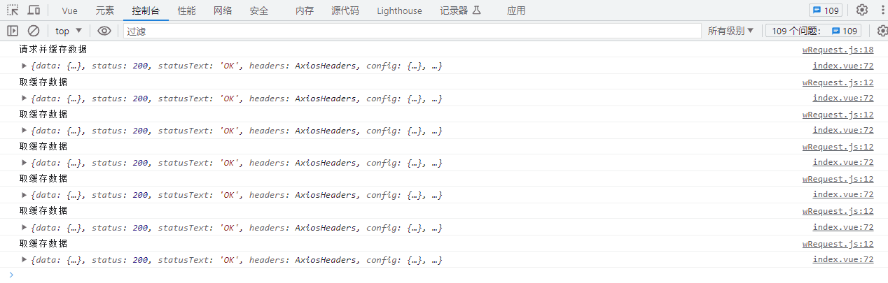
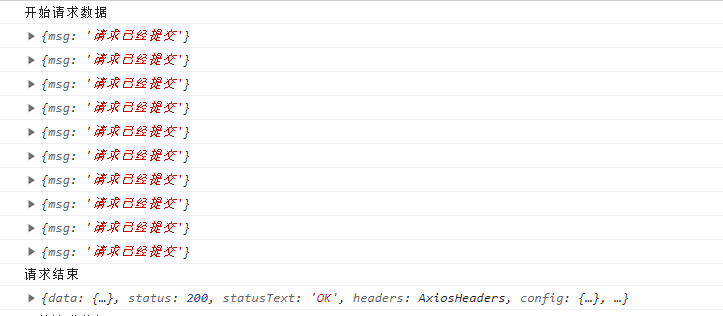

<h1><center>axios</center></h1>

[toc]

[axios 官网](https://www.axios-http.cn/) [axios 详细介绍，核心使用、封装、个性化配置](https://blog.csdn.net/qq_41809113/article/details/121705383)

# 一、开始之前

### 1. 前后台交互的基本过程

> 1. 前后应用从浏览器端向服务器发送HTTP请求(请求报文)
> 2. 后台服务器接收到请求后, 调度服务器应用处理请求, 向浏览器端返回HTTP响应(响应报文)
> 3. 浏览器端接收到响应, 解析显示响应体/调用监视回调

### 2. HTTP 请求报文

> 1. 请求行: 请求方式/url
> 2. 多个请求头: 一个请求头由name:value组成, 如Host/Cookie/Content-Type头
> 3. 请求体

### 3. HTTP 响应报文

> 1. 响应行: 响应状态码/对应的文本
> 2. 多个响应头: 如 Content-Type / Set-Cookie 头
> 3. 响应体

### 4. 请求体文本参数格式

> 1. Content-Type: application/x-www-form-urlencoded;charset=utf-8
        用于键值对参数，参数的键值用=连接, 参数之间用&连接
        例如: name=zs&age=12
> 2. Content-Type: application/json;charset=utf-8
        用于json字符串参数   axios默认application/json
        例如: {"name": "zs", "age": 12}

### 5. 常见响应状态码

>  1. 200	OK                     请求成功。一般用于GET与POST请求
>  2. 201 Created                已创建。成功请求并创建了新的资源
>  3. 401 Unauthorized           未授权/请求要求用户的身份认证
>  4. 404 Not Found              服务器无法根据客户端的请求找到资源
>  5. 500 Internal Server Error  服务器内部错误，无法完成请求

### 6. 不同类型的请求及其作用:

>   1. GET: 从服务器端读取数据
>   2. POST: 向服务器端添加新数据
>   3. PUT: 更新服务器端已经数据
>   4. DELETE: 删除服务器端数据

### 7. API 的分类

>   1. REST API:    restful
        发送请求进行CRUD哪个操作由请求方式来决定
        同一个请求路径可以进行多个操作
        请求方式会用到GET/POST/PUT/DELETE
>   2. 非REST API:   restless
        请求方式不决定请求的CRUD操作
        一个请求路径只对应一个操作
        一般只有GET/POST
      测试: 可以使用json-server快速搭建模拟的rest api 接口

### 8. 理解 XHR

>    使用XMLHttpRequest (XHR)对象可以与服务器交互, 也就是发送ajax请求
>    前端可以获取到数据，而无需让整个的页面刷新。
>    这使得Web页面可以只更新页面的局部，而不影响用户的操作。

### 9. 区别 ajax 请求与一般 HTTP 请求

```js
ajax(异步 JavaScript 和 XML)请求是一种特别的http请求: 只有通过XHR/fetch发送的是ajax请求, 其它都是一般HTTP请求
对服务器端来说, 没有任何区别, 区别在浏览器端
浏览器端发请求: 只有XHR或fetch发出的才是ajax请求, 其它所有的都是非ajax请求
浏览器端接收到响应
    一般请求: 浏览器一般会直接显示响应体数据, 也就是我们常说的刷新/跳转页面
    ajax请求: 浏览器不会对界面进行任何更新操作, 只是调用监视的回调函数并传入响应相关数据
```

### 10. fetch 的使用:

```js
fetch('http://127.0.0.1', { method: 'get' })
	.then(response => {
		return response.json()
	})
	.then(data => {
		console.log(data)
	})
```

# 二、概述

## 1、Axios 是什么

> Axios 是一个基于 _[promise](https://javascript.info/promise-basics)_ 网络请求库，类似于 jQuery 的 ajax，用于 http 请求。可以应用于浏览器端和 node.js，既可以用于客户端，也可以用于 node.js 编写的服务端。

## 2、axios 的特点

- 基于 promise 的封装 XHR 的异步 ajax 请求库
- 浏览器端/node 端都可以使用
- 支持请求／响应拦截器
- 支持请求取消
- 请求/响应数据转换
- 批量发送多个请求
- 转换请求和响应数据 
- 客户端支持防御[XSRF](http://en.wikipedia.org/wiki/Cross-site_request_forgery)

# 三、安装配置

## 1、安装

- 配置到项目
  ```bash
  $ npm install axios
  # or
  $ yarn add axios
  ```
- 或使用 CDN:
  ```html
  <script src="https://cdn.jsdelivr.net/npm/axios/dist/axios.min.js"></script>
  ```

## 2、VUE中简单使用
```js
//main.js
import axios from 'axios'
Vue.prototype.$http = axios
// vue组件中使用
mounted(){
  this.$http({
    method:'get',
    url:'xxx.com',
    params:{
      id:1
    }
  }).then((data)=>{
    console.log(data)
  })
}
```

# 四、使用

## 1、基本使用

### 1.1、get 请求 一般用户获取数据

```javascript
// 向具有指定id的用户发出请求
axios
	.get('/user?id=12345')
	.then(data => {
		console.log(data)
	})
	.catch(error => {
		console.log(error)
	}) // 也可以通过 params 对象传递参数
axios.get('/user', { params: { id: 12345 } }).then(data => {
	console.log(data)
})

axios('/user.json').then(data => {
	console.log(data)
})
```

### 1.2、post 请求 一般用于表单提交与文件上传（新建数据）

```javascript
axios
	.post('/user', { firstName: 'Fred', lastName: 'Flintstone' })
	.then(data => {
		console.log(data)
	})
	.catch(error => {
		console.log(error)
	})
```

### 1.3、patch：更新数据（只将修改的数据推送到后端）（数据量较大）

```js
axios.patch('/data.json', { id: 2 }).then(res => {
	console.log(res, 'patch')
})
```

### 1.4、put：更新数据（所有数据推送到服务端）

```js
axios.put("/data.json", { id:2 }a).then(res=>{
console.log(res, 'put')
});

```

### 1.5、delete：删除数据

```js
axios.delete('/data.json', { params: { id: 12 } }).then(res => {
	console.log(res, 'deleted!')
})

axios({
	method: 'delete',
	url: '/data.json',
	params: { id: 1 }
}).then(res => {
	console.log(res)
})
```

### 1.6、执行多个并发请求

```javascript
function getUserAccount() {
	return axios.get('/user/12345')
}
function getUserPermissions() {
	return axios.get('/user/12345/permissions')
}
axios.all([getUserAccount(), getUserPermissions()]).then(
	axios.spread((dataRes, cityRes) => {
		//所有个请求现已完成
		console.log(dataRes, cityRes)
	})
)
```

## 2、请求取消

### 2.1、AbortController 方式

```js
const controller = new AbortController()
axios
	.get('/foo/bar', {
		signal: controller.signal
	})
	.then(function (response) {
		//...
	})
// 取消请求
controller.abort()
```

### 2.2、CancelToken 方式

```js
const CancelToken = axios.CancelToken
const source = CancelToken.source()

axios
	.get('/user/12345', {
		cancelToken: source.token
	})
	.catch(function (thrown) {
		if (axios.isCancel(thrown)) {
			console.log('Request canceled', thrown.message)
		} else {
			// 处理错误
		}
	})

axios.post('/user/12345',
	{ name: 'new name' },
	{ cancelToken: source.token	}
)

// 取消请求（message 参数是可选的）
source.cancel('Operation canceled by the user.')
```
或
```js
const CancelToken = axios.CancelToken
let cancel

axios.get('/user/12345', {
	cancelToken: new CancelToken(function executor(c) {
		// executor 函数接收一个 cancel 函数作为参数
		cancel = c
	})
})

// 取消请求
cancel()
```

### 2.3、取消多个请求

```js
const controller = new AbortController()

const CancelToken = axios.CancelToken
const source = CancelToken.source()

axios
	.get('/user/12345', {
		cancelToken: source.token,
		signal: controller.signal
	})
	.catch(function (thrown) {
		if (axios.isCancel(thrown)) {
			console.log('Request canceled', thrown.message)
		} else {
			// 处理错误
		}
	})

axios.post(
	'/user/12345',
	{	name: 'new name' },
	{	cancelToken: source.token }
)

// 取消请求 (message 参数是可选的)
source.cancel('Operation canceled by the user.')
// 或
controller.abort() // 不支持 message 参数
```

## 3、axios 常用语法

    axios(config): 通用/最本质的发任意类型请求的方式
    axios(url[, config]): 可以只指定url发get请求
    axios.request(config): 等同于axios(config)
    axios.get(url[, config]): 发get请求
    axios.delete(url[, config]): 发delete请求
    axios.post(url[, data, config]): 发post请求
    axios.put(url[, data, config]): 发put请求
    
    axios.defaults.xxx: 请求的默认全局配置
    axios.interceptors.request.use(): 添加请求拦截器
    axios.interceptors.response.use(): 添加响应拦截器
    
    axios.create([config]): 创建一个新的axios(它没有下面的功能)
    
    axios.Cancel(): 用于创建取消请求的错误对象
    axios.CancelToken(): 用于创建取消请求的token对象
    axios.isCancel(): 是否是一个取消请求的错误
    
    axios.all(promises): 用于批量执行多个异步请求
    axios.spread(): 用来指定接收所有成功数据的回调函数的方法

# 五、封装

## 1、基于配置封装

> 1). 统一进行请求配置: 基础路径/超时时间等 
> 2). 请求过程中 loading 提示
> 3). 请求可能需要携带 token 数据(后台返回给前台的身份标识字符串)  添加请求拦截器
> 4). 请求成功的 value 不再是 response, 而是 response.data  添加响应拦截器
> 5). 请求失败/出错统一进行处理, 每个请求可以不用单独处理
> 6). 对请求成功的特定状态码进行特殊处理

```js
// @/util/http.js文件
import { MessageBox, Message } from 'element-ui'
import axios from 'axios'
import NProgress from 'nprogress'

// 统一进行请求配置: 基础路径/超时时间等
// axios.defaults.baseURL = 'https://api.github.com'
// axios.defaults.timeout = 20000 // 请求连接超时时间
const service = axios.create({
	baseURL: 'https://192.168.0.1',
	//也可使用 import.meta.BASE_URL读取.env文件的url配置
	timeout: 2000
})
// 添加请求拦截器
service.interceptors.request.use(
	config => {
		// 请求过程中loading提示: 显示
		NProgress.start()
		// 请求可能需要携带token数据(后台返回给前台的身份标识字符串)
		const token = 'abcd' // 浏览器端保存的token
    // TODO: 白名单放行
		if (token) {
			// 如果有值, 通过请求头来自动携带token数据
			config.headers.Authorization = token
		}
		return config
	},
	error => {
		return Promise.reject(error)
	}
)

// 添加响应拦截器
service.interceptors.response.use(
	response => {
		// 请求过程中loading提示: 隐藏
		NProgress.done()
		// 特定状态码处理
    // 授权判断
		if (response && response.status === 401) {
			Message.warning('401 NO Authorization!')
			setTimeout(() => {
				top.location.href = '/login'
			}, 3000)
			return Promise.reject(error)
		}

    // 顶号判断
    // if (error.response.status === 403) {
    //     Message.warning('您的账号已在其他地方登录，已被强制下线！')
    //     store.dispatch('user/resetToken').then(() => {
    //         location.reload()
    //     })
    // }
		// 请求成功的value不再是response, 而是response.data
		return response.data
	},
	error => {
		// 请求过程中loading提示: 隐藏
		NProgress.done()
		// 请求失败/出错统一进行处理, 每个请求可以不用单独处理
		if (typeof error.response !== 'undefined') {
			Message.error(error.response.data.message)
		} else {
				Message.error('网络请求超时，请稍后再试')
		}
		return Promise.reject(error)
	}
)
// 导出service，用于发请求
export default service
```

## 2、基于请求方式对上述导出的service进行封装

### 2.1、封装方式一
```js
// @/util/request.js文件
import http from '@/utils/http.js' 
// 上述导出的service为对象 此处将其取为http对象
// 如 测试可直接用以下替换,但调用时url得写全 如 http://192.168.0.1:8080 后续样例均可像此替换
// import http from 'axios'
const request = {
  get(url, params) {
    return http.get(url, { params })
  },
  post(url, params) {
    return http.post(url, params)
  }
}
export default request
```
调用： 
```js
import request from '@/util/request.js'
let url = 'http://192.168.0.1:8080'
request.get(url,{id:1}).then((data)=>{console.log(data)})
request.post(url,{id:1}).then((data)=>{console.log(data)})
```
### 2.2、封装方式二

```js
// import http from '@/util/http.js' 
import http from 'axios'
const request=(url,params={},method = 'GET')=>{
  if(method.toUpperCase() === 'GET'){
    return http.get(url,{ params })
  }
  if(method.toUpperCase() === 'POST'){
    return http.post(url, params)
  }
  return Promise.reject({msg:'请求方式错误!'})
}
export default request
```
调用
```js
import request from '@/util/request.js'
let url = 'http://192.168.0.1:8080'
request.get(url,{id:1},).then((data)=>{console.log(data)})
request.get(url,{id:1},'GET').then((data)=>{console.log(data)})
request.post(url,{id:1}),'POST'.then((data)=>{console.log(data)})
```
## 3、基于特定需求对上述导出的service进行封装

### 3.1、缓存请求数据
```js
// @/util/wRequest.js文件
import http from '@/util/http.js'
const wRequest = (() => {
  // 立即执行函数  形成闭包,不会被gc
  // cacheArr(用于缓存请求数据)
  let cacheArr = new Map()
  return (url, params = {}, method = 'GET') => {
    let key = url + JSON.stringify(params)
    if (cacheArr.has(key)) {
      // cachaArr 中有该请求 则返回cacheArr中的数据
      console.log('取缓存数据', cacheArr.get(key));
      return Promise.resolve(cacheArr.get(key))
    }
    if (method.toUpperCase() === 'GET') {
      return http.get(url, { params }).then((res) => {
        // 存入数据
        console.log('请求并缓存数据', res);
        cacheArr.set(key, res)
        // 返回请求的数据
        return res
        // 或 return Promise.resolve(res)
      })
    }
    else if (method.toUpperCase() === 'POST') {
      return http.post(url, params).then((res) => {
        cacheArr.set(key, res)
        return Promise.resolve(res)
      })
    }
    else {
      return Promise.reject({ msg: '请求方式错误!' })
    }
  }
})();
export default wRequest 
```
调用： 
```js
import wRequest from '@/util/wRequest.js'
let url='http://127.0.0.1:9000/user/get'
wRequest(url).then((data)=>{console.log(data)}).catch(e=>{console.log(e);})
wRequest(url,{id:1}).then((data)=>{console.log(data)}).catch(e=>{console.log(e);})
wRequest(url,{id:1},'GET').then((data)=>{console.log(data)}).catch(e=>{console.log(e);})
wRequest(url,{id:1},'POST').then((data)=>{console.log(data)}).catch(e=>{console.log(e);})
```

测试效果：



### 3.2、请求防抖动

```js
import http from '@/util/http.js'
const wRequest2 = (() => {
  // 立即执行函数  形成闭包,不会被gc
  // hasRequest(用于缓存请求数据)
  let hasRequest = new Set()
  return (method, url, params) => {
    // let key = url // 也可换成地址 防止重复请求同一地址
    let key = url + JSON.stringify(params)// 防止重复提交表单
    if (hasRequest.has(key)) {
      return Promise.reject({ msg: '请求已经提交' })
    }
    console.log('开始请求数据')
    hasRequest.add(key)
    if (method.toUpperCase() === 'GET') {
      http.get(url, { params }).then((res) => {
        console.log('请求结束')
        // 清除数据
        hasRequest.delete(key)
        // 返回请求的数据
        return Promise.resolve(res)
      })
    }
    if (method.toUpperCase() === 'POST') {
      http.post(url, params).then((res) => {
        hasRequest.delete(url)
        return Promise.resolve(res)
      })
    }
    return Promise.reject({msg:'请求方式错误!'})
  }
})();
export default wRequest2
```
调用： 
```js
import wRequest2 from '@/util/wRequest2.js'
let url='http://127.0.0.1:9000/user/get'
wRequest2(url).then((data)=>{console.log(data)}).catch(e=>{console.log(e);})
wRequest2(url,{id:1},'GET').then((data)=>{console.log(data)}).catch(e=>{console.log(e);})
wRequest2(url,{id:1},'POST').then((data)=>{console.log(data)}).catch(e=>{console.log(e);})
```

测试效果：



# 六、代理

如果项目地址和 API 地址不一致，而当前的 API 接口没有开启 CDRS 跨域资源共享，是不能够正常请求的。

可以通过代理解决接口的跨域问题。

步骤如下：

1. 把 axios 的请求根路径设置为 vue 项目的运行地址（接口请求不再跨域）
2. vue 项目发现请求的接口不存在，把请求转交给 proxy 代理
3. 代理把请求根路径替换为 devServe.proxy 属性的值，发起真正的数据请求
4. 代理把请求到的数据，转发给 axios

```js
devServer: {
            overlay: { // 让浏览器 overlay 同时显示警告和错误
              warnings: true,
              errors: true
            },
            host: "localhost",
            port: 8080, // 端口号
            https: false, // https:{type:Boolean}
            open: false, //配置后自动启动浏览器
            hotOnly: true, // 热更新
            // proxy: 'http://localhost:8080'   // 配置跨域处理,只有一个代理
            proxy: { //配置多个代理
                "/testIp": {
                    target: "http://197.0.0.1:8088",
                    changeOrigin: true,
                    ws: true,//websocket支持
                    secure: false,
                    pathRewrite: {
                        "^/testIp": "/"
                    }
                },
                "/elseIp": {
                    target: "http://197.0.0.2:8088",
                    changeOrigin: true,
                    //ws: true,//websocket支持
                    secure: false,
                    pathRewrite: {
                        "^/elseIp": "/"
                    }
                },
            }
        }
```

> - devServe.proxy 提供的代理功能，仅在开发调试阶段生效
> - 项目上线发布时，依旧需要 API 接口服务器开启 CORS 跨域资源共享


# 附录
* axios的一些基本配置
```javascript
{
  // `url`是将用于请求的服务器URL
  url: '/user',
  // `method`是发出请求时使用的请求方法
  method: 'get', // 默认
  // `baseURL`将被添加到`url`前面，除非`url`是绝对的。
  // 可以方便地为 axios 的实例设置`baseURL`，以便将相对 URL 传递给该实例的方法。
  baseURL: 'https://some-domain.com/api/',
  // `transformRequest`允许在请求数据发送到服务器之前对其进行更改
  // 这只适用于请求方法'PUT'，'POST'和'PATCH'
  // 数组中的最后一个函数必须返回一个字符串，一个 ArrayBuffer或一个 Stream
  transformRequest: [function (data) {
    // 做任何想要的数据转换
    return data;
  }],
  // `transformResponse`允许在 then / catch之前对响应数据进行更改
  transformResponse: [function (data) {
    // Do whatever you want to transform the data
    return data;
  }],
  // `headers`是要发送的自定义 headers
  headers: {'X-Requested-With': 'XMLHttpRequest'},
  // `params`是要与请求一起发送的URL参数
  // 必须是纯对象或URLSearchParams对象
  params: {
    id: 12345
  },
  // `paramsSerializer`是一个可选的函数，负责序列化`params`
  // (e.g. https://www.npmjs.com/package/qs, http://api.jquery.com/jquery.param/)
  paramsSerializer: function(params) {
    return Qs.stringify(params, {arrayFormat: 'brackets'})
  },
  // `data`是要作为请求主体发送的数据
  // 仅适用于请求方法“PUT”，“POST”和“PATCH”
  // 当没有设置`transformRequest`时，必须是以下类型之一：
  // - string, plain object, ArrayBuffer, ArrayBufferView, URLSearchParams
  // - Browser only: FormData, File, Blob
  // - Node only: Stream
  data: {
    firstName: 'Fred'
  },
  // `timeout`指定请求超时之前的毫秒数。
  // 如果请求的时间超过'timeout'，请求将被中止。
  timeout: 1000,
  // `withCredentials`指示是否跨站点访问控制请求
  // should be made using credentials
  withCredentials: false, // default
  // `adapter'允许自定义处理请求，这使得测试更容易。
  // 返回一个promise并提供一个有效的响应（参见[response docs]（＃response-api））
  adapter: function (config) {
    /* ... */
  },
  // `auth'表示应该使用 HTTP 基本认证，并提供凭据。
  // 这将设置一个`Authorization'头，覆盖任何现有的`Authorization'自定义头，使用`headers`设置。
  auth: {
    username: 'janedoe',
    password: 's00pers3cret'
  },
  // “responseType”表示服务器将响应的数据类型
  // 包括 'arraybuffer', 'blob', 'document', 'json', 'text', 'stream'
  responseType: 'json', // default
  //`xsrfCookieName`是要用作 xsrf 令牌的值的cookie的名称
  xsrfCookieName: 'XSRF-TOKEN', // default
  // `xsrfHeaderName`是携带xsrf令牌值的http头的名称
  xsrfHeaderName: 'X-XSRF-TOKEN', // default
  // `onUploadProgress`允许处理上传的进度事件
  onUploadProgress: function (progressEvent) {
    // 使用本地 progress 事件做任何你想要做的
  },
  // `onDownloadProgress`允许处理下载的进度事件
  onDownloadProgress: function (progressEvent) {
    // Do whatever you want with the native progress event
  },
  // `maxContentLength`定义允许的http响应内容的最大大小
  maxContentLength: 2000,
  // `validateStatus`定义是否解析或拒绝给定的promise
  // HTTP响应状态码。如果`validateStatus`返回`true`（或被设置为`null` promise将被解析;否则，promise将被
  // 拒绝。
  validateStatus: function (status) {
    return status >= 200 && status < 300; // default
  },
  // `maxRedirects`定义在node.js中要遵循的重定向的最大数量。
  // 如果设置为0，则不会遵循重定向。
  maxRedirects: 5, // 默认
  // `httpAgent`和`httpsAgent`用于定义在node.js中分别执行http和https请求时使用的自定义代理。
  // 允许配置类似`keepAlive`的选项，
  // 默认情况下不启用。
  httpAgent: new http.Agent({ keepAlive: true }),
  httpsAgent: new https.Agent({ keepAlive: true }),
  // 'proxy'定义代理服务器的主机名和端口
  // `auth`表示HTTP Basic auth应该用于连接到代理，并提供credentials。
  // 这将设置一个`Proxy-Authorization` header，覆盖任何使用`headers`设置的现有的`Proxy-Authorization` 自定义 headers。
  proxy: {
    host: '127.0.0.1',
    port: 9000,
    auth: : {
      username: 'mikeymike',
      password: 'rapunz3l'
    }
  },
  // “cancelToken”指定可用于取消请求的取消令牌
  // (see Cancellation section below for details)
  cancelToken: new CancelToken(function (cancel) {
  })
}
```
