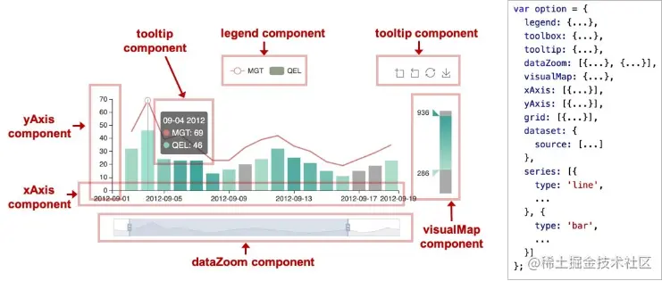
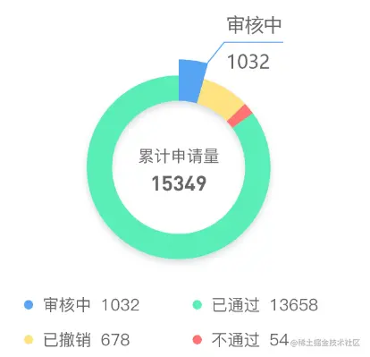
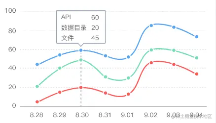
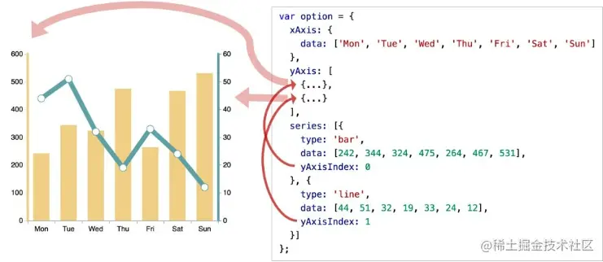

<h1><center>Echats</center></h1>
[toc]
# 一、概述
[官网 ](https://echarts.apache.org/zh/index.html)  [echarts入门教程](https://blog.csdn.net/m0_55734030/article/details/127559434) [在vue中使用Echarts](https://www.cnblogs.com/ludeng-blog/p/12531903.html)
## 1.1、ECharts介绍

ECharts是一个使用 JavaScript 实现的开源可视化库，可以流畅的运行在 PC 和移动设备上，兼容当前绝大部分浏览器（IE8/9/10/11，Chrome，Firefox，Safari等），底层依赖矢量图形库 ZRender，提供直观，交互丰富，可高度个性化定制的数据可视化图表。

> 通俗的理解：
    - 是一个JS插件
    - 性能好可流畅运行PC与移动设备
    - 兼容主流浏览器
    - 提供很多常用图表【折线图、柱状图、散点图、饼图、K线图】，且可定制（支持自定义）
## 1.2、下载安装
（1） npm 
```bash
npm install echarts --save
```
（2） CDN 
```js
<script src="https://cdn.bootcdn.net/ajax/libs/echarts/5.4.2/echarts.common.js"></script>
```
## 1.3、基础使用
基本步骤

> ​    步骤1：引入echarts.js文件
> ​    步骤2：准备一个呈现图表的盒子
> ​    步骤3：初始化echarts实例对象
> ​    步骤4：准备配置项
> ​    步骤5：将配置项设置给echarts实例对象


js中示例

  ```js
    import * as echarts from 'echarts'; //导入echarts
    const chartDom = document.getElementById('chart');// 得到dom元素
    const chart = echarts.init(chartDom);// 初始化
    let option={...} // 配置
    chart.setOption(option);// 渲染
  ```
完整示例
  ```html
  <!DOCTYPE html>
  <html lang="en">
  <head>
    <meta charset="UTF-8">
    <meta name="viewport" content="width=device-width, initial-scale=1.0">
    <meta http-equiv="X-UA-Compatible" content="ie=edge">
    <title>Document</title>
    <!-- 步骤1：引入echarts.js文件 -->
    <script src="lib/echarts.min.js"></script>
  </head>
  <body>
    <!-- 步骤2：准备一个呈现图表的盒子 -->
    <div style="width: 600px;height: 400px"></div>
    <script>
      // 步骤3：初始化echarts实例对象
      // 参数, dom,决定图表最终呈现的位置
      let mCharts = echarts.init(document.querySelector('div'))
      // 步骤4：准备配置项
      let option = {
        xAxis: {
          type: 'category',// 类目轴
          data: ['小明', '小红', '小王']// 类目
        },
        yAxis: {
          type: 'value'// 数值轴 显示数值
        },
        series: [
          {
            name: '语文',
            type: 'bar',// 类型为柱状图
            data: [70, 92, 87]// y轴上数据
          }
        ]
      }
      // 步骤5：将配置项设置给echarts实例对象
      mCharts.setOption(option)
    </script>
  </body>
  </html>
  ```

# 二、示例

## 1、折线图
### 1.1、基础使用
```html
<!DOCTYPE html>
<html lang="en">
<head>
  <meta charset="UTF-8">
  <meta name="viewport" content="width=device-width, initial-scale=1.0">
  <meta http-equiv="X-UA-Compatible" content="ie=edge">
  <title>Document</title>
  <script src="lib/echarts.min.js"></script>
</head>

<body>
  <div style="width: 600px;height: 400px"></div>
  <script>
    //1. ECharts最基本的代码结构
    //2. x轴数据
    //3. y轴数据
    //4. 将type的值设置为line
    var mCharts = echarts.init(document.querySelector("div"))    
    var xDataArr = ['1月', '2月', '3月', '4月', '5月', '6月', '7月', '8月', '9月', '10月', '11月', '12月']
    var yDataArr = [3000, 2800, 900, 1000, 800, 700, 1400, 1300, 900, 1000, 800, 600]
    var yDataArr2 = [2000, 3800, 1900, 500, 900, 1700, 2400, 300, 1900, 1500, 1800, 200]
    var option = {
      xAxis: {
        type: 'category',
        data: xDataArr
        // ,boundaryGap: false // x轴的第1个元素是否与y轴有距离
      },
      yAxis: {
        type: 'value',
      },
      series: [
        {
          type: 'line',
          data: yDataArr,
          stack: 'all', // 堆叠图的设置
          areaStyle: {}
        }
        ,{
          type: 'line',
          data: yDataArr2,
          stack: 'all', // 堆叠图的设置
          areaStyle: {}
        }
      ]
    }
    mCharts.setOption(option)
  </script>
</body>

</html>
```
### 1.2、折线图样式设置

折线图中折线的样式可以通过 `lineStyle` 设置。可以为其指定颜色、线宽、折线类型、阴影、不透明度等等。

具体的可以参考配置项手册 [`series.lineStyle`](https://echarts.apache.org/option.html#series-line.lineStyle) 了解。

数据点的样式可以通过 [`series.itemStyle`](https://echarts.apache.org/option.html#series-line.itemStyle) 指定填充颜色（color）、描边颜色（borderColor）、描边宽度（borderWidth）、描边类型（borderType）、阴影（shadowColor）、不透明度（opacity）等。
### 1.3、在数据点处显示数值

在系列中，这数据点的标签通过 [`series.label`](https://echarts.apache.org/option.html#series-line.label) 属性指定。如果将 `label` 下的 `show` 指定为`true`，则表示该数值默认时就显示；如果为 `false`，而 [`series.emphasis.label.show`](https://echarts.apache.org/option.html#series-line.emphasis.label.show) 为 `true`，则表示只有在鼠标移动到该数据时，才显示数值。

```js
option = {
  xAxis: {
    data: ['A', 'B', 'C', 'D', 'E']
  },
  yAxis: {},
  series: [
    {
      data: [10, 22, 28, 23, 19],
      type: 'line',
      label: {
        show: true,
        position: 'bottom',
        textStyle: {
          fontSize: 20
        }
      }
    }
  ]
};
```
### 1.4、空数据

在一个系列中，可能一个横坐标对应的取值是“空”的，将其设为 0 有时并不能满足我们的期望--空数据不应被其左右的数据连接。

在 ECharts 中，我们使用字符串 `'-'` 表示空数据，这对其他系列的数据也是适用的。

```js

option = {
  xAxis: {
    data: ['A', 'B', 'C', 'D', 'E']
  },
  yAxis: {},
  series: [
    {
      data: [0, 22, '-', 23, 19],
      type: 'line'
    }
  ]
};
```

## 2、柱状图

柱状图（或称条形图）是一种通过柱形的长度来表现数据大小的一种常用图表类型。
设置柱状图的方式，是将 `series` 的 `type` 设为 `'bar'`。
### 2.1、基础使用
```HTML
  <!DOCTYPE html>
  <html lang="en">

  <head>
    <meta charset="UTF-8">
    <meta name="viewport" content="width=device-width, initial-scale=1.0">
    <meta http-equiv="X-UA-Compatible" content="ie=edge">
    <title>Document</title>
    <script src="lib/echarts.min.js"></script>
  </head>

  <body>
    <div style="width: 600px;height:400px"></div>
    <script>
      //1. ECharts最基本的代码结构
      //2. x轴数据:['张三', '李四', '王五', '闰土', '小明', '茅台', '二妞', '大强']
      //3. y轴数据:[88, 92, 63, 77, 94, 80, 72, 86]
      //4. 将type的值设置为bar
      var mCharts = echarts.init(document.querySelector("div")) // 初始化echarts实例对象
      var xDataArr = ['张三', '李四', '王五', '闰土', '小明', '茅台', '二妞', '大强'] // 准备x轴数据
      var yDataArr = [88, 92, 63, 77, 94, 80, 72, 86] // 为x轴每一个元素指明数据
      var option = {
        xAxis: {
          type: 'value'
        },
        yAxis: {
          type: 'category',
          data: xDataArr
        },
        series: [
          {
            name: '语文',
            type: 'bar',
            markPoint: { // 标记点
              data: [
                {
                  type: 'max', name: '最大值'
                },{
                  type: 'min', name: '最小值'
                }
              ]
            },
            markLine: { // 标记线
              data: [
                {
                  type: 'average', name: '平均值'
                }
              ]
            },
            label: { // 柱状图上的文字设置
              show: true, // 是否显示
              rotate: 60, // 旋转角度
              position: 'top' // 显示位置
            },
            barWidth: '30%', // 柱的宽度
            data: yDataArr
          }
          // 如果需要实现多系列的柱状图，只需要在 `series` 多添加一项就可以了,
          // ,{
          //   type: 'bar',
          //   data: [26, 24, 18, 11,22, 23, 20, 27]
          // }
        ]
      }
      mCharts.setOption(option)
    </script>
  </body>
  </html>
```

### 2.2、柱条样式

柱条的样式可以通过 [`series.itemStyle`](https://echarts.apache.org/option.html#series-bar.itemStyle) 设置，包括：

- 柱条的颜色（`color`）；
- 柱条的描边颜色（`borderColor`）、宽度（`borderWidth`）、样式（`borderType`）；
- 柱条圆角的半径（`barBorderRadius`）；
- 柱条透明度（`opacity`）；
- 阴影（`shadowBlur`、`shadowColor`、`shadowOffsetX`、`shadowOffsetY`）。

### 2.3、柱条宽度和高度

柱条宽度可以通过 [`barWidth`](https://echarts.apache.org/option.html##series-bar.barWidth) 设置。比如在下面的例子中，将 `barWidth` 设为 `'20%'`，表示每个柱条的宽度就是类目宽度的 20%。由于这个例子中，每个系列有 5 个数据，20% 的类目宽度也就是整个 x 轴宽度的 4%。

```js
option = {
  xAxis: {
    data: ['A', 'B', 'C', 'D', 'E']
  },
  yAxis: {},
  series: [
    {
      type: 'bar',
      data: [10, 22, 28, 43, 49],
      barWidth: '20%'
    }
  ]
};
```

> 另外，还可以设置 [`barMaxWidth`](https://echarts.apache.org/option.html#series-bar.barMaxWidth) 限制柱条的最大宽度。对于一些特别小的数据，我们也可以为柱条指定最小高度 [`barMinHeight`](https://echarts.apache.org/option.html#series-bar.barMinHeight)，当数据对应的柱条高度小于该值时，柱条高度将采用这个最小高度。

### 2.4、柱条间距

柱条间距分为两种，一种是不同系列在同一类目下的距离 [`barGap`](https://echarts.apache.org/option.html#series-bar.barGap)，另一种是类目与类目的距离 [`barCategoryGap`](https://echarts.apache.org/option.html#series-bar.barCategoryGap)。

```js
option = {
  xAxis: {
    data: ['A', 'B', 'C', 'D', 'E']
  },
  yAxis: {},
  series: [
    {
      type: 'bar',
      data: [23, 24, 18, 25, 18],
      barGap: '20%',
      barCategoryGap: '40%'
    },
    {
      type: 'bar',
      data: [12, 14, 9, 9, 11]
    }
  ]
};
```

在这个例子中，`barGap` 被设为 `'20%'`，这意味着每个类目（比如 `A`）下的两个柱子之间的距离，相对于柱条宽度的百分比。而 `barCategoryGap` 是 `'40%'`，意味着柱条每侧空余的距离，相对于柱条宽度的百分比。

通常而言，设置 `barGap` 及 `barCategoryGap` 后，就不需要设置 `barWidth` 了，这时候的宽度会自动调整。如果有需要的话，可以设置 `barMaxWidth` 作为柱条宽度的上限，当图表宽度很大的时候，柱条宽度也不会太宽。

## 3、饼图
饼图主要用于表现不同类目的数据在总和中的占比。每个的弧度表示数据数量的比例。
### 3.1、基础使用

```html
<!DOCTYPE html>
<html lang="en">
<head>
  <meta charset="UTF-8">
  <meta name="viewport" content="width=device-width, initial-scale=1.0">
  <meta http-equiv="X-UA-Compatible" content="ie=edge">
  <title>Document</title>
  <script src="lib/echarts.min.js"></script>
</head>
<body>
  <div style="width: 600px;height:400px"></div>
  <script>
    //1. ECharts最基本的代码结构
    //2. 准备数据[{name:???, value:??? },{}]
    //   淘宝: 11231  京东: 22673  唯品会: 6123  1号店: 8989   聚美优品: 6700
    //3. 将type的值设置为pie
    var mCharts = echarts.init(document.querySelector("div"))
    // pieData就是需要设置给饼图的数据, 数组,数组中包含一个又一个的对象, 每一个对象中, 需要有name和value
    var pieData = [{ name: '淘宝',value: 11231},{ name: '京东',value: 22673},{ name: '唯品会',value: 6123},{ name: '1号店',value: 8989},{ name: '聚美优品',value: 6700}
    ]
    var option = {
      series: [
        {
          type: 'pie',
          data: pieData,
          label: { // 饼图文字的显示
            show: true, // 显示文字
            //formatter: 'hehe' // 决定文字显示的内容
            formatter: function(arg){
              // console.log(arg)
              return arg.name + '平台' + arg.value + '元\n' + arg.percent + '%'
            }
          },
          // radius: 20 // 饼图的半径
          // radius: '20%' // 百分比参照的是宽度和高度中较小的那一部分的一半来进行百分比设置
          // radius: ['50%', '75%'] // 第0个元素代表的是內圆的半径 第1个元素外圆的半径
          roseType: 'radius', // 南丁格尔图 饼图的每一个区域的半径是不同的
          // selectedMode: 'single' // 选中的效果,能够将选中的区域偏离圆点一小段距离
          selectedMode: 'multiple',
          selectedOffset: 30
        }
      ]
    }
    mCharts.setOption(option)
  </script>
</body>
</html>
```

> 需要注意的是，这里是 `value` 不需要是百分比数据，ECharts 会根据所有数据的 `value` ，按比例分配它们在饼图中对应的弧度。

### 3.2、圆环图

圆环图同样可以用来表示数据占总体的比例，相比于饼图，它中间空余的部分可以用来显示一些额外的文字等信息，因而也是一种常用的图表类型。

在 ECharts 中，饼图的半径除了上面提到的，可以是一个数值或者字符串之外，还可以是一个包含两个元素的数组，每个元素可以为数值或字符串。当它是一个数组时，它的前一项表示内半径，后一项表示外半径，这样就形成了一个圆环图。

从这个角度上来说，可以认为饼图是一个内半径为 0 的圆环图，也就是说，饼图是圆环图的特例。

```JS
option = {
  title: {
    text: '圆环图的例子',
    left: 'center',
    top: 'center'
  },
  series: [
    {
      type:'pie',
      data:[{value:335,name:'A'},{value:234,name:'B'},{value:1548,name:'C'}],
      radius: ['40%', '70%']
    }
  ]
};
```

> 如果半径是数组，其中的两项也可以一项是数值，另一项是百分比形式的字符串。但是这样可能导致在某些分辨率下，内半径小于外半径。ECharts 会自动使用小的一项作为内半径，但是仍应小心这样可能会导致的非预期效果。


### 3.3、饼图样式设置

饼图的半径可以通过 [`series.radius`](https://echarts.apache.org/option.html#series-pie.radius) 设置，可以是诸如 `'60%'` 这样相对的百分比字符串，或是 `200` 这样的绝对像素数值。当它是百分比字符串时，它是相对于容器宽高中较小的一条边的。也就是说，如果宽度大于高度，则百分比是相对于高度的，反之则反；当它是数值型时，它表示绝对的像素大小。


## 4、散点图

散点图，也是一种常见的图表类型。散点图由许多“点”组成，有时，这些点用来表示数据在坐标系中的位置（比如在笛卡尔坐标系下，表示数据在 x 轴和 y 轴上的坐标；在地图坐标系下，表示数据在地图上的某个位置等）；有时，这些点的大小、颜色等属性也可以映射到数据值，用以表现高维数据
### 4.1、基础使用
```html
<!DOCTYPE html>
<html lang="en">
  <head>
    <meta charset="UTF-8" />
    <meta http-equiv="X-UA-Compatible" content="IE=edge" />
    <meta name="viewport" content="width=device-width, initial-scale=1.0" />
    <title>Document</title>
    <!-- <script src="https://cdn.bootcdn.net/ajax/libs/echarts/5.4.2/echarts.js"></script> -->
    <script src="./lib/echarts.js"></script>
  </head>

  <body>
    <div id="main" style="width: 800px; height: 600px"></div>
    <script>
      const data_list = [[170,69],[180,56],[150,60],[160,59],[175,68],[173,67],[177,71],[168,56],[172,65]]
      const option = {
        dataZoom: [ // 控制区域缩放效果的实现
          {
            type: 'slider', // 缩放的类型  slide代表滑块  inside代表依靠鼠标滚轮
            // type: 'inside' 
            xAxisIndex: 0
          },
          {
            type: 'slider',
            yAxisIndex: 0,
            start: 0, // 渲染完成后, 数据筛选的初始值, 百分比
            end: 80 // 渲染完成后, 数据筛选的结束值, 百分比
          }
        ],
        toolbox: {
          feature: {
            dataZoom: {} // 控制区域缩放效果生效
          }
        },
        grid: { // 最外层边框效果
          show: true,
          borderColor: 'red',
        },
        title: { // 标题
          text: '身高体重散点图',
          subtext: '数据源：data_list',
          x: 'center'
        },
        tooltip: { // 鼠标移动到散点上的显示文字
          trigger: 'item',
          formatter: (a,b,c,d)=>{
            return `身高：${a.data[0]}cm<br/>体重：${a.data[0]}kg`
          }
        },
        xAxis:{
          type:'value',// 数值轴
          scale:true // x轴 以数组最小值开始,最大值结束

        },
        yAxis:{
          type:'value',// 数值轴
          scale :true
        },
        series: [
          // 基础散点图
          // {
          //   name: '数据',
          //   type: 'scatter',// 类型为散点图
          //   data: data_list // 数据
          // },
          //涟漪散点图
          {
          type: 'effectScatter', // 指明图表为带涟漪动画的散点图
          showEffectOn: 'emphasis', // 出现涟漪动画的时机 render emphasis
          rippleEffect: {
            scale: 10 // 涟漪动画时, 散点的缩放比例
          },
          data: axisData,
          // symbolSize: 30  //散点大小
          symbolSize:(arg)=>{
            if(arg[0]*1.0/arg[1]>2.6){
              return 20
            }
            return 40
          },
          // 散点样式
          itemStyle:{
            // color: 'red'
            color:function(arg){
            if(arg.data[0]*1.0/arg.data[1]>2.6){
              return 'red'
            }
            return 'lightblue'
            }
          }
        }
        ]
      }
      ec_map = echarts.init(document.getElementById('main'))
      ec_map.setOption(option)
    </script>
  </body>
</html>
```
### 4.2、散点图样式设置

**图形的形状**

图形（symbol）指的是散点图中数据“点”的形状。有三类图形可选，一种是 ECharts 内置形状，第二种是图片，第三种是 SVG 的路径。

ECharts 内置形状包括：圆形、矩形、圆角矩形、三角形、菱形、大头针形、箭头形，分别对应`'circle'`、`'rect'`、`'roundRect'`、`'triangle'`、`'diamond'`、`'pin'`、`'arrow'`。使用内置形状时，只要将 `symbol` 属性指定为形状名称对应的字符串即可。

如果想要将图形指定为任意的图片，以 `'image://'` 开头，后面跟图片的绝对或相对地址。形如：`'image://http://example.com/xxx.png'` 或 `'image://./xxx.png'`。

除此之外，还支持 SVG 的路径作为矢量图形，将 `symbol` 设置为以 `'path://'` 开头的 SVG 路径即可。使用矢量图形的好处是，图片不会因为缩放而产生锯齿或模糊，并且通常而言比图片形式的文件大小更小。路径的查看方法为，打开一个 `SVG` 文件，找到形如 `<path d="M… L…"></path>` 的路径，将 `d` 的值添加在 `'path://'` 后即可。

**图形的大小**

图形大小可以使用 [`series.symbolSize`](https://echarts.apache.org/option.html#series-scatter.symbolSize) 控制。它既可以是一个表示图形大小的像素值，也可以是一个包含两个 number 元素的数组，分别表示图形的宽和高。


## 5、雷达图
### 5.1、基础使用
```html
<!DOCTYPE html>
<html lang="en">
<head>
  <meta charset="UTF-8">
  <meta name="viewport" content="width=device-width, initial-scale=1.0">
  <meta http-equiv="X-UA-Compatible" content="ie=edge">
  <title>Document</title>
  <script src="lib/echarts.min.js"></script>
</head>
<body>
  <div style="width: 600px;height:400px"></div>
  <script>
    //1. ECharts最基本的代码结构
    //2. 定义各个维度的最大值, 通过radar属性配置
    //   易用性,功能,拍照,跑分,续航, 每个维度的最大值都是100
    //3. 准备产品数据, 设置给series下的data
    //   华为手机1: 80, 90, 80, 82, 90
    //   中兴手机1: 70, 82, 75, 70, 78
    //4. 将type的值设置为radar
    var mCharts = echarts.init(document.querySelector("div"))
    // 各个维度的最大值
    var dataMax = [{name:'易用性',max:100},{name:'功能',max:100},{name:'拍照',max:100},{name:'跑分',max:100},{name:'续航',max: 100}
    ]
    var option = {
      radar: { 
        indicator: dataMax, // 配置各个维度的最大值
        shape: 'polygon' // 配置雷达图最外层的图形 circle polygon
      },
      series: [
        {
          type: 'radar', // radar 此图表时一个雷达图
          label: { // 设置标签的样式
            show: true // 显示数值
          },
          areaStyle: {}, // 将每一个产品的雷达图形成阴影的面积
          data: [
            {
              name: '华为手机1',
              value: [80, 90, 80, 82, 90]
            },
            {
              name: '中兴手机1',
              value: [70, 82, 75, 70, 78]
            }
          ]
        }
      ]
    }
    mCharts.setOption(option)
  </script>
</body>
</html>
```

## 6、仪表盘
### 6.1、基础使用

```html
<!DOCTYPE html>
<html lang="en">

<head>
  <meta charset="UTF-8">
  <meta name="viewport" content="width=device-width, initial-scale=1.0">
  <meta http-equiv="X-UA-Compatible" content="ie=edge">
  <title>Document</title>
  <script src="lib/echarts.min.js"></script>
</head>

<body>
  <div style="width: 600px;height:400px"></div>

  <script>
    //1. ECharts最基本的代码结构
    //2. 准备数据, 设置给series下的data
    //3. 将type的值设置为gauge
    var mCharts = echarts.init(document.querySelector("div"))
    var option = {
      series: [
        {
          type: 'gauge',
          data: [
            {
              value: 97,
              itemStyle: { // 指针的样式
                color: 'pink' // 指针的颜色
              }
            }, // 每一个对象就代表一个指针
            {
              value: 85,
              itemStyle: {
                color: 'green'
              }
            }
          ],
          min: 50 // min max 控制仪表盘数值范围
        }
      ]
    }
    mCharts.setOption(option)
  </script>
</body>
</html>
```

## 7、中国地图
### 7.1、基础使用

```html
<!DOCTYPE html>
<html lang="en">
<head>
  <meta charset="UTF-8">
  <meta name="viewport" content="width=device-width, initial-scale=1.0">
  <meta http-equiv="X-UA-Compatible" content="ie=edge">
  <title>Document</title>
  <script src="lib/echarts.min.js"></script>
  <script src="lib/jquery.min.js"></script>
</head>
<body>
  <div style="width: 600px;height:400px;border: 1px solid #f00"></div>

  <script>
    //1. 显示基本的中国地图
    //2. 将空气质量的数据设置给series下的对象
    //3. 将series下的数据和geo关联起来
    //4. 配置visualMap
    var airData = [
        { name: '北京', value: 39.92 },{ name: '天津', value: 39.13 },{ name: '上海', value: 31.22 },{ name: '重庆', value: 66 },{ name: '河北', value: 147 },{ name: '河南', value: 113 },{ name: '云南', value: 25.04 },{ name: '辽宁', value: 50 },{ name: '黑龙江', value: 114 },{ name: '湖南', value: 175 },{ name: '安徽', value: 117 },{ name: '山东', value: 92 },{ name: '新疆', value: 84 },{ name: '江苏', value: 67 },{ name: '浙江', value: 84 },{ name: '江西', value: 96 },{ name: '湖北', value: 273 },{ name: '广西', value: 59 },{ name: '甘肃', value: 99 },{ name: '山西', value: 39 },{ name: '内蒙古', value: 58 },{ name: '陕西', value: 61 },{ name: '吉林', value: 51 },{ name: '福建', value: 29 },{ name: '贵州', value: 71 },{ name: '广东', value: 38 },{ name: '青海', value: 57 },{ name: '西藏', value: 24 },{ name: '四川', value: 58 },{ name: '宁夏', value: 52 },{ name: '海南', value: 54 },{ name: '台湾', value: 88 },{ name: '香港', value: 66 },{ name: '澳门', value: 77 },{ name: '南海诸岛', value: 55 }
    ]
    var mCharts = echarts.init(document.querySelector("div"))
    $.get('map_data/china.json', function (ret) {
      // ret 就是中国的各个省份的矢量地图数据
      console.log(ret)
      echarts.registerMap('chinaMap', ret)
      var option = {
        geo: {
          type: 'map',
          map: 'chinaMap', // chinaMap需要和registerMap中的第一个参数保持一致
          roam: true, // 设置允许缩放以及拖动的效果
          label: {
            show: true // 展示标签
          }
        },
        series: [
          {
            data: airData,
            geoIndex: 0, // 将空气质量的数据和第0个geo配置关联在一起
            type: 'map'
          }
        ],
        visualMap: { // 控制范围颜色的组件
          min: 0,
          max: 300,
          inRange: {
            color: ['white', 'red'] // 控制颜色渐变的范围
          },
          calculable: true // 出现滑块
        }
      }
      mCharts.setOption(option)
    })

  </script>
</body>
</html>
```


## 8、中国地图+散点涟漪图
### 8.1、基础使用

```html
 <!DOCTYPE html>
<html lang="en">

<head>
  <meta charset="UTF-8">
  <meta name="viewport" content="width=device-width, initial-scale=1.0">
  <meta http-equiv="X-UA-Compatible" content="ie=edge">
  <title>Document</title>
  <script src="lib/echarts.min.js"></script>
  <script src="lib/jquery.min.js"></script>
</head>

<body>
  <div style="width: 600px;height:400px;border: 1px solid #f00"></div>

  <script>
    //1. 给series下增加一个新的对象
    //2. 准备数据散点数据  , 配置给series下的另外一个对象
    //3. 配置series下的新对象的type值为effectScatter
    //4. 指明散点图的坐标系统为geo
    //5. 调整涟漪动画效果
    var airData = [
      { name: '北京', value: 39.92 },{ name: '天津', value: 39.13 },{ name: '上海', value: 31.22 },{ name: '重庆', value: 66 },{ name: '河北', value: 147 },{ name: '河南', value: 113 },{ name: '云南', value: 25.04 },{ name: '辽宁', value: 50 },{ name: '黑龙江', value: 114 },{ name: '湖南', value: 175 },{ name: '安徽', value: 117 },{ name: '山东', value: 92 },{ name: '新疆', value: 84 },{ name: '江苏', value: 67 },{ name: '浙江', value: 84 },{ name: '江西', value: 96 },{ name: '湖北', value: 273 },{ name: '广西', value: 59 },{ name: '甘肃', value: 99 },{ name: '山西', value: 39 },{ name: '内蒙古', value: 58 },{ name: '陕西', value: 61 },{ name: '吉林', value: 51 },{ name: '福建', value: 29 },{ name: '贵州', value: 71 },{ name: '广东', value: 38 },{ name: '青海', value: 57 },{ name: '西藏', value: 24 },{ name: '四川', value: 58 },{ name: '宁夏', value: 52 },{ name: '海南', value: 54 },{ name: '台湾', value: 88 },{ name: '香港', value: 66 },{ name: '澳门', value: 77 },{ name: '南海诸岛', value: 55 }
    ]
    var scatterData = [
      {
        value: [117.283042, 31.86119] // 坐标经纬度 
      }
    ]
    var mCharts = echarts.init(document.querySelector("div"))
    $.get('map_data/china.json', function (ret) {
      // ret 就是中国的各个省份的矢量地图数据
      console.log(ret)
      echarts.registerMap('chinaMap', ret)
      var option = {
        geo: {
          type: 'map',
          map: 'chinaMap', // chinaMap需要和registerMap中的第一个参数保持一致
          roam: true, // 设置允许缩放以及拖动的效果
          label: {
            show: true // 展示标签
          }
        },
        series: [
          {
            data: airData,
            geoIndex: 0, // 将空气质量的数据和第0个geo配置关联在一起
            type: 'map'
          },
          {
            data: scatterData, // 配置散点的坐标数据
            type: 'effectScatter',
            coordinateSystem: 'geo', // 指明散点使用的坐标系统  geo的坐标系统
            rippleEffect: {
              scale: 10 // 设置涟漪动画的缩放比例
            }
          }
        ],
        visualMap: {
          min: 0,
          max: 300,
          inRange: {
            color: ['white', 'red'] // 控制颜色渐变的范围
          },
          calculable: true // 出现滑块
        }
      }
      mCharts.setOption(option)
    })

  </script>
</body>
</html>
```


# 三、配置

[官方文档](https://echarts.apache.org/zh/option.html)

ECharts 中除了绘图之外其他部分，都可抽象为 「组件」。例如，ECharts 中至少有这些组件：xAxis（直角坐标系 X 轴）、yAxis（直角坐标系 Y 轴）、grid（直角坐标系底板）、angleAxis（极坐标系角度轴）等等。



## 1、图表标题
```yaml
title : {
  x: 'left',     // 水平安放位置，默认为左对齐，可选为： 'center' ¦ 'left' ¦ 'right' ¦ {number}（x坐标，单位px）
  y: 'top',      // 垂直安放`在这里插入代码片`位置，默认为全图顶端，可选为： / 'top' ¦ 'bottom' ¦ 'center'  ¦ {number}（y坐标，单位px）
  //textAlign: null      // 水平对齐方式，默认根据x设置自动调整
  backgroundColor: 'rgba(0,0,0,0)',
  borderColor: '#ccc',   // 标题边框颜色
  borderWidth: 10,   // 标题边框线宽，单位px，默认为0（无边框）
  padding: 10,       // 标题内边距，单位px，默认各方向内边距为5，// 接受数组分别设定上右下左边距，同css
  itemGap: 10,       // 主副标题纵向间隔，单位px，默认为10，
  textStyle: {
    fontSize: 10,
    fontWeight: 'bolder',
    color: '#333'    // 主标题文字颜色
  },
  subtextStyle: {
    color: '#aaa'    // 副标题文字颜色
  }
}
```

## 2、值域
```yaml
   dataRange: {
          orient: 'vertical',  // 布局方式，默认为垂直布局，可选为：'horizontal' ¦ 'vertical'
          x: 'left',           // 水平安放位置，默认为全图左对齐，可选为：'center' ¦ 'left' ¦ 'right'¦ {number}（x坐标，单位px）
          y: 'bottom',         // 垂直安放位置，默认为全图底部，可选为：'top' ¦ 'bottom' ¦ 'center'¦ {number}（y坐标，单位px）
         backgroundColor: 'rgba(0,0,0,0)',
         borderColor: '#ccc',  // 值域边框颜色
         borderWidth: 10,      // 值域边框线宽，单位px，默认为0（无边框）
         padding: 10,          // 值域内边距，单位px，默认各方向内边距为5， 接受数组分别设定上右下左边距，同css
         itemGap: 10,          // 各个item之间的间隔，单位px，默认为10， 横向布局时为水平间隔，纵向布局时为纵向间隔
         itemWidth: 10,        // 值域图形宽度，线性渐变水平布局宽度为该值 * 10
         itemHeight: 10,       // 值域图形高度，线性渐变垂直布局高度为该值 * 10
         splitNumber: 5,       // 分割段数，默认为5，为0时为线性渐变
         color:['#1e90ff','#f0ffff'],//颜色 
         //text:['高','低'],   // 文本，默认为数值文本
         textStyle: {
             color: '#333'      // 值域文字颜色
         }
     },
 
     toolbox: {
         orient: 'horizontal', // 布局方式，默认为水平布局，可选为： 'horizontal' ¦ 'vertical'
         x: 'right',           // 水平安放位置，默认为全图右对齐，可选为： 'center' ¦ 'left' ¦ 'right' ¦ {number}（x坐标，单位px）
         y: 'top',             // 垂直安放位置，默认为全图顶端，可选为： 'top' ¦ 'bottom' ¦ 'center' ¦ {number}（y坐标，单位px）
         color : ['#1e90ff','#22bb22','#4b0082','#d2691e'],
         backgroundColor: 'rgba(0,0,0,0)', // 工具箱背景颜色
         borderColor: '#ccc', // 工具箱边框颜色
         borderWidth: 10,     // 工具箱边框线宽，单位px，默认为0（无边框）
         padding: 10,         // 工具箱内边距，单位px，默认各方向内边距为5，接受数组分别设定上右下左边距，同css
         itemGap: 10,         // 各个item之间的间隔，单位px，默认为10，横向布局时为水平间隔，纵向布局时为纵向间隔
         itemSize: 10,        // 工具箱图形宽度
         featureImageIcon : {},     // 自定义图片icon
         featureTitle : {
             mark : '辅助线开关',
             markUndo : '删除辅助线',
             markClear : '清空辅助线',
             dataZoom : '区域缩放',
             dataZoomReset : '区域缩放后退',
             dataView : '数据视图',
             lineChart : '折线图切换',
             barChart : '柱形图切换',
             restore : '还原',
             saveAsImage : '保存为图片'
         }
     },
```


## 3、图例

[图例](https://link.juejin.cn?target=https%3A%2F%2Fecharts.apache.org%2Fhandbook%2Fzh%2Fconcepts%2Flegend)是图表中对内容区元素的注释、用不同形状、颜色、文字等来标示不同数据列，通过点击对应数据列的标记，可以显示或隐藏该数据列。图例用legend对象来设置，并和`series.name`绑定。
图例一般放在图表的右上角、也可以放在图表的底部、同一页面中的所有图例位置保持一致，可以横排对齐也可以纵排对齐。还要综合考虑整体的图表空间是适合哪种摆放方式。当图表纵向空间紧张或者内容区量过大的时候、建议摆放在图表的下方。下面是几种图例：
```js
legend: {
    data: [{
          name: '来源',
          icon: 'circle',
          textStyle: {
            color: 'red'
          }
        }, '折线图', '柱状图'],
        left: 300,
      },
```

```js
option = {
  legend: {
    // Try 'horizontal'
    orient: 'vertical',
    right: 10,
    top: 'center'
  },
  dataset: {
    source: [
      ['product', '2015', '2016', '2017'],
      ['Matcha Latte', 43.3, 85.8, 93.7],
      ['Milk Tea', 83.1, 73.4, 55.1],
      ['Cheese Cocoa', 86.4, 65.2, 82.5],
      ['Walnut Brownie', 72.4, 53.9, 39.1]
    ]
  },
  xAxis: { type: 'category' },
  yAxis: {},
  series: [{ type: 'bar' }, { type: 'bar' }, { type: 'bar' }]
};
```

对于图例较多时，可以使用可滚动翻页的图例

```js
option = {
  legend: {
    type: 'scroll',
    orient: 'vertical',
    right: 10,
    top: 20,
    bottom: 20,
    data: ['图例一', '图例二', '图例三' /* ... */, , '图例n']
    // ...
  }
  // ...
};
```

## 4、工具栏

内置有[导出图片](https://link.juejin.cn?target=https%3A%2F%2Fecharts.apache.org%2Fzh%2Foption.html%23toolbox.feature.saveAsImage)，[数据视图](https://link.juejin.cn?target=https%3A%2F%2Fecharts.apache.org%2Fzh%2Foption.html%23toolbox.feature.dataView)，[动态类型切换](https://link.juejin.cn?target=https%3A%2F%2Fecharts.apache.org%2Fzh%2Foption.html%23toolbox.feature.magicType)，[数据区域缩放](https://link.juejin.cn?target=https%3A%2F%2Fecharts.apache.org%2Fzh%2Foption.html%23toolbox.feature.dataZoom)，[重置](https://link.juejin.cn?target=https%3A%2F%2Fecharts.apache.org%2Fzh%2Foption.html%23toolbox.feature.reset)五个工具。

```yaml
// 工具栏
      toolbox: {
        feature: {
          saveAsImage: {},
          dataZoom: {
            yAxisIndex: false // 默认是0
          },
          restore: {}
        }
      },
```

## 5、区域缩放控制器 

[Documentation - Apache ECharts](https://echarts.apache.org/zh/option.html#dataZoom)

`dataZoom` 组件 用于区域缩放，从而能自由关注细节的数据信息，或者概览数据整体，或者去除离群点的影响。

```yaml
 // 区域缩放
      dataZoom: [{
        show: true,
        start: 0, // 起始位置
        end: 50 // 结束位置
      }],
```

## 6、提示框

直接查看文档[-->tooltip](https://link.juejin.cn?target=https%3A%2F%2Fecharts.apache.org%2Fzh%2Foption.html%23tooltip)

```yaml
    tooltip: {
          trigger: 'item',           // 触发类型，默认数据触发，见下图，可选为：'item' ¦ 'axis'
          showDelay: ,             // 显示延迟，添加显示延迟可以避免频繁切换，单位ms
          hideDelay: ,            // 隐藏延迟，单位ms
          transitionDuration : ,  // 动画变换时间，单位s
          backgroundColor: 'rgba(0,0,0,0.7)',     // 提示背景颜色，默认为透明度为0.7的黑色
          borderColor: '#333',       // 提示边框颜色
          borderRadius: ,           // 提示边框圆角，单位px，默认为4
          borderWidth: ,            // 提示边框线宽，单位px，默认为0（无边框）
         padding: ,                // 提示内边距，单位px，默认各方向内边距为5，接受数组分别设定上右下左边距，同css
         axisPointer : {            // 坐标轴指示器，坐标轴触发有效
             type : 'line',         // 默认为直线，可选为：'line' | 'shadow'
             lineStyle : {          // 直线指示器样式设置
                 color: '#48b',
                 width: ,
                 type: 'solid'
             },
             shadowStyle : {                     // 阴影指示器样式设置
                 width: 'auto',                  // 阴影大小
                 color: 'rgba(150,150,150,0.3)'  // 阴影颜色
             }
         },
         textStyle: {
             color: '#fff'
         }
     }
```

## 7、定位

ECharts大多数组件都提供了定位属性，我们可以采用类似 CSS absolute 的定位属性来控制组件的位置--->[grid](https://link.juejin.cn?target=https%3A%2F%2Fecharts.apache.org%2Fzh%2Foption.html%23grid)

```less
less复制代码// 定位
   grid: {
      top: 150,
      left: '10%',
      right: '10%',
      bottom: 150
  },
```

但是，在实际的项目中，UI给的设计图往往定制性很强，这就需要我们充分了解`echarts`中组件的属性设置，比如下图：



 

如上两图，不难看出第一张是由一个饼图变化而来的一个圆环，颜色是自定义的，中间有数量的显示，环还有一点点阴影；第二张的折线图与默认的相比变得平滑了，线上的圆点和图例的圆点都是实心的。现在我们就在上个例子的基础上做一些样式的定制改变：

- 将饼图变为圆环并加上阴影，中间显示累加数量
- 将折线图和其图例的空心圆点变为实心，折线平滑过渡 


## 8、坐标系

一个坐标系，可能由多个组件协作而成。比如直角坐标系中，包括有 `xAxis`（直角坐标系 X 轴）、`yAxis`（直角坐标系 Y 轴）、grid（直角坐标系底板）三种组件。`xAxis、yAxis` 被 grid 自动引用并组织起来，共同工作。

ECharts 中至少支持这些坐标系：直角坐标系、极坐标系、地理坐标系（GEO）、单轴坐标系、日历坐标系 等。line（折线图）、bar（柱状图）、scatter（散点图）、heatmap（热力图）等等，需要运行在 “坐标系” 上，坐标系用于布局这些图，以及显示数据的刻度等等。其他一些系列，例如 pie（饼图）、tree（树图）等等，并不依赖坐标系，能独立存在。还有一些图，例如 graph（关系图）等，既能独立存在，也能布局在坐标系中，依据用户的设定而来。

## 9、双坐标系

看下图，两个 yAxis，共享了一个 xAxis。两个 series，也共享了这个 xAxis，但是分别使用不同的 yAxis，使用 yAxisIndex 来指定它自己使用的是哪个 yAxis：




# 四、注意事项

## 1、监听图表容器的大小并改变图表大小

在有些场景下，我们希望当容器大小改变时，图表的大小也相应地改变。

比如，图表容器是一个高度为 400px、宽度为页面 100% 的节点，你希望在浏览器宽度改变的时候，始终保持图表宽度是页面的 100%。

这种情况下，可以监听页面的 `resize` 事件获取浏览器大小改变的事件，然后调用 [`echartsInstance.resize`](https://echarts.apache.org/api.html#echartsInstance.resize) 改变图表的大小。

```vue
<style>
  #main,
  html,
  body {
    width: 100%;
  }
  #main {
    height: 400px;
  }
</style>
<div id="main"></div>
<script type="text/javascript">
  var myChart = echarts.init(document.getElementById('main'));
  window.addEventListener('resize', function() {
    myChart.resize();
  });
</script>
```

## 2、容器节点被销毁以及被重建时

假设页面中存在多个标签页，每个标签页都包含一些图表。当选中一个标签页的时候，其他标签页的内容在 DOM 中被移除了。这样，当用户再选中这些标签页的时候，就会发现图表“不见”了。

本质上，这是由于图表的容器节点被移除导致的。即使之后该节点被重新添加，图表所在的节点也已经不存在了。

正确的做法是，在图表容器被销毁之后，调用 [`echartsInstance.dispose`](https://echarts.apache.org/api.html#echartsInstance.dispose) 销毁实例，在图表容器重新被添加后再次调用 [echarts.init](https://echarts.apache.org//api.html#echarts.init) 初始化。

> 在容器节点被销毁时，总是应调用 [`echartsInstance.dispose`](https://echarts.apache.org/api.html#echartsInstance.dispose) 以销毁实例释放资源，避免内存泄漏。

## 3、颜色主题（Theme）

最简单的更改全局样式的方式，是直接采用颜色主题（theme）。

```js
//切换成深色模式：
var chart = echarts.init(dom, 'dark');
```

其他的主题，没有内置在 ECharts 中，需要自己加载。这些主题可以在 [主题编辑器(https://echarts.apache.org/theme-builder.html)](https://echarts.apache.org/theme-builder.html) 里访问到。也可以使用这个主题编辑器，自己编辑主题。下载下来的主题可以这样使用：

如果主题保存为 JSON 文件，则需要自行加载和注册，例如：

```js
// 假设主题名称是 "vintage"
fetch('theme/vintage.json')
  .then(r => r.json())
  .then(theme => {
    echarts.registerTheme('vintage', theme);
    var chart = echarts.init(dom, 'vintage');
  })
```
如果保存为 UMD 格式的 JS 文件，文件内部已经做了自注册，直接引入 JS 即可：

```js
// HTML 引入 vintage.js 文件后（假设主题名称是 "vintage"）
var chart = echarts.init(dom, 'vintage');
// ...
```


## 4、调色盘

调色盘，可以在 option 中设置。它给定了一组颜色，图形、系列会自动从其中选择颜色。 可以设置全局的调色盘，也可以设置系列自己专属的调色盘。

```js
option = {
  // 全局调色盘。
  color: [
    '#c23531','#2f4554','#61a0a8','#d48265','#91c7ae','#749f83','#ca8622','#bda29a','#6e7074','#546570','#c4ccd3'
  ],

  series: [
    {
      type: 'bar',
      // 此系列自己的调色盘。
      color: [
        '#dd6b66','#759aa0','#e69d87','#8dc1a9','#ea7e53','#eedd78','#73a373','#73b9bc','#7289ab','#91ca8c','#f49f42'
      ]
      // ...
    },
    {
      type: 'pie',
      // 此系列自己的调色盘。
      color: [
        '#37A2DA','#32C5E9','#67E0E3','#9FE6B8','#FFDB5C','#ff9f7f','#fb7293','#E062AE','#E690D1','#e7bcf3','#9d96f5','#8378EA','#96BFFF'
      ]
      // ...
    }
  ]
};
```


## 5、直接样式设置（itemStyle、lineStyle、areaStyle、label、...）

直接的样式设置是比较常用设置方式。纵观 ECharts 的 [option](https://echarts.apache.org/option.html#) 中，很多地方可以设置 [itemStyle](https://echarts.apache.org/option.html#series-bar.itemStyle)、[lineStyle](https://echarts.apache.org/option.html#series-line.lineStyle)、[areaStyle](https://echarts.apache.org/option.html#series-line.areaStyle)、[label](https://echarts.apache.org/option.html#series-bar.label) 等等。这些的地方可以直接设置图形元素的颜色、线宽、点的大小、标签的文字、标签的样式等等。

一般来说，ECharts 的各个系列和组件，都遵从这些命名习惯，虽然不同图表和组件中，`itemStyle`、`label` 等可能出现在不同的地方。


## 6、高亮的样式：emphasis

在鼠标悬浮到图形元素上时，一般会出现高亮的样式。默认情况下，高亮的样式是根据普通样式自动生成的。但是高亮的样式也可以自己定义，主要是通过 [emphasis](https://echarts.apache.org/option.html#series-bar.emphasis) 属性来定制。[emphasis](https://echarts.apache.org/option.html#series-bar.emphasis) 中的结构，和普通样式的结构相同，例如：

```js
option = {
  series: {
    type: 'scatter',

    // 普通样式。
    itemStyle: {
      // 点的颜色。
      color: 'red'
    },
    label: {
      show: true,
      // 标签的文字。
      formatter: 'This is a normal label.'
    },

    // 高亮样式。
    emphasis: {
      itemStyle: {
        // 高亮时点的颜色。
        color: 'blue'
      },
      label: {
        show: true,
        // 高亮时标签的文字。
        formatter: 'This is a emphasis label.'
      }
    }
  }
};
```


## 7、轴线

ECharts 提供了轴线 [axisLine](https://echarts.apache.org/option.html#xAxis.axisLine) 相关的配置，我们可以根据实际情况调整，例如轴线两端的箭头，轴线的样式等。

```js
option = {
  xAxis: {
    axisLine: {
      symbol: 'arrow',
      lineStyle: {
        type: 'dashed'
        // ...
      }
    }
    // ...
  },
  yAxis: {
    axisLine: {
      symbol: 'arrow',
      lineStyle: {
        type: 'dashed'
        // ...
      }
    }
  }
  // ...
};
```
## 8、刻度

ECharts 提供了轴线 [axisTick](https://echarts.apache.org/option.html#xAxis.axisTick) 相关的配置，我们可以根据实际情况调整，例如刻度线的长度，样式等。

```js
option = {
  xAxis: {
    axisTick: {
      length: 6,
      lineStyle: {
        type: 'dashed'
        // ...
      }
    }
    // ...
  },
  yAxis: {
    axisTick: {
      length: 6,
      lineStyle: {
        type: 'dashed'
        // ...
      }
    }
  }
  // ...
};
```

### 刻度标签

ECharts 提供了轴线 [axisLabel](https://echarts.apache.org/option.html#xAxis.axisLabel) 相关的配置，我们可以根据实际情况调整，例如文字对齐方式，自定义刻度标签内容等。

```js
option = {
  xAxis: {
    axisLabel: {
      formatter: '{value} kg',
      align: 'center'
      // ...
    }
    // ...
  },
  yAxis: {
    axisLabel: {
      formatter: '{value} 元',
      align: 'center'
      // ...
    }
  }
  // ...
};
```
## 9、数据集

`数据集（dataset）`是专门用来管理数据的组件。虽然每个系列都可以在 `series.data` 中设置数据，但是从 ECharts4 支持数据集开始，更推荐使用数据集来管理数据。因为这样，数据可以被多个组件复用，也方便进行 “数据和其他配置” 分离的配置风格。毕竟，在运行时，数据是最常改变的，而其他配置大多并不会改变。
而数据设置在 `数据集（dataset）` 中，会有这些好处：

- 能够贴近数据可视化常见思维方式：（I）提供数据，（II）指定数据到视觉的映射，从而形成图表。
- 数据和其他配置可以被分离开来。数据常变，其他配置常不变。分开易于分别管理。
- 数据可以被多个系列或者组件复用，对于大数据量的场景，不必为每个系列创建一份数据。
- 支持更多的数据的常用格式，例如二维数组、对象数组等，一定程度上避免使用者为了数据格式而进行转换。
```js
option = {
  legend: {},
  tooltip: {},
  dataset: {
    // 提供一份数据。
    source: [
      ['product', '2015', '2016', '2017'],
      ['Matcha Latte', 43.3, 85.8, 93.7],
      ['Milk Tea', 83.1, 73.4, 55.1],
      ['Cheese Cocoa', 86.4, 65.2, 82.5],
      ['Walnut Brownie', 72.4, 53.9, 39.1]
    ]
  },
  // 声明一个 X 轴，类目轴（category）。默认情况下，类目轴对应到 dataset 第一列。
  xAxis: { type: 'category' },
  // 声明一个 Y 轴，数值轴。
  yAxis: {},
  // 声明多个 bar 系列，默认情况下，每个系列会自动对应到 dataset 的每一列。
  series: [{ type: 'bar' }, { type: 'bar' }, { type: 'bar' }]
};
```

### 9.1、在数据集中设置数据

而数据设置在 `数据集（dataset）` 中，会有这些好处：

- 能够贴近数据可视化常见思维方式：（I）提供数据，（II）指定数据到视觉的映射，从而形成图表。
- 数据和其他配置可以被分离开来。数据常变，其他配置常不变。分开易于分别管理。
- 数据可以被多个系列或者组件复用，对于大数据量的场景，不必为每个系列创建一份数据。
- 支持更多的数据的常用格式，例如二维数组、对象数组等，一定程度上避免使用者为了数据格式而进行转换。

```js
option = {
  legend: {},
  tooltip: {},
  dataset: {
    // 提供一份数据。
    source: [
      ['product', '2015', '2016', '2017'],
      ['Matcha Latte', 43.3, 85.8, 93.7],
      ['Milk Tea', 83.1, 73.4, 55.1],
      ['Cheese Cocoa', 86.4, 65.2, 82.5],
      ['Walnut Brownie', 72.4, 53.9, 39.1]
    ]
  },
  // 声明一个 X 轴，类目轴（category）。默认情况下，类目轴对应到 dataset 第一列。
  xAxis: { type: 'category' },
  // 声明一个 Y 轴，数值轴。
  yAxis: {},
  // 声明多个 bar 系列，默认情况下，每个系列会自动对应到 dataset 的每一列。
  series: [{ type: 'bar' }, { type: 'bar' }, { type: 'bar' }]
};
```

### 9.2、数据到图形的映射

如上所述，数据可视化的一个常见思路是：（I）提供数据，（II）指定数据到视觉的映射。

简而言之，可以进行这些映射的设定：

- 指定 `数据集` 的列（column）还是行（row）映射为 `系列（series）`。这件事可以使用 [series.seriesLayoutBy](https://echarts.apache.org/option.html#series.seriesLayoutBy) 属性来配置。默认是按照列（column）来映射。
- 指定维度映射的规则：如何从 dataset 的维度（一个“维度”的意思是一行/列）映射到坐标轴（如 X、Y 轴）、提示框（tooltip）、标签（label）、图形元素大小颜色等（visualMap）。这件事可以使用 [series.encode](https://echarts.apache.org/option.html#series.encode) 属性，以及 [visualMap](https://echarts.apache.org/option.html#visualMap) 组件来配置（如果有需要映射颜色大小等视觉维度的话）。上面的例子中，没有给出这种映射配置，那么 ECharts 就按最常见的理解进行默认映射：X 坐标轴声明为类目轴，默认情况下会自动对应到 `dataset.source` 中的第一列；三个柱图系列，一一对应到 `dataset.source` 中后面每一列。

### 9.3、把数据集（dataset）的行或列映射为系列（series）

有了数据表之后，使用者可以灵活地配置：数据如何对应到轴和图形系列。

用户可以使用 `seriesLayoutBy` 配置项，改变图表对于行列的理解。`seriesLayoutBy` 可取值：

- `'column'`: 默认值。系列被安放到 `dataset` 的列上面。
- `'row'`: 系列被安放到 `dataset` 的行上面。

```js
option = {
  legend: {},
  tooltip: {},
  dataset: {
    source: [
      ['product', '2012', '2013', '2014', '2015'],
      ['Matcha Latte', 41.1, 30.4, 65.1, 53.3],
      ['Milk Tea', 86.5, 92.1, 85.7, 83.1],
      ['Cheese Cocoa', 24.1, 67.2, 79.5, 86.4]
    ]
  },
  xAxis: [
    { type: 'category', gridIndex: 0 },
    { type: 'category', gridIndex: 1 }
  ],
  yAxis: [{ gridIndex: 0 }, { gridIndex: 1 }],
  grid: [{ bottom: '55%' }, { top: '55%' }],
  series: [
    // 这几个系列会出现在第一个直角坐标系中，每个系列对应到 dataset 的每一行。
    { type: 'bar', seriesLayoutBy: 'row' },
    { type: 'bar', seriesLayoutBy: 'row' },
    { type: 'bar', seriesLayoutBy: 'row' },
    // 这几个系列会出现在第二个直角坐标系中，每个系列对应到 dataset 的每一列。
    { type: 'bar', xAxisIndex: 1, yAxisIndex: 1 },
    { type: 'bar', xAxisIndex: 1, yAxisIndex: 1 },
    { type: 'bar', xAxisIndex: 1, yAxisIndex: 1 },
    { type: 'bar', xAxisIndex: 1, yAxisIndex: 1 }
  ]
};
```

### 9.4、纬度（dimension）

常用图表所描述的数据大部分是“二维表”结构，上述的例子中，我们都使用二维数组来容纳二维表。现在，当我们把系列（series）对应到“列”的时候，那么每一列就称为一个“维度（dimension）”，而每一行称为数据项（item）。反之，如果我们把系列（series）对应到表行，那么每一行就是“维度（dimension）”，每一列就是数据项（item）。

维度可以有单独的名字，便于在图表中显示。维度名（dimension name）可以在定义在 dataset 的第一行（或者第一列）。例如上面的例子中，`'score'`、`'amount'`、`'product'` 就是维度名。从第二行开始，才是正式的数据。`dataset.source` 中第一行（列）到底包含不包含维度名，ECharts 默认会自动探测。当然也可以设置 `dataset.sourceHeader: true` 显示声明第一行（列）就是维度，或者 `dataset.sourceHeader: false` 表明第一行（列）开始就直接是数据。

维度的定义，也可以使用单独的 `dataset.dimensions` 或者 `series.dimensions` 来定义，这样可以同时指定维度名，和维度的类型（dimension type）：

```js
var option1 = {
  dataset: {
    dimensions: [
      { name: 'score' },
      // 可以简写为 string ，表示 dimension name 。
      'amount',
      // 可以在 type 中指定维度类型。
      { name: 'product', type: 'ordinal' }
    ],
    source: [
      //...
    ]
  }
  // ...
};

var option2 = {
  dataset: {
    source: [
      // ...
    ]
  },
  series: {
    type: 'line',
    // series.dimensions 会更优先于 dataset.dimension 采纳。
    dimensions: [
      null, // 可以设置为 null 表示不想设置维度名
      'amount',
      { name: 'product', type: 'ordinal' }
    ]
  }
  // ...
};
```

大多数情况下，我们并不需要去设置维度类型，因为 ECharts 会自动尝试判断。但是如果不足够准确时，可以手动设置维度类型。

维度类型（dimension type）可以取这些值：

- `'number'`: 默认，表示普通数据。
- `'ordinal'`: 对于类目、文本这些 string 类型的数据，如果需要能在数轴上使用，须是 'ordinal' 类型。ECharts 默认会试图自动判断这个类型。但是自动判断也可能不准确，所以使用者也可以手动强制指定。
- `'time'`: 表示时间数据。设置成 `'time'` 则能支持自动解析数据成时间戳（timestamp），比如该维度的数据是 '2017-05-10'，会自动被解析。如果这个维度被用在时间数轴（[axis.type](https://echarts.apache.org/option.html#xAxis.type) 为 `'time'`）上，那么会被自动设置为 `'time'` 类型。时间类型的支持参见 [data](https://echarts.apache.org/option.html#series.data)。
- `'float'`: 如果设置成 `'float'`，在存储时候会使用 `TypedArray`，对性能优化有好处。
- `'int'`: 如果设置成 `'int'`，在存储时候会使用 `TypedArray`，对性能优化有好处。

### 9.5、数据到图形的映射（series.encode）

```js
var option = {
  dataset: {
    source: [
      ['score', 'amount', 'product'],
      [89.3, 58212, 'Matcha Latte'],
      [57.1, 78254, 'Milk Tea'],
      [74.4, 41032, 'Cheese Cocoa'],
      [50.1, 12755, 'Cheese Brownie'],
      [89.7, 20145, 'Matcha Cocoa'],
      [68.1, 79146, 'Tea'],
      [19.6, 91852, 'Orange Juice'],
      [10.6, 101852, 'Lemon Juice'],
      [32.7, 20112, 'Walnut Brownie']
    ]
  },
  xAxis: {},
  yAxis: { type: 'category' },
  series: [
    {
      type: 'bar',
      encode: {
        // 将 "amount" 列映射到 X 轴。
        x: 'amount',
        // 将 "product" 列映射到 Y 轴。
        y: 'product'
      }
    }
  ]
};
```

`series.encode` 声明的基本结构如下。其中冒号左边是坐标系、标签等特定名称，如 `'x'`, `'y'`, `'tooltip'` 等，冒号右边是数据中的维度名（string 格式）或者维度的序号（number 格式，从 0 开始计数），可以指定一个或多个维度（使用数组）。通常情况下，下面各种信息不需要所有的都写，按需写即可。

下面是 `series.encode` 支持的属性：

```js
// 在任何坐标系和系列中，都支持：
encode: {
  // 使用 “名为 product 的维度” 和 “名为 score 的维度” 的值在 tooltip 中显示
  tooltip: ['product', 'score']
  // 使用 “维度 1” 和 “维度 3” 的维度名连起来作为系列名。（有时候名字比较长，这可以避免在 series.name 重复输入这些名字）
  seriesName: [1, 3],
  // 表示使用 “维度2” 中的值作为 id。这在使用 setOption 动态更新数据时有用处，可以使新老数据用 id 对应起来，从而能够产生合适的数据更新动画。
  itemId: 2,
  // 指定数据项的名称使用 “维度3” 在饼图等图表中有用，可以使这个名字显示在图例（legend）中。
  itemName: 3
}

// 直角坐标系（grid/cartesian）特有的属性：
encode: {
  // 把 “维度1”、“维度5”、“名为 score 的维度” 映射到 X 轴：
  x: [1, 5, 'score'],
  // 把“维度0”映射到 Y 轴。
  y: 0
}

// 单轴（singleAxis）特有的属性：
encode: {
  single: 3
}

// 极坐标系（polar）特有的属性：
encode: {
  radius: 3,
  angle: 2
}

// 地理坐标系（geo）特有的属性：
encode: {
  lng: 3,
  lat: 2
}

// 对于一些没有坐标系的图表，例如饼图、漏斗图等，可以是：
encode: {
  value: 3
}
```

### 9.6、默认的 series.encode

值得一提的是，当 `series.encode` 并没有指定时，ECharts 针对最常见直角坐标系中的图表（折线图、柱状图、散点图、K 线图等）、饼图、漏斗图，会采用一些默认的映射规则。默认的映射规则比较简单，大体是：

- 在坐标系中（如直角坐标系、极坐标系等）
    - 如果有类目轴（[axis.type](https://echarts.apache.org/option.html#xAxis.type) 为 `'category'`），则将第一列（行）映射到这个轴上，后续每一列（行）对应一个系列。
    - 如果没有类目轴，假如坐标系有两个轴（例如直角坐标系的 X Y 轴），则每两列对应一个系列，这两列分别映射到这两个轴上。
- 如果没有坐标系（如饼图）
    - 取第一列（行）为名字，第二列（行）为数值（如果只有一列，则取第一列为数值）。


## 10、数据转换

Apache EChartsTM 5 开始支持了“数据转换”（ data transform ）功能。在 echarts 中，“数据转换” 这个词指的是，给定一个已有的“数据集”（[dataset](https://echarts.apache.org/option.html##dataset)）和一个“转换方法”（[transform](https://echarts.apache.org/option.html##dataset.transform)），echarts 能生成一个新的“数据集”，然后可以使用这个新的“数据集”绘制图表。这些工作都可以声明式地完成。

抽象地来说，数据转换是这样一种公式：`outData = f(inputData)`。`f` 是转换方法，例如：`filter`、`sort`、`regression`、`boxplot`、`cluster`、`aggregate`(todo) 等等。有了数据转换能力后，我们就至少可以做到这些事情：

- 把数据分成多份用不同的饼图展现。
- 进行一些数据统计运算，并展示结果。
- 用某些数据可视化算法处理数据，并展示结果。
- 数据排序。
- 去除或直选择数据项。
- ...

### 10.1、数据转换基础使用

在 echarts 中，数据转换是依托于数据集（[dataset](https://echarts.apache.org/option.html##dataset)）来实现的. 我们可以设置 [dataset.transform](https://echarts.apache.org/option.html##dataset.transform) 来表示，此 dataset 的数据，来自于此 transform 的结果。

下面是上述例子的效果，三个饼图分别显示了 2011、2012、2013 年的数据。

```js
var option = {
  dataset: [
    {
      // 这个 dataset 的 index 是 `0`。
      source: [
        ['Product', 'Sales', 'Price', 'Year'],
        ['Cake', 123, 32, 2011],
        ['Cereal', 231, 14, 2011],
        ['Tofu', 235, 5, 2011],
        ['Dumpling', 341, 25, 2011],
        ['Biscuit', 122, 29, 2011],
        ['Cake', 143, 30, 2012],
        ['Cereal', 201, 19, 2012],
        ['Tofu', 255, 7, 2012],
        ['Dumpling', 241, 27, 2012],
        ['Biscuit', 102, 34, 2012],
        ['Cake', 153, 28, 2013],
        ['Cereal', 181, 21, 2013],
        ['Tofu', 395, 4, 2013],
        ['Dumpling', 281, 31, 2013],
        ['Biscuit', 92, 39, 2013],
        ['Cake', 223, 29, 2014],
        ['Cereal', 211, 17, 2014],
        ['Tofu', 345, 3, 2014],
        ['Dumpling', 211, 35, 2014],
        ['Biscuit', 72, 24, 2014]
      ]
      // id: 'a'
    },
    {
      // 这个 dataset 的 index 是 `1`。
      // 这个 `transform` 配置，表示，此 dataset 的数据，来自于此 transform 的结果。
      transform: {
        type: 'filter',
        config: { dimension: 'Year', value: 2011 }
      }
      // 我们还可以设置这些可选的属性： `fromDatasetIndex` 或 `fromDatasetId`。
      // 这些属性，指定了，transform 的输入，来自于哪个 dataset。例如，
      // `fromDatasetIndex: 0` 表示输入来自于 index 为 `0` 的 dataset 。又例如，
      // `fromDatasetId: 'a'` 表示输入来自于 `id: 'a'` 的 dataset。
      // 当这些属性都不指定时，默认认为，输入来自于 index 为 `0` 的 dataset 。
    },
    {
      // 这个 dataset 的 index 是 `2`。
      // 同样，这里因为 `fromDatasetIndex` 和 `fromDatasetId` 都没有被指定，
      // 那么输入默认来自于 index 为 `0` 的 dataset 。
      transform: {
        // 这个类型为 "filter" 的 transform 能够遍历并筛选出满足条件的数据项。
        type: 'filter',
        // 每个 transform 如果需要有配置参数的话，都须配置在 `config` 里。
        // 在这个 "filter" transform 中，`config` 用于指定筛选条件。
        // 下面这个筛选条件是：选出维度（ dimension ）'Year' 中值为 2012 的所有
        // 数据项。
        config: { dimension: 'Year', value: 2012 }
      }
    },
    {
      // 这个 dataset 的 index 是 `3`。
      transform: {
        type: 'filter',
        config: { dimension: 'Year', value: 2013 }
      }
    }
  ],
  series: [
    {
      type: 'pie',
      radius: 50,
      center: ['25%', '50%'],
      // 这个饼图系列，引用了 index 为 `1` 的 dataset 。也就是，引用了上述
      // 2011 年那个 "filter" transform 的结果。
      datasetIndex: 1
    },
    {
      type: 'pie',
      radius: 50,
      center: ['50%', '50%'],
      datasetIndex: 2
    },
    {
      type: 'pie',
      radius: 50,
      center: ['75%', '50%'],
      datasetIndex: 3
    }
  ]
};
```

现在我们简单总结下，使用 transform 时的几个要点：

- 在一个空的 dataset 中声明 `transform`, `fromDatasetIndex`/`fromDatasetId` 来表示我们要生成新的数据。
- 系列引用这个 dataset 。

### 10.2、数据转换器 "filter"

echarts 内置提供了能起过滤作用的数据转换器。我们只需声明 `transform.type: "filter"`，以及给出数据筛选条件。如下例：

```js
option = {
  dataset: [
    {
      source: [
        ['Product', 'Sales', 'Price', 'Year'],
        ['Cake', 123, 32, 2011],
        ['Latte', 231, 14, 2011],
        ['Tofu', 235, 5, 2011],
        ['Milk Tee', 341, 25, 2011],
        ['Porridge', 122, 29, 2011],
        ['Cake', 143, 30, 2012],
        ['Latte', 201, 19, 2012],
        ['Tofu', 255, 7, 2012],
        ['Milk Tee', 241, 27, 2012],
        ['Porridge', 102, 34, 2012],
        ['Cake', 153, 28, 2013],
        ['Latte', 181, 21, 2013],
        ['Tofu', 395, 4, 2013],
        ['Milk Tee', 281, 31, 2013],
        ['Porridge', 92, 39, 2013],
        ['Cake', 223, 29, 2014],
        ['Latte', 211, 17, 2014],
        ['Tofu', 345, 3, 2014],
        ['Milk Tee', 211, 35, 2014],
        ['Porridge', 72, 24, 2014]
      ]
    },
    {
      transform: {
        type: 'filter',
        config: { dimension: 'Year', '=': 2011 }
        // 这个筛选条件表示，遍历数据，筛选出维度（ dimension ）
        // 'Year' 上值为 2011 的所有数据项。
      }
    }
  ],
  series: {
    type: 'pie',
    datasetIndex: 1
  }
};
```

**关于关系比较操作符：**

关系操作符，可以设定这些： `>`（`gt`）、`>=`（`gte`）、`<`（`lt`）、`<=`（`lte`）、`=`（`eq`）、`!=`（`ne`、`<>`）、`reg`。（小括号中的符号或名字，是别名，设置起来作用相同）。他们首先基本地能基于数值大小进行比较，然后也有些额外的功能特性：

- 多个关系操作符能声明在一个 {} 中，例如 `{ dimension: 'Price', '>=': 20, '<': 30 }`。这表示“与”的关系，即，筛选出价格大于等于 20 小于 30 的数据项。
- data 里的值，不仅可以是数值（ number ），也可以是“类数值的字符串”（“ numeric string ”）。“类数值的字符串”本身是一个字符串，但是可以被转换为字面所描述的数值，例如 `' 123 '`。转换过程中，空格（全角半角空格）和换行符都能被消除（ trim ）。
- 如果我们需要对日期对象（JS `Date`）或者日期字符串（如 '2012-05-12'）进行比较，我们需要手动指定 `parser: 'time'`，例如 `config: { dimension: 3, lt: '2012-05-12', parser: 'time' }`。
- 纯字符串比较也被支持，但是只能用在 `=` 或 `!=` 上。而 `>`, `>=`, `<`, `<=` 并不支持纯字符串比较，也就是说，这四个操作符的右值，不能是字符串。
- `reg` 操作符能提供正则表达式比较。例如， `{ dimension: 'Name', reg: /\s+Müller\s*$/ }` 能在 `'Name'` 维度上选出姓 `'Müller'` 的数据项。

```js
option = {
  dataset: [
    {
      source: [
        // ...
      ]
    },
    {
      transform: {
        type: 'filter',
        config: {
          // 使用 and 操作符。
          // 类似地，同样的位置也可以使用 “or” 或 “not”。
          // 但是注意 “not” 后应该跟一个 {...} 而非 [...] 。
          and: [
            { dimension: 'Year', '=': 2011 },
            { dimension: 'Price', '>=': 20, '<': 30 }
          ]
        }
        // 这个表达的是，选出 2011 年价格大于等于 20 但小于 30 的数据项。
      }
    }
  ],
  series: {
    type: 'pie',
    datasetIndex: 1
  }
};
```

### 10.3、数数据转换器 "sort"

"sort" 是另一个内置的数据转换器，用于排序数据。目前主要能用于在类目轴（ `axis.type: 'category'` ）中显示排过序的数据。例如：

```js
option = {
  dataset: [
    {
      dimensions: ['name', 'age', 'profession', 'score', 'date'],
      source: [
        [' Hannah Krause ', 41, 'Engineer', 314, '2011-02-12'],
        ['Zhao Qian ', 20, 'Teacher', 351, '2011-03-01'],
        [' Jasmin Krause ', 52, 'Musician', 287, '2011-02-14'],
        ['Li Lei', 37, 'Teacher', 219, '2011-02-18'],
        [' Karle Neumann ', 25, 'Engineer', 253, '2011-04-02'],
        [' Adrian Groß', 19, 'Teacher', null, '2011-01-16'],
        ['Mia Neumann', 71, 'Engineer', 165, '2011-03-19'],
        [' Böhm Fuchs', 36, 'Musician', 318, '2011-02-24'],
        ['Han Meimei ', 67, 'Engineer', 366, '2011-03-12']
      ]
    },
    {
      transform: {
        type: 'sort',
        // 按分数排序
        config: { dimension: 'score', order: 'asc' }
      }
    }
  ],
  series: {
    type: 'bar',
    datasetIndex: 1
  }
  // ...
};
```

