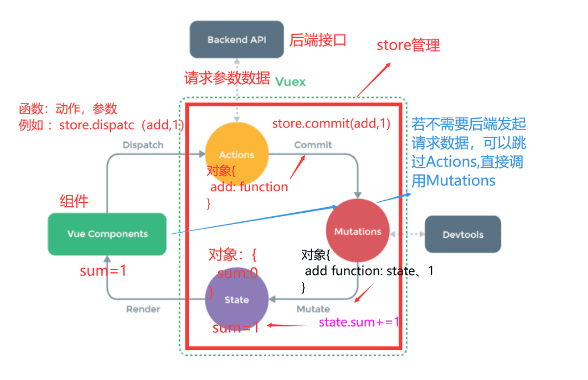
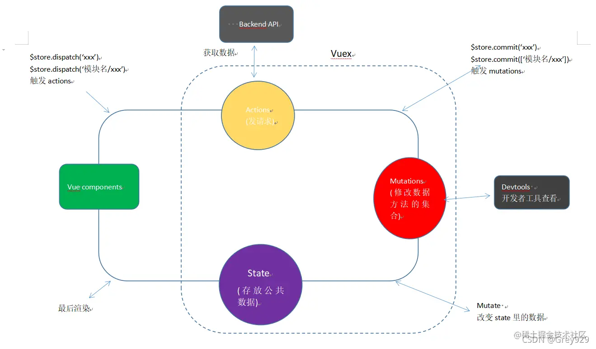
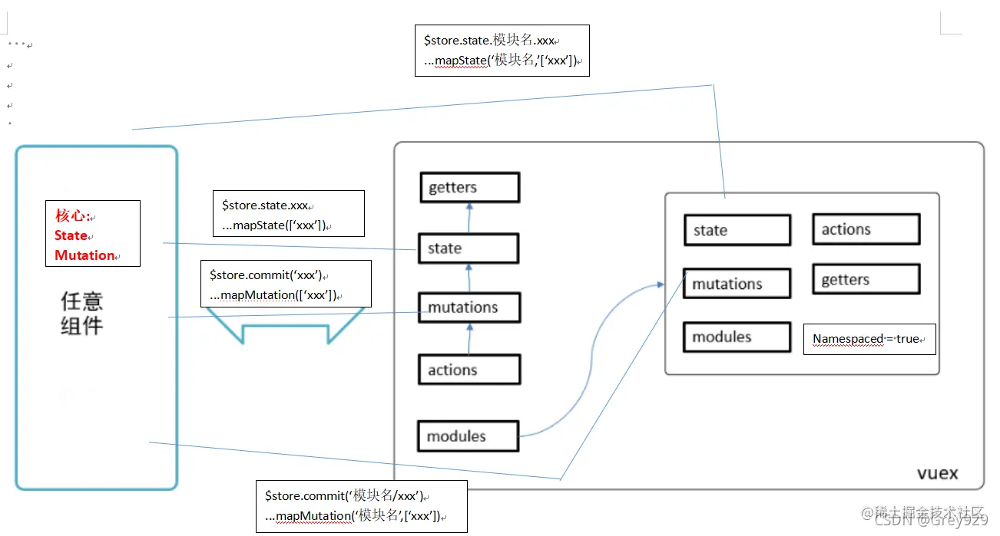

<h1><center>Vuex</center></h1>

[toc]

# 一、开始之前

[官网](https://vuex.vuejs.org/zh/)

## 1. 浏览器本地缓存(localStorage)、会话缓存(sessionStorage)、cookie、状态管理模式(vuex)的区别

- sessionStorage 方法针对一个会话(session)进行数据存储。sessionStorage 用于保存每个用户的专用信息，变量的值保存在服务器端，通过 SessionID 来区分不同的客户。当用户关闭浏览器窗口后，数据会被删除。

- cookie 是服务器发给客户端的特殊信息，cookie 是以文本的方式保存在客户端，每次请求时都带上它.能够用来判断用户是否登陆过网站，以便下次登录时能够实现自动登录。如果不在浏览器中设置过期时间，cookie 被保存在内存中，生命周期随浏览器的关闭而结束，这种 cookie 简称会话 cookie。如果在浏览器中设置了 cookie 的过期时间，cookie 被保存在硬盘中，关闭浏览器后，cookie 数据仍然存在，直到过期时间结束才消失。

- localStorage 将数据保存到本地，存储的数据没有时间限制。
- Vuex 是一个专为 Vue.js 应用程序开发的状态管理模式。它采用集中式存储管理应用的所有组件的状态，并以相应的规则保证状态以一种可预测的方式发生变化。vuex 会随着页面的重启刷新一起重置状态
- 区别：
  cookie 保存在浏览器端，session 保存在服务器端
  vuex 存储在内存,localstorage（本地存储）则以文件的方式存储在本地,永久保存；sessionstorage( 会话存储 ) ,临时保存。localStorage 和 sessionStorage 只能存储字符串类型，对于复杂的对象可以使用 ECMAScript 提供的 JSON 对象的 stringify 和 parse 来处理.

# 二、概述

## 1. Vuex 是什么？

Vuex 是一个专为 Vue.js 应用程序开发的状态管理模式。它采用集中式存储管理应用的所有组件的状态（数据）。 Vuex 也集成到 Vue 的官方调试工
简单来说， Vuex 是在 Vue 中实现集中式状态（数据）管理的一个 Vue 插件，对 vue 应用中多个组件的共享状态进行集中式的管理（读/写），也是一种组件
式，且适用于任意组件间通信

## 2.何时使用

- 当多个组件需要共享数据
- 多个组件依赖于同一状态
- 来自不同组件的行为需要变更同一状态

## 3. 原理图分析

接下来以一个函数 add（参数为 1），来说明 Vuex 的原理图。

（1）state：vuex 管理的状态对象（数据对象） ，它应该是唯一的。

（2）actions：为一个对象，包含多个响应用户动作的回调函数。

> 在组件中使用$store.dispatch('对应的 action 回调名')触发 actions 中的回调
> 通过 commit( )来触发 mutation 中函数的调用, 间接更新 state。
> 可以包含异步代码（定时器, ajax 等等）

（3）mutations：是一个对象，包含多个直接更新 state 的方法

> 在 action 中使用 commit('对应的 mutations 方法名') 触发 mutations 中的方法
> 不能写异步代码、只能单纯的操作 state



# 三、安装及配置

## 1、安装

```javascript
npm install vuex@3 --save
# or
yarn add vuex@3 --save
# cdn引入
<script src="/path/to/vue.js"></script>
<script src="/path/to/vuex.js"></script>
```

## 2、配置

```javascript
1.在store/index.js 中放置具体的代码

import Vue from 'vue'
import Vuex from 'vuex'
Vue.use(Vuex)
const store = new Vuex.Store({
  state: {
    count: 0,num: 10
  }，
  mutation:{},
  action:{},
  getters:{}
})
export default store
-------------------------------------------

2.在src/main.js中

// 1. 导入store
import store from './store'
new Vue({
   store    //注入store
  // 省略..
})
```

# 四、使用

map 辅助函数
作用:当数据嵌套太深,优化访问方式

### 1.state

提供唯一的公共数据源，所有共享的数据统一放到 store 的 state 进行储存

- 单一状态树
    - Vuex 用一个对象就包含了全部的应用层级状态
    - 每个应用将仅仅包含一个 store 实例
    - 单状态树和模块化并不冲突

#### 1.1 基本使用

  ```javascript
  1.模板中 省略this
  {{$store.state.xxx}}
  {{$store.state.模块名.xxx}}

  2.组件中
  this.$store.state.xxx
  this.$store.state.模块名.xxx
  ```

监听 state 变化 每当 state 变化便会重新计算，并且触发更新相关联的 DOM。

```js
// 创建一个 Counter 组件
const Counter = {
	template: `<div>{{ count }}</div>`,
	computed: {
		count() {
			return store.state.count
		}
	}
}
```

#### 1.2 mapState

- 使用 mapState 取得 state 中的值 并支持响应式

```js
import mapState from 'vuex'
export default{
    computed: {
      ..mapState(['count','sum'])
  }
}
// # 或者
import mapState from 'vuex'
export default {
  data () {
    return {
      localCount: 10
    }
  },
  computed: {
    ...mapState({
      count: 'count',
      sum: state => state.sum,
      // 为了能够使用`this` 获取局部状态，必须使用常规函数
    countPlusLocalState (state) {
    return state.count + this.localCount
    }
    })
  }
}
  // 组件内使用
    <h1>当前求和为：{{sum}}</h1>
```

  > 注: state.sum 等同于 state['sum']

### 2.getters

类似于 vue 中的 computed，进行缓存，对于 Store 中的数据进行加工处理形成新的数据

#### 2.1 基本使用

  ```js
  // 1.定义格式
  new Vuex.store({
    // 省略其他...
    getters: {
      // state 就是上边定义的公共数据state
      bigCount: function(state) {
        return state.conut *  10
      }
    }
  })

  2.使用格式
  $store.getters.bigCount
  $store.getters['模块名/xxx']
  ```

- 监听 state 变化 每当 state 变化便会重新计算 getters

    ```js
    const Counter = {
    	template: `<div>{{ bigCount }}</div>`,
    	computed: {
    		count() {
    			return store.getters.bigCount
    		}
    	}
    }
    ```

- 通过方法传参访问
    通过让 getter 返回一个函数，来实现给 getter 传参

    ```js
    getters: {
    	// ...
    	getTodoById: state => id => {
    		return state.todos.find(todo => todo.id === id)
    	}
    }
    ```

    ```js
    store.getters.getTodoById(2) // -> { id: 2, text: '...', done: false }
    ```

#### 2.2 mapGetters

- 使用 mapGetters 取得 getters 中的值 并支持响应式

    ```js
     computed: {
     //借助mapGetters生成计算属性：bigSum（对象写法）
     ...mapGetters({bigSum:'bigSum'}),
    
     //借助mapGetters生成计算属性：bigSum（数组写法）
     ...mapGetters(['bigSum'])
     }
     // 组件内使用
     <h3>当前求和放大10倍为：{{bigSum}}</h3>
    ```

### 3.mutations

更改 Vuex 的 store 中的状态的唯一方法是提交 mutation。Vuex 中的 mutation 非常类似于事件：每个 mutation 都有一个字符串的事件类型 (type)和一个回调函数 (handler)。这个回调函数就是我们实际进行状态更改的地方，并且它会接受 state 作为第一个参数：

#### 3.1 基本使用

```js
mutations：{
    // 每一项都是一个函数，可以声明两个形参
    // 参数1 当前state   参数2 载荷payload
  	SET_COUNT：function(state,count) {
      state.count = count
    },
    INC_COUNT:(state)=>{
        state++
    }
}

// 调用格式
// commit是固定写法
// 参数2:(可选) 如果要传递复杂数据,第二个参数可以是对象
this.$store.commit('SET_COUNT', 100)
this.$store.commit('模块名/mutation名', 参数)
```


#### 3.2 Vuex-mutations 拓展:

(1).Vuex 中的 mutation 非常类似于事件：每个 mutation 都有一个字符串的 **事件类型 (type)** 和 一个 **回调函数 (handler)** 。这个回调函数就是我们实际进行状态更改的地方，并且它会接受 state 作为第一个参数。

(2).不推荐直接在组件内部修改数据(比如 this.$store.state.count = 10;),特别是在严格模式下会报错。

#### 3.3 mapMutations

放在 methods 下 后续直接调用方法,推荐重命名一下

```js
methods:{
 ...mapMutations({setCount:'SET_COUNT',incCount:'INC_COUNT'})
}
methods:{
 ...mapMutations(['SET_COUNT','INC_COUNT'])
}
// 调用
mounted(){
  this.setCount(100)
  // this.SET_COUNT(100)
}
```

### 4.actions

1.action 中可以通过调用 mutation 来修改 state，而不是直接变更状态

2.action 可以包含**异步**(例如发请求)操作。

#### 4.1 基本使用

```js
// 写法一
actions: {
  // context对象会自动传入，它与store实例具有相同的方法和属性
  getCount: function(context, payload) {
    // 1. 发异步请求, 请求数据
    // 2. commit调用mutation来修改/保存数据
    // context.commit('mutation名', 载荷)
  }
}
// 写法二
actions: {
  getCount: ({commit}, arg)=> {
      getCountApi(arg).then((count)=>{
        commit('SET_COUNT',count)
      })
  },
  getInfo:({commit},arg)=>{
    return getInfoApi(arg).then((count)=>{
        commit('INC_COUNT',count)
        return count
      })
  }
}
// 调用
this.$store.dispatch('actions的名字', 参数)
this.$store.dispatch('模块名/actions的名字', 参数)
this.$store.dispatch('getCount', 'arg')
this.$store.dispatch('getInfo', 'arg').then((count)=>{
  console.log(count)
})
```

#### 4.2 mapActions

放在 methods 下 后续直接调用方法,推荐重命名一下

```js
methods:{
    ...mapActions({getCount:'getCount',getInfo:'getInfo'})
}
// 或
methods:{
    ...mapActions(['getCount','getInfo'])
}
// 调用
mounted(){
  this.getCount('100')
  this.getInfo(100).then((name)=>{console.log(name)})
}
```

### 5.modules

**当遇见大型项目时，数据量大，store 就会显得很臃肿**

**当多人协同开发时，命名难免会冲突，单个store模块就显得难以维护**

**为了解决以上问题，Vuex 允许我们将 store 分割成模块（module）。每个模块拥有自己的 state、mutation、action、getter、甚至是嵌套子模块——从上至下进行同样方式的分割：**

默认情况下，模块内部的 action 和 mutation 仍然是注册在**全局命名空间**的——这样使得多个模块能够对同一个 action 或 mutation 作出响应。

如果希望模块具有更高的封装度和复用性，可以通过添加 namespaced: true 的方式使其成为带命名空间的模块。当模块被注册后，它的所有 getter、action 及 mutation 都会自动根据模块注册的路径调整命名。

#### 5.1 基本使用

```js
new Vuex.Store({
  // state: 用来保存所有的公共数据
  state: {},
  getters: {},
  mutations: {},
  actions: {},
  modules: {
  	user: {
    		// namespaced为true，则在使用mutations时，就必须要加上模块名
            // 如果为false 则不需加模块名
      	namespaced: true,
  		  state: {
          name:'zhangsan'
        },
  			getters: {
          getName(state){
          return state.name
        }},
  			mutations: {
          SET_NAME(state,name){
            state.name = name
          }
        },
  			actions: {
          getInfo({commit},id){
            return getNameByIdApi(id).then((name)=>{
              commit('SET_NAME',name)
              return name
            })
          }
        },
  			modules: {}
  	}
  })
```

后续调用

```js
this.$store.state.user.name
this.$store.state['user/name']

this.$store.getters['user/getName']
this.$store.commit('user/SET_NAME', 'ls')
this.$store.dispatch('user/getInfo', 11).then((name)=>{
  console.log(`hello! ${name}`)
})

computed:{ 
  ...mapState({name:'user/name'}),
  // ...mapState([name:'user/name'])

  ...mapGetters({name:'user/getName'})
  // ...mapGetters([name:'user/getName'])
}
// 调用
mounted(){
  console.log(this.name)
  console.log(this.getName)
}


methods:{
  ...mapMutations({ setName:'user/SET_NAME' }),
  // ...mapMutations(['user/SET_NAME'])
  
  ..mapActions({ getInfo:'user/getInfo' })
  // ..mapActions(['user/getInfo' ])
}
// 调用
mounted(){
  setName('ls')
  // SET_NAME('ls')

  getInfo(11).then((name)=>{
    console.log(`hello! ${name}`)
  })
}

```


用了 modules 之后的结构


# 五、项目结构

- 规则：

  - 应用层级的状态应该集中到单个 store 对象中。
  - 提交 **mutation** 是更改状态的唯一方法，并且这个过程是同步的。
  - 异步逻辑都应该封装到 **action** 里面。

- 示例：

  ```
  ├── index.html
  ├── main.js
  ├── api
  │   └── ... # 抽取出API请求
  ├── components
  │   ├── App.vue
  │   └── ...
  └── store
      ├── index.js          # 我们组装模块并导出 store 的地方
      ├── actions.js        # 根级别的 action
      ├── mutations.js      # 根级别的 mutation
      └── modules
          ├── cart.js       # 购物车模块
          └── products.js   # 产品模块
  ```
# 六、严格模式

- 开启严格模式，仅需在创建 store 的时候传入 `strict: true`

  ```js
  const store = createStore({
    // ...
    strict: true
  })
  ```

- 在严格模式下，无论何时发生了状态变更且不是由 mutation 函数引起的，将会抛出错误。这能保证所有的状态变更都能被调试工具跟踪到。

- **不要在发布环境下启用严格模式**

# 七、小结

1:actions mutations state 关系图



2:核心 API


