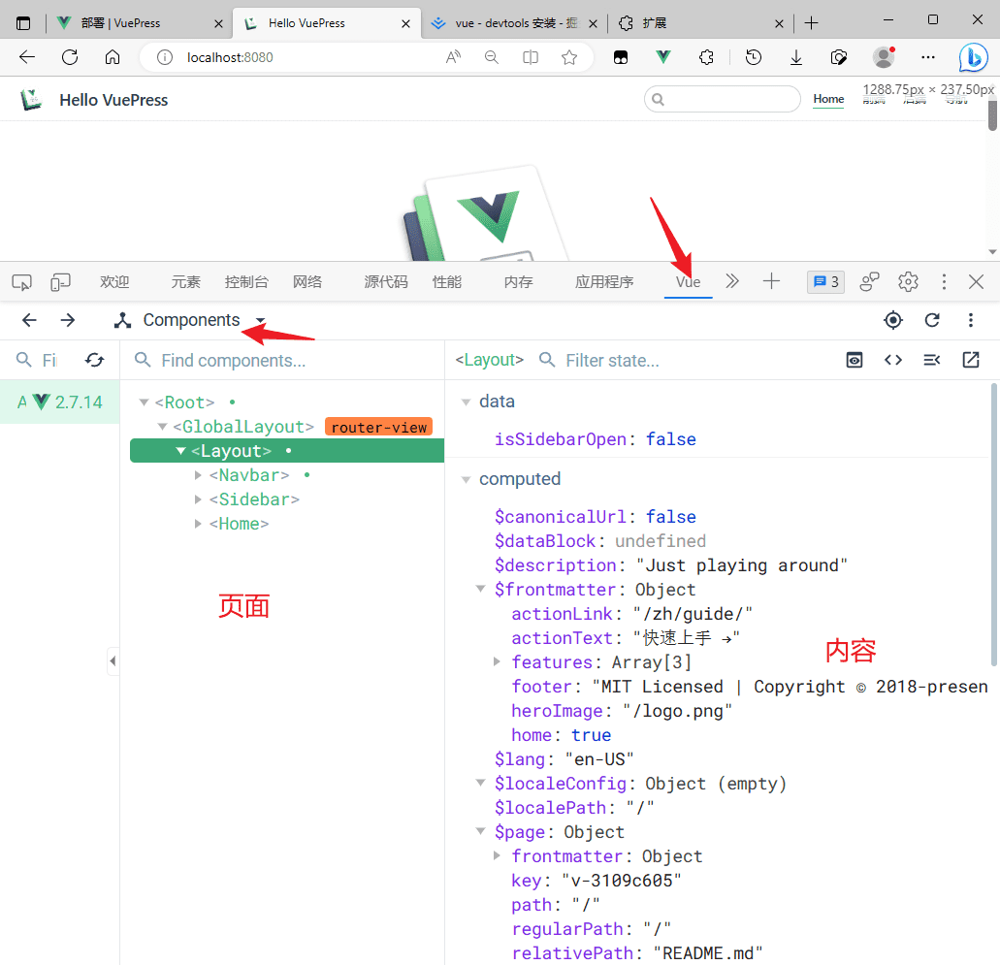

<h1><center>开发工具选型</center></h1>

[toc]

# 一、开发工具

## 1. Vscode
  [官网](https://code.visualstudio.com/docs#vscode) [指南](https://blog.csdn.net/weixin_46215588/article/details/110160065)

  > 功能强大、高度可定制化的编辑器，适用于各种编程语言和项目类型。支持多平台、支持多语言开发,主题界面更丰富,插件齐全,
  >
  > 但后期插件多了之后,就显得繁琐,并且不便于管理 占用内存并且体积也大 
  >
  > 

## 2. Sublime Text 
  [官网](https://www.sublimetext.com) [指南](https://blog.csdn.net/mazegong/article/details/78859502)

  > Sublime轻便，软件尺寸小，打开响应快,具有代码高亮和提示功能 
  > 配置上不是很方便，存在一定版本兼容问题
  >
  > 

## 3. HBuilder / HBuilder X
   [官网](https://hx.dcloud.net.cn/Tutorial/install/windows) [指南](https://blog.csdn.net/weixin_54217081/article/details/122781088)

   > uniapp 官方开发的编辑器 主要用于uniapp程序开发
   > 国产的一个轻便小巧的Web前端开发软件，界面干净、柔绿护眼、轻巧灵活，运行速度快，语法提示、文字处理功能强大,并且不管是启动速度、大文档打开速度、编码提示，都极速响应 ，除此之外，还自带有云端打包功能，可以将前端开发的网页打包为手机APP，使用起来非常方便
   >
   > 编辑器滚动条的滑动有卡顿卡；比较吃内存。HBuilder还自带了可调试控制台的浏览器，ide+浏览器都在这里，内存占用少不了。资源消耗更多，但HBuilder可保证主流配置电脑流畅使用。
   >
   > 

## 4. WebStorm 
   [官网](https://www.jetbrains.com/zh-cn/webstorm/download/other.html)   [指南](https://blog.csdn.net/2301_77835649/article/details/130607199)

   > 前端开发中一个比较专业的软件，相比较其他软件来说，体积比较大，功能也更复杂，常见的代码高亮、智能补全、Git等功能，这个软件都能很好的支持，除此之外，还支持代码调试、重构等功能
   >
   > 


# 二、包管理工具

## 1.  npm  
   [官网](https://www.npmjs.com/) [指南](https://blog.csdn.net/qq_44885775/article/details/126524404)

   > Node Package Manager  Node .js的软件包管理器 与nodejs捆绑安装 nodejs版本不同npm版本也就不同

## 2.  cnpm

   > cnpm 是淘宝对国外 npm 服务器的一个完整镜像版本

## 3.  pnpm

   > pnpm 适用于大型项目 

## 4.  yarn

  > yarn 是 Facebook 开源的新的包管理器，可以用来代替 npm。
  >
  >   - 本地缓存。安装过的包下次不会进行远程安装
  >   - 并行下载。一次下载多个包，而 npm 是串行下载
  >   - 精准的版本控制。保证每次安装跟上次都是一样的

   ```bash
    安装:
   	npm install yarn -g
    yarn相关命令
       yarn --version
       yarn init  //生成package.json
       yarn global add  package (全局安装)
       yarn global remove less (全局删除)
       yarn add package (局部安装)
       yarn add package --dev (相当于npm中的--save-dev)
       yarn remove package
       yarn list //列出已经安装的包名 用的很少
       yarn info packageName //获取包的有关信息  几乎不用
       yarn //安装package.json中的所有依赖
   ```

## 5. nvm  
   [相关安装教程](https://juejin.cn/post/7074108351524634655)

   > nodejs版本管理工具 可以快速切换nodejs版本

   ```bash
   nvm命令提示
       nvm install <version> [arch] 安装node 
       nvm list：显示已安装的列表。list可简化为ls。
       nvm use [version] [arch] ：使用制定版本node。
       nvm version ：显示nvm版本
       
       nvm on ：开启node.js版本管理。
       nvm off ：关闭node.js版本管理。
       nvm proxy [url] ：设置下载代理。
       nvm node_mirror [url] ：设置node镜像。
       nvm npm_mirror [url] ：设置npm镜像。
       nvm uninstall <version> ：卸载指定版本node。
       nvm root [path] ：设置存储不同版本node的目录。如果未设置，默认使用当前目录。
       nvm arch：显示node是运行在32位还是64位。
   ```

   ```bash
   使用例
   	nvm list
   	nvm install v16
   	nvm use 16
   ```

# 三、调试工具

## 1. Vue.js devtools  vue 的调试工具
   [相关安装教程](https://juejin.cn/post/7110225391528181767)

   使用例 打开浏览器开发者工具 tab栏有个 Vue 点击后即可查看更改项目中的一些内容

## 2. postman 
[官网](https://www.postman.com/downloads/) 

> 支持http协议的接口调试与测试工具 英文界面 简洁 功能强大，使用简单且易用性好 。
>
> 

## 3. apipost 
[官网](https://www.apipost.cn/) 

> 支持http协议的接口调试与测试工具  中文界面 支持生成接口文档
>
> 

# 四、打包工具

## 1. Vue-cli-srevice 
[官网](https://cli.vuejs.org/zh/guide/cli-service.html) 
>Vue CLI 是一个基于 Vue.js 进行快速开发的完整系统，提供：
- 通过 @vue/cli 实现的交互式的项目脚手架。
- 通过 @vue/cli + @vue/cli-service-global 实现的零配置原型开发。
- 一个运行时依赖 (@vue/cli-service)，该依赖：
  可升级；
   - 基于 webpack 构建，并带有合理的默认配置；
   - 可以通过项目内的配置文件进行配置；
   - 可以通过插件进行扩展。
- 一个丰富的官方插件集合，集成了前端生态中最好的工具。
- 一套完全图形化的创建和管理 Vue.js 项目的用户界面。

## 2. Vite 
[官网](https://cn.vitejs.dev/) 

> vue官方开发并推荐使用 优点支持热部署 依赖预加载 开箱即用 对于项目中需要的静态资源，html，less等无需手动引入loader来处理这些资源，直接引入对应的库即可 
 但耗内存 大型项目启动速度较慢
## 3. Webpack 
[官网](https://www.webpackjs.com/) 
> 需要手动配置CssLoader SassLoader 配置项复杂，社区丰富
   在webpack项目中需要使用的静态资源，css，以及less等预处理器需要手动引入对应的loader才能使用,
   支持代码分割，热更新，丰富的插件系统，通过使用loader可以解析各种类型的资源等
   缺点：冷启动，热更新随着项目体量增大而变慢，体量大的项目热更新一次甚至需要几分钟

# 五、浏览器

1. Chrome 谷歌浏览器

2. edge 浏览器

# 六、vscode插件

1. Live Server 一个具有实时加载功能的小型服务器，可以使用它来破解html/css/javascript，但是不能用于部署最终站点。也就是说我们可以在项目中实时用live-server作为一个实时服务器实时查看开发的网页或项目效果。

2. Vue Language Features (Volar) / Vetur  针对vue文件的插件 提供代码提示、.vue文件代码格式化功能

3. Vue 2 Snippets 快速生成vue2相关代码片段

4. Chinese (Simplified) (简体中文) Language Pack for Visual Studio Code    vscode汉化插件

5. Auto Rename Tag 自动重命名结束标签

6. Auto Close Tag 自动添加结束标签


