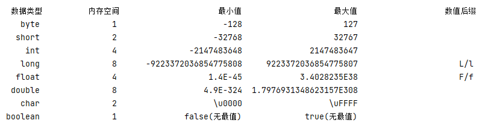
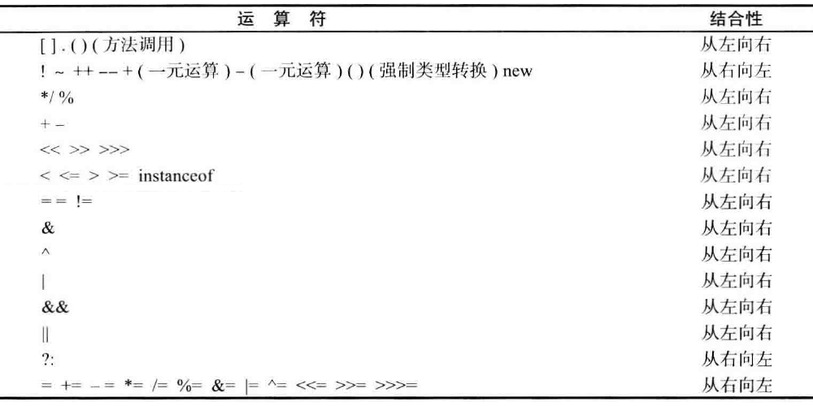
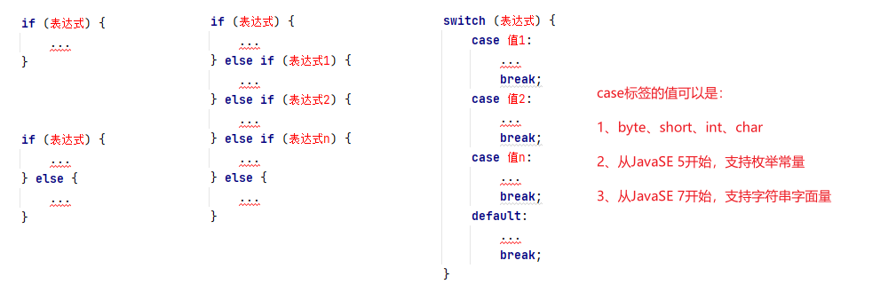
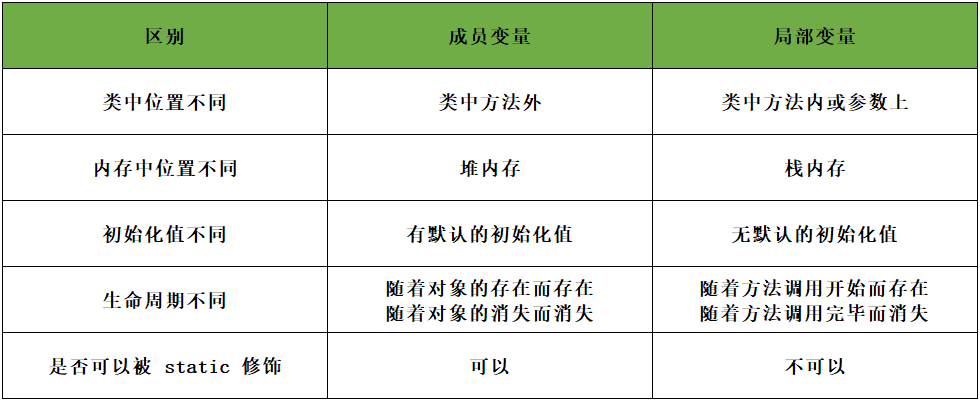
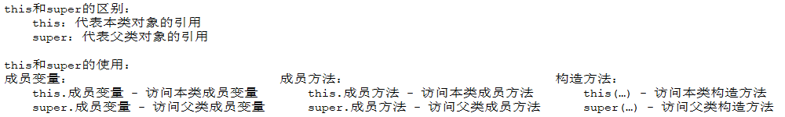
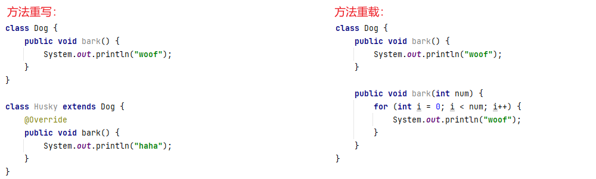
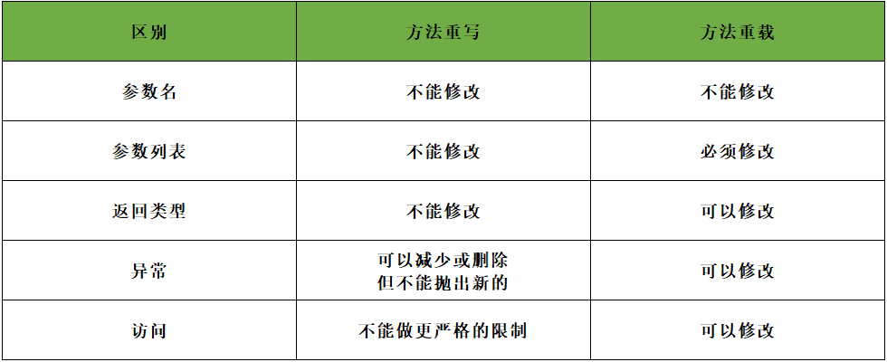

<h1><center>java8基础</center></h1>
[TOC]
> *   官方文档：https://docs.oracle.com/javase/8/docs/index.html
> *   下载地址：https://www.oracle.com/java/technologies/javase/javase-jdk8-downloads.html
> *   配套版本：1.8.0_291
> *   配套资料：无

第一章 基础语法
========

1.1、标识符
-------

标识符可以简单理解为：给文件名、类名、接口名、注解名、数组名、方法名、变量名、常量名起名字。

标识符的命名规则：（必须遵守）

*   标识符由字母(a-z,A-Z)、数字(0-9)、下划线(_)、美元符号($)，且第一个字符不能为数字。
*   标识符是严格区分大小写的。
*   标识符使用 Unicode 标准字符集，最多可以识别 65535 个字符。
*   标识符不能是 Java 的关键字和保留字。

标识符的写法规则：（建议遵守）

*   大驼峰命名法：所有单词的首字母大写，单词间无空格，适用于：**文件名、类名、接口名、注解名**，例如：StudentName
*   小驼峰命名法：除首字母小写，其余所有单词的首字母大写，单词间无空格，适用于：**数组名、方法名、变量名**，例如：studentName
*   常量的命名法：所有单词大写，单词间用下划线分隔，适用于：**常量名**，例如：STUDENT_NAME

1.2、关键字和保留字
-----------

关键字是 Java 语言中已经被赋予特定意义的一些单词，不可以把这些关键字作为标识符来使用。

关键字的分类展示：（共50个）

*   用于定义数据类型的关键字：**class、interface、byte、short、int、long、float、double、char、boolean、void**
*   用于定义数据类型值的关键字：**true、false、null**
*   用于定义流程控制的关键字：**if、else、switch、case、default、while、do、for、break、continue、return**
*   用于定义访问权限修饰符的关键字：**private、protected、public**
*   用于定义类、方法、变量修饰符的关键字：**abstract、final、static、synchronized**
*   用于定义类与类、类与接口、接口与接口之间关系的关键字：**extends、implements**
*   用于定义建立实例、引用实例、判断实例的关键字：**new、this、super、instanceof**
*   用于定义异常处理的关键字：**try、catch、finally、throw、throws**
*   用于定义包、导入包的关键字：**package、import**
*   剩余其他的关键字：**volatile、transient、strictfp、native、assert**

保留字的分类展示：（共2个）

*   在命名标识符的时候，虽然 const 和 goto 不是 Java 的关键字，但也不可以使用，这两个词可能会在以后的升级版本中被用到。

1.3、基本数据类型
----------


**数据类型：**



**整数类型：**

    int a = 0b11111111;//支持二进制
    int b = 255;//支持十进制
    int c = 0377;//支持八进制
    int d = 0xFF;//支持十六进制

**转义字符：**

| 转义字符 | 字符含义                    |
| -------- | --------------------------- |
| `\ddd`   | 3位八进制数所代表的任意字符 |
| `\uxxxx` | 4位十六进制所代表的任意字符 |
| `\'`     | 代表一个单引号字符          |
| `\"`     | 代表一个双引号字符          |
| `\\`     | 代表一个反斜杠字符          |
| `\t`     | 水平制表符                  |
| `\r`     | 回车                        |
| `\n`     | 换行                        |
| `\b`     | 退格                        |
| `\f`     | 换页                        |

> 有特殊意义的字符若想使用它原本的意思，就需要使用到转义字符"\\"

1.4、变量和常量
---------

*   变量：在程序运行期间，其值可以发生改变的量，被称为变量。语法：`数据类型 标识符 [=初始化值];`
*   常量：在程序运行期间，其值不会发生改变的量，被称为常量。语法：`final 数据类型 标识符 [=初始化值];`

1.5、类型转换
--------

*   自动类型转换：把小范围数据类型赋值给大范围数据类型，由于精度并不会丢失，因为这种转换是自动的。
*   强制类型转换：把大范围数据类型赋值给小范围数据类型，由于精度可能会丢失，因此需要进行强制转换。
    *   语法：`目标数据类型 新标识符 = (目标数据类型)(旧标识符 / 表达式);`

1.6、运算符
----------------------------------------------------------------------------------------------

**运算符的分类：**

*   算术运算符：**+、-、*、/、%**
*   自增与自减：**++、–-**
*   位运算符：**&（与）、|（或）、~（非）、^（异或）**
*   移位运算符：**<<（左移）、>>（有符号右移）、>>>（无符号右移）**
*   逻辑运算符：**&&（逻辑与）、||（逻辑或）、!（逻辑非）**
*   关系运算符：**==、!=、<、<=、>、>=、instanccof**
*   三目运算符：**condition ? sentence1 : sentence2**
*   赋值运算符：**=、+=、-=、*=、/=、%=、&=、|=、^=、<<=、>>=、>>>=**

> instanccof,它的作用是判断其左边对象是否为其右边类的实例，返回boolean类型的数据。可以用来判断继承中的子类的实例是否为父类的实现。

**运算符优先级：**



1.7、输入和输出
---------

```java
// import java.util.Scanner;
Scanner scanner = new Scanner(System.in);

byte b = scanner.nextByte();//输入byte类型数据
short s = scanner.nextShort();//输入short类型数据
int i = scanner.nextInt();//输入int类型数据
long l = scanner.nextLong();//输入long类型数据
float f = scanner.nextFloat();//输入float类型数据
double d = scanner.nextDouble();//输入double类型数据
char c = scanner.next().charAt(0);//输入char类型数据
boolean bool = scanner.nextBoolean();//输入boolean类型数据

System.out.println("b=" + b);//输出byte类型数据
System.out.println("s=" + s);//输出入short类型数据
System.out.println("i=" + i);//输出入int类型数据
System.out.println("l=" + l);//输出long类型数据
System.out.println("f=" + f);//输出float类型数据
System.out.println("d=" + d);//输出double类型数据
System.out.println("c=" + c);//输出char类型数据
System.out.println("bool=" + bool);//输出boolean类型数据
```


1.8、流程控制
--------

**条件语句：**



**循环语句：**


**跳转语句：**

*   break：结束本次循环。带标签的 break 语句，将跳到与标签匹配的语句块末尾。
*   continue：跳过本次循环。带标签的 continue 语句，将跳到与标签匹配的循环首部。

1.9、数组
------

*   **一维数组：**
    *   格式一：`数据类型[] 数组名 = new 数据类型[数组长度];`
    *   格式二：`数据类型[] 数组名 = new 数据类型[]{元素1,元素2,...};`
    *   格式三：`数据类型[] 数组名 = {元素1,元素2,...};`
*   **二维数组：**
    *   格式一：`数据类型[][] 数组名 = new 数据类型[行长度][列长度];`
    *   格式二：`数据类型[][] 数组名 = new 数据类型[][]{{元素1,元素2,...},{元素1,元素2,...},...};`
    *   格式三：`数据类型[][] 数组名 = {{元素1,元素2,...},{元素1,元素2,...},...};`
*   **参数数组：**
    *   命令行：`public static void main(String[] args)`

-----

> java有垃圾回收机制，不需要手动释放内存，只需要将数组变量置为null即可。详细请看第九章节《JVM-垃圾回收》

第二章 面向对象
========

2.1、类
-----

### 2.1.1、类的定义

```java
[public] class 类名 {
    // 成员变量（可多个）
    [权限修饰符] {基本数据类型|引用数据类型} 变量名;

    // 成员常量（可多个）
    [权限修饰符] final {基本数据类型|引用数据类型} 变量名;

    // 成员方法（可多个）
    [权限修饰符] 返回值类型 方法名([参数类型 参数名,...]) {
        ...
        [return 返回值;]
    }

    // 构造方法（无参，只一个）
    public 类名() {
        ...
    }

    // 构造方法（有参，可多个）
    public 类名([参数类型 参数名,...]) {
        ...
    }
}
```

> 引用数据类型:  **类、接口、数组**

**成员变量 和 局部变量的区别？**



### 2.1.2、类的继承

    [public] class 父类 { }
    [public] class 子类 extends 父类 { }

**this 和 super关键字的对比？**



**继承中变量使用的访问特点？**

1.  子类局部范围找
2.  子类成员范围找
3.  父类成员范围找
4.  如果都没有就报错(不考虑父亲的父亲…)

**继承中成员方法的访问特点？**

1.  子类成员范围找
2.  父类成员范围找
3.  如果都没有就报错(不考虑父亲的父亲…)

**继承中构造方法的访问特点？**

1.  子类中所有的构造方法默认都会访问父类中无参的构造方法，每一个子类构造方法的第一条语句默认都是：super()
2.  如果父类中没有无参的构造方法，只有带参的构造方法，通过使用 super 关键字去显示的调用父类的带参构造方法。

**多态中成员变量的访问特点？**

1.  编译看父类，运行看父类

**多态中成员方法的访问特点？**

1.  编译看父类，运行看子类

**多态中向上转型和向下转型？**

1.  向上转型：`父类引用指向子类对象就是向上转型`
2.  向下转型：`子类型 对象名 = (子类型)父类引用;`

**方法重写 和 方法重载的区别？**

*   方法重写：子类对父类允许访问的方法的实现过程进行重新编写就是方法重写。英文名：Override
*   方法重载：在一个类里面，方法名字相同而参数列表不同的方法就是方法重载。英文名：Overload





### 2.1.3、[static](https://so.csdn.net/so/search?q=static&spm=1001.2101.3001.7020)关键字

由 static 关键字修饰的成员变量、成员常量、成员方法和内部类被称为静态成员变量、静态成员常量、静态成员方法和静态内部类。

*   修饰成员变量时，将其变为类的静态成员变量，从而实现所有对象对于该变量的共享，可直接使用"类名.变量名"的方式调用。
*   修饰成员常量时，将其变为类的静态成员常量，从而实现所有对象对于该常量的共享，可直接使用"类名.常量名"的方式调用。
*   修饰成员方法时，将其变为类的静态成员方法，从而实现所有对象对于该方法的共享，可直接使用"类名.方法名"的方式调用。
*   修饰内部类时，将其变为类的静态内部类，从而实现所有对象对于该内部类的共享，可直接使用"类名.内部类名"的方式调用。
*   静态导包用法时，将指定类的方法直接导入到当前类中，从而直接使用"方法名"即可调用指定类的指定方法。
*   静态代码块用法时，随着类的加载而执行，而且只执行一次，常用于初始化成员变量。

**非静态的成员方法 和 静态的成员方法的区别？**


### 2.1.4、final关键字

*   final 关键字修饰基本数据类型时，其数值不能发生改变。
*   final 关键字修饰引用数据类型时，其地址不能发生改变。
*   final 关键字修饰成员方法时，表示该方法不能被重写。
*   final 关键字修饰 class 类时，表示该类不能被继承。

### 2.1.5、[package](https://so.csdn.net/so/search?q=package&spm=1001.2101.3001.7020)关键字

概述：包就是文件夹，用来管理类文件的。

语法：`package 包名;` （多级包名用点分隔）

    带包编译：javac –d . 类名.java
    例如：javac -d . com.company.demo.HelloWorld.java
    
    带包运行：java 包名+类名
    例如：java com.company.demo.HelloWorld


### 2.1.6、import关键字

概述：使用不同包下的类时，使用的时候要写类的全路径，为了简化操作，Java就提供了导包的功能。

语法：`import 包名;` （多级包名用点分隔）

### 2.1.7、权限修饰符


2.2、对象
------

**对象的创建：**

    通过无参构造创建对象：对象类型 对象名 = new 对象类型();
    通过有参构造创建对象：对象类型 对象名 = new 对象类型(参数列表);


**对象的使用：**

    对象名.成员变量;
    对象名.成员方法();


**对象的比较：**

*   ==：用于比较两个对象的地址是否相同。
*   equals()：用于比较两个对象的内容是否相同，需要对象重写equals()、hashCode()两个方法。
*   instanceof运算符：用于判断运算符前的对象是否是运算符后的类、抽象类或接口的子类或实现类所创建的对象。
    *   语法：`boolean result = 对象 instanceof (类/抽象类/接口);`

**对象的销毁：**

每个对象都有生命周期，当对象生命周期结束时，分配给该对象的内存地址将会被回收，在 Java 中拥有一套完整的垃圾回收机制，用户不必担心废弃的对象占用内存，他会被垃圾回收器自动回收，垃圾回收不保证一定会发生，具体执行时间也不确定，可以手动调用：`System.gc();`回收。

*   当对象被置为null时将消亡。
*   当对象超出作用域时将消亡。

2.3、接口
------

    [public] interface 父接口 { }
    [public] class 子实现 implements 父接口 { }


1.  成员变量：只能是静态常量，默认修饰符：public static final
2.  成员方法：只能是抽象方法，默认修饰符：public abstract
3.  构造方法：没有构造方法
4.  默认方法：`public default 返回值类型 方法名(参数列表) { }`
5.  静态方法：`public static 返回值类型 方法名(参数列表) { }`

**如何解决默认方法冲突？**

如果先在一个接口中将一个方法定义为默认方法，然后又在超类或另一个接口中定义了同样方法，遵循如下规则：

1.  超类优先。如果超类提供了一个具体方法，同名且有相同参数类型的默认方法会被忽略。
2.  接口冲突。如果一个接口提供了一个默认方法，另一个接口提供了一个同名而且参数类型相同的方法，必须覆盖这个方法来解决冲突。

2.4、抽象类
-------

    [public] abstract 抽象类名 { }
    [public] class 实现类 extends 抽象类名 { }


1.  成员变量：既可以成员变量，也可以成员常量
2.  成员方法：既可以普通方法，也可以抽象方法
3.  构造方法：既可以无参构造，也可以有参构造
4.  注意事项：与abstract不能共存的关键字：final、private、static

2.5、内部类
-------

    [public] class Outer {
        [public] class Inner { }
    }


**内部类的常见分类：**

    成员内部类：在成员变量位置定义的内部类
    	   格式：外部类名.内部类名 对象名 = 外部类对象.内部类对象;
    	   注意：Outer.Inner oi = new Outer().new Inner();
    
    局部内部类：在成员方法位置定义的内部类
    	   格式：外界是无法直接使用，需要在方法内部创建对象并使用
    	   注意：局部内部类可以直接访问外部类的成员，也可以访问方法内的局部变量
    
    匿名内部类：前提是继承一个类或实现接口
    	   格式：new 类名 ( ) { 重写方法 } 、 new 接口名 ( ) { 重写方法 }
    	   注意：本质上是一个继承了该类或者实现了该接口的子类匿名对象
    
    静态内部类：在成员变量位置定义的内部类
    	   格式：使用 static 关键字修饰的成员内部类
    	   注意：静态内部类中可以声明静态成员，而成员内部类中不可以声明静态成员，而且静态内部类不可以访问外部类的非静态成员


2.6、[枚举类](https://so.csdn.net/so/search?q=%E6%9E%9A%E4%B8%BE%E7%B1%BB&spm=1001.2101.3001.7020)
----------------------------------------------------------------------------------------------

    [public] enum 枚举名 { 枚举项1,枚举项2,枚举项3,... }


1.  成员变量：既可以成员变量，也可以成员常量
2.  成员方法：既可以普通方法，也可以抽象方法，但是枚举项必须实现抽象方法
3.  构造方法：既可以无参构造，也可以有参构造，但是修饰符必须都是 private
4.  注意事项：枚举类第一行必须是枚举项，多个枚举项之间使用逗号隔开，最后一个枚举项使用分号结束，如果最后一个枚举项后没有其他东西，最后一个分号可以省略，所有枚举类都是Enum的子类，有参构造函数的枚举类的枚举项的用法比较特殊：`枚举项("")`

**枚举类的常用方法：**

方法

描述

示例

values()

该方法可以将枚举类型成员以数组的形式返回

枚举类型名称.values()

valueOf(String name)

该方法可以实现将普通字符串转换为枚举实例

枚举类型名称.valueOf()

compareTo()

该方法用于比较两个枚举对象在定义时的顺序

枚举对象.compareTo()

ordinal()

该方法用于获取枚举成员的位置索引

枚举对象.ordinal()

2.7、注解
------

    //基本注解
    public @interface 注解名 {
        成员类型 value() default "默认值; 
    }


**基本注解可以取啥？**

*   @Document注解：表示将此注解包含在 javadoc 中
*   @Inherited注解：表示该注解的继承特性
*   @Retention注解：表示该注解的生命周期
    *   RetentionPolicy.SOURCE：源码期间有效
    *   RetentionPolicy.CLASS：编译期间有效
    *   RetentionPolicy.RUNTIME：运行期间有效
*   @Target注解：表示该注解的标注位置
    *   ElementType.TYPE：表示用于类、接口、枚举类以及注解上
    *   ElementType.FIELD：表示用于成员变量和枚举变量上
    *   ElementType.METHOD：表示用于成员方法上
    *   ElementType.PARAMETER：表示用于方法参数上
    *   ElementType.CONSTRUCTOR：表示用于构造方法上
    *   ElementType.LOCAL_VARIABLE：表示用于局部变量上
    *   ElementType.ANNOTATION_TYPE：表示用于注解上
    *   ElementType.PACKAGE：表示用于包上
    *   ElementType.TYPE_PARAMETER：表示用于类上泛型参数上
    *   ElementType.TYPE_USE：表示用于任何类型声明上
*   @Repeatable：表示该注解可重复使用


**成员类型可以取啥？**

*   八种基本数据类型、String、Class、枚举类、注解类及以上所列类型的数组

**平时开发常用注解？**

*   @Override：表示当前方法覆盖了父类的方法
*   @Deprecated：表示当前方法已经过时不建议使用
*   @SuppressWarnings：表示关闭一些警告信息，抑制信息如下：


2.8、泛型
------

**泛型类：**

    [public] class 类名<T> { }


**泛型方法：**

    权限修饰符 <T> 返回值类型 方法名(T t) {
        return 返回值类型;
    }


**泛型接口：**

    [public] interface 类名<T> { }


**泛型通配符：**

    类型通配符：<?>
        List<?>：表示元素类型未知的List，它的元素可以匹配任何的类型
        
    类型通配符上限：<? extends 类型>
        List<? extends Number>：它表示的类型是Number或者其子类型
        
    类型通配符下限：<? super 类型>
        List<? super Number>：它表示的类型是Number或者其父类型 


**泛型局限性：**

1.  不能用八种基本类型实例化类型参数，而是用他们所对应的包装类
2.  无论何时定义一个泛型类型， 都自动提供了一个相应的原始类型（ raw type )，原始类型的名字就是删去类型参数后的泛型类型名。擦除（ erased ) 类型变量，并替换为限定类型，无限定的变量用Object替换
3.  运行时类型查询只适用于原始类型，试图查询一个对象是否属于某个泛型类型时，倘若使用instanceof会得到一个编译器错误， 如果使用强制类型转换会得到一个警告，正确的做法是调用getClass()方法进行比较原始类型是否一致
4.  不能创建参数化类型的数组，例如：`Pair<String>[] table = new Pair<String>[10] ;`这是错误的，可以声明通配类型的数组， 然后进行类型转换：`Pair<String>[] table = (Pair<String>[]) new Pair<?>[10];`
5.  不能实例化类型变量，不能使用像`new T(...)`，`newT[...]` 或`T.class`这样的表达式
6.  不能在静态域或方法中引用类型变量
7.  不能抛出或捕获泛型类的实例

2.9、注释
------

    单行注释：// 注释内容
    多行注释：/* 注释内容 */
    文档注释：/** 注释内容 */


**文档注释加在类上的标签：**

*   @author：指定类的作者
*   @version：指定类的版本
*   @since：从以下版本开始
*   @see：另请参阅一个类

**文档注释加在方法上的标签：**

*   @param：说明一个方法的参数
*   @return：说明一个方法的返回值
*   @throws：说明一个方法的异常

第三章 基础类
=======

3.1、Object
----------

描述：该类是所有类的最终根类。

方法

描述

`public final native Class<?> getClass();`

返回对象的运行时类

`public boolean equals(Object obj)`

判断对象是否相等

`public native int hashCode();`

返回对象的哈希值

`protected native Object clone()`

返回对象的浅拷贝

`public String toString()`

返回对象的字符串表示

`protected void finalize()`

当对象即将消亡时运行

**如何实现对象的深拷贝？**

    public class Person implements Serializable {
        private static final long serialVersionUID = -7466779555039906117L;
        private String name;
        private Integer age;
        private Person friend;
    
        public String getName() {
            return name;
        }
    
        public void setName(String name) {
            this.name = name;
        }
    
        public Integer getAge() {
            return age;
        }
    
        public void setAge(Integer age) {
            this.age = age;
        }
    
        public Person getFriend() {
            return friend;
        }
    
        public void setFriend(Person friend) {
            this.friend = friend;
        }
    
        public Person deepClone() {
            ByteArrayOutputStream bos = null;
            ObjectOutputStream oos = null;
            ByteArrayInputStream bis = null;
            ObjectInputStream ois = null;
    
            try {
                //序列化
                bos = new ByteArrayOutputStream();
                oos = new ObjectOutputStream(bos);
                oos.writeObject(this);
    
                //反序列化
                bis = new ByteArrayInputStream(bos.toByteArray());
                ois = new ObjectInputStream(bis);
                return (Person) ois.readObject();
            } catch (Exception e) {
                e.printStackTrace();
            } finally {
                try {
                    ois.close();
                    bis.close();
                    oos.close();
                    bos.close();
                } catch (Exception e) {
                    e.printStackTrace();
                }
            }
            return null;
        }
    }


3.2、Class
---------

描述：在Java中，每个`class`都有一个相应的`Class`对象。也就是说，当我们编写一个类，编译完成后，在生成的`.class`文件中，就会产生一个`Class`对象，用于表示这个类的类型信息。

如何获取一个`class`的`Class`实例？有三个方法：

方法一：直接通过一个`class`的静态变量`class`获取：

    Class cls = String.class;


方法二：如果我们有一个实例变量，可以通过该实例变量提供的`getClass()`方法获取：

    String s = "Hello";
    Class cls = s.getClass();


方法三：如果知道一个`class`的完整类名，可以通过静态方法`Class.forName()`获取：

    Class cls = Class.forName("java.lang.String");


因为`Class`实例在`JVM`中是唯一的，所以，上述方法获取的`Class`实例是同一个实例。

1.  用`instanceof`不但可以匹配指定类型，还可以匹配指定类型的子类
2.  用`==`判断`class`实例可以精确地判断数据类型，但不能作子类型比较

由于`JVM`为每个加载的`class`创建了对应的`Class`实例，并在实例中保存了该`class`的所有信息，包括类名、包名、父类、实现的接口、所有方法、字段等，因此，如果获取了某个`Class`实例，我们就可以通过这个`Class`实例获取到该实例对应的`class`的所有信息。这种通过`Class`实例获取`class`信息的方法称为反射（`Reflection`）。

**反射创建新的实例：**

方法

描述

`public T newInstance()`

创建新的实例

**反射获取资源文件：**

方法

描述

`cls.getResourceAsStream("aa.txt");`

获取编译后Class文件同级目录的aa.txt

`cls.getClassLoader().getResourceAsStream("bb.txt");`

获取编译后ClassPath目录下的bb.txt

**反射获取构造方法：**

方法

描述

`public Constructor<?>[] getConstructors()`

返回一个包含Constructor对象的数组  
不包含私有构造，不包括父类声明的

`public Constructor<T> getConstructor(Class<?>... parameterTypes)`

返回一个指定的Constructor对象  
不包含私有构造，不包括父类声明的

`public Constructor<?>[] getDeclaredConstructors()`

返回一个包含Constructor对象的数组  
包含私有构造，不包括父类声明的

`public Constructor<T> getConstructor(Class<?>... parameterTypes)`

返回一个指定的Constructor对象  
包含私有构造，不包括父类声明的

**反射获取成员变量：**

方法

描述

`public Field[] getFields()`

返回一个包含Field对象的数组  
不包含私有成员变量，包括父类声明的

`public Field getField(String name)`

返回一个指定的Field对象  
不包含私有成员变量，包括父类声明的

`public Field[] getDeclaredFields()`

返回一个包含Field对象的数组  
包含私有成员变量，不包括父类声明的

`public Field getDeclaredField(String name)`

返回一个指定的Field对象  
包含私有成员变量，不包括父类声明的

**反射获取成员方法：**

方法

描述

`public Method[] getMethods()`

返回一个包含Method对象的数组  
不包含私有成员方法，包括父类声明的

`public Method getMethod(String name, Class<?>... parameterTypes)`

返回一个指定的Method对象  
不包含私有成员方法，包括父类声明的

`public Method[] getDeclaredMethods()`

返回一个包含Method对象的数组  
包含私有成员方法，不包括父类声明的

`public Method getDeclaredMethod(String name, Class<?>... parameterTypes)`

返回一个指定的Method对象  
包含私有成员方法，不包括父类声明的

**反射获取类上注解：**

方法

描述

`public Annotation[] getAnnotations()`

返回一个包含Annotation对象的数组  
包括继承的注解，继承需标明@Inherited

`public <A extends Annotation> A getAnnotation(Class<A> annotationClass)`

返回一个指定的Annotation对象  
包括继承的注解，继承需标明@Inherited

`public <A extends Annotation> A[] getAnnotationsByType(Class<A> annotationClass)`

返回一个指定的Annotation对象数组  
包括继承的注解，继承需标明@Inherited

`public Annotation[] getDeclaredAnnotations()`

返回一个包含Annotation对象的数组  
不包括继承的注解

`public <A extends Annotation> A getDeclaredAnnotation(Class<A> annotationClass)`

返回一个指定的Annotation对象  
不包括继承的注解

`public <A extends Annotation> A[] getDeclaredAnnotationsByType(Class<A> annotationClass)`

返回一个指定的Annotation对象数组  
不包括继承的注解

**反射获取类上信息：**

方法

描述

`public Package getPackage()`

获取当前类的包对象

`public String getName()`

获取当前类的类全名

`public Class<?>[] getClasses()`

获取当前类的所有内部类  
不包含私有，包含父类声明的

`public Class<?>[] getDeclaredClasses()`

获取当前类的所有内部类  
包含私有，不包含父类声明的

`public native Class<? super T> getSuperclass();`

返回直接继承的父类，不包含泛型参数

`public Type getGenericSuperclass()`

返回直接继承的父类，包含泛型参数

`public Class<?>[] getInterfaces()`

返回直接实现的接口，不包含泛型参数

`public Type[] getGenericInterfaces()`

返回直接实现的接口，包含泛型参数

**反射判断数据类型：**

方法

描述

`public native boolean isPrimitive();`

判断是否是基本类型

`public native boolean isArray();`

判断是否是数组类型

`public native boolean isInterface();`

判断是否是接口类型

`public boolean isEnum()`

判断是否是枚举类型

`public boolean isAnnotation()`

判断是否是注解类型

`public boolean isAnnotationPresent(Class<? extends Annotation> annotationClass)`

判断是否有指定注解

`public native boolean isAssignableFrom(Class<?> cls);`

判断是否为某类父类

3.3、System
----------

描述：在 System 类提供的设施中，有标准输入、标准输出和错误输出流；对外部定义的属性和环境变量的访问；加载文件和库的方法；还有快速复制数组的一部分的实用方法。

方法

描述

`public static native void arraycopy(Object src, int srcPos, Object dest, int destPos, int length);`

进行数组拷贝

`public static native long currentTimeMillis();`

获取当前时间（毫秒值）

`public static void exit(int status)`

退出当前程序

`public static void gc()`

运行垃圾回收

`public static java.util.Map<String,String> getenv()`

获取系统环境变量

`public static String getenv(String name)`

获取指定环境变量

`public static Properties getProperties()`

获取当前系统属性

`public static String getProperty(String key)`

获取指定系统属性

`public static String getProperty(String key, String def)`

获取指定系统属性（可设默认值）

`public static String clearProperty(String key)`

清除指定系统属性

`public static String lineSeparator()`

返回系统的分隔符

3.4、Math
--------

描述：Math 类包含执行基本数字运算的方法，如基本指数，对数，平方根和三角函数。

两个常量值：

*   `public static final double E = 2.7182818284590452354;`
*   `public static final double PI = 3.14159265358979323846;`

方法

描述

`public static int max(int a, int b)`

返回两个数中的最大值

`public static int min(int a, int b)`

返回两个数中的最小值

`public static int abs(int a)`

返回指定数字的绝对值

`public static double floor(double a)`

返回小于或等于参数的最大整数

`public static double ceil(double a)`

返回大于或等于参数的最小整数

`public static long round(double a)`

返回四舍五入后整数值

`public static double pow(double a, double b)`

返回a的b次幂

`public static double log(double a)`

返回log以e为底的值

`public static double sqrt(double a)`

返回a的正平方根

`public static double random()`

返回一个\[0.0 , 1.0)之间的随机数  
返回指定范围：`(int) (Math.random() * (max - min + 1) + min)`

`public static double sin(double a)`

返回正弦值

`public static double cos(double a)`

返回余弦值

`public static double tan(double a)`

返回正切值

`public static double asin(double a)`

返回反正弦值

`public static double acos(double a)`

返回反余弦值

`public static double atan(double a)`

返回反正切值

3.5、Number
----------

描述：抽象类 Number 是Byte、Short、Integer、Long、Float、Double、BigInteger、BigDecimal等类的父类。

方法

描述

`public byte byteValue()`

以 byte 形式返回指定的数值

`public short shortValue()`

以 short 形式返回指定的数值

`public abstract int intValue();`

以 int 形式返回指定的数值

`public abstract long longValue();`

以 long形式返回指定的数值

`public abstract float floatValue();`

以 float 形式返回指定的数值

`public abstract double doubleValue();`

以 double 形式返回指定的数值

3.6、包装类
-------

基本类型

包装类型

byte

Byte

short

Short

int

Integer

long

Long

float

Float

double

Double

char

Character

boolean

Boolean

    自动装箱：把基本数据类型转换为对应的包装类型
        例如：Integer total = 99; 
        对应：Integer total = Integer.valueOf(99);
    
    自动拆箱：把包装类型转换为对应的基本数据类型
        例如：int totalprim = total;
        对应：int totalprim = total.intValue();


**Integer类：**

方法

描述

`public static String toBinaryString(int i)`

将整数转为二进制字符串

`public static String toOctalString(int i)`

将整数转为八进制字符串

`public static String toHexString(int i)`

将整数转为十六进制字符串

`public static int parseInt(String s)`

将十进制数字字符串解析为整数

`public static int parseInt(String s, int radix)`

将指定进制的字符串解析为整数

`public static Integer valueOf(int i)`

将十进制数字转换为Integer对象

`public static Integer valueOf(String s)`

将十进制数字字符串转换为Integer对象

`public static Integer valueOf(String s, int radix)`

将指定进制的字符串解析为Integer对象

`public static int max(int a, int b)`

返回两个数中的最大值

`public static int min(int a, int b)`

返回两个数中的最小值

`public static long sum(long a, long b)`

返回两个数的和

**Long类：**

方法

描述

`public static String toBinaryString(long i)`

将整数转为二进制字符串

`public static String toOctalString(long i)`

将整数转为八进制字符串

`public static String toHexString(long i)`

将整数转为十六进制字符串

`public static long parseLong(String s)`

将十进制数字字符串解析为整数

`public static long parseLong(String s, int radix)`

将指定进制的字符串解析为整数

`public static Long valueOf(long l)`

将十进制数字转换为Long对象

`public static Long valueOf(String s)`

将十进制数字字符串转换为Long对象

`public static Long valueOf(String s, int radix)`

将指定进制的字符串解析为Long对象

`public static long max(long a, long b)`

返回两个数中的最大值

`public static long min(long a, long b)`

返回两个数中的最小值

`public static long sum(long a, long b)`

返回两个数的和

3.7、大数字
-------

**BigInteger类：**

    BigInteger bi1 = new BigInteger("100");
    BigInteger bi2 = new BigInteger("50");
    
    // public BigInteger add(BigInteger val)：加
    System.out.println("add:" + bi1.add(bi2));
    
    // public BigInteger subtract(BigInteger val)：减
    System.out.println("subtract:" + bi1.subtract(bi2));
    
    // public BigInteger multiply(BigInteger val)：乘
    System.out.println("multiply:" + bi1.multiply(bi2));
    
    // public BigInteger divide(BigInteger val)：除
    System.out.println("divide:" + bi1.divide(bi2));


**BigDecimal类：**

    BigDecimal bd1 = new BigDecimal("0.09");
    BigDecimal bd2 = new BigDecimal("0.01");
    // public BigDecimal add(BigDecimal val)：加
    System.out.println("add:" + bd1.add(bd2));
    
    BigDecimal bd3 = new BigDecimal("1.0");
    BigDecimal bd4 = new BigDecimal("0.32");
    // public BigDecimal subtract(BigDecimal val)：减
    System.out.println("subtract:" + bd3.subtract(bd4));
    
    BigDecimal bd5 = new BigDecimal("1.015");
    BigDecimal bd6 = new BigDecimal("100");
    // public BigDecimal multiply(BigDecimal val)：乘
    System.out.println("multiply:" + bd5.multiply(bd6));
    
    BigDecimal bd7 = new BigDecimal("1.301");
    BigDecimal bd8 = new BigDecimal("100");
    // public BigDecimal divide(BigDecimal val)：除
    System.out.println("divide:" + bd7.divide(bd8));


3.8、String
----------

描述：String 类代表字符串。

**构造方法：**

方法

描述

`public String()`

初始化构造一个空白字符串

`public String(char[] value)`

通过字符数组初始化字符串

`public String(byte[] bytes)`

通过使用平台的默认字符集解码指定的字节数组来构造新的String

`public String(byte[] bytes, Charset charset)`

通过使用自定义的字符集解码指定的字节数组来构造新的String

`public String(StringBuffer buffer)`

字符串缓冲区的内容被复制，重新分配一个新的字符串

`public String(StringBuilder builder)`

字符串构建器的内容被复制，重新分配一个新的字符串

**成员方法：**

方法

描述

`public int length()`

返回此字符串的长度

`public int indexOf(int ch)`

返回指定字符第一次出现的字符串内的索引

`public int lastIndexOf(int ch)`

返回指定字符的最后一次出现的字符串中的索引

`public int indexOf(String str)`

返回指定子字符串第一次出现的字符串内的索引

`public int lastIndexOf(String str)`

返回指定子字符串最后一次出现的字符串中的索引

`public char charAt(int index)`

返回char指定索引处的值

`public char[] toCharArray()`

将此字符串转换为新的字符数组

`public static String valueOf(int i)`

返回int参数的字符串int形式

`public String trim()`

返回一个删除前后空格的字符串

`public String toString()`

返回当前字符串

`public String concat(String str)`

将指定的字符串连接到该字符串的末尾

`public String toLowerCase()`

返回一个转换为小写的字符串

`public String toUpperCase()`

返回一个转换为大写的字符串

`public String substring(int beginIndex)`

返回一个以指定索引处的字符开头到该字符串的末尾的子字符串

`public String substring(int beginIndex, int endIndex)`

返回一个以指定索引处的字符开头到指定索引处的字符结尾的子字符串

`public String replace(char oldChar, char newChar)`

返回一个替换所有旧字符后的新字符串

`public String replaceAll(String regex, String replacement)`

返回一个替换所有符合正则表达式字符串后的新字符串

`public String[] split(String regex)`

根据正则表达式拆分字符串并返回拆分后的字符串数组

`public boolean startsWith(String prefix)`

判断此字符串是否以指定的前缀开头

`public boolean endsWith(String suffix)`

判断此字符串是否以指定的后缀结尾

`public boolean matches(String regex)`

根据正则表达式判断当前字符串是否符合要求

`public boolean isEmpty()`

判断当前字符串是否为空字符串

`public boolean contains(CharSequence s)`

判断当前字符串是否包含s字符

`public boolean equals(Object anObject)`

判断当前字符串是否和anObject相等

**注意事项：**

StringBuffer

StringBuilder

内容可以变

内容可以变

线程安全

线程不安全

多线程操作字符串

单线程操作字符串

StringBuffer sb = new StringBuffer();  
sb.append(“Hello”);  
sb.append(" ");  
sb.append(“World”);  
System.out.println(sb.toString());

StringBuilder sb = new StringBuilder();  
sb.append(“Hello”);  
sb.append(" ");  
sb.append(“World”);  
System.out.println(sb.toString());

3.9、Throwable
-------------

**异常体系：**


**常见异常：**


**处理异常：**

    解决方案一：用try-catch常规的方式处理异常
    try {
        可能出现异常的代码;
    } catch(异常类名 变量名) {
        异常的处理代码;
    } finally {
        释放资源的代码;
    }
    
    解决方案二：用try-catch新特性方式处理异常
    try (定义流对象;定义流对象....) {
        可能出现异常的代码;
    } catch(异常类名 变量名) {
        异常的处理代码;
    }
    
    解决方案三：用throws方式抛出异常
    public void 方法名() throws 异常类名 {
        
    }
    
    解决方案四：用throw方式抛出异常
    public void 方法名() {
        //...
        //抛出异常
        throw new 异常类名(异常信息);
        //...
    }


**注意事项：**


3.10、Lambda
-----------

**Lambda的简介：**

Lambda 表达式是 JDK8 的一个新特性，可以取代大部分的匿名内部类，写出更优雅的 Java 代码，尤其在集合的遍历和其他集合操作中，可以极大地优化代码结构。虽然使用 Lambda 表达式可以对某些接口进行简单的实现，但并不是所有的接口都可以使用 Lambda 表达式来实现。Lambda 表达式规定接口中只能有一个需要被实现的方法，不是规定接口中只能有一个方法，被 default 修饰的方法会有默认实现，不是必须被实现的方法，所以不影响 Lambda 表达式的使用。

**Lambda的标准语法：**

标准格式：

    (参数类型 参数名称) -> {
        代码体;
    }


无参无返回值抽象方法练习：

    interface MyInter {
        void show();
    }
    
    public class Main {
        public static void main(String[] args) {
            myInterShow(() -> {
                System.out.println("Hello,World");
            });
        }
    
        public static void myInterShow(MyInter mi) {
            mi.show();
        }
    }


有参无返回值抽象方法练习：

    interface MyInter {
        void show(String s);
    }
    
    public class Main {
        public static void main(String[] args) {
            myInterShow((String s) -> {
                System.out.println(s);
            });
        }
    
        public static void myInterShow(MyInter mi) {
            mi.show("Hello,World");
        }
    }


有参有返回值抽象方法练习：

    interface MyInter {
        int show(int x, int y);
    }
    
    public class Main {
        public static void main(String[] args) {
            myInterShow((int x, int y) -> {
                return x + y;
            });
        }
    
        public static void myInterShow(MyInter mi) {
            int show = mi.show(10, 20);
            System.out.println(show);
        }
    }


**Lambda的简化语法：**

1.  小括号内的参数类型可以省略，但是有多个参数的情况下，不能只省略一个
2.  如果小括号内有且仅有一个参数，则小括号可以省略
3.  如果大括号内有且仅有一个语句，则可以同时省略大括号、return关键字及语句分号

**Lambda表达式和匿名内部类的区别：**

1.  所需类型不同
    *   匿名内部类：可以是接口，也可以是抽象类，还可以是具体类
    *   Lambda表达式：只能是接口
2.  使用限制不同
    *   如果接口中有且仅有一个抽象方法，可以使用Lambda表达式，也可以使用匿名内部类
    *   如果接口中多于一个抽象方法，只能使用匿名内部类，而不能使用Lambda表达式
3.  实现原理不同
    *   匿名内部类：编译之后，产生一个单独的.class字节码文件
    *   Lambda表达式：编译之后，没有一个单独的.class字节码文件，对应的字节码会在运行的时候动态生成

第四章 工具类
=======

4.1、函数式接口
---------

### 4.1.1、内置接口

**什么是函数式接口呢？**

有且仅有一个抽象方法的接口就是函数式接口，并且可以通过在类上标注@FunctionalInterface注解进行检测。

**四大内置函数式接口：**


Supplier接口：供给型接口，无参有返回值的接口

    public class Main {
        public static void main(String[] args) {
            printMax(() -> Math.max(10, 20));
        }
    
        public static void printMax(Supplier<Integer> supplier) {
            Integer result = supplier.get();
            System.out.println(result);
        }
    }


Consumer接口：消费型接口，有参无返回值的接口

    public class Main {
        public static void main(String[] args) {
            printStr(s -> System.out.println(s.toUpperCase()));
        }
    
        public static void printStr(Consumer<String> consumer) {
            consumer.accept("Hello,World");
        }
    }


    public class Main {
        public static void main(String[] args) {
            printStr(s -> System.out.println(s.toUpperCase()), s -> System.out.println(s.toLowerCase()));
        }
    
        public static void printStr(Consumer<String> consumer1, Consumer<String> consumer2) {
            consumer1.andThen(consumer2).accept("Hello,World");
        }
    }


Function接口：函数型接口，有参有返回值的接口，第一个参数为输入值，第二个参数为输出值

    public class Main {
        public static void main(String[] args) {
            printNum(s -> Integer.parseInt(s));
        }
    
        public static void printNum(Function<String, Integer> function) {
            Integer result = function.apply("10");
            System.out.println(result);
        }
    }


    public class Main {
        public static void main(String[] args) {
            Function<Integer, Integer> times2 = i -> i * 2;
            Function<Integer, Integer> squared = i -> i * i;
    
            //32，先执行apply(4)，再4×4，然后16×2
            System.out.println(times2.compose(squared).apply(4));
    
            //64，先执行apply(4)，再4×2,然后8×8
            System.out.println(times2.andThen(squared).apply(4));
        }
    }


BiFunction接口：函数型接口，有参有返回值的接口，第一个参数为输入值，第二个参数为输入值，第三个参数为输出值

    public class Main {
        public static void main(String[] args) {
            printSum((num1, num2) -> num1 + num2);
        }
    
        public static void printSum(BiFunction<Integer, Integer, Integer> biFunction) {
            Integer result = biFunction.apply(10, 20);
            System.out.println(result);
        }
    }


    public class Main {
        public static void main(String[] args) {
            printSumAndMul((num1, num2) -> num1 + num2, num3 -> num3 * num3);
        }
    
        public static void printSumAndMul(BiFunction<Integer, Integer, Integer> biFunction1, Function<Integer, Integer> function2) {
            Integer result = biFunction1.andThen(function2).apply(10, 20);
            System.out.println(result);
        }
    }


Predicate接口：断定式接口，用于条件判断的场景

    public class Main {
        public static void main(String[] args) {
            printResult(s -> s.contains("H"));
        }
    
        public static void printResult(Predicate<String> predicate) {
            boolean result = predicate.test("Hello,World");
            System.out.println(result);
        }
    }


    public class Main {
        public static void main(String[] args) {
            printAnd(s -> s.contains("H"), s -> s.contains("W"));
            printOr(s -> s.contains("H"), s -> s.contains("W"));
            printNegate(s -> s.contains("H"));
        }
    
        public static void printAnd(Predicate<String> predicate1, Predicate<String> predicate2) {
            boolean result = predicate1.and(predicate2).test("Hello,World");
            System.out.println(result);
        }
    
        public static void printOr(Predicate<String> predicate1, Predicate<String> predicate2) {
            boolean result = predicate1.or(predicate2).test("Hello,World");
            System.out.println(result);
        }
    
        public static void printNegate(Predicate<String> predicate) {
            boolean result = predicate.negate().test("Hello,World");
            System.out.println(result);
        }
    }


### 4.1.2、方法引用

符号表示：`::`

符号描述：双冒号为方法引用运算符，而他所在的表达式被称为方法引用。

应用场景：如果Lambda表达式所要实现的方案，已经有其他方法存在相同的方案，那么则可以使用方法引用。

常见形式：

*   `对象::方法名`
    
        Date date = new Date();
        Supplier<Long> supplier = date::getTime;
        Long time = supplier.get();
        System.out.println(time);
    
*   `类名::静态方法`
    
        Supplier<Long> supplier = System::currentTimeMillis;
        Long time = supplier.get();
        System.out.println(time);
    
*   `类名::普通方法`
    
        Function<String, Integer> function = String::length;
        Integer length = function.apply("Hello");
        System.out.println(length);
    
*   `类名::new 调用对象的构造器`
    
        Function<String, String> function = String::new;
        String result = function.apply("Hello");
        System.out.println(result);
    
*   `数据类型[]::new 调用数组的构造器`
    
        Function<Integer, int[]> function = int[]::new;
        int[] result = function.apply(10);
        System.out.println(Arrays.toString(result));
    
    

4.2、时间工具类
---------

### 4.2.1、LocalDate

描述：LocalDate类获取日期信息。例如：`2021-07-14`

    LocalDate nowTime = LocalDate.now();
    System.out.println(nowTime);//获取日期
    System.out.println(nowDate.getYear());//获取当前日期的年份
    System.out.println(nowDate.getMonth());//获取当前日期的月份对象
    System.out.println(nowDate.getMonthValue());//获取当前日期的月份
    System.out.println(nowDate.getDayOfWeek());//表示该对象表示的日期是本周星期几
    System.out.println(nowDate.getDayOfMonth());//表示该对象表示的日期是本月第几天
    System.out.println(nowDate.getDayOfYear());//表示该对象表示的日期是本年第几天
    
    System.out.println(nowDate.withYear(1997));//修改当前对象的年份
    System.out.println(nowDate.withMonth(12));//修改当前对象的月份
    System.out.println(nowDate.withDayOfMonth(5));//修改当前对象在本月的日期
    System.out.println(nowDate.withDayOfYear(30));//修改当前对象在本年的日期
    
    System.out.println(nowDate.minusYears(1));//一年前
    System.out.println(nowDate.minusMonths(1));//一月前
    System.out.println(nowDate.minusWeeks(1));//一周前
    System.out.println(nowDate.minusDays(1));//一天前
    
    System.out.println(nowDate.plusYears(1));//一年后
    System.out.println(nowDate.plusMonths(1));//一月后
    System.out.println(nowDate.plusWeeks(1));//一周后
    System.out.println(nowDate.plusDays(1));//一天后
    
    LocalDate other = LocalDate.now().minusDays(1);//一天前
    System.out.println(nowDate.isBefore(other));//比较当前对象日期是否在other对象日期之前
    System.out.println(nowDate.isAfter(other));//比较当前对象日期是否在other对象日期之后
    System.out.println(nowDate.isEqual(other));//比较当前对象日期是否与other对象日期相等
    System.out.println(nowDate.compareTo(other));//比较当前对象日期与other对象日期在时间上的大小，为正，则nowDate晚
    
    System.out.println(LocalDate.of(1991, 11, 11));//直接传入对应的年月日
    System.out.println(LocalDate.of(1991, Month.NOVEMBER, 11));//相对上面只是把月换成了枚举
    LocalDate birDay = LocalDate.of(1991, 11, 11);
    System.out.println(LocalDate.ofYearDay(1991, birDay.getDayOfYear()));//第一个参数为年，第二个参数为当年的第多少天
    System.out.println(LocalDate.ofEpochDay(birDay.toEpochDay()));//参数为距离1970-01-01的天数
    
    System.out.println(LocalDate.parse("1991-11-11"));
    System.out.println(LocalDate.parse("19911111", DateTimeFormatter.ofPattern("yyyyMMdd")));


### 4.2.2、LocalTime

描述：LocalTime类获取时间信息。例如：`16:54:14.267`

    LocalTime nowTime = LocalTime.now();
    System.out.println(nowTime);//获取时间
    System.out.println(nowTime.getHour());//获取时
    System.out.println(nowTime.getMinute());//获取分
    System.out.println(nowTime.getSecond());//获取秒
    System.out.println(nowTime.getNano());//获取纳秒
    
    System.out.println(nowTime.withHour(19));//修改时
    System.out.println(nowTime.withMinute(18));//修改分
    System.out.println(nowTime.withSecond(17));//修改秒
    System.out.println(nowTime.withNano(16));//修改纳秒
    
    System.out.println(nowTime.minusHours(1));//一小时前
    System.out.println(nowTime.minusMinutes(1));//一分钟前
    System.out.println(nowTime.minusSeconds(1));//一秒钟前
    System.out.println(nowTime.minusNanos(1));//一纳秒前
    
    System.out.println(nowTime.plusHours(1));//一小时后
    System.out.println(nowTime.plusMinutes(1));//一分钟后
    System.out.println(nowTime.plusSeconds(1));//一秒钟后
    System.out.println(nowTime.plusNanos(1));//一纳秒后
    
    LocalTime other = LocalTime.now().minusHours(1);//一小时前
    System.out.println(nowTime.isBefore(other));//比较当前时间是否在other对象时间之前
    System.out.println(nowTime.isAfter(other));//比较当前对象时间是否在other对象时间之后
    System.out.println(nowTime.compareTo(other));//比较当前对象时间与other对象时间在时间上的大小，为正，则nowTime晚
    
    System.out.println(LocalTime.of(8, 20));//时分
    System.out.println(LocalTime.of(8, 20, 30));//时分秒
    System.out.println(LocalTime.of(8, 20, 30, 150));//时分秒纳秒
    LocalTime mTime = LocalTime.of(8, 20, 30, 150);
    System.out.println(LocalTime.ofSecondOfDay(mTime.toSecondOfDay()));//参数为距离当天零时的秒数
    System.out.println(LocalTime.ofNanoOfDay(mTime.toNanoOfDay()));//参数为距离当天零时的纳秒数
    
    System.out.println(LocalTime.parse("08:20:30"));
    System.out.println(LocalTime.parse("082030", DateTimeFormatter.ofPattern("HHmmss")));


### 4.2.3、LocalDateTime

描述：LocalDateTime类获取日期时间信息。例如：`2021-07-14T17:08:23.894`

    LocalDateTime nowDateTime = LocalDateTime.now();
    System.out.println(nowDateTime);
    System.out.println(nowDateTime.getYear());//获取年
    System.out.println(nowDateTime.getMonthValue());//获取月
    System.out.println(nowDateTime.getDayOfMonth());//获取日
    System.out.println(nowDateTime.getHour());//获取时
    System.out.println(nowDateTime.getMinute());//获取分
    System.out.println(nowDateTime.getSecond());//获取秒
    System.out.println(nowDateTime.getNano());//获取纳秒
    
    System.out.println(nowDateTime.withYear(1997));//修改年
    System.out.println(nowDateTime.withMonth(12));//修改月
    System.out.println(nowDateTime.withDayOfMonth(5));//修改日
    System.out.println(nowDateTime.withHour(19));//修改时
    System.out.println(nowDateTime.withMinute(18));//修改分
    System.out.println(nowDateTime.withSecond(17));//修改秒
    System.out.println(nowDateTime.withNano(16));//修改纳秒
    
    System.out.println(nowDateTime.minusYears(1));//一天前
    System.out.println(nowDateTime.minusMonths(1));//一月前
    System.out.println(nowDateTime.minusDays(1));//一天前
    System.out.println(nowDateTime.minusHours(1));//一小时前
    System.out.println(nowDateTime.minusMinutes(1));//一分钟前
    System.out.println(nowDateTime.minusSeconds(1));//一秒钟前
    System.out.println(nowDateTime.minusNanos(1));//一纳秒前
    
    System.out.println(nowDateTime.plusYears(1));//一天后
    System.out.println(nowDateTime.plusMonths(1));//一月后
    System.out.println(nowDateTime.plusDays(1));//一天后
    System.out.println(nowDateTime.plusHours(1));//一小时后
    System.out.println(nowDateTime.plusMinutes(1));//一分钟后
    System.out.println(nowDateTime.plusSeconds(1));//一秒钟后
    System.out.println(nowDateTime.plusNanos(1));//一纳秒后
    
    LocalDateTime other = LocalDateTime.now().minusHours(1);//一小时前
    System.out.println(nowDateTime.isBefore(other));//比较当前时间是否在other对象时间之前
    System.out.println(nowDateTime.isAfter(other));//比较当前对象时间是否在other对象时间之后
    System.out.println(nowDateTime.isEqual(other));//比较当前对象时间是否与other对象时间相等
    System.out.println(nowDateTime.compareTo(other));//比较当前对象时间与other对象时间在时间上的大小，为正，则nowDateTime晚
    
    LocalDate birDay = LocalDate.of(1991, 11, 11);
    LocalTime mTime = LocalTime.of(8, 20, 30, 150);
    System.out.println(LocalDateTime.of(birDay, mTime));//参数为LocalDate和LocalTime
    System.out.println(LocalDateTime.of(1991, 11, 11, 8, 20));
    System.out.println(LocalDateTime.of(1991, Month.NOVEMBER, 11, 8, 20));
    System.out.println(LocalDateTime.of(1991, 11, 11, 8, 20, 30));
    System.out.println(LocalDateTime.of(1991, Month.NOVEMBER, 11, 8, 20, 30));
    System.out.println(LocalDateTime.of(1991, 11, 11, 8, 20, 30, 150));
    System.out.println(LocalDateTime.of(1991, Month.NOVEMBER, 11, 8, 20, 30, 150));
    
    System.out.println(LocalDateTime.parse("1991-11-11T08:20:30"));
    System.out.println(LocalDateTime.parse("1991-11-11 08:20:30", DateTimeFormatter.ofPattern("yyyy-MM-dd HH:mm:ss")));


### 4.2.4、Instant

描述：Instant类由一个静态的工厂方法now()可以返回当前时间戳。

    Instant instant = Instant.now();
    System.out.println("当前时间戳是：" + instant);
    Date date = Date.from(instant);
    System.out.println("当前时间戳是：" + date);
    instant = date.toInstant();
    System.out.println("当前时间戳是：" + instant);


### 4.2.5、Period

描述：使用Period类计算日期时间差。

    LocalDate today = LocalDate.now();
    System.out.println(today);
    LocalDate birthDate = LocalDate.of(1997, 12, 05);
    System.out.println(birthDate);
    
    Period period = Period.between(birthDate, today);//第二个参数减第一个参数
    System.out.printf("年龄 : %d 年 %d 月 %d 日", period.getYears(), period.getMonths(), period.getDays());


### 4.2.6、Duration

描述：使用Duration类计算日期时间差。

    LocalDateTime today = LocalDateTime.now();
    System.out.println(today);
    LocalDateTime birthDate = LocalDateTime.of(1997, 12, 5, 20, 10, 5);
    System.out.println(birthDate);
    
    Duration duration = Duration.between(birthDate, today);//第二个参数减第一个参数
    System.out.println(duration.toDays());//两个时间差的天数
    System.out.println(duration.toHours());//两个时间差的小时数
    System.out.println(duration.toMinutes());//两个时间差的分钟数
    System.out.println(duration.toMillis());//两个时间差的毫秒数
    System.out.println(duration.toNanos());//两个时间差的纳秒数


### 4.2.7、ChronoUnit

描述：ChronoUnit类可用于在单个时间单位内测量一段时间。

    LocalDateTime today = LocalDateTime.now();
    System.out.println(today);
    LocalDateTime birthDate = LocalDateTime.of(1997, 12, 5, 20, 10, 5);
    System.out.println(birthDate);
    
    System.out.println("相差的年数：" + ChronoUnit.YEARS.between(birthDate, today));
    System.out.println("相差的月数：" + ChronoUnit.MONTHS.between(birthDate, today));
    System.out.println("相差的周数：" + ChronoUnit.WEEKS.between(birthDate, today));
    System.out.println("相差的天数：" + ChronoUnit.DAYS.between(birthDate, today));
    System.out.println("相差的时数：" + ChronoUnit.HOURS.between(birthDate, today));
    System.out.println("相差的分数：" + ChronoUnit.MINUTES.between(birthDate, today));
    System.out.println("相差的秒数：" + ChronoUnit.SECONDS.between(birthDate, today));
    System.out.println("相差的毫秒数：" + ChronoUnit.MILLIS.between(birthDate, today));
    System.out.println("相差的微秒数：" + ChronoUnit.MICROS.between(birthDate, today));
    System.out.println("相差的纳秒数：" + ChronoUnit.NANOS.between(birthDate, today));
    
    System.out.println("相差的半天数：" + ChronoUnit.HALF_DAYS.between(birthDate, today));
    System.out.println("相差的十年数：" + ChronoUnit.DECADES.between(birthDate, today));
    System.out.println("相差的百年数：" + ChronoUnit.CENTURIES.between(birthDate, today));
    System.out.println("相差的千年数：" + ChronoUnit.MILLENNIA.between(birthDate, today));
    System.out.println("相差的纪元数：" + ChronoUnit.ERAS.between(birthDate, today));


### 4.2.8、时间格式化

**字符串常用占位符：**

    y	四位数年份
    M	月
    d	日
    H	时（24小时制）
    h	时（12小时制）
    m	分
    s	秒
    S	毫秒


**线程安全的格式化：**

*   将时间转为字符串：
    
        LocalDateTime ldt = LocalDateTime.now();
        DateTimeFormatter dtf = DateTimeFormatter.ofPattern("yyyy-MM-dd HH:mm:ss");
        String s = dtf.format(ldt);
    
*   将字符串转为时间：
    
        DateTimeFormatter dtf = DateTimeFormatter.ofPattern("yyyy-MM-dd HH:mm:ss");
        LocalDateTime ldt = LocalDateTime.parse("2021-07-14 01:02:03", dtf);
    
    

**线程不安全的格式化：**

*   将时间转为字符串：
    
        Date d = new Date();
        SimpleDateFormat sdf = new SimpleDateFormat("yyyy-MM-dd HH:mm:ss");
        String s = sdf.format(d);
    
*   将字符串转为时间：
    
        SimpleDateFormat sdf = new SimpleDateFormat("yyyy-MM-dd HH:mm:ss");
        Date d = sdf.parse("2021-07-14 01:02:03");
    
    

4.3、原子工具类
---------

### 4.3.1、原子整数

**AtomicBoolean类：**

    AtomicBoolean atomicBoolean = new AtomicBoolean(false);
    
    // 获取当前 atomicBoolean 的值
    System.out.println(atomicBoolean.get());
    
    // 设置当前 atomicBoolean 的值
    atomicBoolean.set(true);
    System.out.println(atomicBoolean.get());
    
    // 获取并设置 getAndSet 的值
    System.out.println("获取并设置结果：" + atomicBoolean.getAndSet(false));
    System.out.println(atomicBoolean.get());
    
    // 比较并设置 atomicBoolean 的值，如果期望值不等于传入的第一个参数，则比较失败，返回false
    System.out.println("比较并设置结果：" + atomicBoolean.compareAndSet(false, true));
    System.out.println(atomicBoolean.get());


    false
    true
    获取并设置结果：true
    false
    比较并设置结果：true
    true


**AtomicInteger类** 、 **AtomicLong类**

以 AtomicInteger 为例：

    AtomicInteger atomicInteger = new AtomicInteger(0);
    
    // 获取并自增（i = 0, 结果 i = 1, 返回 0），类似于 i++
    System.out.println(atomicInteger.getAndIncrement());
    
    // 自增并获取（i = 1, 结果 i = 2, 返回 2），类似于 ++i
    System.out.println(atomicInteger.incrementAndGet());
    
    // 自减并获取（i = 2, 结果 i = 1, 返回 1），类似于 --i
    System.out.println(atomicInteger.decrementAndGet());
    
    // 获取并自减（i = 1, 结果 i = 0, 返回 1），类似于 i--
    System.out.println(atomicInteger.getAndDecrement());
    
    // 获取并加值（i = 0, 结果 i = 5, 返回 0）
    System.out.println(atomicInteger.getAndAdd(5));
    
    // 加值并获取（i = 5, 结果 i = 0, 返回 0）
    System.out.println(atomicInteger.addAndGet(-5));
    
    // 获取并更新（i = 0, p 为 i 的当前值, 结果 i = -2, 返回 0）
    // 其中函数中的操作能保证原子，但函数需要无副作用
    System.out.println(atomicInteger.getAndUpdate(p -> p - 2));
    
    // 更新并获取（i = -2, p 为 i 的当前值, 结果 i = 0, 返回 0）
    // 其中函数中的操作能保证原子，但函数需要无副作用
    System.out.println(atomicInteger.updateAndGet(p -> p + 2));
    
    // 获取并计算（i = 0, p 为 i 的当前值, x 为参数1, 结果 i = 10, 返回 0）
    // 其中函数中的操作能保证原子，但函数需要无副作用
    // getAndUpdate 如果在 lambda 中引用了外部的局部变量，要保证该局部变量是 final 的
    // getAndAccumulate 可以通过 参数1 来引用外部的局部变量，但因为其不在 lambda 中因此不必是 final
    System.out.println(atomicInteger.getAndAccumulate(10, (p, x) -> p + x));
    
    // 计算并获取（i = 10, p 为 i 的当前值, x 为参数1, 结果 i = 0, 返回 0）
    // 其中函数中的操作能保证原子，但函数需要无副作用
    // updateAndGet 如果在 lambda 中引用了外部的局部变量，要保证该局部变量是 final 的
    // accumulateAndGet 可以通过 参数1 来引用外部的局部变量，但因为其不在 lambda 中因此不必是 final
    System.out.println(atomicInteger.accumulateAndGet(-10, (p, x) -> p + x));


### 4.3.2、原子引用

有些时候，我们不一定会使用基础类型作为共享变量，也可能会使用对象类型作为共享变量，如何确保在多线程下的线程安全呢？

**AtomicReference类：**

    class BigDecimalAccount {
        private AtomicReference<BigDecimal> balance;
    
        // 初始余额
        public BigDecimalAccount(BigDecimal balance) {
            this.balance = new AtomicReference<>(balance);
        }
    
        // 获取余额
        public BigDecimal getBalance() {
            return balance.get();
        }
    
        // 增加余额
        public void increase(BigDecimal money) {
            while (true) {
                BigDecimal prev = balance.get();
                BigDecimal next = prev.add(money);
                if (balance.compareAndSet(prev, next)) {
                    break;
                }
            }
        }
    
        // 减少余额
        public void decrease(BigDecimal money) {
            while (true) {
                BigDecimal prev = balance.get();
                BigDecimal next = prev.subtract(money);
                if (balance.compareAndSet(prev, next)) {
                    break;
                }
            }
        }
    }
    
    public class Test {
        public static void main(String[] args) throws InterruptedException {
            BigDecimalAccount account = new BigDecimalAccount(new BigDecimal(1000.00));
            List<Thread> threads = new ArrayList<>();
            for (int i = 0; i < 10; i++) {
                threads.add(new Thread(() -> { account.decrease(new BigDecimal(100.00)); }));
            }
            for (int i = 0; i < 10; i++) {
                threads.get(i).start();
            }
            for (int i = 0; i < 10; i++) {
                threads.get(i).join();
            }
            System.out.println("money : " + account.getBalance());
        }
    }


    money : 0


compareAndSet方法，首先，先比较传递过来的参数是否是期望的值，如果是，才会修改，如果不是，则修改失败。

那有没有有一种可能，在 A 线程第二次修改的时候，虽然，他的期望值是 10，但是这个 10，是被 B 线程修改的，他以为别人没有动过，然后执行更改操作，其实中间已经被更改过了，这就是ABA问题。

    AtomicInteger atomicInteger = new AtomicInteger(10);
    
    // A 线程修改预期值10为 100
    atomicInteger.compareAndSet(10,100);
    
    // B 线程修改预期值100 为 10
    atomicInteger.compareAndSet(100,10);
    
    // A 线程修改预期值10 为 0
    atomicInteger.compareAndSet(10,0);


为了解决这个问题，我们只需要在每一次的修改操作上加一个版本号，这样即使中间被修改过，也能知道，JDK就提供了一种带版本号的原子引用对象。

**AtomicStampedReference类：**

    AtomicStampedReference<Integer> asr = new AtomicStampedReference<>(10, 0);
    
    // A 线程修改预期值10为 100
    Integer prev = asr.getReference();//10
    int stamp = asr.getStamp();//0
    asr.compareAndSet(prev, 100, stamp, stamp + 1);
    System.out.println(asr.getStamp());//1
    
    // B 线程修改预期值100 为 10
    prev = asr.getReference();//100
    stamp = asr.getStamp();//1
    asr.compareAndSet(prev, 10, stamp, stamp + 1);
    System.out.println(asr.getStamp());//2
    
    // A 线程修改预期值10 为 0
    prev = asr.getReference();//10
    stamp = asr.getStamp();//2
    asr.compareAndSet(prev, 0, stamp, stamp + 1);
    System.out.println(asr.getStamp());//3


AtomicStampedReference可以给原子引用加上版本号，追踪原子引用的变化过程： `A -> B -> A`，通过AtomicStampedReference，我们可以知道，引用变量中途被更改了几次。但是有时候，并不关心引用变量更改了几次，只是单纯的关心是否更改过，所以就有了  
AtomicMarkableReference。

**AtomicMarkableReference类：**

    class GarbageBag {
        String desc;
    
        public GarbageBag(String desc) {
            this.desc = desc;
        }
    }
    
    public class Test {
        public static void main(String[] args) {
            GarbageBag garbageBag = new GarbageBag("垃圾已满");
            AtomicMarkableReference<GarbageBag> amr = new AtomicMarkableReference<>(garbageBag, true);
    
            // 如果垃圾已满，请及时清理
            GarbageBag prev = amr.getReference();
            System.out.println(amr.compareAndSet(prev, new GarbageBag("垃圾已空"), true, false));
            System.out.println(amr.isMarked());
        }
    }


    true
    false


### 4.3.3、原子数组

**AtomicIntegerArray类** 、 **AtomicLongArray类** 、 **AtomicReferenceArray类**

以 AtomicIntegerArray 为例：

    AtomicIntegerArray atomicIntegerArray = new AtomicIntegerArray(10);
    
    for (int i = 0; i < atomicIntegerArray.length(); i++) {
        while (true) {
            int prev = atomicIntegerArray.get(i);
            int next = prev + i;
            if (atomicIntegerArray.compareAndSet(i, prev, next)) {
                break;
            }
        }
    }
    
    System.out.println(atomicIntegerArray);


    [0, 1, 2, 3, 4, 5, 6, 7, 8, 9]


### 4.3.4、字段更新器

**AtomicIntegerFieldUpdater类** 、 **AtomicLongFieldUpdater类** 、 **AtomicReferenceFieldUpdater类**

以 AtomicIntegerFieldUpdater 为例：

    class Person {
        volatile String name;
        volatile int age;
    
        public Person(String name, int age) {
            this.name = name;
            this.age = age;
        }
    
        @Override
        public String toString() {
            return "Person{" +
                    "name='" + name + '\'' +
                    ", age=" + age +
                    '}';
        }
    }
    
    public class Test {
        public static void main(String[] args) {
            Person person = new Person("张三", 20);
            System.out.println(person);
            AtomicIntegerFieldUpdater updater = AtomicIntegerFieldUpdater.newUpdater(Person.class, "age");
    
            updater.compareAndSet(person, 20, 18);
            System.out.println(person);
        }
    }


    Person{name='张三', age=20}
    Person{name='张三', age=18}


### 4.3.5、原子累加器

**LongAdder类：**

    LongAdder longAdder = new LongAdder();
    
    longAdder.add(100L);
    longAdder.add(200L);
    longAdder.add(300L);
    System.out.println(longAdder.sum());
    
    longAdder.increment();
    System.out.println(longAdder.sum());
    
    longAdder.decrement();
    System.out.println(longAdder.sum());


    600
    601
    600


**DoubleAdder类：**

    DoubleAdder doubleAdder = new DoubleAdder();
    
    doubleAdder.add(100.00D);
    doubleAdder.add(200.00D);
    doubleAdder.add(300.00D);
    System.out.println(doubleAdder.sum());


    600.0


4.4、Optional类
-------------

Optional类主要解决的问题是臭名昭著的空指针异常（NullPointerException）。

### 4.4.1、创建对象

方法

描述

`public static<T> Optional<T> empty()`

返回一个空的`Optional`实例

`public static <T> Optional<T> of(T value)`

返回一个含值`Optional`实例，value不能为null

`public static <T> Optional<T> ofNullable(T value)`

返回一个含值`Optional`实例，value可以是null

### 4.4.2、基本使用

基础版：

    Optional<String> name = Optional.of("zhangsan");
    if (name.isPresent()) {
        String value = name.get();
        System.out.println(value);
    }


简化版：

    Optional<String> name = Optional.of("zhangsan");
    name.ifPresent(v -> System.out.println(v));


### 4.4.3、高级使用

**filter：过滤操作**

    Optional<String> name = Optional.of("zhangsan");
    Optional<String> optional = name.filter(s -> s.startsWith("zhang"));
    optional.ifPresent(System.out::println);


**map：映射操作**

    Optional<String> name = Optional.of("zhangsan");
    Optional<String> optional = name.map(s -> s.toUpperCase());
    optional.ifPresent(System.out::println);


**flatMap：展开操作**

    Optional<String> name = Optional.of("zhangsan");
    Optional<String> optional = name.flatMap(s -> Optional.of(s.toUpperCase()));
    optional.ifPresent(System.out::println);


### 4.4.4、其他使用

如果 Optional 中有值则将其返回，否则返回 orElse 方法传入的参数。

    String s = Optional.of("zhangsan").orElse("lisi");
    System.out.println(s);


如果 Optional 中有值则将其返回，否则返回 orElseGet 方法传入的接口值。

    String s = Optional.of("zhangsan").orElseGet(() -> "lisi");
    System.out.println(s);


如果 Optional 中有值则将其返回，否则抛出 orElseThrow 方法传入的异常信息。

    String s = Optional.of("zhangsan").orElseThrow(() -> new RuntimeException("空值"));
    System.out.println(s);


4.5、Arrays类
-----------

描述：该类包含用于操作数组的各种方法。

方法

描述

`public static <T> List<T> asList(T... a)`

描述：返回由指定数组支持的固定大小的列表  
举例：List stooges = Arrays.asList(“Larry”, “Moe”, “Curly”);

`public static String toString(int[] a)`

描述：返回指定数组的内容的字符串表示形式  
举例：  
int\[\] a = { 10, 20, 30, 4, 5, 60, 70, 80 };  
String as = Arrays.toString(a);

`public static void sort(int[] a)`

描述：按照数字升序顺序排列指定的数组  
举例：  
int\[\] a = { 10, 20, 30, 4, 5, 60, 70, 80 };  
Arrays.sort(a);

`public static void sort(int[] a, int fromIndex, int toIndex)`

描述：按照数字升序顺序对数组的指定范围进行排序  
举例：  
int\[\] a = { 10, 20, 30, 4, 5, 60, 70, 80 };  
Arrays.sort(a, 2, 7);

`public static int binarySearch(int[] a, int key)`

描述：使用二分查找算法在指定的int数组中搜索指定的值  
举例：  
int\[\] a = { 10, 20, 30, 4, 5, 60, 70, 80 };  
Arrays.sort(a);  
int index = Arrays.binarySearch(a, 5);

`public static int binarySearch(int[] a, int fromIndex, int toIndex, int key)`

描述：使用二分查找算法在指定的int数组中的指定范围搜索指定的值  
举例：  
int\[\] a = { 10, 20, 30, 4, 5, 60, 70, 80 };  
Arrays.sort(a);  
int index = Arrays.binarySearch(a, 2, 7, 60);

4.6、Objects类
------------

描述：该类包含用于操作对象的各种方法。

方法

描述

`public static boolean isNull(Object obj)`

判断对象是否为空

`public static boolean nonNull(Object obj)`

判断对象是否不空

`public static <T> T requireNonNull(T obj)`

检查对象是否不空  
如果为空，抛出NullPointerException()

`public static <T> T requireNonNull(T obj, String message)`

检查对象是否不空  
如果为空：抛出NullPointerException(message)

`public static <T> T requireNonNull(T obj, Supplier<String> messageSupplier)`

检查对象是否不空  
如果为空：抛出NullPointerException(messageSupplier.get())

`public static boolean equals(Object a, Object b)`

比较两个对象是否相等

`public static boolean deepEquals(Object a, Object b)`

比较两个对象是否相等

`public static int hashCode(Object o)`

获取对象的哈希码

`public static int hash(Object... values)`

获取对象的哈希值

`public static <T> int compare(T a, T b, Comparator<? super T> c)`

比较两个对象大小

`public static String toString(Object o)`

输出对象的字符串形式

`public static String toString(Object o, String nullDefault)`

输出对象的字符串形式，可以设置为空时默认值

第五章 集合
======


5.1、Collection接口
----------------

**常见方法：**

方法

描述

`int size();`

返回元素数量

`boolean isEmpty();`

判断是否为空

`void clear();`

清空集合元素

`boolean add(E e);`

添加一个元素

`boolean addAll(Collection<? extends E> c);`

添加一个集合

`boolean remove(Object o);`

删除一个元素

`boolean removeAll(Collection<?> c);`

删除一个集合

`default boolean removeIf(Predicate<? super E> filter)`

根据条件删除

`boolean retainAll(Collection<?> c);`

返回交集部分

`Object[] toArray();`

返回一个包含此集合中所有元素的数组。  
toArray(new Object\[0\])的功能与toArray()的相同。

`<T> T[] toArray(T[] a);`

返回一个包含此集合中所有元素的数组。  
返回的数组的运行时类型是指定数组的运行时类型。

**三种遍历：**

    Collection<String> collection = new ArrayList<>();
    collection.add("张三");
    collection.add("李四");
    collection.add("王五");
    
    //第一种：使用迭代器
    Iterator<String> iterator = collection.iterator();
    while (iterator.hasNext()) {
        String s = iterator.next();
        System.out.println(s);
    }
    
    //第二种：使用增强for，其实是迭代器的升级版
    for (String s : collection) {
        System.out.println(s);
    }
    
    //第三种：使用forEach，其实是增强for的升级版
    collection.forEach(s -> {
        System.out.println(s);
    });


**遍历删除：**

    Collection<String> collection = new ArrayList<>();
    collection.add("aaa");
    collection.add("bbb");
    collection.add("ccc");
    collection.add("ddd");
    //使用迭代器删除
    Iterator<String> iterator = collection.iterator();
    while (iterator.hasNext()) {
        String next = iterator.next();
        if (next.equals("aaa")) {
            iterator.remove();
        }
    }
    collection.forEach(System.out::println);


**流式操作：**

Stream流是由三部分组成的。数据源，零个或一个或多个中间操作，零个或一个终止操作。

在 Java 8 中，集合接口有两个方法来生成流：

*   **stream()** − 为集合创建串行流。
*   **parallelStream()** − 为集合创建并行流。

和以前的Collection操作不同，Stream操作还有两个基础的特征：

*   **Pipelining** ：中间操作都会返回流对象本身。这样多个操作可以串联成一个管道，如同流式风格（fluent style）。这样做可以对操作进行优化，比如延迟执行（laziness）和短路（ short-circuiting）。
*   **内部迭代** ：以前对集合遍历都是通过Iterator或者For-Each的方式，显式的在集合外部进行迭代，这叫做外部迭代。Stream提供了内部迭代的方式，通过访问者模式（Visitor）实现。

> 注意：Stream操作并不会存储元素，而是按需计算。

中间操作：

**filter：过滤操作**

    Collection<String> collection = Arrays.asList("abc", "abd", "abe", "123", "456", "789", "aaa", "bbb", "ccc", "aaa");
    collection.stream().filter(s -> s.startsWith("a")).forEach(System.out::println);


**distinct：去重操作**

    Collection<String> collection = Arrays.asList("abc", "abd", "abe", "123", "456", "789", "aaa", "bbb", "ccc", "aaa");
    collection.stream().distinct().forEach(System.out::println);


**limit：返回前 n 个元素**

    Collection<String> collection = Arrays.asList("abc", "abd", "abe", "123", "456", "789", "aaa", "bbb", "ccc", "aaa");
    collection.stream().limit(5).forEach(System.out::println);


**skip：跳过前 n 个元素**

    Collection<String> collection = Arrays.asList("abc", "abd", "abe", "123", "456", "789", "aaa", "bbb", "ccc", "aaa");
    collection.stream().skip(5).forEach(System.out::println);


**sorted：对流进行排序**

    Collection<String> collection = Arrays.asList("abc", "abd", "abe", "123", "456", "789", "aaa", "bbb", "ccc", "aaa");
    collection.stream().sorted().forEach(System.out::println);


**map：将每个元素映射为新元素**

    Collection<String> collection = Arrays.asList("abc", "abd", "abe", "123", "456", "789", "aaa", "bbb", "ccc", "aaa");
    collection.stream().map(s -> s.toUpperCase()).forEach(System.out::println);


**flatMap：将每个流转化为一个流**

    Collection<String> collection = Arrays.asList("abc", "abd", "abe", "123", "456", "789", "aaa", "bbb", "ccc", "aaa");
    collection.stream().flatMap(s -> Stream.of(s.split(""))).forEach(System.out::println);


**peek：常用于操作间结果输出**

    Collection<String> collection = Arrays.asList("abc", "abd", "abe", "123", "456", "789", "aaa", "bbb", "ccc", "aaa");
    collection.stream()
            .map(s -> s.toLowerCase())
            .peek(s -> System.out.println("toLowerCase value: " + s))
            .map(s -> s.toUpperCase())
            .peek(s -> System.out.println("toUpperCase value: " + s))
            .forEach(System.out::println);


**max：常用于获取流中最大值**

    Collection<Integer> collection = Arrays.asList(3, 2, 1, 4, 5, 6);
    Optional<Integer> max = collection.stream().max(Comparator.comparingInt(o -> o));
    max.ifPresent(System.out::println);


**min：常用于获取流中最小值**

    Collection<Integer> collection = Arrays.asList(3, 2, 1, 4, 5, 6);
    Optional<Integer> max = collection.stream().min(Comparator.comparingInt(o -> o));
    max.ifPresent(System.out::println);


终止操作：

**forEach：用于串行流保持顺序遍历**

    Collection<String> collection = Arrays.asList("abc", "abd", "abe", "123", "456", "789", "aaa", "bbb", "ccc", "aaa");
    collection.parallelStream().forEach(System.out::println);


**forEachOrdered：用于并行流保持顺序遍历**

    Collection<String> collection = Arrays.asList("abc", "abd", "abe", "123", "456", "789", "aaa", "bbb", "ccc", "aaa");
    collection.parallelStream().forEachOrdered(System.out::println);


**anyMatch：检查是否至少匹配一个元素**

    Collection<String> collection = Arrays.asList("abc", "abd", "abe", "123", "456", "789", "aaa", "bbb", "ccc", "aaa");
    boolean result = collection.parallelStream().anyMatch(s -> s.equals("aaa"));
    System.out.println(result);


**allMatch：检查是否匹配所有元素**

    Collection<String> collection = Arrays.asList("abc", "abd", "abe", "123", "456", "789", "aaa", "bbb", "ccc", "aaa");
    boolean result = collection.parallelStream().allMatch(s -> s.equals("aaa"));
    System.out.println(result);


**noneMatch：检查是否没有匹配所有元素**

    Collection<String> collection = Arrays.asList("abc", "abd", "abe", "123", "456", "789", "aaa", "bbb", "ccc", "aaa");
    boolean result = collection.parallelStream().noneMatch(s -> s.equals("aaa"));
    System.out.println(result);


**findAny：将返回当前流中的任意元素**

    Collection<String> collection = Arrays.asList("abc", "abd", "abe", "123", "456", "789", "aaa", "bbb", "ccc", "aaa");
    Optional<String> any = collection.parallelStream().findAny();
    if (any.isPresent()) {
        System.out.println(any.get());
    }


**findFirst：将返回当前流中的第一元素**

    Collection<String> collection = Arrays.asList("abc", "abd", "abe", "123", "456", "789", "aaa", "bbb", "ccc", "aaa");
    Optional<String> first = collection.parallelStream().findFirst();
    if (first.isPresent()) {
        System.out.println(first.get());
    }


**count：返回当前流中元素的总数**

    Collection<String> collection = Arrays.asList("abc", "abd", "abe", "123", "456", "789", "aaa", "bbb", "ccc", "aaa");
    long count = collection.parallelStream().count();
    System.out.println(count);


**collect：对流中的数据进行收集**

    Collection<String> collection = Arrays.asList("abc", "abd", "abe", "123", "456", "789", "aaa", "bbb", "ccc", "aaa");
    ArrayList<String> collect1 = collection.parallelStream().collect(Collectors.toCollection(ArrayList<String>::new));
    LinkedList<String> collect2 = collection.parallelStream().collect(Collectors.toCollection(LinkedList<String>::new));
    List<String> collect3 = collection.parallelStream().collect(Collectors.toList());
    Set<String> collect4 = collection.parallelStream().collect(Collectors.toSet());
    Map<String, String> collect5 = collection.parallelStream().collect(Collectors.toMap(k -> k, v -> v, (oldVale, newValue) -> newValue));
    String string = collection.parallelStream().collect(Collectors.joining());


**reduce：对流中的数据进行计算**

    Collection<String> collection = Arrays.asList("abc", "abd", "abe", "123", "456", "789", "aaa", "bbb", "ccc", "aaa");
    Optional<String> reduce = collection.parallelStream().reduce((acc, item) -> acc + item);
    if (reduce.isPresent()) {
        System.out.println(reduce.get());
    }
    String string = collection.parallelStream().reduce("prefix_", (acc, item) -> acc + item);
    System.out.println(string);


5.2、List接口
----------

**常见方法：**

方法

描述

`void add(int index, E element);`

在指定索引处添加元素

`E remove(int index);`

删除指定位置处的元素

`E get(int index);`

获取指定位置处的元素

`E set(int index, E element);`

设置指定位置处的元素

`int indexOf(Object o);`

从前开始查找，返回该元素第一次出现的索引

`int lastIndexOf(Object o);`

从后开始查找，返回该元素第一次出现的索引

`default void replaceAll(UnaryOperator<E> operator)`

指定替换方式，替换集合中每个元素为新的值

`default void sort(Comparator<? super E> c)`

指定排序方式，更改集合中每个元素排列位置

`List<E> subList(int fromIndex, int toIndex);`

根据前闭后开，重新获取集合中的一个子集合

**三种遍历：**

    List<String> list = Arrays.asList("abc", "abd", "abe", "123", "456", "789", "aaa", "bbb", "ccc", "aaa");
    ListIterator<String> listIterator = list.listIterator();
    
    //第一种：使用下标遍历
    for (int i = 0; i < list.size(); i++) {
        String s = list.get(i);
        System.out.println(i + "=" + s);
    }
    
    //第二种：从前向后遍历
    while (listIterator.hasNext()) {
        int nextIndex = listIterator.nextIndex();
        String next = listIterator.next();
        System.out.println(nextIndex + "=" + next);
    }
    
    //第三种：从后向前遍历
    while (listIterator.hasPrevious()) {
        int previousIndex = listIterator.previousIndex();
        String previous = listIterator.previous();
        System.out.println(previousIndex + "=" + previous);
    }


**遍历删除：**

    List<String> list = new ArrayList<>();
    list.add("aaa");
    list.add("bbb");
    list.add("ccc");
    list.add("ddd");
    //使用迭代器删除
    ListIterator<String> listIterator = list.listIterator();
    while (listIterator.hasNext()) {
        String next = listIterator.next();
        if (next.equals("bbb")) {
            listIterator.remove();
        }
    }
    //使用迭代器删除
    while (listIterator.hasPrevious()) {
        String previous = listIterator.previous();
        if (previous.equals("ccc")) {
            listIterator.remove();
        }
    }
    list.forEach(System.out::println);


**子类对比：**

相同点：元素的存取是有序的，可以重复，可以存取null，元素有下标

不同点：

底层结构

线程安全

集合特点

扩容机制

版本

Vector

数组

是

查询快、增删慢

如果有参构造，满后每次2倍  
如果无参构造，默认10，满后每次2倍

1.0

ArrayList

数组

否

查询快、增删慢

如果有参构造，满后每次1.5倍  
如果无参构造，默认0，第一次10，满后每次1.5倍

1.2

LinkedList

双向链表

否

查询慢、增删快

无扩容机制

1.2

5.3、Set接口
---------

**子类对比：**

相同点：元素的存取是无序的，不能重复，可以存取null，元素无下标

不同点：

底层结构

线程安全

集合特点

扩容机制

版本

HashSet

HashMap  
（数组+单向链表+红黑树）

否

存取无序

同HashMap

1.2

TreeSet

TreeMap  
（红黑树）

否

支持排序

无扩容机制

1.2

LinkedHashSet

LinkedHashMap  
（数组+双向链表+红黑树）

否

存取有序

同HashMap

1.4

ConcurrentSkipListSet

ConcurrentSkipListMap  
（跳跃表）

是

支持排序

无扩容机制

1.6

5.4、Map接口
---------

**常见方法：**

方法

描述

`int size();`

返回元素数量

`boolean isEmpty();`

判断是否为空

`void clear();`

清空集合元素

`V put(K key, V value);`

添加一个键值对

`void putAll(Map<? extends K, ? extends V> m);`

添加集合键值对

`default V putIfAbsent(K key, V value)`

如果指定键尚未与某个值相关联，  
则将其与给定值关联并返回null ，  
否则返回当前值

`V remove(Object key);`

删除键所指对象

`default boolean remove(Object key, Object value)`

删除指定键值对

`V get(Object key);`

根据键来获取值

`default V getOrDefault(Object key, V defaultValue)`

根据键来获取值，  
如果值为空则返回defaultValue

`default V merge(K key, V value, BiFunction<? super V, ? super V, ? extends V> remappingFunction)`

根据键来设置值，  
如果值为空则置value，否则算新值

`default V replace(K key, V value)`

替换指定键值对

`default boolean replace(K key, V oldValue, V newValue)`

替换指定键值对

`default void replaceAll(BiFunction<? super K, ? super V, ? extends V> function)`

函数式替换所有

`Set<K> keySet();`

获取所有键集合

`Collection<V> values();`

获取所有值集合

`Set<Map.Entry<K, V>> entrySet();`

获取键值对集合

`boolean containsKey(Object key);`

是否包含指定键

`boolean containsValue(Object value);`

是否包含指定值

`default void forEach(BiConsumer<? super K, ? super V> action)`

循环遍历键值对

`default V compute(K key, BiFunction<? super K, ? super V, ? extends V> remappingFunction)`

如果该键存在，  
则使用函数式重新计算新值

`default V computeIfAbsent(K key, Function<? super K, ? extends V> mappingFunction)`

如果该键存在，且值为null，  
则使用函数式重新计算新值

`default V computeIfPresent(K key, BiFunction<? super K, ? super V, ? extends V> remappingFunction)`

如果该键存在，且值不null，  
则使用函数式重新计算新值

**三种遍历：**

    Map<Integer, String> map = new HashMap<>();
    map.put(1, "张三");
    map.put(2, "李四");
    map.put(3, "王五");
    map.put(4, "赵六");
    
    //第一种遍历：遍历所有键值对
    Set<Map.Entry<Integer, String>> entries = map.entrySet();
    entries.forEach((Map.Entry<Integer, String> entry) -> {
        System.out.println(entry.getKey() + "=" + entry.getValue());
    });
    
    //第二种遍历：遍历所有键集合
    Set<Integer> keySets = map.keySet();
    keySets.forEach((key) -> {
        System.out.println(key);
    });
    
    //第三种遍历：遍历所有值集合
    Collection<String> values = map.values();
    values.forEach((value) -> {
        System.out.println(value);
    });


**遍历删除：**

    Map<Integer, String> map = new HashMap<>();
    map.put(1, "张三");
    map.put(2, "李四");
    map.put(3, "王五");
    map.put(4, "赵六");
    
    //第一种删除
    Set<Map.Entry<Integer, String>> entries = map.entrySet();
    Iterator<Map.Entry<Integer, String>> entryIterator = entries.iterator();
    while (entryIterator.hasNext()) {
        Map.Entry<Integer, String> next = entryIterator.next();
        if (next.getKey() == 2) {
            entryIterator.remove();
        }
    }
    
    //第二种删除
    Set<Integer> keySets = map.keySet();
    Iterator<Integer> keySetIterator = keySets.iterator();
    while (keySetIterator.hasNext()) {
        Integer next = keySetIterator.next();
        if (next == 3) {
            keySetIterator.remove();
        }
    }


**子类对比：**

相同点：以键值对的形式添加元素，键不能重复，值可以重复

不同点：

底层结构

线程安全

集合特点

扩容机制

版本

Hashtable

数组

是

键和值不可null  
存取无序

如果无参构造，加载因子为0.75  
默认11，阈值8，大于阈值扩容2倍+1

1.0

HashMap

数组+单向链表+红黑树

否

键和值可以null  
存取无序

如果无参构造，加载因子为0.75  
默认16，阈值12，大于阈值扩容2倍  
何时进行树化？链表大小>=8、数组大小>=64

1.2

TreeMap

红黑树

否

键不可null  
值可以null  
支持排序

无扩容机制

1.2

LinkedHashMap

HashMap  
（数组+双向链表+红黑树）

否

键和值可以null  
存取有序

同HashMap

1.4

ConcurrentSkipListMap

跳跃表

是

键和值不可null  
支持排序

无扩容机制

1.6

5.5、Collections类
----------------

**常见方法：**

方法

描述

`public static void reverse(List<?> list)`

反转排列集合元素

`public static void shuffle(List<?> list)`

随机排序集合元素

`public static <T extends Comparable<? super T>> void sort(List<T> list)`

默认排序集合元素

`public static void swap(List<?> list, int i, int j)`

交换指定下标元素

`public static <T> boolean replaceAll(List<T> list, T oldVal, T newVal)`

替换集合指定元素的值

`public static <T> void fill(List<? super T> list, T obj)`

填充集合元素为指定值

`public static int frequency(Collection<?> c, Object o)`

返回指定元素出现次数

`public static <T extends Object & Comparable<? super T>> T max(Collection<? extends T> coll)`

根据自然顺序，获取集合中的最大值

`public static <T extends Object & Comparable<? super T>> T min(Collection<? extends T> coll)`

根据自然顺序，获取集合中的最小值

`public static <T> List<T> singletonList(T o)`

创建单例集合列表

`public static <K,V> Map<K,V> singletonMap(K key, V value)`

创建单例集合映射

第六章 文件编程
========

6.1、File类
---------

描述：该类是文件和目录路径名的抽象表示。

**构造方法：**

方法

描述

`public File(String pathname)`

通过将给定的路径名字符串转换为抽象路径名来创建新的File实例

`public File(String parent, String child)`

从父路径名字符串和子路径名字符串创建新的File实例

`public File(File parent, String child)`

从父抽象路径名和子路径名字符串创建新的File实例

**创建功能：**

方法

描述

`public boolean createNewFile()`

创建一个由该抽象路径名命名的文件

`public boolean mkdir()`

创建由此抽象路径名命名的单级目录

`public boolean mkdirs()`

创建由此抽象路径名命名的多级目录

**判断功能：**

方法

描述

`public boolean isDirectory()`

测试此抽象路径名表示的File是否为目录

`public boolean isFile()`

测试此抽象路径名表示的File是否为文件

`public boolean exists()`

测试此抽象路径名表示的File是否存在

**获取功能：**

方法

描述

`public String getAbsolutePath()`

返回此抽象路径名的绝对路径名字符串

`public String getPath()`

将此抽象路径名转换为路径名字符串

`public String getName()`

返回由此抽象路径名表示的文件或目录的名称

`public String[] list()`

返回此抽象路径名表示的目录中的文件和目录的名称字符串数组

`public File[] listFiles()`

返回此抽象路径名表示的目录中的文件和目录的File对象数组

**删除功能：**

方法

描述

`public boolean delete()`

删除由此抽象路径名表示的文件或目录

6.2、Files类
----------

jdk7 引入了 Path 和 Paths 类：

*   Path 用来表示文件路径
*   Paths 是工具类，用来获取 Path 实例

    Path source = Paths.get("1.txt"); 					// 相对路径 使用 user.dir 环境变量来定位 1.txt
    Path source = Paths.get("d:\\1.txt"); 				// 绝对路径 代表了 d:\1.txt
    Path source = Paths.get("d:/1.txt"); 				// 绝对路径 代表了 d:\1.txt
    Path projects = Paths.get("d:\\data", "projects"); 	// 绝对路径 代表了  d:\data\projects
    
*   `.` 代表了当前路径
*   `..` 代表了上一级路径

例如：

    d:
    	|- data
    		|- projects
    			|- a
    			|- b


代码：

    Path path = Paths.get("d:\\data\\projects\\a\\..\\b");
    System.out.println(path);				// 原来的路径
    System.out.println(path.normalize()); 	// 正常化路径


输出：

    d:\data\projects\a\..\b
    d:\data\projects\b


**检查是否存在：**

    Path path = Paths.get("data.txt");
    System.out.println(Files.exists(path));


**创建一级目录：**

    Path path = Paths.get("helloword");
    Files.createDirectory(path);


*   如果该目录已经存在了，会抛异常 FileAlreadyExistsException
*   不能一次创建多级目录，否则会抛异常 NoSuchFileException

**创建多级目录：**

    Path path = Paths.get("helloword/hello/world");
    Files.createDirectories(path);


**拷贝文件方法：**

    Path source = Paths.get("helloword/source.txt");
    Path target = Paths.get("helloword/target.txt");
    Files.copy(source, target);


*   如果文件已存在，会抛异常 FileAlreadyExistsException

如果希望用 source 覆盖掉 target，需要用 StandardCopyOption 来控制

    Files.copy(source, target, StandardCopyOption.REPLACE_EXISTING);


**移动文件方法：**

    Path source = Paths.get("helloword/source.txt");
    Path target = Paths.get("helloword/target.txt");
    Files.move(source, target, StandardCopyOption.ATOMIC_MOVE);


*   StandardCopyOption.ATOMIC_MOVE 保证文件移动的原子性

**删除文件方法：**

    Path target = Paths.get("helloword/target.txt");
    Files.delete(target);


*   如果文件不存在，会抛异常 NoSuchFileException

**删除为空目录：**

    Path target = Paths.get("helloword/hello/world");
    Files.delete(target);


*   如果目录还有内容，会抛异常 DirectoryNotEmptyException

**删除非空目录：**

    Files.walkFileTree(Paths.get("d:\\a"), new SimpleFileVisitor<Path>() {
        @Override
        public FileVisitResult visitFile(Path file, BasicFileAttributes attrs) throws IOException {
            Files.delete(file);
            return super.visitFile(file, attrs);
        }
    
        @Override
        public FileVisitResult postVisitDirectory(Path dir, IOException exc) throws IOException {
            Files.delete(dir);
            return super.postVisitDirectory(dir, exc);
        }
    });


**遍历指定目录：**

    Files.walkFileTree(Paths.get("d:\\a"), new SimpleFileVisitor<Path>() {
        @Override
        public FileVisitResult preVisitDirectory(Path dir, BasicFileAttributes attrs) throws IOException {
            System.out.println(dir);
            return super.preVisitDirectory(dir, attrs);
        }
    
        @Override
        public FileVisitResult visitFile(Path file, BasicFileAttributes attrs) throws IOException {
            System.out.println("\t" + file);
            return super.visitFile(file, attrs);
        }
    });


**拷贝多级目录：**

    String source = "d:\\a";
    String target = "d:\\b";
    Files.walk(Paths.get(source)).forEach(path -> {
        try {
            String targetName = path.toString().replace(source, target);
            // 目录文件
            if (Files.isDirectory(path)) {
                Files.createDirectory(Paths.get(targetName));
            }
            // 普通文件
            else if (Files.isRegularFile(path)) {
                Files.copy(path, Paths.get(targetName));
            }
        } catch (IOException e) {
            e.printStackTrace();
        }
    });


6.3、IO流
-------

概述：IO流就是用来处理设备间数据传输问题的。常见的应用：文件复制、文件上传、文件下载、文件的读取、文件的写出等等。

分类：

    按照数据流向来分：
    	输入流：读数据
    	输出流：写数据
    	
    按照数据类型来分：
    	字节流
    		字节输入流
    		字节输出流
    	字符流
    		字符输入流
    		字符输出流


注意：

1.  如果操作的是纯文本文件，优先使用字符流
2.  如果操作的是图片、视频、音频、应用等二进制文件，优先使用字节流
3.  如果不确定文件类型，优先使用字节流，字节流是万能的流

### 6.3.1、字节流

体系：


**字节流写数据的三种方式：**

方法

描述

`public void write(int b)`

写入一个字节

`public void write(byte[] b)`

写入一个字节数组

`public void write(byte[] b, int off, int len)`

写入一个字节数组的一部分

**字节流读数据的三种方式：**

方法

描述

`public abstract int read()`

读入一个字节

`public int read(byte[] b)`

读入一个字节数组

`public int read(byte[] b, int off, int len)`

读入一个字节数组的一部分

**字节流复制文件的四种方式：**

    import java.io.BufferedInputStream;
    import java.io.BufferedOutputStream;
    import java.io.FileInputStream;
    import java.io.FileOutputStream;
    import java.io.IOException;
    
    public class Main {
    	public static void main(String[] args) throws IOException {
    		method1();
    		method2();
    		method3();
    		method4();
    	}
    
    	// 基本字节流一次读写一个字节
    	public static void method1() throws IOException {
    		FileInputStream fis = new FileInputStream("sFolder\\demo.txt");
    		FileOutputStream fos = new FileOutputStream("dFolder\\demo.txt");
    
    		int by;
    		while ((by = fis.read()) != -1) {
    			fos.write(by);
    		}
    
    		fos.close();
    		fis.close();
    	}
    
    	// 基本字节流一次读写一个字节数组
    	public static void method2() throws IOException {
    		FileInputStream fis = new FileInputStream("sFolder\\demo.txt");
    		FileOutputStream fos = new FileOutputStream("dFolder\\demo.txt");
    
    		byte[] bys = new byte[1024];
    		int len;
    		while ((len = fis.read(bys)) != -1) {
    			fos.write(bys, 0, len);
    		}
    
    		fos.close();
    		fis.close();
    	}
    
    	// 字节缓冲流一次读写一个字节
    	public static void method3() throws IOException {
    		BufferedInputStream bis = new BufferedInputStream(new FileInputStream("sFolder\\demo.txt"));
    		BufferedOutputStream bos = new BufferedOutputStream(new FileOutputStream("dFolder\\demo.txt"));
    
    		int by;
    		while ((by = bis.read()) != -1) {
    			bos.write(by);
    		}
    
    		bos.close();
    		bis.close();
    	}
    
    	// 字节缓冲流一次读写一个字节数组
    	public static void method4() throws IOException {
    		BufferedInputStream bis = new BufferedInputStream(new FileInputStream("sFolder\\demo.txt"));
    		BufferedOutputStream bos = new BufferedOutputStream(new FileOutputStream("dFolder\\demo.txt"));
    
    		byte[] bys = new byte[1024];
    		int len;
    		while ((len = bis.read(bys)) != -1) {
    			bos.write(bys, 0, len);
    		}
    
    		bos.close();
    		bis.close();
    	}
    }


**字节流复制单级文件夹：**

    import java.io.BufferedInputStream;
    import java.io.BufferedOutputStream;
    import java.io.File;
    import java.io.FileInputStream;
    import java.io.FileOutputStream;
    import java.io.IOException;
    
    public class Main {
    	public static void main(String[] args) throws IOException {
    		File srcFolder = new File("D:\\sFolder");
    		File destFolder = new File("D:\\dFolder");
    		copyFolder(srcFolder, destFolder);
    	}
    
    	/**
    	 * 复制单级文件夹
    	 * 
    	 * @param srcFolder  源文件夹
    	 * @param destFolder 目的文件夹
    	 * @throws IOException
    	 */
    	private static void copyFolder(File srcFolder, File destFolder) throws IOException {
    		// 判断路径是否存在
    		if (!destFolder.exists()) {
    			destFolder.mkdirs();
    		}
    		// 获取目的文件列表
    		File[] listFiles = srcFolder.listFiles();
    		// 遍历目的文件列表
    		for (File file : listFiles) {
    			copyFile(file, new File(destFolder, file.getName()));
    		}
    	}
    
    	/**
    	 * 复制文件
    	 * 
    	 * @param srcFile  源文件
    	 * @param destFile 目的文件
    	 * @throws IOException
    	 */
    	private static void copyFile(File srcFile, File destFile) throws IOException {
    		BufferedInputStream bis = new BufferedInputStream(new FileInputStream(srcFile));
    		BufferedOutputStream bos = new BufferedOutputStream(new FileOutputStream(destFile));
    		byte[] bys = new byte[1024];
    		int len;
    		while ((len = bis.read(bys)) != -1) {
    			bos.write(bys, 0, len);
    		}
    		bos.close();
    		bis.close();
    	}
    }


**字节流复制多级文件夹：**

    import java.io.BufferedInputStream;
    import java.io.BufferedOutputStream;
    import java.io.File;
    import java.io.FileInputStream;
    import java.io.FileOutputStream;
    import java.io.IOException;
    
    public class Main {
    	public static void main(String[] args) throws IOException {
    		File srcFolder = new File("D:\\sFolder");
    		File destFolder = new File("D:\\dFolder");
    		copyFolder(srcFolder, destFolder);
    	}
    
    	/**
    	 * 复制多级文件夹
    	 * 
    	 * @param srcFolder  源文件夹
    	 * @param destFolder 目的文件夹
    	 * @throws IOException
    	 */
    	private static void copyFolder(File srcFolder, File destFolder) throws IOException {
    		// 判断路径是否存在
    		if (!destFolder.exists()) {
    			destFolder.mkdirs();
    		}
    		// 获取目的文件列表
    		File[] listFiles = srcFolder.listFiles();
    		// 遍历目的文件列表
    		for (File file : listFiles) {
    			if (file.isDirectory()) {
    				copyFolder(file, new File(destFolder, file.getName()));
    			} else {
    				copyFile(file, new File(destFolder, file.getName()));
    			}
    		}
    	}
    
    	/**
    	 * 复制文件
    	 * 
    	 * @param srcFile  源文件
    	 * @param destFile 目的文件
    	 * @throws IOException
    	 */
    	private static void copyFile(File srcFile, File destFile) throws IOException {
    		BufferedInputStream bis = new BufferedInputStream(new FileInputStream(srcFile));
    		BufferedOutputStream bos = new BufferedOutputStream(new FileOutputStream(destFile));
    		byte[] bys = new byte[1024];
    		int len;
    		while ((len = bis.read(bys)) != -1) {
    			bos.write(bys, 0, len);
    		}
    		bos.close();
    		bis.close();
    	}
    }


### 6.3.2、字符流

体系：


**字符流写数据的五种方式：**

方法

描述

`public void write(int c)`

写入一个字符

`public void write(char[] cbuf)`

写入一个字符数组

`public void write(char[] cbuf, int off, int len)`

写入一个字符数组的一部分

`public void write(String str)`

写入一个字符串

`public void write(String str, int off, int len)`

写入一个字符串的一部分

**字符流读数据的四种方式：**

方法

描述

`public int read()`

读入一个字符

`public int read(char[] cbuf)`

读入一个字符数组

`public int read(char[] cbuf, int offset, int length)`

读入一个字符数组的一部分

`public String readLine()`

读入一个字符串

**字符流复制文本的七种方式：**

    import java.io.BufferedReader;
    import java.io.BufferedWriter;
    import java.io.FileInputStream;
    import java.io.FileOutputStream;
    import java.io.FileReader;
    import java.io.FileWriter;
    import java.io.IOException;
    import java.io.InputStreamReader;
    import java.io.OutputStreamWriter;
    
    public class Main {
    	public static void main(String[] args) throws IOException {
    		method1();
    		method2();
    		method3();
    		method4();
    		method5();
    		method6();
    		method7();
    	}
    
    	// 基本字符流一次读写一个字符
    	public static void method1() throws IOException {
    		InputStreamReader isr = new InputStreamReader(new FileInputStream("sFolder\\demo.txt"));
    		OutputStreamWriter osw = new OutputStreamWriter(new FileOutputStream("dFolder\\demo.txt"));
    
    		int ch;
    		while ((ch = isr.read()) != -1) {
    			osw.write(ch);
    		}
    
    		osw.close();
    		isr.close();
    	}
    
    	// 基本字符流一次读写一个字符数组
    	public static void method2() throws IOException {
    		InputStreamReader isr = new InputStreamReader(new FileInputStream("sFolder\\demo.txt"));
    		OutputStreamWriter osw = new OutputStreamWriter(new FileOutputStream("dFolder\\demo.txt"));
    
    		char[] chs = new char[1024];
    		int len;
    		while ((len = isr.read(chs)) != -1) {
    			osw.write(chs, 0, len);
    		}
    
    		osw.close();
    		isr.close();
    	}
    
    	// 文件字符流一次读写一个字符
    	public static void method3() throws IOException {
    		FileReader fr = new FileReader("sFolder\\demo.txt");
    		FileWriter fw = new FileWriter("dFolder\\demo.txt");
    
    		int ch;
    		while ((ch = fr.read()) != -1) {
    			fw.write(ch);
    		}
    
    		fw.close();
    		fr.close();
    	}
    
    	// 文件字符流一次读写一个字符数组
    	public static void method4() throws IOException {
    		FileReader fr = new FileReader("sFolder\\demo.txt");
    		FileWriter fw = new FileWriter("dFolder\\demo.txt");
    
    		char[] chs = new char[1024];
    		int len;
    		while ((len = fr.read(chs)) != -1) {
    			fw.write(chs, 0, len);
    		}
    
    		fw.close();
    		fr.close();
    	}
    
    	// 字符缓冲流一次读写一个字符
    	public static void method5() throws IOException {
    		BufferedReader br = new BufferedReader(new FileReader("sFolder\\demo.txt"));
    		BufferedWriter bw = new BufferedWriter(new FileWriter("dFolder\\demo.txt"));
    
    		int ch;
    		while ((ch = br.read()) != -1) {
    			bw.write(ch);
    		}
    
    		bw.close();
    		br.close();
    	}
    
    	// 字符缓冲流一次读写一个字符数组
    	public static void method6() throws IOException {
    		BufferedReader br = new BufferedReader(new FileReader("sFolder\\demo.txt"));
    		BufferedWriter bw = new BufferedWriter(new FileWriter("dFolder\\demo.txt"));
    
    		char[] chs = new char[1024];
    		int len;
    		while ((len = br.read(chs)) != -1) {
    			bw.write(chs, 0, len);
    		}
    
    		bw.close();
    		br.close();
    	}
    
    	// 字符缓冲流特有功能复制文本文件
    	public static void method7() throws IOException {
    		BufferedReader br = new BufferedReader(new FileReader("sFolder\\demo.txt"));
    		BufferedWriter bw = new BufferedWriter(new FileWriter("dFolder\\demo.txt"));
    
    		String line;
    		while ((line = br.readLine()) != null) {
    			bw.write(line);
    			bw.newLine();
    		}
    
    		bw.close();
    		br.close();
    	}
    }


### 6.3.3、特殊流

**标准输入流：**

    import java.io.IOException;
    import java.io.InputStream;
    
    public class Main {
    	public static void main(String[] args) throws IOException {
    		InputStream is = System.in;
    
    		int by;
    		while ((by = is.read()) != -1) {
    			System.out.print((char) by);
    		}
    
    		is.close();
    	}
    }


**标准输出流：**

    import java.io.IOException;
    import java.io.PrintStream;
    
    public class Main {
    	public static void main(String[] args) throws IOException {
    		PrintStream ps = System.out;
    
    		ps.println("Hello,World");
    		ps.write("Hello,World".getBytes());
    
    		ps.close();
    	}
    }


**字节打印流：**

    import java.io.IOException;
    import java.io.PrintStream;
    
    public class Main {
    	public static void main(String[] args) throws IOException {
    		PrintStream ps = new PrintStream("ps.txt");
    
    		ps.println(97);
    		ps.write(97);
    
    		ps.close();
    	}
    }


**字符打印流：**

    import java.io.IOException;
    import java.io.PrintWriter;
    
    public class Main {
    	public static void main(String[] args) throws IOException {
    		PrintWriter pw = new PrintWriter("pw.txt");
    
    		pw.println("hello");
    		pw.write("Hello");
    
    		pw.close();
    	}
    }


**对象序列化流：**

注意：需要实现Serializable接口，同时需要给出serialVersionUID

    import java.io.FileOutputStream;
    import java.io.IOException;
    import java.io.ObjectOutputStream;
    import java.io.Serializable;
    
    class Student implements Serializable {
    	private static final long serialVersionUID = 5923003911550370832L;
    	private String name;
    	private Integer age;
    
    	public Student() {
    		super();
    	}
    
    	public Student(String name, Integer age) {
    		super();
    		this.name = name;
    		this.age = age;
    	}
    
    	public String getName() {
    		return name;
    	}
    
    	public void setName(String name) {
    		this.name = name;
    	}
    
    	public Integer getAge() {
    		return age;
    	}
    
    	public void setAge(Integer age) {
    		this.age = age;
    	}
    
    	@Override
    	public String toString() {
    		return "Student [name=" + name + ", age=" + age + "]";
    	}
    }
    
    public class Main {
    	public static void main(String[] args) throws IOException {
    		ObjectOutputStream oos = new ObjectOutputStream(new FileOutputStream("oos.txt"));
    
    		Student s = new Student("曹晨磊", 30);
    		oos.writeObject(s);
    
    		oos.close();
    	}
    }


**对象反序列化流：**

注意：成员变量加transient关键字修饰，该关键字标记的成员变量不参与序列化过程

    import java.io.FileInputStream;
    import java.io.IOException;
    import java.io.ObjectInputStream;
    import java.io.Serializable;
    
    class Student implements Serializable {
    	private static final long serialVersionUID = 5923003911550370832L;
    	private String name;
    	private Integer age;
    
    	public Student() {
    		super();
    	}
    
    	public Student(String name, Integer age) {
    		super();
    		this.name = name;
    		this.age = age;
    	}
    
    	public String getName() {
    		return name;
    	}
    
    	public void setName(String name) {
    		this.name = name;
    	}
    
    	public Integer getAge() {
    		return age;
    	}
    
    	public void setAge(Integer age) {
    		this.age = age;
    	}
    
    	@Override
    	public String toString() {
    		return "Student [name=" + name + ", age=" + age + "]";
    	}
    }
    
    public class Main {
    	public static void main(String[] args) throws IOException, ClassNotFoundException {
    		ObjectInputStream ois = new ObjectInputStream(new FileInputStream("oos.txt"));
    
    		Object obj = ois.readObject();
    		Student s = (Student) obj;
    		System.out.println(s);
    
    		ois.close();
    	}
    }


6.4、ByteBuffer
--------------

**使用步骤：**

1.  向 buffer 写入数据，例如调用 channel.read(buffer)
2.  调用 flip() 切换至**读模式**
3.  从 buffer 读取数据，例如调用 buffer.get()
4.  调用 clear() 或 compact() 切换至**写模式**
5.  重复 1~4 步骤

**代码演示：**

    try (FileChannel channel = new FileInputStream("data.txt").getChannel()) {
        ByteBuffer buffer = ByteBuffer.allocate(10);
        while (true) {
            int len = channel.read(buffer);
            if (len == -1) break;
            buffer.flip();
            while (buffer.hasRemaining()) {
                byte b = buffer.get();
                System.out.print((char) b);
            }
            buffer.clear();
        }
    } catch (IOException e) {
        e.printStackTrace();
    }


**运行效果：**

    Hello,World


**内部结构：**

ByteBuffer 有以下重要属性：

*   capacity
*   position
*   limit

一开始：


写模式下，position 是写入位置，limit 等于容量，下图表示写入了 4 个字节后的状态。


flip 动作发生后，position 切换为读取位置，limit 切换为读取限制。


读取 4 个字节后，状态：


clear 动作发生后，状态：


compact 方法，是把未读完的部分向前压缩，然后切换至写模式。


**分配空间：**

可以使用 allocate 方法为 ByteBuffer 分配空间，其它 buffer 类也有该方法。

    Bytebuffer buf = ByteBuffer.allocate(16);


*   ByteBuffer.allocate(16).getClass()：class java.nio.HeapByteBuffer，java 堆内存，读写效率低，受到 GC 的影响，分配的效率高
*   ByteBuffer.allocateDirect(16).getClass()：class java.nio.DirectByteBuffer，直接内存，读写效率高，不受 GC 影响，分配的效率低

**向 buffer 写入数据：**

有两种办法：

*   调用 channel 的 read 方法

    int readBytes = channel.read(buf);
    
*   调用 buffer 自己的 put 方法

    buf.put((byte)127);
    

**从 buffer 读取数据：**

有两种办法：

*   调用 channel 的 write 方法

    int writeBytes = channel.write(buf);
    
*   调用 buffer 自己的 get 方法

    byte b = buf.get();
    

get 方法会让 position 读指针向后走，如果想重复读取数据

*   可以调用 rewind 方法将 position 重新置为 0
*   或者调用 get(int i) 方法获取索引 i 的内容，它不会移动读指针

**mark 和 reset方法：**

mark 是在读取时，做一个标记，即使 position 改变，只要调用 reset 就能回到 mark 的位置，但是，rewind 和 flip 都会清除 mark 。

**字符串与 ByteBuffer 互转：**

**第一种方式：**

    ByteBuffer buffer = StandardCharsets.UTF_8.encode("abc123");
    String string = StandardCharsets.UTF_8.decode(buffer).toString();
    System.out.println(string);


**第二种方式：**

    ByteBuffer buffer = Charset.forName("utf-8").encode("abc123");
    String string = Charset.forName("utf-8").decode(buffer).toString();
    System.out.println(string);


6.5、FileChannel
---------------

**Channel 介绍：**

Channel 有一点类似于 Stream，它就是读写数据的**双向通道**，可以从 Channel 将数据读入 buffer，也可以将 buffer 的数据写入 Channel，而之前的 Stream 要么是输入，要么是输出，Channel 比 Stream 相比更为底层。

**Channel 分类：**

*   FileChannel
*   DatagramChannel
*   SocketChannel
*   ServerSocketChannel

**FileChannel 获取方法：**

FileChannel 只能工作在阻塞模式下，不能直接打开 FileChannel，必须通过 FileInputStream、FileOutputStream 或者 RandomAccessFile 来获取 FileChannel，它们都有 getChannel 方法。

*   通过 FileInputStream 获取的 channel 只能读
*   通过 FileOutputStream 获取的 channel 只能写
*   通过 RandomAccessFile 是否能读写根据构造 RandomAccessFile 时的读写模式决定

**FileChannel 读取方法：**

会从 channel 读取数据填充 ByteBuffer，返回值表示读到了多少字节，-1 表示到达了文件的末尾。

    int readBytes = channel.read(buffer);


**FileChannel 写入方法：**

写入的正确姿势如下，在 while 中调用 channel.write 是因为 write 方法并不能保证一次将 buffer 中的内容全部写入 channel。

    ByteBuffer buffer = ...;
    buffer.put(...); // 存入数据
    buffer.flip();   // 切换读模式
    
    while(buffer.hasRemaining()) {
        channel.write(buffer);
    }


**FileChannel 关闭方法：**

channel 必须关闭，不过调用了 FileInputStream、FileOutputStream 或者 RandomAccessFile 的 close 方法会间接地调用 channel 的 close 方法，或者使用 try 代码块自动释放。

    try (FileChannel channel = new FileInputStream("data.txt").getChannel()) {
    
    } catch (IOException e) {
        e.printStackTrace();
    }


**FileChannel 位置方法：**

获取当前位置

    long pos = channel.position();


设置当前位置

    long newPos = ...;
    channel.position(newPos);


设置当前位置时，如果设置为文件的末尾，这时读取会返回 -1 ，这时写入，会追加内容，但要注意，如果 position 超过了文件末尾，再写入时在新内容和原末尾之间会有空洞（00）。

**FileChannel 大小方法：**

使用 size 方法获取文件的大小。

**FileChannel 强制写入：**

操作系统出于性能考虑，会将数据缓存，不是立刻写入磁盘。可以调用 force(true) 方法将文件内容和元数据（文件权限等信息）立刻写入磁盘。

**FileChannel 文件拷贝：**

    try (
        FileChannel from = new FileInputStream("data.txt").getChannel();
        FileChannel to = new FileOutputStream("to.txt").getChannel();
    ) {
        long size = from.size();
        // remain 变量代表还剩余多少字节
        for (long remain = size; remain > 0; ) {
            remain -= from.transferTo((size - remain), remain, to);
        }
    } catch (IOException e) {
        e.printStackTrace();
    }


第七章 多线程
=======

7.1、线程基本知识
----------

进程与线程：

进程（Process）是系统进行资源分配和调度的基本单位，是操作系统结构的基础。在早期面向进程设计的计算机结构中，进程是程序的基本执行实体；在当代面向线程设计的计算机结构中，进程是线程的容器。

线程（Thread）是操作系统能够进行运算调度的最小单位。它被包含在进程之中，是进程中的实际运作单位。一个线程就是一个指令流，将指令流中的一条条指令以一定的顺序交给 CPU 执行。

**在 windows 下查看进程的命令：**

*   查看进程：`tasklist`
*   杀死进程：`taskkill /pid <PID>`

**在 linux 下查看进程的命令：**

*   查看进程：`ps -fe`
*   查看线程：`top -H -p <PID>`
*   杀死进程：`kill <PID>`

**在 java 中查看进程的命令：**

*   查看Java进程：`jps`
*   查看Java线程：`jstack <PID>`
*   图形化的工具：`jconsole`

并行与并发：

单核 CPU 下，线程实际还是 **串行执行** 的。操作系统中有一个组件叫做任务调度器，将 CPU 的时间片（windows下时间片最小约为 15 毫秒）分给不同的程序使用，只是由于 CPU 在线程间的切换非常快，人类感觉是同时运行的 。总结为一句话就是：微观串行，宏观并行，一般会将这种线程轮流使用 CPU 的做法称为并发（Concurrent）。

多核 CPU下，每个核都可以调度运行线程，这时候线程可以是并行（Parallel）的。

同步与异步：

以调用方角度来讲：

*   需要等待结果返回后才能继续运行就是同步。
*   不需要等待结果返回就能继续运行就是异步。

7.2、线程创建方式
----------

*   **方式一：**

    Thread thread = new Thread(){
        @Override
        public void run() {
            System.out.println("thread run ...");
        }
    };
    
    thread.start();
    

简化后：

    Thread thread = new Thread(() -> System.out.println("thread run ..."));
    
    thread.start();


*   **方式二：**

    Thread thread = new Thread(new Runnable() {
        @Override
        public void run() {
            System.out.println("runnable run ...");
        }
    });
    
    thread.start();
    

简化后：

    Thread thread = new Thread(() -> System.out.println("runnable run ..."));
    
    thread.start();


*   **方式三：**

    Callable<Integer> callable = new Callable() {
        @Override
        public Object call() throws Exception {
            System.out.println("callable run ...");
            return 521;
        }
    };
    FutureTask futureTask = new FutureTask(callable);
    Thread thread = new Thread(futureTask);
    thread.start();
    

简化后：

    Thread thread = new Thread(new FutureTask(() -> {
        System.out.println("callable run ...");
        return 521;
    }));
    
    thread.start();


7.3、线程基本方法
----------

> 注意：标黄色的方法代表是 `static` 方法，可直接类名调用，无需创建对象。

名称

描述

注意事项

`start()`

启动一个新线程，  
在新的线程运行 run 方法

start 方法只是让线程进入就绪，里面代码不一定立刻  
运行（CPU 的时间片还没分给它）。每个线程对象的  
start方法只能调用一次，如果调用了多次会出现  
IllegalThreadStateException

`run()`

新线程启动后会调用的方法

如果在构造 Thread 对象时传递了 Runnable 参数，则  
线程启动后会调用 Runnable 中的 run 方法，否则默  
认不执行任何操作。但可以创建 Thread 的子类对象，  
来覆盖默认行为

`join()`

等待线程运行结束

`join(long n)`

等待线程运行结束，  
最多等待 n 毫秒

`getId()`

获取线程长整型的 id

id 唯一

`getName()`

获取线程名

`setName(String name)`

修改线程名

`getPriority()`

获取线程优先级

`setPriority(int priority)`

修改线程优先级

Java 中规定线程优先级是1~10 的整数，较大的优先级  
能提高该线程被 CPU 调度的机率

`getState()`

获取线程状态

Java 中线程状态是用 6 个 enum 表示，分别为：  
NEW, RUNNABLE, BLOCKED, WAITING,  
TIMED_WAITING, TERMINATED

`interrupt()`

打断线程

如果被打断线程正在 sleep，wait，join 会导致被  
打断的线程抛出 InterruptedException，并清除  
打断标记；如果打断正在运行的线程，则会设置  
打断标记；park 的线程被打断，也会设置打断标记

interrupted()

判断当前线程是否被打断

会清除打断标记

`isInterrupted()`

判断当前线程是否被打断

不会清除打断标记

`isAlive()`

判断当前线程是否存活

`isDaemon()`

判断当前线程是否是守护线程

`setDaemon(boolean on)`

设置当前线程为守护线程

currentThread()

获取当前正在执行的线程

sleep(long n)

让当前执行的线程休眠n毫秒，  
休眠时让出 CPU 的时间片  
给其它线程

yield()

提示线程调度器让出当前线程  
对 CPU 的使用

主要是为了测试和调试，它的具体的实现依赖于  
操作系统的任务调度器

7.4、线程安全问题
----------

两个线程对初始值为 0 的静态变量一个做自增，一个做自减，各做 5000 次，结果是 0 吗？

    public class Main {
        static int counter = 0;
    
        public static void main(String[] args) throws InterruptedException {
            Thread t1 = new Thread(() -> {
                for (int i = 0; i < 5000; i++) {
                    counter++;
                }
            }, "t1");
            Thread t2 = new Thread(() -> {
                for (int i = 0; i < 5000; i++) {
                    counter--;
                }
            }, "t2");
            t1.start();
            t2.start();
            t1.join();
            t2.join();
            System.out.println(counter);
        }
    }


以上的结果可能是正数、负数、零。因为 Java 中对静态变量的自增，自减并不是原子操作，要彻底理解，必须从字节码来进行分析。

对于 i++ 而言（i 为静态变量），实际会产生如下的 JVM 字节码指令：

    getstatic i // 获取静态变量i的值
    iconst_1 	// 准备常量1
    iadd 		// 自增
    putstatic i // 将修改后的值存入静态变量i


对于 i-- 而言（i 为静态变量），实际会产生如下的 JVM 字节码指令：

    getstatic i // 获取静态变量i的值
    iconst_1 	// 准备常量1
    isub 		// 自减
    putstatic i // 将修改后的值存入静态变量i


而 Java 的内存模型如下，完成静态变量的自增，自减需要在主存和工作内存中进行数据交换：


如果是单线程的情况下，以上8行代码不会交错执行：


如果是多线程的情况下，以上8行代码可能交错执行：

出现负数的情况：


出现正数的情况：


一个程序运行多个线程本身是没有问题的，问题出现在多个线程访问共享资源：多个线程读共享资源其实也没有问题，问题本质在于多个线程对共享资源读写操作时发生指令交错，就会出现问题。

一段代码块内，如果存在对共享资源的多线程读写操作，称这段代码块为临界区（Critical Section）。

例如，下面代码中的临界区：

    static int counter = 0;
    
    static void increment()
    // 临界区
    {
    	counter++;
    }
    
    static void decrement()
    // 临界区
    {
    	counter--;
    }


多个线程在临界区内执行，由于代码的执行序列不同而导致结果无法预测，称之为发生了竞态条件（Race Condition）。

为了避免临界区的竞态条件发生，有多种手段可以达到目的。

*   阻塞式的解决方案：synchronized，Lock
*   非阻塞式的解决方案：原子变量

我们使用阻塞式的解决方案：synchronized，来解决上述问题，即俗称的【对象锁】，它采用互斥的方式让同一时刻至多只有一个线程能持有【对象锁】，其它线程再想获取这个【对象锁】时就会阻塞住。这样就能保证拥有锁的线程可以安全的执行临界区内的代码，不用担心线程上下文切换，以此避免线程安全问题。

虽然 Java 中互斥和同步都可以采用 synchronized 关键字来完成，但它们还是有区别的：

*   互斥是保证临界区的竞态条件发生，同一时刻只能有一个线程执行临界区代码
*   同步是由于线程执行的先后、顺序不同、需要一个线程等待其它线程运行到某个点

synchronized的语法：

    synchronized(对象)
    {
    	临界区
    }


synchronized改进后：

    public class Main {
        static int counter = 0;
        static final Object room = new Object();
    
        public static void main(String[] args) throws InterruptedException {
            Thread t1 = new Thread(() -> {
                for (int i = 0; i < 5000; i++) {
                    synchronized (room) {
                        counter++;
                    }
                }
            }, "t1");
            Thread t2 = new Thread(() -> {
                for (int i = 0; i < 5000; i++) {
                    synchronized (room) {
                        counter--;
                    }
                }
            }, "t2");
            t1.start();
            t2.start();
            t1.join();
            t2.join();
            System.out.println(counter);
        }
    }


synchronized 实际是用对象锁保证了临界区内代码的原子性，临界区内的代码对外是不可分割的，不会被线程切换所打断。

方法上的 synchronized

    class Test{
        public synchronized void test() {
        }
    }
    等价于
    class Test{
        public void test() {
            synchronized(this) {
            }
        }
    }


    class Test{
        public synchronized static void test() {
        }
    }
    等价于
    class Test{
        public static void test() {
            synchronized(Test.class) {
            }
        }
    }


成员变量和静态变量是否线程安全？

*   如果它们没有共享，则线程安全
*   如果它们被共享了，根据它们的状态是否能够改变，又分两种情况
    *   如果只有读操作，则线程安全
    *   如果有读写操作，则这段代码是临界区，需要考虑线程安全

方法上(内)局部变量是否线程安全？

*   局部变量是线程安全的
*   但局部变量引用的对象则未必
    *   如果该对象没有逃离方法的作用访问，它是线程安全的
    *   如果该对象逃离方法的作用范围，需要考虑线程安全

7.5、线程并发工具
----------

### 7.5.1、ReentrantLock

锁介绍

ReentrantLock 相对于 synchronized，它具备如下特点：

*   可中断
*   可以设置超时时间
*   可以设置为公平锁
*   支持多个条件变量
*   与 synchronized 一样，都支持可重入

基本语法：

    // 创建锁
    ReentrantLock reentrantLock = new ReentrantLock();
    // 获取锁
    reentrantLock.lock();
    try {
        // 临界区
    } finally {
        // 释放锁
        reentrantLock.unlock();
    }


可重入

可重入是指同一个线程，如果首次获得了这把锁，那么因为它是这把锁的拥有者，因此有权利再次获取这把锁，如果是不可重入锁，那么第二次获得锁时，自己也会被锁挡住。

    public class Main {
        public static ReentrantLock lock = new ReentrantLock();
    
        public static void main(String[] args) {
            method1();
        }
    
        public static void method1() {
            lock.lock();
            try {
                System.out.println("execute method1");
                method2();
            } finally {
                lock.unlock();
            }
        }
    
        public static void method2() {
            lock.lock();
            try {
                System.out.println("execute method2");
                method3();
            } finally {
                lock.unlock();
            }
        }
    
        public static void method3() {
            lock.lock();
            try {
                System.out.println("execute method3");
            } finally {
                lock.unlock();
            }
        }
    }


    execute method1
    execute method2
    execute method3


可打断

ReentrantLock 支持可打断，如果是不可中断模式，即使使用了 interrupt 也不会让等待中断。

    public class Main {
        public static ReentrantLock lock = new ReentrantLock();
    
        public static void main(String[] args) {
            Thread t1 = new Thread(() -> {
                System.out.println("t1启动...");
                try {
                    lock.lockInterruptibly();
                } catch (InterruptedException e) {
                    e.printStackTrace();
                    System.out.println("t1等锁的过程中被打断");
                    return;
                }
                try {
                    System.out.println("t1获得了锁");
                } finally {
                    lock.unlock();
                }
            }, "t1");
            lock.lock();
            System.out.println("main获得了锁");
            t1.start();
            try {
                Thread.sleep(1000);
                t1.interrupt();
                System.out.println("main执行打断");
            } catch (InterruptedException e) {
                e.printStackTrace();
            } finally {
                lock.unlock();
            }
        }
    }


    main获得了锁
    t1启动...
    main执行打断
    t1等锁的过程中被打断
    java.lang.InterruptedException
    	at java.util.concurrent.locks.AbstractQueuedSynchronizer.doAcquireInterruptibly(AbstractQueuedSynchronizer.java:898)
    	at java.util.concurrent.locks.AbstractQueuedSynchronizer.acquireInterruptibly(AbstractQueuedSynchronizer.java:1222)
    	at java.util.concurrent.locks.ReentrantLock.lockInterruptibly(ReentrantLock.java:335)
    	at com.company.Main.lambda$main$0(Main.java:12)


锁超时

    public class Main {
        public static ReentrantLock lock = new ReentrantLock();
    
        public static void main(String[] args) {
            Thread t1 = new Thread(() -> {
                System.out.println("t1启动...");
                if (!lock.tryLock()) {
                    System.out.println("t1获取失败，返回");
                    return;
                }
                try {
                    System.out.println("t1获得了锁");
                } finally {
                    lock.unlock();
                }
            }, "t1");
            lock.lock();
            System.out.println("main获得了锁");
            t1.start();
            try {
                Thread.sleep(2000);
            } catch (InterruptedException e) {
                e.printStackTrace();
            } finally {
                lock.unlock();
            }
        }
    }


    main获得了锁
    t1启动...
    t1获取失败，返回


公平锁

ReentrantLock 默认是不公平的，改为公平锁语法如下，公平锁一般没有必要，会降低并发度。

    ReentrantLock lock = new ReentrantLock(true);


多条件

synchronized 中也有条件变量，就是 waitSet 休息室，当条件不满足时进入 waitSet 等待，ReentrantLock 的条件变量比 synchronized 强大之处在于，它是支持多个条件变量的，这就好比 synchronized 是那些不满足条件的线程都在一间休息室等消息，而 ReentrantLock 支持多间休息室，有专门等烟的休息室、专门等早餐的休息室、唤醒时也是按休息室来唤醒。

使用要点：

*   await 前需要获得锁
*   await 执行后，会释放锁，进入 conditionObject 等待
*   await 的线程被唤醒（或打断、或超时）去重新竞争 lock 锁
*   竞争 lock 锁成功后，从 await 后继续执行

    public class Main {
        public static ReentrantLock lock = new ReentrantLock();
        public static Condition waitCigaretteQueue = lock.newCondition();
        public static Condition waitbreakfastQueue = lock.newCondition();
        public static volatile boolean hasCigrette = false;
        public static volatile boolean hasBreakfast = false;
    
        public static void main(String[] args) throws InterruptedException {
            new Thread(() -> {
                try {
                    lock.lock();
                    while (!hasCigrette) {
                        try {
                            waitCigaretteQueue.await();
                        } catch (InterruptedException e) {
                            e.printStackTrace();
                        }
                    }
                    System.out.println("小明等到了它的烟");
                } finally {
                    lock.unlock();
                }
            },"小明").start();
            new Thread(() -> {
                try {
                    lock.lock();
                    while (!hasBreakfast) {
                        try {
                            waitbreakfastQueue.await();
                        } catch (InterruptedException e) {
                            e.printStackTrace();
                        }
                    }
                    System.out.println("小红等到了它的早餐");
                } finally {
                    lock.unlock();
                }
            },"小红").start();
            Thread.sleep(1000);
            sendBreakfast();
            Thread.sleep(1000);
            sendCigarette();
        }
        
        private static void sendCigarette() {
            lock.lock();
            try {
                System.out.println("送烟来了");
                hasCigrette = true;
                waitCigaretteQueue.signal();
            } finally {
                lock.unlock();
            }
        }
        
        private static void sendBreakfast() {
            lock.lock();
            try {
                System.out.println("送早餐来了");
                hasBreakfast = true;
                waitbreakfastQueue.signal();
            } finally {
                lock.unlock();
            }
        }
    }
    

    送早餐来了
    小红等到了它的早餐
    送烟来了
    小明等到了它的烟
    

小测验

线程 1 输出 a 5 次，线程 2 输出 b 5 次，线程 3 输出 c 5 次。现在要求输出 abcabcabcabcabc 怎么实现？

    class AwaitSignal extends ReentrantLock {
        private int loopNumber;// 循环次数
    
        public AwaitSignal(int loopNumber) {
            this.loopNumber = loopNumber;
        }
    
        public void start(Condition first) {
            this.lock();
            try {
                first.signal();
            } finally {
                this.unlock();
            }
        }
    
        public void print(String str, Condition current, Condition next) {
            for (int i = 0; i < loopNumber; i++) {
                this.lock();
                try {
                    current.await();
                    System.out.print(str);
                    next.signal();
                } catch (InterruptedException e) {
                    e.printStackTrace();
                } finally {
                    this.unlock();
                }
            }
        }
    }
    
    public class Main {
        public static void main(String[] args) {
            AwaitSignal as = new AwaitSignal(5);
            Condition aWaitSet = as.newCondition();
            Condition bWaitSet = as.newCondition();
            Condition cWaitSet = as.newCondition();
            new Thread(() -> {
                as.print("a", aWaitSet, bWaitSet);
            }).start();
            new Thread(() -> {
                as.print("b", bWaitSet, cWaitSet);
            }).start();
            new Thread(() -> {
                as.print("c", cWaitSet, aWaitSet);
            }).start();
            as.start(aWaitSet);
        }
    }


    abcabcabcabcabc


### 7.5.2、ReentrantReadWriteLock

当读操作远远高于写操作时，这时候使用 `读写锁` 让 `读-读` 可以并发，提高性能。

加解读锁

    rw.readLock().lock();
    rw.readLock().unlock();


加解写锁

    rw.writeLock().lock();
    rw.writeLock().unlock();


提供一个 `数据容器类` 内部分别使用读锁保护数据的 `read()` 方法，写锁保护数据的 `write()` 方法。

    public class DataContainer {
        private final ReentrantReadWriteLock rw = new ReentrantReadWriteLock();
        private int data;
    
        public DataContainer(int data) {
            this.data = data;
        }
    
        public int read() throws InterruptedException {
            System.out.println(Thread.currentThread().getName() + "获取读锁...");
            rw.readLock().lock();
            try {
                System.out.println(Thread.currentThread().getName() + "读取");
                Thread.sleep(2000);
                return data;
            } finally {
                System.out.println(Thread.currentThread().getName() + "释放读锁...");
                rw.readLock().unlock();
            }
        }
    
        public void write(int data) throws InterruptedException {
            System.out.println(Thread.currentThread().getName() + "获取写锁...");
            rw.writeLock().lock();
            try {
                System.out.println(Thread.currentThread().getName() + "写入");
                this.data = data;
                Thread.sleep(2000);
            } finally {
                System.out.println(Thread.currentThread().getName() + "释放写锁...");
                rw.writeLock().unlock();
            }
        }
    }


测试`读-读`：

    public class TestReadRead {
        public static void main(String[] args) {
            DataContainer dataContainer = new DataContainer(123456);
            new Thread(() -> {
                try {
                    int data = dataContainer.read();
                    System.out.println(data);
                } catch (InterruptedException e) {
                    e.printStackTrace();
                }
            }, "t1").start();
            new Thread(() -> {
                try {
                    int data = dataContainer.read();
                    System.out.println(data);
                } catch (InterruptedException e) {
                    e.printStackTrace();
                }
            }, "t2").start();
        }
    }


    t1获取读锁...
    t1读取
    t2获取读锁...
    t2读取
    t2释放读锁...
    t1释放读锁...
    123456
    123456


测试`读-写`：

    public class TestReadWrite {
        public static void main(String[] args) {
            DataContainer dataContainer = new DataContainer(123456);
            new Thread(() -> {
                try {
                    int data = dataContainer.read();
                    System.out.println(data);
                } catch (InterruptedException e) {
                    e.printStackTrace();
                }
            }, "t1").start();
            new Thread(() -> {
                try {
                    dataContainer.write(100);
                } catch (InterruptedException e) {
                    e.printStackTrace();
                }
            }, "t2").start();
        }
    }


    t1获取读锁...
    t2获取写锁...
    t1读取
    t1释放读锁...
    123456
    t2写入
    t2释放写锁...


测试`写-写`：

    public class TestWriteWrite {
        public static void main(String[] args) {
            DataContainer dataContainer = new DataContainer(123456);
            new Thread(() -> {
                try {
                    dataContainer.write(100);
                } catch (InterruptedException e) {
                    e.printStackTrace();
                }
            }, "t1").start();
            new Thread(() -> {
                try {
                    dataContainer.write(100);
                } catch (InterruptedException e) {
                    e.printStackTrace();
                }
            }, "t2").start();
        }
    }


    t1获取写锁...
    t1写入
    t2获取写锁...
    t1释放写锁...
    t2写入
    t2释放写锁...


### 7.5.3、StampedLock

该类自 JDK 8 加入，是为了进一步优化读性能，它的特点是在使用读锁、写锁时都必须配合【戳】使用。

加解读锁

    long stamp = lock.readLock();
    lock.unlockRead(stamp);


加解写锁

    long stamp = lock.writeLock();
    lock.unlockWrite(stamp);


乐观读，StampedLock 支持 tryOptimisticRead() 方法（乐观读），读取完毕后需要做一次 **戳校验** ，如果校验通过，表示这期间确实没有写操作，数据可以安全使用，如果校验没通过，需要重新获取读锁，保证数据安全。

    long stamp = lock.tryOptimisticRead();
    // 验戳
    if(!lock.validate(stamp)) {
        // 锁升级
    }


提供一个 `数据容器类` 内部分别使用读锁保护数据的 `read()` 方法，写锁保护数据的 `write()` 方法。

    public class DataContainerStamped {
        private final StampedLock lock = new StampedLock();
        private int data;
    
        public DataContainerStamped(int data) {
            this.data = data;
        }
    
        public int read() throws InterruptedException {
            // 乐观锁 - 读锁
            long stamp = lock.tryOptimisticRead();
            System.out.println(Thread.currentThread().getName() + " optimistic read locking..." + stamp);
            Thread.sleep(2000);
            if (lock.validate(stamp)) {
                System.out.println(Thread.currentThread().getName() + " read finish..." + stamp + ", data:" + data);
                return data;
            }
            // 锁升级 - 读锁
            System.out.println(Thread.currentThread().getName() + " updating to read lock..." + stamp);
            try {
                stamp = lock.readLock();
                System.out.println(Thread.currentThread().getName() + " read lock " + stamp);
                Thread.sleep(2000);
                System.out.println(Thread.currentThread().getName() + " read finish..." + stamp + ", data:" + data);
                return data;
            } finally {
                System.out.println(Thread.currentThread().getName() + " read unlock " + stamp);
                lock.unlockRead(stamp);
            }
        }
    
        public void write(int data) throws InterruptedException {
            long stamp = lock.writeLock();
            System.out.println(Thread.currentThread().getName() + " write lock " + stamp);
            try {
                Thread.sleep(2000);
                this.data = data;
            } finally {
                System.out.println(Thread.currentThread().getName() + " write unlock " + stamp);
                lock.unlockWrite(stamp);
            }
        }
    }


测试`读-读`：

    public class TestReadReadStamped {
        public static void main(String[] args) {
            DataContainerStamped dataContainer = new DataContainerStamped(123456);
            new Thread(() -> {
                try {
                    int data = dataContainer.read();
                    System.out.println(data);
                } catch (InterruptedException e) {
                    e.printStackTrace();
                }
            }, "t1").start();
            new Thread(() -> {
                try {
                    int data = dataContainer.read();
                    System.out.println(data);
                } catch (InterruptedException e) {
                    e.printStackTrace();
                }
            }, "t2").start();
        }
    }


    t1 optimistic read locking...256
    t2 optimistic read locking...256
    t2 read finish...256, data:123456
    t1 read finish...256, data:123456
    123456
    123456


测试`读-写`：

    public class DataContainerStampedTest {
        public static void main(String[] args) {
            DataContainerStamped dataContainer = new DataContainerStamped();
            new Thread(() -> {
                try {
                    dataContainer.read();
                } catch (InterruptedException e) {
                    e.printStackTrace();
                }
            }, "t1").start();
            new Thread(() -> {
                try {
                    dataContainer.write(100);
                } catch (InterruptedException e) {
                    e.printStackTrace();
                }
            }, "t2").start();
        }
    }


    t1 optimistic read locking...256
    t2 write lock 384
    t2 write unlock 384
    t1 updating to read lock...256
    t1 read lock 513
    t1 read finish...513, data:100
    t1 read unlock 513
    100


测试`写-写`：

    public class TestWriteWriteStamped {
        public static void main(String[] args) {
            DataContainerStamped dataContainer = new DataContainerStamped(123456);
            new Thread(() -> {
                try {
                    dataContainer.write(100);
                } catch (InterruptedException e) {
                    e.printStackTrace();
                }
            }, "t1").start();
            new Thread(() -> {
                try {
                    dataContainer.write(100);
                } catch (InterruptedException e) {
                    e.printStackTrace();
                }
            }, "t2").start();
        }
    }


    t1 write lock 384
    t1 write unlock 384
    t2 write lock 640
    t2 write unlock 640


### 7.5.4、Semaphore

Semaphore信号量，用来限制能同时访问共享资源的线程上限。

场景：我们现在有6个线程，但是我们每次要求只有2个线程运行，这时候可以使用信号量，来限制能同时访问共享资源的线程上限。

    public class Main {
        public static void main(String[] args) {
            Semaphore semaphore = new Semaphore(2);
            for (int i = 0; i < 6; i++) {
                new Thread(() -> {
                    try {
                        semaphore.acquire();
                        System.out.println("running...");
                        Thread.sleep(2000);
                        System.out.println("end...");
                    } catch (InterruptedException e) {
                        e.printStackTrace();
                    } finally {
                        semaphore.release();
                    }
                }).start();
            }
        }
    }


    running...
    running...
    end...
    end...
    running...
    running...
    end...
    end...
    running...
    running...
    end...
    end...


### 7.5.5、CountDownLatch

CountdownLatch用来进行线程同步协作，等待所有线程完成倒计时。

其中构造参数用来初始化等待计数值，await() 用来等待计数归零，countDown() 用来让计数减一。

    public class Main {
        public static void main(String[] args) throws InterruptedException {
            CountDownLatch latch = new CountDownLatch(3);
            new Thread(() -> {
                try {
                    System.out.println(Thread.currentThread().getName() + " begin...");
                    Thread.sleep(1000);
                    latch.countDown();
                    System.out.println(Thread.currentThread().getName() + " end... " + latch.getCount());
                } catch (InterruptedException e) {
                    e.printStackTrace();
                }
            }, "t1").start();
            new Thread(() -> {
                try {
                    System.out.println(Thread.currentThread().getName() + " begin...");
                    Thread.sleep(2000);
                    latch.countDown();
                    System.out.println(Thread.currentThread().getName() + " end... " + latch.getCount());
                } catch (InterruptedException e) {
                    e.printStackTrace();
                }
            }, "t2").start();
            new Thread(() -> {
                try {
                    System.out.println(Thread.currentThread().getName() + " begin...");
                    Thread.sleep(3000);
                    latch.countDown();
                    System.out.println(Thread.currentThread().getName() + " end... " + latch.getCount());
                } catch (InterruptedException e) {
                    e.printStackTrace();
                }
            }, "t3").start();
            System.out.println(Thread.currentThread().getName() + " waiting...");
            latch.await();
            System.out.println(Thread.currentThread().getName() + " wait end...");
        }
    }


    t1 begin...
    t2 begin...
    main waiting...
    t3 begin...
    t1 end... 2
    t2 end... 1
    t3 end... 0
    main wait end...


### 7.5.6、CyclicBarrier

CyclicBarrier循环栅栏，用来进行线程同步协作，等待线程满足某个计数。

构造时设置『计数个数』，每个线程执行到某个需要“同步”的时刻调用 await() 方法进行等待，当等待的线程数满足『计数个数』时，继续执行。他可以用于多线程计算数据，最后合并计算结果的场景。CountDownLatch 是一次性的，CyclicBarrier 是可循环利用的。

    public class Main {
        public static void main(String[] args) {
            ExecutorService service = Executors.newFixedThreadPool(2);
            CyclicBarrier barrier = new CyclicBarrier(2, () -> {
                System.out.println(Thread.currentThread().getName() + " task1, task2 finish...");
            });
            for (int i = 0; i < 4; i++) {
                service.submit(() -> {
                    System.out.println(Thread.currentThread().getName() + " task1 begin...");
                    try {
                        Thread.sleep(1000);
                        barrier.await(); // 2-1=1
                    } catch (InterruptedException | BrokenBarrierException e) {
                        e.printStackTrace();
                    }
                });
                service.submit(() -> {
                    System.out.println(Thread.currentThread().getName() + " task2 begin...");
                    try {
                        Thread.sleep(2000);
                        barrier.await(); // 1-1=0
                    } catch (InterruptedException | BrokenBarrierException e) {
                        e.printStackTrace();
                    }
                });
            }
            service.shutdown();
        }
    }


    pool-1-thread-1 task1 begin...
    pool-1-thread-2 task2 begin...
    pool-1-thread-2 task1, task2 finish...
    pool-1-thread-1 task1 begin...
    pool-1-thread-2 task2 begin...
    pool-1-thread-2 task1, task2 finish...
    pool-1-thread-2 task1 begin...
    pool-1-thread-1 task2 begin...
    pool-1-thread-1 task1, task2 finish...
    pool-1-thread-2 task1 begin...
    pool-1-thread-1 task2 begin...
    pool-1-thread-1 task1, task2 finish...


### 7.5.7、ThreadLocal

ThreadLocal（线程局部变量），在并发编程的时候，成员变量如果不做任何处理其实是线程不安全的，各个线程都在操作同一个变量，显然是不行的，并且我们也知道volatile这个关键字也是不能保证线程安全的。那么在有一种情况之下，我们需要满足这样一个条件：变量是同一个，但是每个线程都使用同一个初始值，也就是使用同一个变量的一个新的副本。这种情况，ThreadLocal就比较好的解决了这个问题。

我们首先来看一个反例：看看线程名中的i与value中的i是否能够一一对应上。

    public class ThreadLocalTest {
        static class ResourceClass {
            public static String s1;
            public static String s2;
        }
    
        static class A {
            public void setOne(String value) {
                ResourceClass.s1 = value;
            }
    
            public void setTwo(String value) {
                ResourceClass.s2 = value;
            }
        }
    
        static class B {
            public void display() {
                System.out.println(ResourceClass.s1 + ":" + ResourceClass.s2);
            }
        }
    
        public static void main(String[] args) {
            final A a = new A();
            final B b = new B();
            for (int i = 0; i < 10; i++) {
                final String resouce1 = "线程-" + i;
                final String resouce2 = " value = (" + i + ")";
                new Thread(() -> {
                    a.setOne(resouce1);
                    a.setTwo(resouce2);
                    b.display();
                }).start();
            }
        }
    }


    线程-4: value = (4)
    线程-5: value = (5)
    线程-0: value = (0)
    线程-4: value = (4)
    线程-6: value = (6)
    线程-4: value = (4)
    线程-4: value = (5)
    线程-7: value = (7)
    线程-8: value = (8)
    线程-9: value = (9)


我们定义了两个ThreadLocal变量，最终测试的目的就是要看两个值能否相应上，只有这样才能证明ThreadLocal所保存的数据是线程私有的。

    public class ThreadLocalTest {
        static class ResourceClass {
            public final static ThreadLocal<String> RESOURCE_1 = new ThreadLocal<>();
            public final static ThreadLocal<String> RESOURCE_2 = new ThreadLocal<>();
        }
    
        static class A {
            public void setOne(String value) {
                ResourceClass.RESOURCE_1.set(value);
            }
    
            public void setTwo(String value) {
                ResourceClass.RESOURCE_2.set(value);
            }
        }
    
        static class B {
            public void display() {
                System.out.println(ResourceClass.RESOURCE_1.get() + ":" + ResourceClass.RESOURCE_2.get());
            }
        }
    
        public static void main(String[] args) {
            final A a = new A();
            final B b = new B();
            for (int i = 0; i < 10; i++) {
                final String resouce1 = "线程-" + i;
                final String resouce2 = " value = (" + i + ")";
                new Thread(() -> {
                    try {
                        a.setOne(resouce1);
                        a.setTwo(resouce2);
                        b.display();
                    } finally {
                        ResourceClass.RESOURCE_1.remove();
                        ResourceClass.RESOURCE_2.remove();
                    }
                }).start();
            }
        }
    }


    线程-8: value = (8)
    线程-3: value = (3)
    线程-2: value = (2)
    线程-1: value = (1)
    线程-4: value = (4)
    线程-6: value = (6)
    线程-7: value = (7)
    线程-0: value = (0)
    线程-5: value = (5)
    线程-9: value = (9)


从前面的操作能够发现，ThreadLocal最常见的操作就是set、get、remove三个动作。并且通过上面的分析，我们能够认识到ThreadLocal事实上是与线程绑定的一个变量，如此就会出现一个问题：假设没有将ThreadLocal内的变量删除（remove）或替换，它的生命周期将会与线程共存。

因此，ThreadLocal的一个非常大的“坑”就是当使用不当时，导致使用者不知道它的作用域范围。大家可能觉得线程结束后ThreadLocal应该就回收了。假设线程真的注销了确实是这种，可是事实有可能并不是如此。比如：在线程池中对线程管理都是采用线程复用的方法（Web容器通常也会采用线程池）。在线程池中线程非常难结束甚至于永远不会结束，这将意味着线程持续的时间将不可预测，甚至与JVM的生命周期一致，那么对应的ThreadLocal变量的生命周期也将不可预测。

7.6、线程内存模型
----------

### 7.6.1、内存模型

JMM，即为Java内存模型（java memory model）。因为在不同的硬件生产商和不同的操作系统下，内存的访问逻辑有一定的差异，结果就是当你的代码在某个系统环境下运行良好，并且线程安全，但是换了个系统就出现各种问题。Java内存模型，就是为了屏蔽系统和硬件的差异，让一套代码在不同平台下能到达相同的访问结果。JMM从Java 5开始的JSR-133发布后，已经成熟和完善起来。

### 7.6.2、内存划分

JMM规定了内存主要划分为主内存和工作内存两种。此处的主内存和工作内存跟JVM内存划分（堆、栈、方法区）是在不同的层次上进行的，如果非要对应起来，主内存对应的是Java堆中的对象实例部分，工作内存对应的是栈中的部分区域，从更底层的来说，主内存对应的是硬件的物理内存，工作内存对应的是寄存器和高速缓存。


JVM在设计时候考虑到，如果Java线程每次读取和写入变量都直接操作主内存，对性能影响比较大，所以每条线程拥有各自的工作内存，工作内存中的变量是主内存中的一份拷贝，线程对变量的读取和写入，直接在工作内存中操作，而不能直接去操作主内存中的变量。但是这样就会出现一个问题，当一个线程修改了自己工作内存中变量，对其他线程是不可见的，会导致线程不安全的问题。因为JMM制定了一套标准来保证开发者在编写多线程程序的时候，能够控制什么时候内存会被同步给其他线程。

### 7.6.3、内存交互

内存交互操作有8种，虚拟机实现必须保证每一个操作都是原子的，不可在分的（对于double和long类型的变量来说，load、store、read和write操作在某些平台上允许例外）

*   lock （锁定）：作用于主内存的变量，把一个变量标识为线程独占状态
*   unlock （解锁）：作用于主内存的变量，它把一个处于锁定状态的变量释放出来，释放后的变量才可以被其他线程锁定
*   read （读取）：作用于主内存变量，它把一个变量的值从主内存传输到线程的工作内存中，以便随后的load动作使用
*   load （载入）：作用于工作内存的变量，它把read操作从主存中变量放入工作内存中
*   use （使用）：作用于工作内存中的变量，它把工作内存中的变量传输给执行引擎，每当虚拟机遇到一个需要使用到变量的值，就会使用到这个指令
*   assign （赋值）：作用于工作内存中的变量，它把一个从执行引擎中接受到的值放入工作内存的变量副本中
*   store （存储）：作用于主内存中的变量，它把一个从工作内存中一个变量的值传送到主内存中，以便后续的write使用
*   write （写入）：作用于主内存中的变量，它把store操作从工作内存中得到的变量的值放入主内存的变量中

JMM对这八种指令的使用，制定了如下规则：

*   不允许read和load、store和write操作之一单独出现。即使用了read必须load，使用了store必须write
*   不允许线程丢弃他最近的assign操作，即工作变量的数据改变了之后，必须告知主内存
*   不允许一个线程将没有assign的数据从工作内存同步回主内存
*   一个新的变量必须在主内存中诞生，不允许工作内存直接使用一个未被初始化的变量。就是对变量实施use、store操作之前，必须经过assign和load操作
*   一个变量同一时间只有一个线程能对其进行lock。多次lock后，必须执行相同次数的unlock才能解锁
*   如果对一个变量进行lock操作，会清空所有工作内存中此变量的值，在执行引擎使用这个变量前，必须重新load或assign操作初始化变量的值
*   如果一个变量没有被lock，就不能对其进行unlock操作。也不能unlock一个被其他线程锁住的变量
*   对一个变量进行unlock操作之前，必须把此变量同步回主内存

### 7.6.4、模型特征

*   **原子性：** 例如上面八项操作，在操作系统里面是不可分割的单元。被synchronized关键字或其他锁包裹起来的操作也可以认为是原子的。从一个线程观察另外一个线程的时候，看到的都是一个个原子性的操作。

    synchronized (this) {
        a=1;
        b=2;
    }
    
*   **可见性：** 每个工作线程都有自己的工作内存，所以当某个线程修改完某个变量之后，在其他的线程中，未必能观察到该变量已经被修改。volatile关键字要求被修改之后的变量要求立即更新到主内存，每次使用前从主内存处进行读取。因此volatile可以保证可见性。除了volatile以外，synchronized和final也能实现可见性。synchronized保证unlock之前必须先把变量刷新回主内存。final修饰的字段在构造器中一旦完成初始化，并且构造器没有this逸出，那么其他线程就能看到final字段的值。

    public class Main {
        // main 线程对 run 变量的修改对于 t 线程不可见，导致了 t 线程无法停止
        // 解决办法：加上关键字 volatile ，他可以避免线程从自己的工作缓存中查找变量的值，必须到主存中获取它的值
        // 线程操作 volatile 变量都是直接操作主存，这就体现了可见性
        public static volatile boolean run = true;
    
        public static void main(String[] args) throws InterruptedException {
            Thread t = new Thread(() -> {
                while (true) {
                    if (!run) {
                        break;
                    }
                }
            });
            t.start();
        
            // 预期效果：1s钟以后 t 线程停止
            Thread.sleep(1000);
            run = false;
        }
    }
    
*   **有序性：** Java的有序性跟线程相关。如果在线程内部观察，会发现当前线程的一切操作都是有序的。如果在线程的外部来观察的话，会发现线程的所有操作都是无序的。因为JMM的工作内存和主内存之间存在延迟，而且Java会对一些指令进行重新排序。volatile和synchronized可以保证程序的有序性，很多程序员只理解这两个关键字的执行互斥，而没有很好的理解到volatile和synchronized也能保证指令不进行重排序。

### 7.6.5、happens-before

happens-before 规定了对共享变量的写操作对其它线程的读操作可见，它是可见性与有序性的一套规则总结，抛开以下 happens-before 规则，JMM 并不能保证一个线程对共享变量的写，对于其它线程对该共享变量的读可见。

*   线程解锁 m 之前对变量的写，对于接下来对 m 加锁的其它线程对该变量的读可见


*   线程对 volatile 变量的写，对接下来其它线程对该变量的读可见


*   线程 start 前对变量的写，对该线程开始后对该变量的读可见


*   线程结束前对变量的写，对其它线程得知它结束后的读可见（比如其它线程调用 t1.isAlive() 或 t1.join()等待它结束）


*   线程 t1 打断 t2 前对变量的写，对于其他线程得知 t2 被打断后对变量的读可见（通过t2.interrupted 或 t2.isInterrupted）


*   对变量（成员变量或静态成员变量）默认值（0，false，null）的写，对其它线程对该变量的读可见


7.7、线程生命周期
----------


7.8、线程状态转换
----------


假设有线程 Thread t

**情况 1 NEW --> RUNNABLE**

*   当调用 t.start() 方法时，由 NEW --> RUNNABLE

**情况 2 RUNNABLE <–> WAITING**

t 线程用 synchronized(obj) 获取了对象锁后

*   调用 obj.wait() 方法时，t 线程从 RUNNABLE --> WAITING
*   调用 obj.notify() ，obj.notifyAll()，t.interrupt() 时
    *   竞争锁成功，t 线程从 WAITING --> RUNNABLE
    *   竞争锁失败，t 线程从 WAITING --> BLOCKED

**情况 3 RUNNABLE <–> WAITING**

*   当前线程调用 t.join() 方法时，当前线程从 RUNNABLE --> WAITING，注意是当前线程在 t 线程对象的监视器上等待
*   t 线程运行结束，或调用了当前线程的 interrupt() 时，当前线程从 WAITING --> RUNNABLE

**情况 4 RUNNABLE <–> WAITING**

*   当前线程调用 LockSupport.park() 方法会让当前线程从 RUNNABLE --> WAITING
*   调用 LockSupport.unpark(目标线程) 或调用了t线程的 interrupt() ，会让目标线程从 WAITING --> RUNNABLE

**情况 5 RUNNABLE <–> TIMED_WAITING**

t 线程用 synchronized(obj) 获取了对象锁后

*   调用 obj.wait(long n) 方法时，t 线程从 RUNNABLE --> TIMED_WAITING
*   t 线程等待时间超过了 n 毫秒，或调用 obj.notify() ， obj.notifyAll() ， t.interrupt() 时
    *   竞争锁成功，t 线程从 TIMED_WAITING --> RUNNABLE
    *   竞争锁失败，t 线程从 TIMED_WAITING --> BLOCKED

**情况 6 RUNNABLE <–> TIMED_WAITING**

*   当前线程调用 t.join(long n) 方法时，当前线程从 RUNNABLE --> TIMED_WAITING，注意是当前线程在 t 线程对象的监视器上等待
*   当前线程等待时间超过了 n 毫秒，或 t 线程运行结束，或调用了当前线程的 interrupt() 时，当前线程从 TIMED_WAITING --> RUNNABLE

**情况 7 RUNNABLE <–> TIMED_WAITING**

*   当前线程调用 Thread.sleep(long n) ，当前线程从 RUNNABLE --> TIMED_WAITING
*   当前线程等待时间超过了 n 毫秒，当前线程从 TIMED_WAITING --> RUNNABLE

**情况 8 RUNNABLE <–> TIMED_WAITING**

*   当前线程调用 LockSupport.parkNanos(long nanos) 或 LockSupport.parkUntil(long millis) 时，当前线程从 RUNNABLE --> TIMED_WAITING
*   调用 LockSupport.unpark(目标线程) 或调用了线程 的 interrupt() ，或是等待超时，会让目标线程从 TIMED_WAITING–> RUNNABLE

**情况 9 RUNNABLE <–> BLOCKED**

*   t 线程用 synchronized(obj) 获取了对象锁时如果竞争失败，从 RUNNABLE --> BLOCKED
*   持 obj 锁线程的同步代码块执行完毕，会唤醒该对象上所有 BLOCKED 的线程重新竞争，如果其中 t 线程竞争成功，从 BLOCKED --> RUNNABLE ，其它失败的线程仍然 BLOCKED

**情况 10 RUNNABLE <–> TERMINATED**

*   当前线程所有代码运行完毕，进入TERMINATED

7.9、线程组的创建
----------

ThreadGroup是Java提供的一种对线程进行分组管理的手段，可以对所有线程以组为单位进行操作，如设置优先级、守护线程等。

    class MyRunnable implements Runnable {
        @Override
        public void run() {
            for (int x = 0; x < 5; x++) {
                System.out.println(Thread.currentThread().getThreadGroup() + ":" + Thread.currentThread().getName() + ":" + x);
            }
        }
    }
    
    public class Main {
        public static void main(String[] args) {
            // ThreadGroup(String name)
            ThreadGroup tg = new ThreadGroup("线程组");
            // Thread(ThreadGroup group, Runnable target, String name)
            Thread t1 = new Thread(tg, new MyRunnable(), "张三");
            Thread t2 = new Thread(tg, new MyRunnable(), "李四");
            // 获取组名并在控制台输出
            System.out.println("t1的线程组名称：" + t1.getThreadGroup().getName());
            System.out.println("t2的线程组名称：" + t2.getThreadGroup().getName());
            // 表示该组线程是后台线程
            tg.setDaemon(true);
            // 表示该组线程的优先级5
            tg.setMaxPriority(5);
            // 启动线程组中的所有线程
            t1.start();
            t2.start();
            // 打印该组活跃线程的信息
            tg.list();
        }
    }


    t1的线程组名称：线程组
    t2的线程组名称：线程组
    java.lang.ThreadGroup[name=线程组,maxpri=5]
        Thread[张三,5,线程组]
        Thread[李四,5,线程组]
    java.lang.ThreadGroup[name=线程组,maxpri=5]:张三:0
    java.lang.ThreadGroup[name=线程组,maxpri=5]:张三:1
    java.lang.ThreadGroup[name=线程组,maxpri=5]:张三:2
    java.lang.ThreadGroup[name=线程组,maxpri=5]:张三:3
    java.lang.ThreadGroup[name=线程组,maxpri=5]:张三:4
    java.lang.ThreadGroup[name=线程组,maxpri=5]:李四:0
    java.lang.ThreadGroup[name=线程组,maxpri=5]:李四:1
    java.lang.ThreadGroup[name=线程组,maxpri=5]:李四:2
    java.lang.ThreadGroup[name=线程组,maxpri=5]:李四:3
    java.lang.ThreadGroup[name=线程组,maxpri=5]:李四:4


7.10、线程池的创建
-----------

### 7.10.1、自定义线程池


我们接下来将要自己手动设计一个线程池，这个线程池主要由两部分组成：线程池 \+ 阻塞队列。

我们首先来设计一下阻塞队列，作用就是，当线程池容量满了以后，如果主程序 main 还继续增加任务，则会被放到阻塞队列中等待。

> 注意：本章节的内容用到的@Slf4j是Lombok中的注解，建议此章节使用一个全新的Maven项目来演示。

    // 阻塞队列
    @Slf4j
    public class BlockingQueue<T> {
        private Deque<T> deque = new ArrayDeque<>();            // 用来存储阻塞的任务
        private ReentrantLock lock = new ReentrantLock();       // 用来对阻塞队列加锁
        private Condition fullWaitSet = lock.newCondition();    // 生产者条件变量
        private Condition emptyWaitSet = lock.newCondition();   // 消费者条件变量
        private int capcity;                                    // 阻塞队列的容量
    
        // 无参构造函数
        public BlockingQueue() {
            this.capcity = 4;
        }
    
        // 有参构造函数
        public BlockingQueue(int capcity) {
            this.capcity = capcity;
        }
    
        // 获取队列大小
        public int size() {
            lock.lock();
            try {
                return deque.size();
            } finally {
                lock.unlock();
            }
        }
    }


向阻塞队列中添加任务：

*   如果容量已经满了，那么该任务要阻塞
*   如果容量还有剩余，那么该任务要入队

    // 向阻塞队列中添加任务
    public boolean put(T task) {
        lock.lock();
        try {
            // 如果容量已经满了，那么该任务要阻塞
            while (deque.size() == capcity) {
                try {
                    log.info("等待加入阻塞队列：{}", task);
                    fullWaitSet.await();
                } catch (InterruptedException e) {
                    e.printStackTrace();
                }
            }
            // 如果容量还有剩余，那么该任务要入队
            log.info("已经加入阻塞队列：{}", task);
            deque.addLast(task);
            emptyWaitSet.signal();
            return true;
        } finally {
            lock.unlock();
        }
    }
    

向阻塞队列中获取任务：

*   如果容量已经空了，那么该请求要阻塞
*   如果容量还有剩余，那么直接返回任务

    // 向阻塞队列中获取任务
    public T take() {
        lock.lock();
        try {
            // 如果容量已经空了，那么该请求要阻塞
            while (deque.isEmpty()) {
                try {
                    emptyWaitSet.await();
                } catch (InterruptedException e) {
                    e.printStackTrace();
                }
            }
            // 如果容量还有剩余，那么直接返回任务
            T task = deque.removeFirst();
            fullWaitSet.signal();
            return task;
        } finally {
            lock.unlock();
        }
    }
    

向阻塞队列中添加任务（带超时时间）：

*   如果容量已经满了，那么该任务要阻塞
*   如果容量还有剩余，那么该任务要入队

    // 向阻塞队列中添加任务（带超时时间）
    public boolean offer(T task, Long timeout, TimeUnit timeUnit) {
        lock.lock();
        try {
            long nanos = timeUnit.toNanos(timeout);
            // 如果容量已经满了，那么该任务要阻塞
            while (deque.size() == capcity) {
                try {
                    log.info("等待加入阻塞队列：{}", task);
                    // awaitNanos的返回值是剩余时间，如果<=0，则表示超时
                    if (nanos <= 0) return false;
                    nanos = fullWaitSet.awaitNanos(nanos);
                } catch (InterruptedException e) {
                    e.printStackTrace();
                }
            }
            // 如果容量还有剩余，那么该任务要入队
            log.info("已经加入阻塞队列：{}", task);
            deque.addLast(task);
            emptyWaitSet.signal();
            return true;
        } finally {
            lock.unlock();
        }
    }
    

向阻塞队列中获取任务（带超时时间）：

*   如果容量已经空了，那么该请求要阻塞
*   如果容量还有剩余，那么直接返回任务

    // 向阻塞队列中获取任务（带超时时间）
    public T poll(Long timeout, TimeUnit timeUnit) {
        lock.lock();
        try {
            long nanos = timeUnit.toNanos(timeout);
            // 如果容量已经空了，那么该请求要阻塞
            while (deque.isEmpty()) {
                try {
                    // awaitNanos的返回值是剩余时间，如果<=0，则表示超时
                    if (nanos <= 0) return null;
                    nanos = emptyWaitSet.awaitNanos(nanos);
                } catch (InterruptedException e) {
                    e.printStackTrace();
                }
            }
            // 如果容量还有剩余，那么直接返回任务
            T task = deque.removeFirst();
            fullWaitSet.signal();
            return task;
        } finally {
            lock.unlock();
        }
    }
    

阻塞队列已经设计的可以使用了，接下来我们将要设计线程池。

    // 自定义线程池
    @Slf4j
    public class ThreadPool {
        private int coreSize;                                   // 核心线程数
        private Long timeout;                                   // 超时时间值
        private TimeUnit timeUnit;                              // 时间工具类
        private HashSet<Worker> workers = new HashSet<>();      // 线程集合
        private BlockingQueue<Runnable> taskQueue;              // 阻塞队列
    
        public ThreadPool(int coreSize, Long timeout, TimeUnit timeUnit, int taskQueueSize) {
            this.coreSize = coreSize;
            this.timeout = timeout;
            this.timeUnit = timeUnit;
            this.taskQueue = new BlockingQueue<>(taskQueueSize);
        }
    }


我们需要设计 Worker 工作线程。

    // 自定义线程池
    @Slf4j
    public class ThreadPool {
        private int coreSize;                                   // 核心线程数
        private Long timeout;                                   // 超时时间值
        private TimeUnit timeUnit;                              // 时间工具类
        private HashSet<Worker> workers = new HashSet<>();      // 线程集合
        private BlockingQueue<Runnable> taskQueue;              // 阻塞队列
    
        public ThreadPool(int coreSize, Long timeout, TimeUnit timeUnit, int taskQueueSize) {
            this.coreSize = coreSize;
            this.timeout = timeout;
            this.timeUnit = timeUnit;
            this.taskQueue = new BlockingQueue<>(taskQueueSize);
        }
    
        // 工作线程
        class Worker extends Thread {
            private Runnable task;
    
            public Worker(Runnable task) {
                this.task = task;
            }
    
            @Override
            public void run() {
                // 运行任务
                while (task != null || (task = taskQueue.poll(timeout, timeUnit)) != null) {
                    try {
                        task.run();
                    } catch (Exception e) {
                        e.printStackTrace();
                    } finally {
                        task = null;
                    }
                }
                // 释放线程
                synchronized (workers) {
                    log.info("移除线程：{}", this);
                    workers.remove(this);
                }
            }
        }
    
        // 执行任务
        public void execute(Runnable task) {
            // 当任务数没有超过 coreSize 时，直接交给 worker 对象执行
            // 当任务数已经超过 coreSize 时，将 task 加入阻塞队列之中
            synchronized (workers) {
                if (workers.size() < coreSize) {
                    Worker worker = new Worker(task);
                    log.debug("新增 worker 执行 {}", worker, task);
                    workers.add(worker);
                    worker.start();
                } else {
                    taskQueue.put(task);
                }
            }
        }
    }


接下来，我们需要对自己设计的自定义线程池进行测试。

    @Slf4j
    public class ThreadPoolTest {
        public static void main(String[] args) {
            ThreadPool threadPool = new ThreadPool(5, 1000L, TimeUnit.MILLISECONDS, 10);
    
            for (int i = 0; i < 10; i++) {
                int info = i;
                threadPool.execute(() -> {
                    try {
                        Thread.sleep(2000);
                    } catch (InterruptedException e) {
                        e.printStackTrace();
                    }
                    log.info("{}", info);
                });
            }
        }
    }


    @Slf4j
    public class ThreadPoolTest {
        public static void main(String[] args) {
            ThreadPool threadPool = new ThreadPool(5, 1000L, TimeUnit.MILLISECONDS, 1);
    
            for (int i = 0; i < 10; i++) {
                int info = i;
                threadPool.execute(() -> {
                    try {
                        Thread.sleep(1000);
                    } catch (InterruptedException e) {
                        e.printStackTrace();
                    }
                    log.info("{}", info);
                });
            }
        }
    }


当任务数已经超过 coreSize 时，将 task 加入阻塞队列之中，一般来说，我们不能一直都等待，一般有以下几种处理方案：

*   死等
*   带超时等待
*   让调用者放弃任务执行
*   让调用者抛出异常
*   让调用者自己执行任务

为了能够支持不同的拒绝策略，我们需要自己设计一个接口：

    // 拒绝策略
    @FunctionalInterface
    interface RejectPolicy<T> {
        void reject(BlockingQueue<T> taskQueue, T task);
    }


在 `BlockingQueue` 中添加一个尝试加入的方法：

    public void tryPut(RejectPolicy<T> rejectPolicy, T task) {
        lock.lock();
        try {
            // 判断队列是否满
            if (deque.size() == capcity) {
                rejectPolicy.reject(this, task);
            } else
                // 如果队列有剩余
            {
                log.info("尝试加入阻塞队列：{}", task);
                deque.addLast(task);
                emptyWaitSet.signal();
            }
        } finally {
            lock.unlock();
        }
    }


在 `ThreadPool` 中添加一个拒绝策略的属性：

    private RejectPolicy<Runnable> rejectPolicy;            // 拒绝策略


在 `ThreadPool` 中添加一个有参构造的方法：

    public ThreadPool(int coreSize, Long timeout, TimeUnit timeUnit, int taskQueueSize, RejectPolicy<Runnable> rejectPolicy) {
        this.coreSize = coreSize;
        this.timeout = timeout;
        this.timeUnit = timeUnit;
        this.taskQueue = new BlockingQueue<>(taskQueueSize);
        this.rejectPolicy = rejectPolicy;
    }


在 `ThreadPool` 中修改执行 `execute` 方法：

    // 执行任务
    public void execute(Runnable task) {
        // 当任务数没有超过 coreSize 时，直接交给 worker 对象执行
        // 当任务数已经超过 coreSize 时，将 task 加入阻塞队列之中
        synchronized (workers) {
            if (workers.size() < coreSize) {
                Worker worker = new Worker(task);
                log.debug("新增 worker 执行 {}", worker, task);
                workers.add(worker);
                worker.start();
            } else {
                // taskQueue.put(task);
                taskQueue.tryPut(rejectPolicy, task);
            }
        }
    }


紧接着，我们需要对自己设计的自定义线程池进行测试。

    @Slf4j
    public class ThreadPoolTest {
        public static void main(String[] args) {
            ThreadPool threadPool = new ThreadPool(5, 1000L, TimeUnit.MILLISECONDS, 1, (taskQueue, task) -> {
                // 1. 死等
                taskQueue.put(task);
                // 2) 带超时等待
                // taskQueue.offer(task, 1500L, TimeUnit.MILLISECONDS);
                // 3) 让调用者放弃任务执行
                // log.debug("放弃{}", task);
                // 4) 让调用者抛出异常
                // throw new RuntimeException("任务执行失败 " + task);
                // 5) 让调用者自己执行任务
                // task.run();
            });
    
            for (int i = 0; i < 10; i++) {
                int info = i;
                threadPool.execute(() -> {
                    try {
                        Thread.sleep(3000);
                    } catch (InterruptedException e) {
                        e.printStackTrace();
                    }
                    log.info("{}", info);
                });
            }
        }
    }


### 7.10.2、ThreadPoolExecutor

#### 7.10.2.1、线程池状态

ThreadPoolExecutor 使用 int 的高 3 位来表示线程池状态，低 29 位表示线程数量

状态名

高3位

接收新任务

处理阻塞任务队列

说明

`RUNNING`

111

Y

Y

运行状态

`SHUTDOWN`

000

N

Y

不会接收新任务，但会处理阻塞队列剩余任务

`STOP`

001

N

N

会中断正在执行的任务，并抛弃阻塞队列任务

`TIDYING`

010

-

-

任务全执行完毕，活动线程为 0 即将进入终结

`TERMINATED`

011

-

-

终结状态

从数字上比较：`TERMINATED > TIDYING > STOP > SHUTDOWN > RUNNING`

这些信息存储在一个原子变量 ctl 中，目的是将线程池状态与线程个数合二为一，这样就可以用一次 cas 原子操作进行赋值。

    // c 为旧值， ctlOf 返回结果为新值
    ctl.compareAndSet(c, ctlOf(targetState, workerCountOf(c))));
    
    // rs 为高 3 位代表线程池状态， wc 为低 29 位代表线程个数，ctl 是合并它们
    private static int ctlOf(int rs, int wc) { return rs | wc; }


#### 7.10.2.2、线程池构造

    public ThreadPoolExecutor(int corePoolSize,
                                  int maximumPoolSize,
                                  long keepAliveTime,
                                  TimeUnit unit,
                                  BlockingQueue<Runnable> workQueue,
                                  ThreadFactory threadFactory,
                                  RejectedExecutionHandler handler){}


*   corePoolSize：核心线程数目 (最多保留的线程数)
*   maximumPoolSize：最大线程数目
*   keepAliveTime：生存时间 - 针对救急线程
*   unit：时间单位 - 针对救急线程
*   workQueue：阻塞队列
*   threadFactory：线程工厂 - 可以为线程创建时起个好名字
*   handler：拒绝策略

线程池中刚开始没有线程，当一个任务提交给线程池后，线程池会创建一个新线程来执行任务。当线程数达到 corePoolSize 并没有线程空闲，这时再加入任务，新加的任务会被加入 workQueue 队列排队，直到有空闲的线程。如果队列选择了有界队列，那么任务超过了队列大小时，会创建 maximumPoolSize - corePoolSize 数目的线程来救急。如果线程到达 maximumPoolSize 仍然有新任务这时会执行拒绝策略。拒绝策略 jdk 提供了 4 种实现，其它著名框架也提供了实现。


*   AbortPolicy 让调用者抛出 RejectedExecutionException 异常，这是默认策略
*   CallerRunsPolicy 让调用者运行任务
*   DiscardOldestPolicy 放弃队列中最早的任务，本任务取而代之
*   DiscardPolicy 放弃本次任务
*   Dubbo 的实现，在抛出 RejectedExecutionException 异常之前会记录日志，并 dump 线程栈信息，方便定位问题
*   Netty 的实现，是创建一个新线程来执行任务
*   ActiveMQ 的实现，带超时等待（60s）尝试放入队列，类似我们之前自定义的拒绝策略
*   PinPoint 的实现，它使用了一个拒绝策略链，会逐一尝试策略链中每种拒绝策略

高峰过去后，超过 corePoolSize 的救急线程，如果一段时间没有任务做，需要结束节省资源，这个时间由 keepAliveTime 和 unit 控制。

#### 7.10.2.3、线程池工厂方法

根据这个构造方法，JDK Executors 类中提供了众多工厂方法来创建各种用途的线程池。

**（1）newFixedThreadPool**

    public static ExecutorService newFixedThreadPool(int nThreads) {
        return new ThreadPoolExecutor(nThreads, nThreads,
                                      0L, TimeUnit.MILLISECONDS,
                                      new LinkedBlockingQueue<Runnable>());
    }


特点：

*   核心线程数 == 最大线程数（没有救急线程被创建），因此也无需超时时间
*   阻塞队列是无界的，可以放任意数量的任务
*   适用于任务量已知，相对耗时的任务

**（2）newCachedThreadPool**

    public static ExecutorService newCachedThreadPool() {
        return new ThreadPoolExecutor(0, Integer.MAX_VALUE,
                                      60L, TimeUnit.SECONDS,
                                      new SynchronousQueue<Runnable>());
    }


特点：

*   核心线程数是 0， 最大线程数是 Integer.MAX_VALUE，救急线程的空闲生存时间是 60s，意味着全部都是救急线程（60s 后回收），救急线程可以无限创建
*   救急线程可以无限创建队列采用了 SynchronousQueue 实现特点是，它没有容量，没有线程来取是放不进去的
*   整个线程池表现为线程数会根据任务量不断增长，没有上限，当任务执行完毕，空闲 1分钟后释放线程。 适合任务数比较密集，但每个任务执行时间较短的情况

**（3）newSingleThreadExecutor**

    public static ExecutorService newSingleThreadExecutor() {
        return new FinalizableDelegatedExecutorService
            (new ThreadPoolExecutor(1, 1,
                                    0L, TimeUnit.MILLISECONDS,
                                    new LinkedBlockingQueue<Runnable>()));
    }


特点：

*   希望多个任务排队执行。线程数固定为 1，任务数多于 1 时，会放入无界队列排队。任务执行完毕，这唯一的线程也不会被释放
*   自己创建一个单线程串行执行任务，如果任务执行失败而终止那么没有任何补救措施，而线程池会新建一个线程，保证池的正常工作

注意：

*   Executors.newSingleThreadExecutor() 线程个数始终为1，不能修改，FinalizableDelegatedExecutorService 应用的是装饰器模式，只对外暴露了 ExecutorService 接口，因此不能调用 ThreadPoolExecutor 中特有的方法
*   Executors.newFixedThreadPool(1) 初始时为1，以后还可以修改，对外暴露的是 ThreadPoolExecutor 对象，可以强转后调用 setCorePoolSize 等方法进行修改

#### 7.10.2.4、线程池提交任务

    // 执行任务
    public void execute(Runnable command)
    
    // 提交任务，用返回值 Future 获得任务执行结果
    public <T> Future<T> submit(Callable<T> task)
    public Future<?> submit(Runnable task)
    public <T> Future<T> submit(Runnable task, T result)
    
    // 提交 tasks 中所有任务
    public <T> List<Future<T>> invokeAll(Collection<? extends Callable<T>> tasks)
    // 提交 tasks 中所有任务，带超时时间
    public <T> List<Future<T>> invokeAll(Collection<? extends Callable<T>> tasks, long timeout, TimeUnit unit)
    
    // 提交 tasks 中所有任务，哪个任务先成功执行完毕，返回此任务执行结果，其它任务取消
    public <T> T invokeAny(Collection<? extends Callable<T>> tasks)
    // 提交 tasks 中所有任务，哪个任务先成功执行完毕，返回此任务执行结果，其它任务取消，带超时时间
    public <T> T invokeAny(Collection<? extends Callable<T>> tasks, long timeout, TimeUnit unit)


#### 7.10.2.5、线程池关闭方法

    // 线程池状态变为 SHUTDOWN，不会接收新任务，但已提交任务会执行完，此方法不会阻塞调用线程的执行
    public void shutdown()
    // 线程池状态变为 STOP，不会接收新任务，会将队列中的任务返回，并用 interrupt 的方式中断正在执行的任务
    public List<Runnable> shutdownNow()
    // 不在 RUNNING 状态的线程池，此方法就返回 true
    public boolean isShutdown()
    // 线程池状态是否是 TERMINATED
    public boolean isTerminated()
    // 调用 SHUTDOWN 后，由于调用线程并不会等待所有任务运行结束，因此如果它想在线程池 TERMINATED 后做些事情，可利用此方法等待
    public boolean awaitTermination(long timeout, TimeUnit unit)


#### 7.10.2.6、任务调度线程池

    ScheduledExecutorService pool = Executors.newScheduledThreadPool(2);
    pool.schedule(() -> {
        System.out.println("我执行啦1");
    }, 1000, TimeUnit.MILLISECONDS);
    pool.schedule(() -> {
        System.out.println("我执行啦2");
    }, 1000, TimeUnit.MILLISECONDS);
    pool.schedule(() -> {
        System.out.println("我执行啦3");
    }, 1000, TimeUnit.MILLISECONDS);
    pool.schedule(() -> {
        System.out.println("我执行啦4");
    }, 1000, TimeUnit.MILLISECONDS);


scheduleAtFixedRate：（延时时间、间隔时间、时间单位），如果执行逻辑时间大于间隔时间，以执行逻辑时间为准。

    ScheduledExecutorService pool = Executors.newScheduledThreadPool(2);
    pool.scheduleAtFixedRate(() -> {
        try {
            Thread.sleep(2000);
        } catch (InterruptedException e) {
            e.printStackTrace();
        }
        log.info("我执行啦");
    }, 1000, 1000, TimeUnit.MILLISECONDS);


    16:08:44.178 [pool-1-thread-1] INFO com.caochenlei.Test40 - 我执行啦
    16:08:46.200 [pool-1-thread-1] INFO com.caochenlei.Test40 - 我执行啦
    16:08:48.207 [pool-1-thread-1] INFO com.caochenlei.Test40 - 我执行啦
    16:08:50.215 [pool-1-thread-1] INFO com.caochenlei.Test40 - 我执行啦
    16:08:52.221 [pool-1-thread-1] INFO com.caochenlei.Test40 - 我执行啦


scheduleWithFixedDelay：（延时时间、间隔时间、时间单位），如果执行逻辑时间大于间隔时间，以执行逻辑时间 + 间隔时间为准。

    ScheduledExecutorService pool = Executors.newScheduledThreadPool(2);
    pool.scheduleWithFixedDelay(() -> {
        try {
            Thread.sleep(2000);
        } catch (InterruptedException e) {
            e.printStackTrace();
        }
        log.info("我执行啦");
    }, 1000, 1000, TimeUnit.MILLISECONDS);


    16:10:34.122 [pool-1-thread-1] INFO com.caochenlei.Test40 - 我执行啦
    16:10:37.157 [pool-1-thread-1] INFO com.caochenlei.Test40 - 我执行啦
    16:10:40.167 [pool-1-thread-1] INFO com.caochenlei.Test40 - 我执行啦
    16:10:43.174 [pool-1-thread-1] INFO com.caochenlei.Test40 - 我执行啦
    16:10:46.192 [pool-1-thread-1] INFO com.caochenlei.Test40 - 我执行啦


### 7.10.3、Fork & Join

Fork/Join 是 JDK 1.7 加入的新的线程池实现，它体现的是一种分治思想，适用于能够进行任务拆分的 cpu 密集型运算。

所谓的任务拆分，是将一个大任务拆分为算法上相同的小任务，直至不能拆分可以直接求解。跟递归相关的一些计算，如归并排序、斐波那契数列、都可以用分治思想进行求解。

Fork/Join 在分治的基础上加入了多线程，可以把每个任务的分解和合并交给不同的线程来完成，进一步提升了运算效率。

Fork/Join 默认会创建与 cpu 核心数大小相同的线程池。

提交给 Fork/Join 线程池的任务需要继承 RecursiveTask（有返回值）或 RecursiveAction（没有返回值）。

例如：下面定义了一个对 `1~n` 之间的整数求和的任务。

    @Slf4j
    public class MyTask extends RecursiveTask<Integer> {
        int begin;
        int end;
    
        public MyTask(int begin, int end) {
            this.begin = begin;
            this.end = end;
        }
    
        @Override
        protected Integer compute() {
            if (begin == end) {
                log.info("join {}", begin);
                return begin;
            }
    
            int mid = (begin + end) / 2;
            MyTask myTask1 = new MyTask(begin, mid);
            myTask1.fork();
            MyTask myTask2 = new MyTask(mid + 1, end);
            myTask2.fork();
    
            return myTask1.join() + myTask2.join();
        }
    }


    public class MyTaskTest {
        public static void main(String[] args) {
            ForkJoinPool pool = new ForkJoinPool(4);
            System.out.println(pool.invoke(new MyTask(1, 10)));
        }
    }


    21:41:05.165 [ForkJoinPool-1-worker-3] INFO com.caochenlei.fj.MyTask - join 6
    21:41:05.165 [ForkJoinPool-1-worker-0] INFO com.caochenlei.fj.MyTask - join 3
    21:41:05.165 [ForkJoinPool-1-worker-2] INFO com.caochenlei.fj.MyTask - join 1
    21:41:05.165 [ForkJoinPool-1-worker-1] INFO com.caochenlei.fj.MyTask - join 4
    21:41:05.174 [ForkJoinPool-1-worker-3] INFO com.caochenlei.fj.MyTask - join 7
    21:41:05.174 [ForkJoinPool-1-worker-1] INFO com.caochenlei.fj.MyTask - join 5
    21:41:05.174 [ForkJoinPool-1-worker-0] INFO com.caochenlei.fj.MyTask - join 2
    21:41:05.174 [ForkJoinPool-1-worker-3] INFO com.caochenlei.fj.MyTask - join 8
    21:41:05.174 [ForkJoinPool-1-worker-3] INFO com.caochenlei.fj.MyTask - join 9
    21:41:05.174 [ForkJoinPool-1-worker-2] INFO com.caochenlei.fj.MyTask - join 10
    55


第八章 网络编程
========

8.1、概述
------

计算机网络：是指将地理位置不同的具有独立功能的多台计算机及其外部设备，通过通信线路连接起来，在网络操作系统、网络管理软件及网络通信协议的管理和协调下，实现资源共享和信息传递的计算机系统。

网络编程：在网络通信协议下，实现网络互连的不同计算机上运行的程序间可以进行数据交换。

8.2、三要素
-------

IP地址：是网络中设备的唯一标识，一般分两类：IPV4、IPV6

端口：设备上应用程序的唯一标识，常见的端口：8080、3306

协议：计算机网络中，连接和通信的规则被称为网络通信协议，常见的协议：UDP协议、TCP协议

8.3、UDP编程
---------

UDP协议：用户数据报协议(User Datagram Protocol)，无连接通讯协议，但不能保证传输数据完整性，常用于音频、视频、普通数据传输等。

### 8.3.1、发送数据

    import java.io.IOException;
    import java.net.DatagramPacket;
    import java.net.DatagramSocket;
    import java.net.InetAddress;
    
    public class SendDemo {
    	public static void main(String[] args) throws IOException {
    		// 1.创建发送端套接字对象
    		DatagramSocket ds = new DatagramSocket();
    		// 2.创建数据并把数据打包
    		byte[] bys = "Hello,World!".getBytes();
    		DatagramPacket dp = new DatagramPacket(bys, bys.length, InetAddress.getByName("127.0.0.1"), 10086);
    		// 3.从此套接字发送数据包
    		ds.send(dp);
    		// 4.关闭此数据包的套接字
    		ds.close();
    	}
    }


### 8.3.2、接收数据

    import java.io.IOException;
    import java.net.DatagramPacket;
    import java.net.DatagramSocket;
    
    public class ReceiveDemo {
    	public static void main(String[] args) throws IOException {
    		// 1.创建接收端套接字对象
    		DatagramSocket ds = new DatagramSocket(10086);
    		// 2.创建数据包用于接收数据
    		byte[] bys = new byte[1024];
    		DatagramPacket dp = new DatagramPacket(bys, bys.length);
    		ds.receive(dp);
    		// 3.解析数据包并把数据输出
    		System.out.println("数据是：" + new String(dp.getData(), 0, dp.getLength()));
    		// 4.关闭此数据包的套接字
    		ds.close();
    	}
    }


​    

### 8.3.3、练习

*   案例需求：

UDP发送数据：数据来自于键盘录入，直到输入的数据是886，发送数据才结束

UDP接收数据：因为接收端不知道发送端什么时候停止发送，故采用死循环接收

*   代码实现：

    // 发送端代码：
    import java.io.BufferedReader;
    import java.io.IOException;
    import java.io.InputStreamReader;
    import java.net.DatagramPacket;
    import java.net.DatagramSocket;
    import java.net.InetAddress;
    
    public class SendDemo {
    	public static void main(String[] args) throws IOException {
    		DatagramSocket ds = new DatagramSocket();
    		BufferedReader br = new BufferedReader(new InputStreamReader(System.in));
    		String line;
    		while ((line = br.readLine()) != null) {
    			if ("886".equals(line)) {
    				break;
    			}
    			byte[] bys = line.getBytes();
    			DatagramPacket dp = new DatagramPacket(bys, bys.length, InetAddress.getByName("127.0.0.1"), 10086);
    			ds.send(dp);
    		}
    		ds.close();
    	}
    }
    
    // 接收端代码：
    import java.io.IOException;
    import java.net.DatagramPacket;
    import java.net.DatagramSocket;
    
    public class ReceiveDemo {
    	public static void main(String[] args) throws IOException {
    		DatagramSocket ds = new DatagramSocket(10086);
    		while (true) {
    			byte[] bys = new byte[1024];
    			DatagramPacket dp = new DatagramPacket(bys, bys.length);
    			ds.receive(dp);
    			System.out.println("数据是：" + new String(dp.getData(), 0, dp.getLength()));
    		}
    	}
    }
    

8.4、TCP编程
---------

TCP协议：传输控制协议 (Transmission Control Protocol)，面向连接通讯协议、且可以保证传输数据完整性，常用于文件上传、文件下载、浏览网页等

### 8.4.1、发送数据

    import java.io.IOException;
    import java.io.OutputStream;
    import java.net.Socket;
    
    public class ClientDemo {
    	public static void main(String[] args) throws IOException {
    		// 1.创建客户端的Socket对象
    		Socket s = new Socket("127.0.0.1", 10086);
    		// 2.获取输出流对象，写数据
    		OutputStream os = s.getOutputStream();
    		os.write("Hello,World!".getBytes());
    		// 3.释放资源
    		s.close();
    	}
    }


### 8.4.2、接收数据

    import java.io.IOException;
    import java.io.InputStream;
    import java.net.ServerSocket;
    import java.net.Socket;
    
    public class ServerDemo {
    	public static void main(String[] args) throws IOException {
    		// 1.创建服务端的ServerSocket对象
    		ServerSocket ss = new ServerSocket(10086);
    		// 2.侦听要连接到此套接字并接受它
    		Socket s = ss.accept();
    		// 3.获取输入流对象，读数据
    		InputStream is = s.getInputStream();
    		byte[] bys = new byte[1024];
    		int len = is.read(bys);
    		String data = new String(bys, 0, len);
    		System.out.println("数据是：" + data);
    		// 4.释放资源
    		s.close();
    		ss.close();
    	}
    }


### 8.4.3、练习

*   案例需求

客户端：数据来自于键盘录入，直到输入的数据是886，发送数据才结束

服务端：因为接收端不知道发送端什么时候停止发送，故采用死循环接收

*   代码实现：

    // 客户端
    import java.io.BufferedReader;
    import java.io.BufferedWriter;
    import java.io.IOException;
    import java.io.InputStreamReader;
    import java.io.OutputStreamWriter;
    import java.net.Socket;
    
    public class ClientDemo {
    	public static void main(String[] args) throws IOException {
    		Socket s = new Socket("127.0.0.1", 10086);
    		BufferedReader br = new BufferedReader(new InputStreamReader(System.in));
    		BufferedWriter bw = new BufferedWriter(new OutputStreamWriter(s.getOutputStream()));
    		String line;
    		while ((line = br.readLine()) != null) {
    			if ("886".equals(line)) {
    				break;
    			}
    			bw.write(line);
    			bw.newLine();
    			bw.flush();
    		}
    		s.close();
    	}
    }
    
    // 服务端
    import java.io.BufferedReader;
    import java.io.IOException;
    import java.io.InputStreamReader;
    import java.net.ServerSocket;
    import java.net.Socket;
    
    public class ServerDemo {
    	public static void main(String[] args) throws IOException {
    		ServerSocket ss = new ServerSocket(10086);
    		Socket s = ss.accept();
    		BufferedReader br = new BufferedReader(new InputStreamReader(s.getInputStream()));
    		String line;
    		while ((line = br.readLine()) != null) {
    			System.out.println(line);
    		}
    		ss.close();
    	}
    }
    

8.5、文件上传
--------

### 8.5.1、单线程文件上传

客户端代码：

    import java.io.BufferedReader;
    import java.io.BufferedWriter;
    import java.io.FileReader;
    import java.io.IOException;
    import java.io.InputStreamReader;
    import java.io.OutputStreamWriter;
    import java.net.Socket;
    
    public class ClientDemo {
    	public static void main(String[] args) throws IOException {
    		// 创建客户端Socket对象
    		Socket s = new Socket("127.0.0.1", 10086);
    		// 封装文本文件的数据
    		BufferedReader br = new BufferedReader(new FileReader("src\\ClientDemo.java"));
    		// 封装输出流写出数据
    		BufferedWriter bw = new BufferedWriter(new OutputStreamWriter(s.getOutputStream()));
    		String line;
    		while ((line = br.readLine()) != null) {
    			bw.write(line);
    			bw.newLine();
    			bw.flush();
    		}
    		// 告诉服务器上传结束
    		s.shutdownOutput();
    		// 接收服务器端的反馈
    		BufferedReader brClient = new BufferedReader(new InputStreamReader(s.getInputStream()));
    		String data = brClient.readLine();
    		System.out.println("服务器反馈：" + data);
    		// 释放资源
    		br.close();
    		s.close();
    	}
    }


服务端代码：

    import java.io.BufferedInputStream;
    import java.io.BufferedOutputStream;
    import java.io.BufferedWriter;
    import java.io.FileOutputStream;
    import java.io.IOException;
    import java.io.OutputStreamWriter;
    import java.net.ServerSocket;
    import java.net.Socket;
    import java.util.Random;
    
    public class ServerDemo {
    	public static void main(String[] args) throws IOException {
    		// 创建服务器Socket对象
    		ServerSocket ss = new ServerSocket(10086);
    		// 监听客户端的连接对象
    		Socket s = ss.accept();
    		// 获取上传文件随机名称
    		String fileName = "src\\" + System.currentTimeMillis() + new Random().nextInt(999999) + ".java";
    		// 保存客户端上传的数据
    		BufferedInputStream bis = new BufferedInputStream(s.getInputStream());
    		BufferedOutputStream bos = new BufferedOutputStream(new FileOutputStream(fileName));
    		byte[] bys = new byte[1024];
    		int len;
    		while ((len = bis.read(bys)) != -1) {
    			bos.write(bys, 0, len);
    		}
    		// 给客户端发出反馈信息
    		BufferedWriter bwServer = new BufferedWriter(new OutputStreamWriter(s.getOutputStream()));
    		bwServer.write("文件上传成功");
    		bwServer.newLine();
    		bwServer.flush();
    		// 释放资源
    		bos.close();
    		ss.close();
    	}
    }


### 8.5.2、多线程文件上传

客户端代码：

    import java.io.BufferedInputStream;
    import java.io.BufferedOutputStream;
    import java.io.BufferedReader;
    import java.io.FileInputStream;
    import java.io.IOException;
    import java.io.InputStreamReader;
    import java.net.Socket;
    
    public class ClientDemo {
    	public static void main(String[] args) throws IOException {
    		// 创建客户端Socket对象
    		Socket s = new Socket("127.0.0.1", 10086);
    		// 打开本地文件准备上传
    		BufferedInputStream bis = new BufferedInputStream(new FileInputStream("src\\ClientDemo.java"));
    		BufferedOutputStream bos = new BufferedOutputStream(s.getOutputStream());
    		byte[] bys = new byte[1024];
    		int len;
    		while ((len = bis.read(bys)) != -1) {
    			bos.write(bys, 0, len);
    			bos.flush();
    		}
    		// 告诉服务器上传结束
    		s.shutdownOutput();
    		// 接收服务器端的反馈
    		BufferedReader brClient = new BufferedReader(new InputStreamReader(s.getInputStream()));
    		String data = brClient.readLine();
    		System.out.println("服务器反馈：" + data);
    		// 释放资源
    		bis.close();
    		s.close();
    	}
    }


服务端代码：

    import java.io.BufferedInputStream;
    import java.io.BufferedOutputStream;
    import java.io.BufferedWriter;
    import java.io.FileOutputStream;
    import java.io.IOException;
    import java.io.OutputStreamWriter;
    import java.net.ServerSocket;
    import java.net.Socket;
    import java.util.Random;
    
    class ServerThread implements Runnable {
    	private Socket s;
    
    	public ServerThread(Socket s) {
    		this.s = s;
    	}
    
    	@Override
    	public void run() {
    		try {
    			// 获取上传文件随机名称
    			String fileName = "src\\" + System.currentTimeMillis() + new Random().nextInt(999999) + ".java";
    			// 保存客户端上传的数据
    			BufferedInputStream bis = new BufferedInputStream(s.getInputStream());
    			BufferedOutputStream bos = new BufferedOutputStream(new FileOutputStream(fileName));
    			byte[] bys = new byte[1024];
    			int len;
    			while ((len = bis.read(bys)) != -1) {
    				bos.write(bys, 0, len);
    			}
    			// 给客户端发出反馈信息
    			BufferedWriter bwServer = new BufferedWriter(new OutputStreamWriter(s.getOutputStream()));
    			bwServer.write("文件上传成功");
    			bwServer.newLine();
    			bwServer.flush();
    			// 释放资源
    			bos.close();
    			s.close();
    		} catch (IOException e) {
    			e.printStackTrace();
    		}
    	}
    }
    
    public class ServerDemo {
    	public static void main(String[] args) throws IOException {
    		ServerSocket ss = new ServerSocket(10086);
    		while (true) {
    			Socket s = ss.accept();
    			ServerThread serverThread = new ServerThread(s);
    			new Thread(serverThread).start();
    		}
    	}
    }


8.6、Selector
------------

阻塞

阻塞模式下，相关方法都会导致线程暂停。暂停期间不会占用 cpu，但线程相当于闲置。单线程下，阻塞方法之间相互影响，几乎不能正常工作，需要多线程支持，但多线程下，又有新的问题，体现在以下方面。32 位 jvm 一个线程 320k，64 位 jvm 一个线程 1024k，如果连接数过多，必然导致 OOM，并且线程太多，反而会因为频繁上下文切换导致性能降低。可以采用线程池技术来减少线程数和线程上下文切换，但治标不治本，如果有很多连接建立，但长时间 inactive，会阻塞线程池中所有线程，因此不适合长连接，只适合短连接。

*   ServerSocketChannel.accept 会在没有连接建立时让线程暂停。
*   SocketChannel.read 会在没有数据可读时让线程暂停。

非阻塞

非阻塞模式下，相关方法都会不会让线程暂停。但非阻塞模式下，即使没有连接建立，和可读数据，线程仍然在不断运行，白白浪费了 cpu。写数据时，线程只是等待数据写入 Channel 即可，无需等 Channel 通过网络把数据发送出去。

*   ServerSocketChannel.accept 在没有连接建立时，会返回 null，继续运行。
*   SocketChannel.read 在没有数据可读时，会返回 0，但线程不必阻塞，可以去执行其它 SocketChannel 的 read 或是去执行 ServerSocketChannel.accept。

### 8.6.1、Selector 介绍

单线程可以配合 Selector 完成对多个 Channel 可读写事件的监控，这称之为多路复用。多路复用仅针对网络 IO、普通文件 IO 没法利用多路复用。如果不用 Selector 的非阻塞模式，线程大部分时间都在做无用功，而 Selector 能够保证：

*   有可连接事件时才去连接
*   有可读事件才去读取，限于网络传输能力，Channel 未必时时可读，一旦 Channel 可读，会触发 Selector 的可读事件
*   有可写事件才去写入，限于网络传输能力，Channel 未必时时可写，一旦 Channel 可写，会触发 Selector 的可写事件


使用 Selector 的好处就是，一个线程配合 Selector 就可以监控多个 Channel 的事件，事件发生线程才去处理。避免非阻塞模式下所做无用功，让这个线程能够被充分利用，节约了线程的数量，减少了线程上下文切换。

### 8.6.2、Selector 创建

    Selector selector = Selector.open();


### 8.6.3、绑定 Channel 事件

绑定 Channel 事件也称之为注册事件，绑定的事件 Selector 才会关心。

    channel.configureBlocking(false);//非阻塞
    SelectionKey key = channel.register(selector, 绑定事件);


*   Channel 必须工作在非阻塞模式，FileChannel 没有非阻塞模式，因此不能配合 Selector 一起使用
*   绑定的事件类型可以有：
    *   connect - 客户端连接成功时触发
    *   accept - 服务器端成功接受连接时触发
    *   read - 数据可读入时触发，有因为接收能力弱，数据暂不能读入的情况
    *   write - 数据可写出时触发，有因为发送能力弱，数据暂不能写出的情况

### 8.6.4、监听 Channel 事件

可以通过下面三种方法来监听是否有事件发生，方法的返回值代表有多少 channel 发生了事件。

方法1，阻塞直到绑定事件发生

    int count = selector.select();


方法2，阻塞直到绑定事件发生，或是超时（时间单位为 ms）

    int count = selector.select(long timeout);


方法3，不会阻塞，也就是不管有没有事件，立刻返回，自己根据返回值检查是否有事件

    int count = selector.selectNow();


**select 何时不阻塞？**

*   事件发生时
    *   客户端发起连接请求，会触发 accept 事件
    *   客户端发送数据、客户端正常、异常关闭时，都会触发 read 事件，如果发送的数据大于 buffer 缓冲区，会触发多次读取事件
    *   channel 可写，会触发 write 事件
    *   在 linux 下 nio bug 发生时
*   调用 selector.wakeup()
*   调用 selector.close()
*   selector 所在线程 interrupt

8.7、应用通信
--------

### 8.7.1、单线程通信

#### 8.7.1.1、服务器

    @Slf4j
    public class Server {
        public static void main(String[] args) throws IOException {
            Selector selector = Selector.open();//打开一个Selector
            ServerSocketChannel ssc = ServerSocketChannel.open();//打开一个Channel
            ssc.configureBlocking(false);//非阻塞
            ssc.register(selector, SelectionKey.OP_ACCEPT);//注册到Selector并监听ACCEPT事件
            ssc.bind(new InetSocketAddress(8080));//绑定端口
            log.debug("服务器启动成功！");
            while (true) {
                selector.select();//监听 Channel 事件
                Iterator<SelectionKey> selectionKeyIterator = selector.selectedKeys().iterator();
                while (selectionKeyIterator.hasNext()) {
                    SelectionKey selectionKey = selectionKeyIterator.next();//获取当前SelectionKey
                    //区分事件类型
                    if (selectionKey.isAcceptable()) {
                        ServerSocketChannel channel = (ServerSocketChannel) selectionKey.channel();
                        SocketChannel acceptChannel = channel.accept();//接收连接
                        acceptChannel.configureBlocking(false);//非阻塞
                        acceptChannel.register(selector, SelectionKey.OP_READ);//注册到Selector并监听READ事件
                        log.debug("客户端连接成功！");
                    } else if (selectionKey.isReadable()) {
                        SocketChannel channel = (SocketChannel) selectionKey.channel();
                        ByteBuffer buffer = ByteBuffer.allocate(16);
                        int read = channel.read(buffer);
                        if (read == -1) {//正常断开连接，返回值为-1
                            selectionKey.cancel();
                            log.debug("客户端断开连接！");
                        } else {//读取发来数据，向客户端返回一个对应响应
                            buffer.flip();
                            log.debug("客户端发来数据：{}", StandardCharsets.UTF_8.decode(buffer));
                            selectionKey.interestOps(selectionKey.interestOps() + SelectionKey.OP_WRITE);
                            channel.write(StandardCharsets.UTF_8.encode("Hi"));
                            selectionKey.interestOps(selectionKey.interestOps() - SelectionKey.OP_WRITE);
                        }
                    }
                    selectionKeyIterator.remove();//移除当前SelectionKey
                }
            }
        }
    }


> 注意：
> 
> *   事件发生后，要么处理，要么取消（cancel），不能什么都不做，否则下次该事件仍会触发！
> *   select 在事件发生后，就会将相关的 selectionKey 放入 selectedKeys 集合，但不会在处理完后从 selectedKeys 集合中移除，需要我们自己编码删除。
> *   cancel 会取消注册在 selector 上的 channel，并从 keys 集合中删除 key 后续不会再监听事件。

#### 8.7.1.2、客户端

    @Slf4j
    public class Client {
        public static void main(String[] args) throws IOException {
            SocketChannel channel = SocketChannel.open();
            channel.connect(new InetSocketAddress("localhost", 8080));
            channel.write(StandardCharsets.UTF_8.encode("Hello"));
            ByteBuffer buffer = ByteBuffer.allocate(16);
            StringBuffer sb = new StringBuffer();
            channel.read(buffer);
            buffer.flip();
            while (buffer.hasRemaining()) {
                sb.append((char) buffer.get());
            }
            log.debug("服务器返回数据：{}", sb);
            channel.close();
        }
    }


#### 8.7.1.3、控制台

Server

    21:35:25 [DEBUG] [main] i.g.c.nio.Server - 服务器启动成功！
    21:35:30 [DEBUG] [main] i.g.c.nio.Server - 客户端连接成功！
    21:35:30 [DEBUG] [main] i.g.c.nio.Server - 客户端发来数据：Hello
    21:35:30 [DEBUG] [main] i.g.c.nio.Server - 客户端断开连接！


Client

    21:36:27 [DEBUG] [main] i.g.c.nio.Client - 服务器返回数据：Hi


### 8.7.2、存在的问题

#### 8.7.2.1、如何处理消息边界


*   一种思路是固定消息长度，数据包大小一样，服务器按预定长度读取，缺点是浪费带宽
*   另一种思路是按分隔符拆分，缺点是效率低
*   TLV 格式，即 Type 类型、Length 长度、Value 数据，类型和长度已知的情况下，就可以方便获取消息大小，分配合适的 buffer，缺点是 buffer 需要提前分配，如果内容过大，则影响 server 吞吐量
    *   Http 1.1 是 TLV 格式
    *   Http 2.0 是 LTV 格式

**服务器：**

    @Slf4j
    public class ExpansionServer {
        public static void main(String[] args) throws IOException {
            Selector selector = Selector.open();//打开一个Selector
            ServerSocketChannel ssc = ServerSocketChannel.open();//打开一个Channel
            ssc.configureBlocking(false);//非阻塞
            ssc.register(selector, SelectionKey.OP_ACCEPT);//注册到Selector并监听ACCEPT事件
            ssc.bind(new InetSocketAddress(8080));//绑定端口
            log.debug("服务器启动成功！");
            while (true) {
                selector.select();//监听 Channel 事件
                Iterator<SelectionKey> selectionKeyIterator = selector.selectedKeys().iterator();
                while (selectionKeyIterator.hasNext()) {
                    SelectionKey selectionKey = selectionKeyIterator.next();//获取当前SelectionKey
                    //区分事件类型
                    if (selectionKey.isAcceptable()) {
                        ServerSocketChannel channel = (ServerSocketChannel) selectionKey.channel();
                        SocketChannel acceptChannel = channel.accept();//接收连接
                        acceptChannel.configureBlocking(false);//非阻塞
                        ByteBuffer buffer = ByteBuffer.allocate(4);
                        acceptChannel.register(selector, SelectionKey.OP_READ, buffer);//主要是关联附件
                        log.debug("客户端连接成功！");
                    } else if (selectionKey.isReadable()) {
                        SocketChannel channel = (SocketChannel) selectionKey.channel();
                        ByteBuffer buffer = (ByteBuffer) selectionKey.attachment();
                        int read = channel.read(buffer);
                        if (read == -1) {//正常断开连接，返回值为-1
                            selectionKey.cancel();
                            log.debug("客户端断开连接！");
                        } else {//读取发来数据，向客户端返回一个对应响应
                            //用分隔符切分数据
                            split(buffer);
                            //看看是否需要扩容
                            if (buffer.position() == buffer.limit()) {
                                ByteBuffer newBuffer = ByteBuffer.allocate(buffer.capacity() * 2);
                                buffer.flip();
                                newBuffer.put(buffer);
                                selectionKey.attach(newBuffer);
                            }
                            //向客户端返回数据
                            if (!buffer.hasRemaining()) {
                                selectionKey.interestOps(selectionKey.interestOps()+SelectionKey.OP_WRITE);
                                channel.write(StandardCharsets.UTF_8.encode("Hi"));
                                selectionKey.interestOps(selectionKey.interestOps()-SelectionKey.OP_WRITE);
                            }
                        }
                    }
                    selectionKeyIterator.remove();//移除当前SelectionKey
                }
            }
        }
    
        private static void split(ByteBuffer source) {
            source.flip();
            for (int i = 0; i < source.limit(); i++) {
                if (source.get(i) == '\n') {
                    int length = i + 1 - source.position();
                    ByteBuffer target = ByteBuffer.allocate(length);
                    for (int j = 0; j < length; j++) {
                        target.put(source.get());
                    }
                    target.flip();
                    log.debug("{}", StandardCharsets.UTF_8.decode(target));
                }
            }
            source.compact();
        }
    }


**客户端：**

    @Slf4j
    public class ExpansionClient {
        public static void main(String[] args) throws IOException {
            SocketChannel channel = SocketChannel.open();
            channel.connect(new InetSocketAddress("localhost", 8080));
            channel.write(StandardCharsets.UTF_8.encode("Hello,world\nI'm zhangsan\nHo"));
            channel.write(StandardCharsets.UTF_8.encode("w are you?\n"));
            ByteBuffer buffer = ByteBuffer.allocate(16);
            StringBuffer sb = new StringBuffer();
            channel.read(buffer);
            buffer.flip();
            while (buffer.hasRemaining()) {
                sb.append((char) buffer.get());
            }
            log.debug("服务器返回数据：{}", sb);
            channel.close();
        }
    }


**控制台：**

ExpansionServer

    22:05:18 [DEBUG] [main] i.g.c.n.ExpansionServer - 服务器启动成功！
    22:05:37 [DEBUG] [main] i.g.c.n.ExpansionServer - 客户端连接成功！
    22:05:37 [DEBUG] [main] i.g.c.n.ExpansionServer - Hello,world
    
    22:05:37 [DEBUG] [main] i.g.c.n.ExpansionServer - I'm zhangsan
    
    22:05:37 [DEBUG] [main] i.g.c.n.ExpansionServer - How are you?
    
    22:05:37 [DEBUG] [main] i.g.c.n.ExpansionServer - 客户端断开连接！


ExpansionClient

    22:05:37 [DEBUG] [main] i.g.c.n.ExpansionClient - 服务器返回数据：Hi


#### 8.7.2.2、数据无法一次返回

*   非阻塞模式下，无法保证把 buffer 中所有数据都写入 channel，因此需要追踪 write 方法的返回值（代表实际写入字节数）
*   用 selector 监听所有 channel 的可写事件，每个 channel 都需要一个 selectionKey 来跟踪 buffer，但这样又会导致占用内存过多，就有两阶段策略
    *   当消息处理器第一次写入消息时，才将 channel 注册到 selector 上
    *   selector 检查 channel 上的可写事件，如果所有的数据写完了，就取消 channel 的注册
    *   如果不取消，会每次可写均会触发 write 事件

**服务端：**

    @Slf4j
    public class WriteServer {
        public static void main(String[] args) throws IOException {
            Selector selector = Selector.open();//打开一个Selector
            ServerSocketChannel ssc = ServerSocketChannel.open();//打开一个Channel
            ssc.configureBlocking(false);//非阻塞
            ssc.register(selector, SelectionKey.OP_ACCEPT);//注册到Selector并监听ACCEPT事件
            ssc.bind(new InetSocketAddress(8080));//绑定端口
            log.debug("服务器启动成功！");
            while (true) {
                selector.select();//监听 Channel 事件
                Iterator<SelectionKey> selectionKeyIterator = selector.selectedKeys().iterator();
                while (selectionKeyIterator.hasNext()) {
                    SelectionKey selectionKey = selectionKeyIterator.next();//获取当前SelectionKey
                    //区分事件类型
                    if (selectionKey.isAcceptable()) {
                        ServerSocketChannel channel = (ServerSocketChannel) selectionKey.channel();
                        SocketChannel acceptChannel = channel.accept();//接收连接
                        acceptChannel.configureBlocking(false);//非阻塞
                        SelectionKey sckey = acceptChannel.register(selector, SelectionKey.OP_READ);
                        // 1. 向客户端发送大量数据
                        StringBuilder sb = new StringBuilder();
                        for (int i = 0; i < 10000000; i++) {
                            sb.append("0");
                        }
                        ByteBuffer buffer = StandardCharsets.UTF_8.encode(sb.toString());
                        // 2. 返回值代表实际写入的字节数
                        int write = acceptChannel.write(buffer);
                        log.debug("{}", write);
                        // 3. 判断是否有剩余内容
                        if (buffer.hasRemaining()) {
                            // 4. 关注可写事件
                            sckey.interestOps(sckey.interestOps() + SelectionKey.OP_WRITE);
                            // 5. 把未写完的数据挂到 sckey 上
                            sckey.attach(buffer);
                        }
                    } else if (selectionKey.isWritable()) {
                        SocketChannel channel = (SocketChannel) selectionKey.channel();
                        ByteBuffer buffer = (ByteBuffer) selectionKey.attachment();
                        int write = channel.write(buffer);
                        log.debug("{}", write);
                        // 6. 清理操作
                        if (!buffer.hasRemaining()) {
                            selectionKey.attach(null);
                            selectionKey.interestOps(selectionKey.interestOps() - SelectionKey.OP_WRITE);
                        }
                    }
                    selectionKeyIterator.remove();//移除当前SelectionKey
                }
            }
        }
    }


**客户端：**

    @Slf4j
    public class WriteClient {
        public static void main(String[] args) throws IOException {
            SocketChannel sc = SocketChannel.open();
            sc.connect(new InetSocketAddress("localhost", 8080));
            int count = 0;
            while (true) {
                ByteBuffer buffer = ByteBuffer.allocate(1024 * 1024);
                count += sc.read(buffer);
                log.debug("{}", count);
                buffer.clear();
            }
        }
    }


**控制台：**

WriteServer

    22:35:59 [DEBUG] [main] i.g.c.n.WriteServer - 服务器启动成功！
    22:36:06 [DEBUG] [main] i.g.c.n.WriteServer - 3014633
    22:36:06 [DEBUG] [main] i.g.c.n.WriteServer - 3014633
    22:36:06 [DEBUG] [main] i.g.c.n.WriteServer - 3970734


WriteClient

    ...
    ...
    ...
    22:36:06 [DEBUG] [main] i.g.c.n.WriteClient - 8978242
    22:36:06 [DEBUG] [main] i.g.c.n.WriteClient - 9109313
    22:36:06 [DEBUG] [main] i.g.c.n.WriteClient - 9240384
    22:36:06 [DEBUG] [main] i.g.c.n.WriteClient - 9371455
    22:36:06 [DEBUG] [main] i.g.c.n.WriteClient - 9502526
    22:36:06 [DEBUG] [main] i.g.c.n.WriteClient - 9633597
    22:36:06 [DEBUG] [main] i.g.c.n.WriteClient - 9764668
    22:36:06 [DEBUG] [main] i.g.c.n.WriteClient - 9895739
    22:36:06 [DEBUG] [main] i.g.c.n.WriteClient - 10000000


### 8.7.3、多线程通信

#### 8.7.3.1、服务器

现在都是多核 cpu，设计时要充分考虑别让 cpu 的力量被白白浪费，前面的代码只有一个选择器，没有充分利用多核 cpu，如何改进呢？


*   Boss：只关注 Accept 连接，他不负责读写
*   Worker：Worker负责具体的读写操作

我们分为两组选择器：

*   单线程配一个选择器，专门处理 accept 事件
*   创建 cpu 核心数的线程，每个线程配一个选择器，轮流处理 read 事件

如何拿到 cpu 个数？

Runtime.getRuntime().availableProcessors()可以拿到 cpu 核心数，如果工作在 docker 容器下，因为容器不是物理隔离的，会拿到物理 cpu 个数，而不是容器申请时的个数，这个问题直到 jdk 10 才修复，使用 jvm 参数 UseContainerSupport 配置， 默认开启。

    @Slf4j
    public class MultiThreadServer {
        public static void main(String[] args) throws IOException {
            Thread.currentThread().setName("boss");
            Selector boss = Selector.open();//打开一个Selector
            ServerSocketChannel ssc = ServerSocketChannel.open();//打开一个Channel
            ssc.configureBlocking(false);//非阻塞
            ssc.register(boss, SelectionKey.OP_ACCEPT);//注册到Selector并监听ACCEPT事件
            ssc.bind(new InetSocketAddress(8080));//绑定端口
            log.debug("服务器启动成功！");
            // 1. 创建固定数量的 worker 并初始化
            Worker[] workers = new Worker[Runtime.getRuntime().availableProcessors()];
            for (int i = 0; i < workers.length; i++) {
                workers[i] = new Worker("worker-" + i);
            }
            AtomicInteger index = new AtomicInteger();
            while (true) {
                boss.select();
                Iterator<SelectionKey> selectionKeyIterator = boss.selectedKeys().iterator();
                while (selectionKeyIterator.hasNext()) {
                    SelectionKey selectionKey = selectionKeyIterator.next();
                    selectionKeyIterator.remove();
                    if (selectionKey.isAcceptable()) {
                        ServerSocketChannel channel = (ServerSocketChannel) selectionKey.channel();
                        SocketChannel acceptChannel = channel.accept();//接收连接
                        acceptChannel.configureBlocking(false);//非阻塞
                        log.debug("客户端连接成功！");
                        // 2. 关联 selector
                        log.debug("before register...{}", acceptChannel.getRemoteAddress());
                        workers[index.getAndIncrement() % workers.length].register(acceptChannel);
                        log.debug("after register...{}", acceptChannel.getRemoteAddress());
                    }
                }
            }
        }
    
        static class Worker implements Runnable {
            private Thread thread;
            private Selector selector;
            private String name;
            private volatile boolean start = false;
    
            public Worker(String name) {
                this.name = name;
            }
    
            public void register(SocketChannel sc) throws IOException {
                if (!start) {
                    selector = Selector.open();
                    thread = new Thread(this, name);
                    thread.start();
                    start = true;
                }
                selector.wakeup();// 在 boss 线程中执行
                sc.register(selector, SelectionKey.OP_READ);// 在 boss 线程中执行
            }
    
            @SneakyThrows
            @Override
            public void run() {
                while (true) {
                    selector.select();// 在 worker 线程中执行
                    Iterator<SelectionKey> selectionKeyIterator = selector.selectedKeys().iterator();
                    while (selectionKeyIterator.hasNext()) {
                        SelectionKey selectionKey = selectionKeyIterator.next();
                        selectionKeyIterator.remove();
                        if (selectionKey.isReadable()) {
                            SocketChannel channel = (SocketChannel) selectionKey.channel();
                            ByteBuffer buffer = ByteBuffer.allocate(16);
                            int read = channel.read(buffer);
                            if (read == -1) {//正常断开连接，返回值为-1
                                selectionKey.cancel();
                                log.debug("客户端断开连接！");
                            } else {//读取发来数据，向客户端返回一个对应响应
                                buffer.flip();
                                log.debug("客户端发来数据：{}", StandardCharsets.UTF_8.decode(buffer));
                                selectionKey.interestOps(selectionKey.interestOps()+SelectionKey.OP_WRITE);
                                channel.write(StandardCharsets.UTF_8.encode("Hi"));
                                selectionKey.interestOps(selectionKey.interestOps()-SelectionKey.OP_WRITE);
                            }
                        }
                    }
                }
            }
        }
    }


#### 8.7.3.2、客户端

    @Slf4j
    public class Client {
        public static void main(String[] args) throws IOException {
            SocketChannel channel = SocketChannel.open();
            channel.connect(new InetSocketAddress("localhost", 8080));
            channel.write(StandardCharsets.UTF_8.encode("Hello"));
            ByteBuffer buffer = ByteBuffer.allocate(16);
            StringBuffer sb = new StringBuffer();
            channel.read(buffer);
            buffer.flip();
            while (buffer.hasRemaining()) {
                sb.append((char) buffer.get());
            }
            log.debug("服务器返回数据：{}", sb);
            channel.close();
        }
    }


#### 8.7.3.3、控制台

MultiThreadServer

    17:28:23 [DEBUG] [boss] i.g.c.n.MultiThreadServer - 服务器启动成功！
    17:29:40 [DEBUG] [boss] i.g.c.n.MultiThreadServer - 客户端连接成功！
    17:29:40 [DEBUG] [boss] i.g.c.n.MultiThreadServer - before register.../127.0.0.1:58891
    17:29:40 [DEBUG] [boss] i.g.c.n.MultiThreadServer - after register.../127.0.0.1:58891
    17:29:40 [DEBUG] [worker-0] i.g.c.n.MultiThreadServer - 客户端发来数据：Hello
    17:29:40 [DEBUG] [worker-0] i.g.c.n.MultiThreadServer - 客户端断开连接！
    17:29:43 [DEBUG] [boss] i.g.c.n.MultiThreadServer - 客户端连接成功！
    17:29:43 [DEBUG] [boss] i.g.c.n.MultiThreadServer - before register.../127.0.0.1:58901
    17:29:43 [DEBUG] [boss] i.g.c.n.MultiThreadServer - after register.../127.0.0.1:58901
    17:29:43 [DEBUG] [worker-1] i.g.c.n.MultiThreadServer - 客户端发来数据：Hello
    17:29:43 [DEBUG] [worker-1] i.g.c.n.MultiThreadServer - 客户端断开连接！
    17:30:46 [DEBUG] [boss] i.g.c.n.MultiThreadServer - 客户端连接成功！
    17:30:46 [DEBUG] [boss] i.g.c.n.MultiThreadServer - before register.../127.0.0.1:64141
    17:30:46 [DEBUG] [boss] i.g.c.n.MultiThreadServer - after register.../127.0.0.1:64141
    17:30:46 [DEBUG] [worker-2] i.g.c.n.MultiThreadServer - 客户端发来数据：Hello
    17:30:46 [DEBUG] [worker-2] i.g.c.n.MultiThreadServer - 客户端断开连接！
    17:31:10 [DEBUG] [boss] i.g.c.n.MultiThreadServer - 客户端连接成功！
    17:31:10 [DEBUG] [boss] i.g.c.n.MultiThreadServer - before register.../127.0.0.1:50833
    17:31:10 [DEBUG] [boss] i.g.c.n.MultiThreadServer - after register.../127.0.0.1:50833
    17:31:10 [DEBUG] [worker-3] i.g.c.n.MultiThreadServer - 客户端发来数据：Hello
    17:31:10 [DEBUG] [worker-3] i.g.c.n.MultiThreadServer - 客户端断开连接！
    17:31:13 [DEBUG] [boss] i.g.c.n.MultiThreadServer - 客户端连接成功！
    17:31:13 [DEBUG] [boss] i.g.c.n.MultiThreadServer - before register.../127.0.0.1:50842
    17:31:13 [DEBUG] [boss] i.g.c.n.MultiThreadServer - after register.../127.0.0.1:50842
    17:31:13 [DEBUG] [worker-0] i.g.c.n.MultiThreadServer - 客户端发来数据：Hello
    17:31:13 [DEBUG] [worker-0] i.g.c.n.MultiThreadServer - 客户端断开连接！
    17:31:18 [DEBUG] [boss] i.g.c.n.MultiThreadServer - 客户端连接成功！
    17:31:18 [DEBUG] [boss] i.g.c.n.MultiThreadServer - before register.../127.0.0.1:50850
    17:31:18 [DEBUG] [boss] i.g.c.n.MultiThreadServer - after register.../127.0.0.1:50850
    17:31:18 [DEBUG] [worker-1] i.g.c.n.MultiThreadServer - 客户端发来数据：Hello
    17:31:18 [DEBUG] [worker-1] i.g.c.n.MultiThreadServer - 客户端断开连接！
    17:31:23 [DEBUG] [boss] i.g.c.n.MultiThreadServer - 客户端连接成功！
    17:31:23 [DEBUG] [boss] i.g.c.n.MultiThreadServer - before register.../127.0.0.1:50858
    17:31:23 [DEBUG] [boss] i.g.c.n.MultiThreadServer - after register.../127.0.0.1:50858
    17:31:23 [DEBUG] [worker-2] i.g.c.n.MultiThreadServer - 客户端发来数据：Hello
    17:31:23 [DEBUG] [worker-2] i.g.c.n.MultiThreadServer - 客户端断开连接！
    17:31:47 [DEBUG] [boss] i.g.c.n.MultiThreadServer - 客户端连接成功！
    17:31:47 [DEBUG] [boss] i.g.c.n.MultiThreadServer - before register.../127.0.0.1:56421
    17:31:47 [DEBUG] [boss] i.g.c.n.MultiThreadServer - after register.../127.0.0.1:56421
    17:31:47 [DEBUG] [worker-3] i.g.c.n.MultiThreadServer - 客户端发来数据：Hello
    17:31:47 [DEBUG] [worker-3] i.g.c.n.MultiThreadServer - 客户端断开连接！


Client

多次运行客户端连接服务器

    17:29:43 [DEBUG] [main] i.g.c.nio.Client - 服务器返回数据：Hi


第九章 JVM
=======

9.1、运行时数据区
----------


*   紫色区域：代表线程私有
*   黄色区域：代表线程共享

### 9.1.1、程序计数器

名称：Program Counter Register（程序计数器）

描述：Java虚拟机线程都有自己的PC（程序计数器）寄存器，各线程间的计数器互不影响，因此该区域是线程私有的。

*   如果线程当前执行的方法是Java方法，则PC寄存器的值是当前正在执行的Java虚拟机指令的地址。
*   如果线程当前执行的方法是Native方法，则PC寄存器的值是undefined。

Java虚拟机的PC寄存器不会内存溢出，可以在特定平台上保存返回地址或本机指针。

### 9.1.2、虚拟机栈

名称：Java Virtual Machine Stacks（虚拟机栈）

参数：`-Xss256K`，设置每个线程的栈大小。JDK5.0以后每个线程的栈大小为1M，以前每个线程的栈大小为256K。根据应用线程所需内存大小进行调整。在相同物理内存下，减小这个值能生成更多的线程。但是操作系统对一个进程内的线程数还是有限制的，不能无限生成，经验值在3000~5000左右。一般小的应用，如果栈不是很深，128K是够用的，大的应用建议使用256K。这个选项对性能影响比较大，需要严格的测试。

描述：每个Java虚拟机线程都有一个私有Java虚拟机栈，它与线程生命周期保持一致，因此，我也称他为线程栈。每个栈由多个栈帧（Frame）组成，对应着每次方法调用时所占用的内存，用于存储局部变量表、操作数栈、动态链接、返回地址等信息。每一个方法从调用直至执行结束，就对应着一个栈帧从虚拟机栈中入栈到出栈的过程。


在Java虚拟机规范中，对这个区域规定了两种异常情况：

1.  如果线程请求的栈深度大于虚拟机所允许的深度，将抛出StackOverflowError异常。
2.  如果虚拟机在动态扩展栈时无法申请到足够的内存空间，则抛出OutOfMemoryError异常。

这两种情况存在着一些互相重叠的地方：当栈空间无法继续分配时，到底是内存太小，还是已使用的栈空间太大，其本质上只是对同一件事情的两种描述而已。在单线程的操作中，无论是由于栈帧太大，还是虚拟机栈空间太小，当栈空间无法分配时，虚拟机抛出的都是StackOverflowError异常，而不会得到OutOfMemoryError异常。而在多线程环境下，则会抛出OutOfMemoryError异常。

**栈帧**

每个栈帧对应一个被调用的方法，可以理解为一个方法的运行时空间。每个栈帧中包括局部变量表(Local Variables)、操作数栈(Operand Stack)、动态链接（Dynamic Linking）、返回地址(Return Address)。在编译程序代码时，栈帧中需要多大的局部变量表、多深的操作数栈都已经完全确定了，并且写入了方法表的Code属性之中。因此，一个栈帧需要分配多少内存，不会受到程序运行期变量数据的影响，而仅仅取决于具体的虚拟机实现。


*   局部变量表：方法中定义的局部变量以及方法的参数存放在这张表中。局部变量表中的变量不可直接使用，如需要使用的话，必须通过相关指令将其加载至操作数栈中作为操作数使用。
*   操作数栈：当一个方法开始执行时，它的操作栈是空的，在方法的执行过程中，会有各种字节码指令（比如：加法操作、赋值运算等）向操作栈中写入和提取内容，也就是入操作数栈和出操作数栈操作。
*   动态链接：每个栈帧都包含一个指向运行时常量池（在方法区中，后面介绍）中该栈帧所属方法的引用，持有这个引用是为了支持方法调用过程中的动态链接。Class文件的常量池中存在有大量的符号引用，字节码中的方法调用指令就以常量池中指向方法的符号引用为参数。这些符号引用，一部分会在类加载阶段或第一次使用的时候转化为直接引用（如final、static域等），称为静态解析，另一部分将在每一次的运行期间转化为直接引用，这部分称为动态链接。
*   返回地址：当一个方法被执行后，有两种方式退出该方法：执行引擎遇到了任意一个方法返回的字节码指令或遇到了异常，并且该异常没有在方法体内得到处理。无论采用何种退出方式，在方法退出之后，都需要返回到方法被调用的位置，程序才能继续执行。方法返回时可能需要在栈帧中保存一些信息，用来帮助恢复它的上层方法的执行状态。一般来说，方法正常退出时，调用者的PC计数器的值就可以作为返回地址，栈帧中很可能保存了这个计数器值，而方法异常退出时，返回地址是要通过异常处理器来确定的，栈帧中一般不会保存这部分信息。

方法退出的过程实际上等同于把当前栈帧出栈，因此退出时可能执行的操作有：恢复上层方法的局部变量表和操作数栈，如果有返回值，则把它压入调用者栈帧的操作数栈中，调整PC计数器的值以指向方法调用指令后面的一条指令。

### 9.1.3、本地方法栈

名称：Native Method Stacks（本地方法栈）

描述：该区域与虚拟机栈所发挥的作用非常相似，只是虚拟机栈为Java方法服务，而本地方法栈则为使用到的本地操作系统（Native）方法服务。

### 9.1.4、堆

名称：Heap（堆）

参数：

参数名称

参数含义

默认值

`-Xms`

初始堆大小

物理内存的1/64(<1GB)，默认空余堆内存小于40%时，JVM就会增大堆直到-Xmx的最大限制

`-Xmx`

最大堆大小

物理内存的1/4(<1GB)，默认空余堆内存大于70%时，JVM会减少堆直到-Xms的最小限制

描述：Java虚拟机有一个在所有Java虚拟机线程之间共享的堆。堆是运行时数据区域，所有类实例（new）和数组的内存都是从该区域分配的。

堆是在虚拟机启动时创建的。对象的堆存储由自动存储管理系统（称为垃圾收集器）回收，对象永远不会显式解除分配。Java虚拟机不采用特定类型的自动存储管理系统，可以根据实施者的系统需求选择存储管理技术。堆可以是固定大小的，也可以根据计算需要进行扩展，如果不需要更大的堆，则可以收缩堆。堆的内存不需要是连续的。

Java虚拟机可以让程序员或用户控制堆的初始大小，如果需要的堆比自动存储管理系统提供的堆多，Java虚拟机将抛出OutOfMemoryError。

### 9.1.5、方法区

名称：Method Area（方法区）

参数：

JDK8以前：

参数名称

参数含义

默认值

`-XX:PermSize`

初始方法区大小

20.75M

`-XX:MaxPermSize`

最大方法区大小

32位机器：64M  
64位机器：82M

JDK8以后：

参数名称

参数含义

默认值

`-XX:MetaspaceSize`

初始方法区大小

21M

`-XX:MaxMetaspaceSize`

最大方法区大小

-1（没有限制）

描述：Java虚拟机有一个在所有Java虚拟机线程之间共享的方法区域。方法区域类似于常规语言编译代码的存储区域，或类似于操作系统进程中的“文本”段。它存储类结构，例如：运行时常量池、字段和方法数据，以及方法和构造函数的代码，包括类和实例初始化以及接口初始化中使用的特殊方法。

方法区域是在虚拟机启动时创建的。尽管方法区域在逻辑上是堆的一部分，但简单的实现可能选择不进行垃圾收集或压缩。本规范不强制要求方法区域的位置或用于管理已编译代码的策略。方法区域可以是固定大小，也可以根据计算要求进行扩展，如果不需要更大的方法区域，则可以收缩。方法区域的内存不需要是连续的。

Java虚拟机可为程序员或用户提供对方法区域初始大小的控制，如果方法区域中的内存无法满足分配请求，Java虚拟机将抛出异常：

*   JDK1.8以前会导致永久代内存溢出：`java.lang.OutOfMemoryError: PermGen space`
*   JDK1.8以后会导致元空间内存溢出：`java.lang.OutOfMemoryError: Metaspace`

### 9.1.6、运行时常量池

名称：Run-Time Constant Pool（运行时常量池）

描述：运行时常量池是类文件中常量池表的每类或每接口运行时表示形式。它包含几种常量，从编译时已知的数值文本到运行时必须解析的方法和字段引用。运行时常量池的功能类似于传统编程语言的符号表，尽管它包含比典型符号表更广泛的数据范围。

每个运行时常量池都是从Java虚拟机的方法区域分配的。类或接口的运行时常量池是在Java虚拟机创建类或接口时构造的。

创建类或接口时，如果运行时常量池的构造需要的内存超过Java虚拟机的方法区域中可用的内存，Java虚拟机将抛出OutOfMemoryError。

9.2、垃圾回收
--------

### 9.2.1、可达性分析算法

可达性分析算法的基本思想是通过一系列的“GC Roots”对象作为起点进行搜索，如果在“GC Roots”和一个对象之间没有可达路径，则称该对象是不可达的，不过要注意的是，被判定为不可达的对象不一定就会成为可回收对象。被判定为不可达的对象要成为可回收对象必须至少经历两次标记过程，如果在这两次标记过程中仍然没有逃脱成为可回收对象的可能性，则基本上就真的成为可回收对象了。


对象Object5 —Object7之间虽然彼此还有联系，但是它们到“GC Roots”是不可达的，因此它们会被判定为可回收对象。

即使在可达性分析算法中不可达的对象，也并非是“非死不可”的，这时候它们暂时处于“缓刑”阶段，要真正宣告一个对象死亡，至少要经历再次标记过程。标记的前提是对象在进行可达性分析后发现没有与“GC Roots”相连接的引用链。

*   第一次标记并进行一次筛选：筛选的条件是此对象是否有必要执行finalize()方法，当对象没有覆盖finalize()方法，或者finalize()方法已经被虚拟机调用过，虚拟机将这两种情况都视为“没有必要执行”，对象被回收。
*   第二次标记并进行一次筛选：如果这个对象被判定为有必要执行finalize()方法，那么这个对象将会被放置在一个名为F-Queue的队列之中，并在稍后由一条虚拟机自动建立的、低优先级的Finalizer线程去执行。这里所谓的“执行”是指虚拟机会触发这个方法，但并不承诺会等待它运行结束。这样做的原因是，如果一个对象finalize()方法中执行缓慢，或者发生死循环，或者更极端的情况，将很可能会导致F-Queue队列中的其他对象永久处于等待状态，甚至导致整个内存回收系统崩溃。finalize()方法是对象脱逃死亡命运的最后一次机会，稍后GC（垃圾回收器）将对F-Queue中的对象进行第二次小规模标记，如果对象要在finalize()中成功拯救自己：只要重新与引用链上的任何的一个对象建立关联即可，譬如把自己赋值给某个类变量或对象的成员变量，那在第二次标记时它将移除出“即将回收”的集合。如果对象这时候还没逃脱，那基本上它就真的被回收了。

在Java语言中，可作为“GC Roots”的对象包含以下几种：

1.  虚拟机栈中引用的对象。(可以理解为：引用栈帧中的本地变量表的所有对象)
2.  方法区中静态属性引用的对象。(可以理解为：引用方法区该静态属性的所有对象)
3.  方法区中常量引用的对象。(可以理解为：引用方法区中常量的所有对象)
4.  本地方法栈中(Native方法)引用的对象。(可以理解为：引用Native方法的所有对象)

### 9.2.2、四种引用概念

在JDK1.2以前，Java中引用的定义很传统：如果引用类型的数据中存储的数值代表的是另一块内存的起始地址，就称这块内存代表着一个引用。这种定义有些狭隘，一个对象在这种定义下只有被引用或者没有被引用两种状态。我们希望能描述这一类对象：当内存空间还足够时，则能保存在内存中；如果内存空间在进行垃圾回收后还是非常紧张，则可以抛弃这些对象，很多系统中的缓存对象都符合这样的场景。

在JDK1.2之后，Java对引用的概念做了扩充，将引用分为强引用(Strong Reference)、软引用(Soft Reference)、弱引用(Weak Reference)和虚引用(Phantom Reference)四种，这四种引用的强度依次递减。

*   强引用（StrongReference）：强引用是使用最普遍的引用。如果一个对象具有强引用，那垃圾回收器绝不会回收它。当内存空间不足，Java虚拟机宁愿抛出OutOfMemoryError错误，使程序异常终止，也不会靠随意回收具有强引用的对象来解决内存不足的问题。
    
*   软引用（SoftReference）：如果一个对象只具有软引用，则内存空间足够，垃圾回收器就不会回收它；如果内存空间不足了，就会回收这些对象的内存。只要垃圾回收器没有回收它，该对象就可以被程序使用。软引用可用来实现内存敏感的高速缓存。软引用可以和一个引用队列（ReferenceQueue）联合使用，如果软引用所引用的对象被垃圾回收器回收，Java虚拟机就会把这个软引用加入到与之关联的引用队列中。
    
        /**
         * 演示软引用, 配合引用队列
         * -Xmx20m -XX:+PrintGCDetails -verbose:gc
         */
        public class Main {
            private static final int _4MB = 4 * 1024 * 1024;
        
            public static void main(String[] args) {
                // 数据队列，list --> SoftReference --> byte[]
                List<SoftReference<byte[]>> list = new ArrayList<>();
                // 引用队列
                ReferenceQueue<byte[]> queue = new ReferenceQueue<>();
        
                for (int i = 0; i < 5; i++) {
                    // 关联了引用队列，当软引用所关联的 byte[] 被回收时，软引用自己会加入到 queue 中去
                    SoftReference<byte[]> ref = new SoftReference<>(new byte[_4MB], queue);
                    list.add(ref);
                    System.out.print("size = " + list.size() + ",list = ");
                    for (SoftReference<byte[]> sr : list) {
                        System.out.print(sr.get() + " ");
                    }
                    System.out.println();
                }
        
                // 从队列中获取无用的软引用对象，并移除
                Reference<? extends byte[]> poll;
                while ((poll = queue.poll()) != null) {
                    list.remove(poll);
                }
            }
        }
    
*   弱引用（WeakReference）：弱引用与软引用的区别在于：只具有弱引用的对象拥有更短暂的生命周期。在垃圾回收器线程扫描它所管辖的内存区域的过程中，一旦发现了只具有弱引用的对象，不管当前内存空间足够与否，都会回收它的内存。不过，由于垃圾回收器是一个优先级很低的线程，因此不一定会很快发现那些只具有弱引用的对象。弱引用可以和一个引用队列（ReferenceQueue）联合使用，如果弱引用所引用的对象被垃圾回收，Java虚拟机就会把这个弱引用加入到与之关联的引用队列中。
    
        /**
         * 演示弱引用, 配合引用队列
         * -Xmx20m -XX:+PrintGCDetails -verbose:gc
         */
        public class Main {
            private static final int _4MB = 4 * 1024 * 1024;
        
            public static void main(String[] args) {
                // 数据队列，list --> WeakReference --> byte[]
                List<WeakReference<byte[]>> list = new ArrayList<>();
                // 引用队列
                ReferenceQueue<byte[]> queue = new ReferenceQueue<>();
        
                for (int i = 0; i < 10; i++) {
                    // 关联了引用队列，当弱引用所关联的 byte[] 被回收时，弱引用自己会加入到 queue 中去
                    WeakReference<byte[]> ref = new WeakReference<>(new byte[_4MB], queue);
                    list.add(ref);
                    System.out.print("size = " + list.size() + ",list = ");
                    for (WeakReference<byte[]> wr : list) {
                        System.out.print(wr.get() + " ");
                    }
                    System.out.println();
                }
        
                // 从队列中获取无用的弱引用对象，并移除
                Reference<? extends byte[]> poll;
                while ((poll = queue.poll()) != null) {
                    list.remove(poll);
                }
            }
        }
    
*   虚引用（PhantomReference）：“虚引用”顾名思义，就是形同虚设，与其他几种引用都不同，虚引用并不会决定对象的生命周期。如果一个对象仅持有虚引用，那么它就和没有任何引用一样，在任何时候都可能被垃圾回收器回收。虚引用主要用来跟踪对象被垃圾回收器回收的活动。虚引用与软引用和弱引用的一个区别在于：虚引用必须和引用队列 （ReferenceQueue）联合使用。当垃圾回收器准备回收一个对象时，如果发现它还有虚引用，就会在回收对象的内存之前，把这个虚引用加入到与之关联的引用队列中。
    

### 9.2.3、垃圾回收算法

*   标记清除（Mark Sweep），速度较快，但存在内存碎片
    
    
    
*   标记整理（Mark Compact），速度较慢，但没有内存碎片
    
    
    
*   复制算法（Copy），没有内存碎片，需要占用双倍内存空间
    
    
    

### 9.2.4、分代垃圾回收


堆内内存 = 新生代 \+ 老年代，相关设置参数如下：

参数名称

参数含义

`-Xms`

堆初始大小

`-Xmx 或 -XX:MaxHeapSize=size`

堆最大大小

`-Xmn 或 (-XX:NewSize=size 加 -XX:MaxNewSize=size )`

新生代大小

`-XX:InitialSurvivorRatio=ratio 和 -XX:+UseAdaptiveSizePolicy`

幸存区比例（动态）

`-XX:SurvivorRatio=ratio`

幸存区比例

`-XX:MaxTenuringThreshold=threshold`

晋升阈值

`-XX:+PrintTenuringDistribution`

晋升详情

`-XX:+PrintGCDetails -verbose:gc`

GC详情

`-XX:+ScavengeBeforeFullGC`

FullGC 前 MinorGC

Java 中的堆也是 GC 收集垃圾的主要区域。GC 分为两种：Minor GC、Full GC ( 或称为 Major GC )。GC日志解读：


如何进行分代垃圾回收？

对象首先分配在伊甸园区，新生代空间不足时，会触发Minor GC，伊甸园区和From Survivor存活的对象使用copy算法复制到To Survivor中，并且将存活的对象年龄加一，之后交换From Survivor和To Survivor的指向。在进行Minor GC会引发Stop The World，暂停其它用户的线程，等待垃圾回收结束，用户线程才恢复运行。当对象寿命超过阈值，会晋升到老年代，最大寿命是15（4bit），当老年代空间不足，会先尝试触发Minor GC，如果之后空间仍不足，那么触发Full GC，此时的Stop The World的时间更长。

### 9.2.5、垃圾回收器


> 注意 ：如果两个收集器之间存在连线，则说明它们可以搭配使用。虚拟机所处的区域则表示它是属于新生代还是老年代收集器。

新生代收集器：Serial（复制算法）、ParNew（复制算法）、Parallel Scavenge（复制算法）

老年代收集器：CMS（标记-清除）、Serial Old（标记-整理）、Parallel Old（标记-整理）

整堆收集器：G1（标记-整理）、ZGC、Shenandoah

**Serial / Serial Old收集器运行示意图：**

串行收集器组合 Serial + Serial Old，开启选项：`-XX:+SerialGC`

串行收集器采用单线程stop-the-world的方式进行收集。当内存不足时，串行GC设置停顿标识，待所有线程都进入安全点(Safepoint)时，应用线程暂停，串行GC开始工作，采用单线程方式回收空间并整理内存。单线程也意味着复杂度更低、占用内存更少，但同时也意味着不能有效利用多核优势。事实上，串行收集器特别适合堆内存不高、单核甚至双核CPU的场合。


**Parallel Scavenge / Parallel Old收集器运行示意图：**

并行收集器组合 Parallel Scavenge + Parallel Old，开启选项：`-XX:+UseParallelGC` 或 `-XX:+UseParallelOldGC` （可互相激活）

并行收集器是以关注吞吐量为目标的垃圾收集器，也是Server模式下的默认收集器配置。并行收集器与串行收集器工作模式相似，都是stop-the-world方式，只是暂停时并行地进行垃圾收集。年轻代采用复制算法，老年代采用标记-整理，在回收的同时还会对内存进行压缩。关注吞吐量主要指年轻代的Parallel Scavenge收集器，通过两个目标参数-XX:MaxGCPauseMillis=ms（默认：200ms）和-XX:GCTimeRatio=ratio（默认：99，计算公式：1/(1+ratio)），调整新生代空间大小，来降低GC触发的频率。还可以设置-XX:+UseAdptiveSizePolicy参数，进行自适应调节。默认情况下，线程数和CPU核心数相同，但是也可以通过-XX:ParallelGCThreads=n来设置。并行收集器适合对吞吐量要求远远高于延迟要求的场景，并且在满足最差延时的情况下，并行收集器将提供最佳的吞吐量。

吞吐量：即CPU用于运行用户代码的时间与CPU总消耗时间的比值（吞吐量 = 运行用户代码时间 / ( 运行用户代码时间 + 垃圾收集时间 )）。

例如：虚拟机共运行100分钟，垃圾收集器花掉1分钟，那么吞吐量就是99%。


**CMS收集器运行示意图：**

并发标记清除收集器组合 ParNew + CMS + Serial Old（替补），开启选项：`-XX:+UseConcMarkSweepGC` 加 `-XX:+UseParNewGC`

并发标记清除(CMS)是以关注延迟为目标、十分优秀的垃圾回收算法，开启后，年轻代使用STW式的并行收集，老年代回收采用CMS进行垃圾回收，对延迟的关注也主要体现在老年代CMS上。

年轻代ParNew与并行收集器类似，而老年代CMS每个收集周期都要经历：初始标记、并发标记、重新标记、并发清除。其中，初始标记以STW的方式标记所有的根对象；并发标记则同应用线程一起并行，标记出根对象的可达路径；在进行垃圾回收前，CMS再以一个STW进行重新标记，标记那些由mutator线程(指引起数据变化的线程，即应用线程)修改而可能错过的可达对象；最后得到的不可达对象将在并发清除阶段进行回收。

值得注意的是，初始标记和重新标记都已优化为多线程执行。CMS非常适合堆内存大、CPU核数多的服务器端应用，也是G1出现之前大型应用的首选收集器。由于并发进行，CMS在收集与应用线程会同时会增加对堆内存的占用，也就是说，CMS必须要在老年代堆内存用尽之前完成垃圾回收，否则CMS回收失败时，将触发担保机制，串行老年代收集器将会以STW的方式进行一次GC，从而造成较大停顿时间。

标记清除算法无法整理空间碎片，老年代空间会随着应用时长被逐步耗尽，最后将不得不通过担保机制对堆内存进行压缩。CMS也提供了参数-XX:CMSFullGCsBeForeCompaction(默认0，即每次都进行内存整理)来指定多少次CMS收集之后，进行一次压缩的Full GC。


**G1收集器运行示意图：**

开启选项：`-XX:+UseG1GC`


我们之前介绍的几组垃圾收集器组合，都有几个共同点：

*   年轻代、老年代是独立且连续的内存块。
*   年轻代收集使用单eden、双survivor进行复制算法。
*   老年代收集必须扫描整个老年代区域。
*   都是以尽可能少而快地执行GC为设计原则。

G1垃圾收集器也是以关注延迟为目标、服务器端应用的垃圾收集器，被HotSpot团队寄予取代CMS的使命，也是一个非常具有调优潜力的垃圾收集器。虽然G1也有类似CMS的收集动作：初始标记、并发标记、重新标记、筛选回收，并且也以一个串行收集器做担保机制，但单纯地以类似前三种的过程描述显得并不是很妥当。事实上，G1收集与以上三组收集器有很大不同：

*   G1的设计原则是"首先收集尽可能多的垃圾(Garbage - First)"。因此，G1并不会等内存耗尽(串行、并行)或者快耗尽(CMS)的时候开始垃圾收集，而是在内部- 采用了启发式算法，在老年代找出具有高收集收益的分区进行收集。同时G1可以根据用户设置的暂停时间目标自动调整年轻代和总堆大小，暂停目标越短年轻代空间越小、总空间就越大。
*   G1采用内存分区(Region)的思路，将内存划分为一个个相等大小的内存分区，回收时则以分区为单位进- 行回收，存活的对象复制到另一个空闲分区中。由于都是以相等大小的分区为单位进行操作，因此G1天然就是一种压缩方案(局部压缩)。
*   G1虽然也是分代收集器，但整个内存分区不存在物理上的年轻代与老年代的区别，也不需要完全独立的survivor(to space)堆做复制准备。G1只有逻辑上的分代概念，或者说每个分区都可能随G1的运行在不同代之间前后切换。
*   G1的收集都是STW的，但年轻代和老年代的收集界限比较模糊，采用了混合(mixed)收集的方式。即每次收集既可能只收集年轻代分区(年轻代收集)，也可能在收集年轻代的同时，包含部分老年代分区(混合收集)，这样即使堆内存很大时，也可以限制收集范围，从而降低停顿。


分区（Region）：G1采用了分区的思路，将整个堆空间分成若干个大小相等的内存区域，每次分配对象空间将逐段地使用内存。因此，在堆的使用上，G1并不要求对象的存储一定是物理上连续的，只要逻辑上连续即可；每个分区也不会确定地为某个代服务，可以按需在年轻代和老年代之间切换。启动时可以通过参数-XX:G1HeapRegionSize=n可指定分区大小(1MB~32MB，且必须是2的幂)，默认将整堆划分为2048个分区。

卡片（Card）：在每个分区内部又被分成了若干个大小为512 Byte卡片，标识堆内存最小可用粒度所有分区的卡片将会记录在全局卡片表(Global Card Table)中，分配的对象会占用物理上连续的若干个卡片，当查找对分区内对象的引用时便可通过记录卡片来查找该引用对象(见RSet)。每次对内存的回收，都是对指定分区的卡片进行处理。

堆（Heap）：G1同样可以通过-Xms/-Xmx来指定堆空间大小。当发生年轻代收集或混合收集时，通过计算GC与应用的耗费时间比，自动调整堆空间大小。如果GC频率太高，则通过增加堆尺寸，来减少GC频率，相应地GC占用的时间也随之降低；目标参数-XX:GCTimeRatio即为GC与应用的耗费时间比，G1默认为9，而CMS默认为99，因为CMS的设计原则是耗费在GC上的时间尽可能的少。另外，当空间不足，如对象空间分配或转移失败时，G1会首先尝试增加堆空间，如果扩容失败，则发起担保的Full GC。Full GC后，堆尺寸计算结果也会调整堆空间。

Young GC：Young GC主要是对Eden区进行GC，它在Eden空间耗尽时会被触发。在这种情况下，Eden空间的数据移动到Survivor空间中，如果Survivor空间不够，Eden空间的部分数据会直接晋升到年老代空间。Survivor区的数据移动到新的Survivor区中，也有部分数据晋升到老年代空间中。最终Eden空间的数据为空，GC停止工作，应用线程继续执行。


这时，我们需要考虑一个问题，如果仅仅GC新生代对象，我们如何找到所有的根对象呢？ 老年代的所有对象都是根么？那这样扫描下来会耗费大量的时间。于是，G1引进了RSet的概念。它的全称是Remembered Set，作用是跟踪指向某个heap区内的对象引用。在CMS中，也有RSet的概念，在老年代中有一块区域用来记录指向新生代的引用。这是一种point-out，在进行Young GC时，扫描根时，仅仅需要扫描这一块区域，而不需要扫描整个老年代。需要注意的是，如果引用的对象很多，赋值器需要对每个引用做处理，赋值器开销会很大，为了解决赋值器开销这个问题，在G1 中又引入了另外一个概念，卡表（Card Table）。一个Card Table将一个分区在逻辑上划分为固定大小的连续区域，每个区域称之为卡。卡通常较小，介于128到512字节之间。Card Table通常为字节数组，由Card的索引（即数组下标）来标识每个分区的空间地址。默认情况下，每个卡都未被引用。当一个地址空间被引用时，这个地址空间对应的数组索引的值被标记为“0”，即标记为脏被引用，此外RSet也将这个数组下标记录下来。一般情况下，这个RSet其实是一个Hash Table，Key是别的Region的起始地址，Value是一个集合，里面的元素是Card Table的Index。


Young GC 阶段：

*   阶段1：根扫描  
    静态和本地对象被扫描
*   阶段2：更新RS  
    处理dirty card队列更新RS
*   阶段3：处理RS  
    检测从年轻代指向年老代的对象
*   阶段4：对象拷贝  
    拷贝存活的对象到survivor/old区域
*   阶段5：处理引用队列  
    软引用，弱引用，虚引用处理

Mixed GC：当整个堆大小在JVM堆栈空间中占比达到IHOP阈值-XX:InitiatingHeapOccupancyPercent(默认45%)时，G1就会启动一次混合垃圾收集周期。Mixed GC不仅进行正常的新生代垃圾收集，同时也回收部分后台扫描线程标记的老年代分区。

它的GC步骤分2步：

*   全局并发标记（global concurrent marking）
*   拷贝存活对象（evacuation）

在进行Mixed GC之前，会先进行全局并发标记。它主要是为Mixed GC提供标记服务的，并不是一次GC过程的一个必须环节。全局并发标记的执行过程分为五个步骤：

*   初始标记（Initial Mark，STW）

初始标记(Initial Mark)负责标记所有能被直接可达的根对象(原生栈对象、全局对象、JNI对象)，根是对象图的起点，因此初始标记需要将Mutator线程(Java应用线程)暂停掉，也就是需要一个STW的时间段。事实上，当达到IHOP阈值时，G1并不会立即发起并发标记周期，而是等待下一次年轻代收集，利用年轻代收集的STW时间段，完成初始标记，这种方式称为借道(Piggybacking)。在初始标记暂停中，分区的NTAMS都被设置到分区顶部Top，初始标记是并发执行，直到所有的分区处理完。

*   根区域扫描（Root Region Scan）

在初始标记暂停结束后，年轻代收集也完成的对象复制到Survivor的工作，应用线程开始活跃起来。此时为了保证标记算法的正确性，所有新复制到Survivor分区的对象，都需要被扫描并标记成根，这个过程称为根分区扫描(Root Region Scanning)，同时扫描的Suvivor分区也被称为根分区(Root Region)。根分区扫描必须在下一次年轻代垃圾收集启动前完成(并发标记的过程中，可能会被若干次年轻代垃圾收集打断)，因为每次GC会产生新的存活对象集合。

*   并发标记（Concurrent Marking）

和应用线程并发执行，并发标记线程在并发标记阶段启动，由参数-XX:ConcGCThreads(默认GC线程数的1/4，即-XX:ParallelGCThreads/4)控制启动数量，每个线程每次只扫描一个分区，从而标记出存活对象图。在这一阶段会处理Previous/Next标记位图，扫描标记对象的引用字段。同时，并发标记线程还会定期检查和处理STAB全局缓冲区列表的记录，更新对象引用信息。参数-XX:+ClassUnloadingWithConcurrentMark会开启一个优化，如果一个类不可达(不是对象不可达)，则在重新标记阶段，这个类就会被直接卸载。所有的标记任务必须在堆满前就完成扫描，如果并发标记耗时很长，那么有可能在并发标记过程中，又经历了几次年轻代收集。如果堆满前没有完成标记任务，则会触发担保机制，经历一次长时间的串行Full GC。

*   最终标记（Remark，STW）

重新标记(Remark)是最后一个标记阶段。在该阶段中，G1需要一个暂停的时间，去处理剩下的SATB日志缓冲区和所有更新，找出所有未被访问的存活对象，同时安全完成存活数据计算。这个阶段也是并行执行的，通过参数-XX:ParallelGCThread可设置GC暂停时可用的GC线程数。同时，引用处理也是重新标记阶段的一部分，所有重度使用引用对象(弱引用、软引用、虚引用、最终引用)的应用都会在引用处理上产生开销。

*   清除垃圾（Cleanup，STW）

紧挨着重新标记阶段的清除(Clean)阶段也是STW的。Previous/Next标记位图、以及PTAMS/NTAMS，都会在清除阶段交换角色。清除阶段主要执行以下操作：RSet梳理，启发式算法会根据活跃度和RSet尺寸对分区定义不同等级，同时RSet数理也有助于发现无用的引用。参数-XX:+PrintAdaptiveSizePolicy可以开启打印启发式算法决策细节；整理堆分区，为混合收集周期识别回收收益高(基于释放空间和暂停目标)的老年代分区集合；识别所有空闲分区，即发现无存活对象的分区。该分区可在清除阶段直接回收，无需等待下次收集周期。

 

文章知识点与官方知识档案匹配，可进一步学习相关知识

[Java技能树](https://edu.csdn.net/skill/java/?utm_source=csdn_ai_skill_tree_blog)[首页](https://edu.csdn.net/skill/java/?utm_source=csdn_ai_skill_tree_blog)[概览](https://edu.csdn.net/skill/java/?utm_source=csdn_ai_skill_tree_blog)126046 人正在系统学习中## 目标


### 原理

