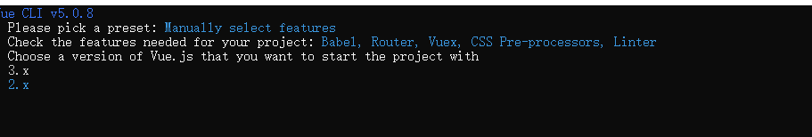

---
title:vue2项目搭建
date: 2023-7-18
tags:
 - 项目搭建
categories:
 - 项目搭建
---

<h1><center>Vue项目搭建</center></h1>
[toc]
# 一、安装

```bash
npm install -g @vue/cli
# OR
yarn global add @vue/cli
```

创建一个项目：

```bash
vue create demo
```
# 二、配置
选择自定义配置


选择项目依赖./Bebal语法降级 Router路由 Vuex数据持久化 CSS预编译)

（空格选中或取消选择）

- TypeScript 支持使用 TypeScript 书写源码

- Progressive Web App (PWA) Support PWA 支持。

- Router 支持 vue-router 。

- Vuex 支持 vuex 。

- CSS Pre-processors 支持 CSS 预处理器。

- Linter / Formatter 支持代码风格检查和格式化。

- Unit Testing 支持单元测试。

- E2E Testing 支持 E2E 测试。
  


选择vue2版本



路由选择history，`history API` 是 `H5` 提供的新特性，允许开发者**直接更改前端路由**，即更新浏览器 `URL` 地址而**不重新发起请求**。

`hash`与`history`最直观的区别是：**url中hash带了“#”，而history没有**

- hash:
- history: 

选择css解析器


关闭eslint部分功能，否则项目开启严格模式，编辑代码时也容易有很多报错


# 三、运行

```
安装依赖
npm install 
# or
yarn
运行项目
npm run serve
# or
yarn serve

```

建立如下,项目结构 


 按需添加axios ElementUI依赖  并在main.js文件引入

# 四、Vue项目结构

```
├── build --------------------------------- 项目构建(webpack)相关配置文件，配置参数什么的，一般不用动 
│   ├── build.js --------------------------webpack打包配置文件
│   ├── check-versions.js ------------------------------ 检查npm,nodejs版本
│   ├── dev-client.js ---------------------------------- 设置环境
│   ├── dev-server.js ---------------------------------- 创建express服务器，配置中间件，启动可热重载的服务器，用于开发项目
│   ├── utils.js --------------------------------------- 配置资源路径，配置css加载器
│   ├── vue-loader.conf.js ----------------------------- 配置css加载器等
│   ├── webpack.base.conf.js --------------------------- webpack基本配置
│   ├── webpack.dev.conf.js ---------------------------- 用于开发的webpack设置
│   ├── webpack.prod.conf.js --------------------------- 用于打包的webpack设置
├── config ---------------------------------- 配置目录，包括端口号等。我们初学可以使用默认的。
│   ├── dev.env.js -------------------------- 开发环境变量
│   ├── index.js ---------------------------- 项目配置文件
│   ├── prod.env.js ------------------------- 生产环境变量
│   ├── test.env.js ------------------------- 测试环境变量
├── node_modules ---------------------------- npm 加载的项目依赖模块
├── src ------------------------------------- 我们要开发的目录，基本上要做的事情都在这个目录里。
│   ├── assets ------------------------------ 静态文件，放置一些图片，如logo等
│   ├── components -------------------------- 组件目录，存放组件文件，可以不用。
│   ├── main.js ----------------------------- 主js
│   ├── App.vue ----------------------------- 项目入口组件，我们也可以直接将组件写这里，而不使用 components 目录。
│   ├── router ------------------------------ 路由
├── static/public ---------------------------- 静态资源目录，如图片、字体等。
├── index.html ------------------------------ 	首页入口文件，你可以添加一些 meta 信息或统计代码啥的。
├── package.json ---------------------------- node配置文件，记载着一些命令和依赖还有简要的项目描述信息 
├──  .README.md------------------------------- 项目的说明文档，markdown 格式。想怎么写怎么写，不会写就参照github上star多的项目，看人家怎么写的
├── .xxxx文件：这些是一些配置文件，包括语法配置，git配置等
│   ├── .babelrc--------------------------------- babel配置文件
│   ├──  .editorconfig---------------------------- 编辑器配置
│   ├──  .eslintignore------------------------------- 配置需要或略的路径，一般build、config、dist、test等目录都会配置忽略
│   ├──  .eslintrc.js ------------------------------- 配置代码格式风格检查规则
│   ├──  .gitignore------------------------------- 配置git可忽略的文件
│   ├──  .postcssrc.js ------------------------------- css转换工具
```

在webpack的配置文件里，设置了main.js是入口文件，我们的项目默认访问index.html，这个文件里面`<div id="app"></div>`和App.vue组件里面的容器完美的重合了，也就是把组件挂载到了index页面，然后我们只需要去建设其他组件就好了，在App组件中我们也可以引入，注册，应用其他组件，可以通过路由将其他组件渲染在App组件，这样我们就只需要去关注每个组件的功能完善。

就是说vue的默认页面是index.html，index中的`<div id="app"></div>`挂载了App.vue这个大组件，然后所有的其他子组件（hello.vue等）都归属在App.vue这个主组件下。

## 4.1、src

这里是要开发的目录，基本要做的事都在这个目录里

- assert: 放置一些图片，如LOGO等

- components：目录里放的组件文件
- App.vue：项目入口文件，可以直接将组件写在这里，而不使用components目录
- main.js：项目的核心文件

## 4.2、index.html

首页入口文件，但一般只定义一个空的根节点，在main.js里面定义的实例将挂载在根节点下，内容都通过vue组件来填充

```html
<!DOCTYPE html>
<html>
  <head>
    <meta charset="utf-8">
    <title>vuedemo</title>
  </head>
  <body>
      <!-- 定义的vue实例将挂载在#app节点下 -->
    <div id="app"></div>
  </body>
</html>
```

## 4.3、App.vue

一个vue页面通常由三部分组成:模板(template)、js(script)、样式(style)

可以直接将组件写在这里，而不使用components目录

```vue
<!-- 模板 -->
<template>
  <div id="app">
    
    <router-view></router-view>
  </div>
</template>

<!-- script -->
<script>
export default {
  name: 'app'
}
</script>

<!-- 样式 -->
<style>
#app {
  font-family: 'Avenir', Helvetica, Arial, sans-serif;
  -webkit-font-smoothing: antialiased;
  -moz-osx-font-smoothing: grayscale;
  text-align: center;
  color: #2c3e50;
  margin-top: 60px;
}
</style>
```

### 4.3.1、template

其中模板只能包含一个父节点，也就是说顶层的div只能有一个（例如上面代码，父节点为#app的div，其没有兄弟节点）

`<router-view></router-view>`是子路由视图，后面的路由页面都显示在此处

打一个比喻吧,`<router-view>`类似于一个插槽，跳转某个路由时，该路由下的页面就插在这个插槽中渲染显示

### 4.3.2、script

vue通常用es6来写，用`export default`导出，其下面可以包含数据data，生命周期(mounted等)，方法(methods)等

### 4.3.3、style

样式通过style标签包裹，默认是影响全局的，如需定义作用域只在该组件下起作用，需在标签上加scoped.

## 4.4、main.js

`main.js`文件是一个很重要的文件，是浏览器解析最先加载的入口文件。这个文件的主要功能是通过import的方式导入各种资源，然后新建了一个vue实例。

```js
/*引入vue框架*/
import Vue from 'vue'
/*引入根组件*/
import App from './App'
/*引入路由设置*/
import router from './router'

/*关闭生产模式下给出的提示*/ 
Vue.config.productionTip = false

/*定义实例*/ 
new Vue({
  el: '#app',
  router,
  template: '<App/>',
  components: { App }
})
```


## 4.5、router

vue-router是Vue.js官方的路由插件，它和vue.js是深度集成的，适合用于构建单页面应用。vue的单页面应用是基于路由和组件的，路由用于设定访问路径，并将路径和组件映射起来。

router文件夹下，有一个index.js，即为路由配置文件。

```js
/*引入vue框架*/
import Vue from 'vue'
/*引入路由依赖*/
import Router from 'vue-router'
/*引入页面组件，命名为Hello*/ 
import Hello from '@/components/Hello'

/*使用路由依赖*/ 
Vue.use(Router)

/*定义路由*/ 
export default new Router({
  routes: [
    {
      path: '/',
      name: 'Hello',
      component: Hello
    }
  ]
})
```


