<h1><center>vue-router</center></h1>

[TOC]


# 一、介绍与安装

**这里的路由就是SPA（单页应用）的路径管理器**。再通俗的说，vue-router就是WebApp的链接路径管理系统。
vue-router是Vue.js官方的路由插件，它和vue.js是深度集成的，适合用于构建单页面应用。vue的单页面应用是基于路由和组件的，路由用于设定访问路径，并将路径和组件映射起来。传统的页面应用，是用一些超链接来实现页面切换和跳转的。在vue-router单页面应用中，则是路径之间的切换，也就是组件的切换。**路由模块的本质 就是建立起url和页面之间的映射关系**。

功能包括：

- 嵌套路由映射
- 动态路由选择
- 模块化、基于组件的路由配置
- 路由参数、查询、通配符
- 展示由 Vue.js 的过渡系统提供的过渡效果
- 细致的导航控制
- 自动激活 CSS 类的链接
- HTML5 history 模式或 hash 模式
- 可定制的滚动行为
- URL 的正确编码

## 1.1、安装步骤

**vue-router 安装和配置的步骤：**

① 安装 vue-router 包

```js
npm i vue-router@3.5.2 -S
```

② 创建路由模块.在 src 源代码目录下，新建 router/index.js 路由模块。

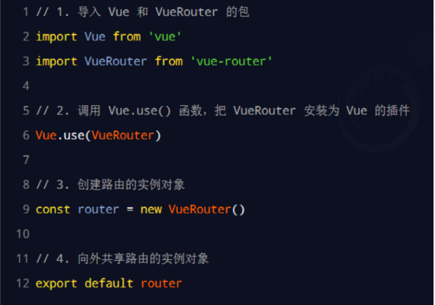

③ 导入并挂载路由模块

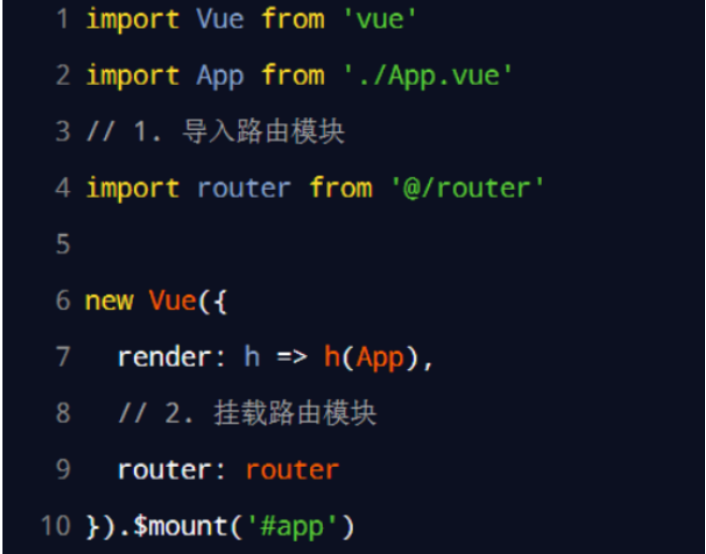

④ 声明路由链接和占位符,示例如下：

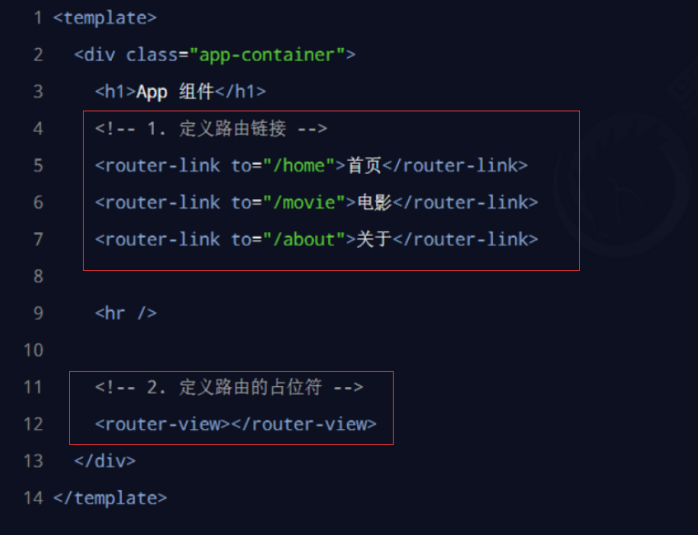


在 src/router/index.js 路由模块中，通过 `routes`数组声明路由的匹配规则。

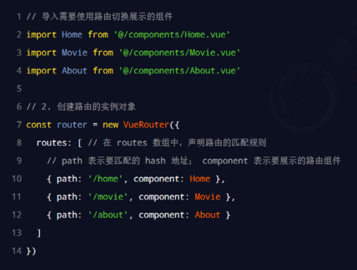


# 二、实现原理

SPA(single page application):单一页面应用程序，只有一个完整的页面；它在加载页面时，不会加载整个页面，而是只更新某个指定的容器中内容。**单页面应用(SPA)的核心之一是: 更新视图而不重新请求页面**;vue-router在实现单页面前端路由时，提供了两种方式：Hash模式和History模式；根据mode参数来决定采用哪一种方式。


## 2.1、Hash模式

**vue-router 默认 hash 模式 —— 使用 URL 的 hash 来模拟一个完整的 URL，于是当 URL 改变时，页面不会重新加载。** hash（#）是URL 的锚点，代表的是网页中的一个位置，单单改变#后的部分，浏览器只会滚动到相应位置，不会重新加载网页，也就是说 #是用来指导浏览器动作的，对服务器端完全无用，HTTP请求中也不会不包括#；同时每一次改变#后的部分，都会在浏览器的访问历史中增加一个记录，使用”后退”按钮，就可以回到上一个位置；所以说**Hash模式通过锚点值的改变，根据不同的值，渲染指定DOM位置的不同数据**


## 2.2、History模式

**由于hash模式会在url中自带#，如果不想要很丑的 hash，我们可以用路由的 history 模式**，只需要在配置路由规则时，**加入"mode: 'history'"**,这种模式充分利用 history.pushState API 来完成 URL 跳转而无须重新加载页面。

```js
//main.js文件中
const router = new VueRouter({
  mode: 'history',
  routes: [...]
})
```


### 两者的区别

hash值不会包含在HTTP请求中，即：hash值不会带给服务器

**hsah模式**

- 地址中永远带有#号，不美观
- 若以后将地址通过第三方手机app分享，若app效验严格，则地址会被标记为不合法
- 兼容性较好

**history模式**

* 地址干净美观
* 兼容性和hash模式相比略差
* 应用部署上线时需要后端人员支持，解决刷新页面服务端404的问题


# 三、vue-router的常见用法

## 3.1、路由重定向

路由重定向指的是：用户在`访问地址 A` 的时候，`强制用户跳转`到地址 C ，从而展示特定的组件页面。

通过路由规则的`redirect`属性，指定一个新的路由地址，可以很方便地设置路由的重定向：

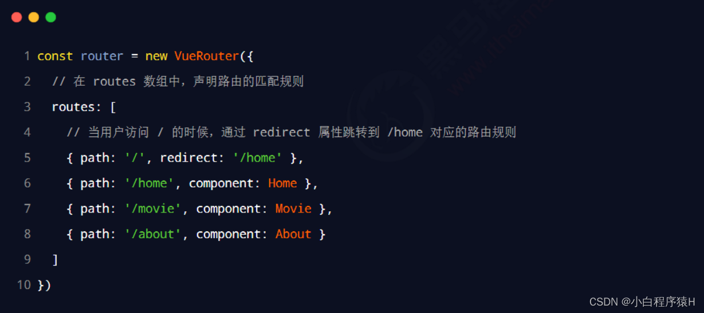

> 当hash为`/`时就默认跳到home组件，防止hash为`/`时什么也没显示，场景就是刚进入页面时，默认显示首页

## 3.2、 重定向404页面

当用户访问不存在的路由时，会自动跳转到该页面进行展示。

1. 创建一个名为 `NotFound.vue` 的组件，用于展示 404 页面的内容。

   ```js
   <template>
     <div>
       <h1>404 - 页面未找到</h1>
       <p>对不起，您访问的页面不存在。</p>
     </div>
   </template>
   
   <script>
   export default {
     // 可以在这里定义组件的逻辑
   }
   </script>
   
   <style scoped>
   /* 可以在这里定义组件的样式 */
   </style>
   ```

2. 在路由配置中，添加一个名为 `*` 的路由，用于匹配所有没有被其他路由匹配到的路径，并将其指向 `NotFound` 组件。

   ```js
   import NotFound from '@/views/NotFound.vue';
   
   const route = new VueRouter({
   	const routes = [
    	 // 其他路由配置...
     	 // 404 页面路由
     		{
       		path: '*',
       		component: NotFound
     		}
   	];
   )}
   ```

   

## 3.3、嵌套路由

通过路由实现`组件的嵌套展示`，叫做嵌套路由,也叫多级路由。

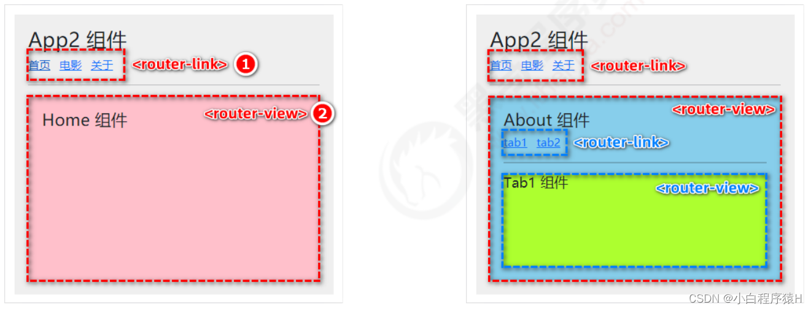

**需要 通过 children 属性声明 子路由规则:**

在 src/router/index.js 路由模块中:

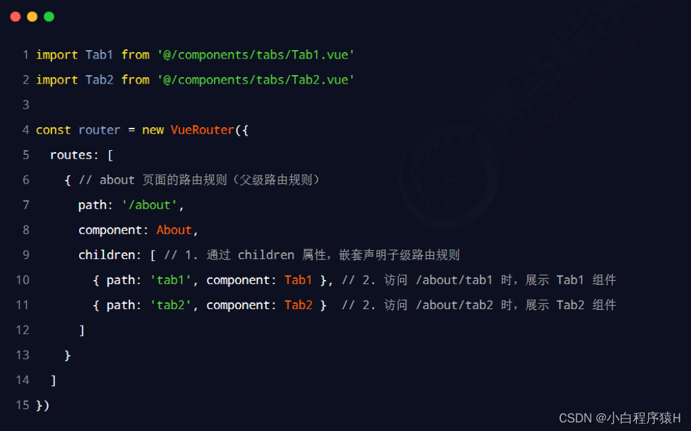

> 注意：子路由的 `path` 不需要加 `/`

**组件中使用嵌套路由：**
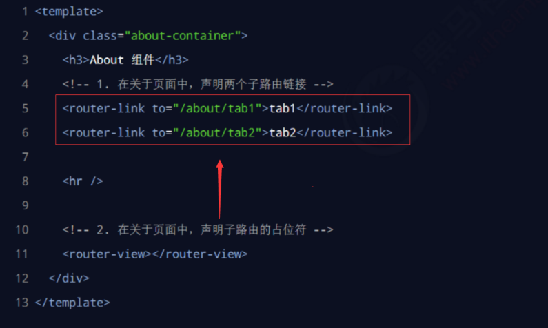

## 3.4、动态路由

动态路由指的是：把 Hash 地址中`可变的部分`定义为`参数项`，从而提高路由规则的`复用性`。

在 vue-router 中使用`英文的冒号`（**:**）来定义路由的参数项。示例代码如下：

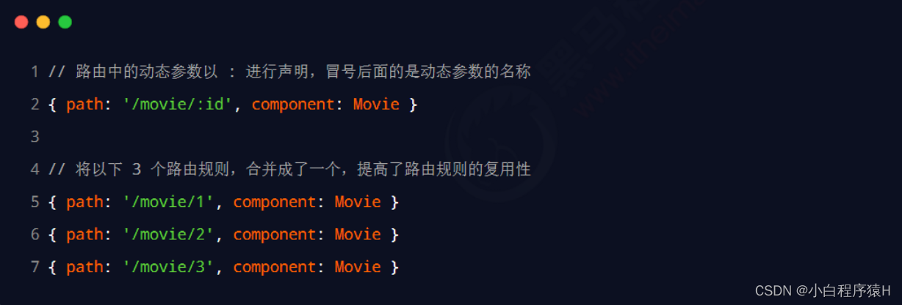

> `/movie/:id`这样情况下必须传递参数，`/movie/:id?`表示可以不传参数

在动态路由渲染出来的组件中，可以使用 `this.$route.params` 对象访问到`动态匹配的参数值`，在`template`中可不加`this`。

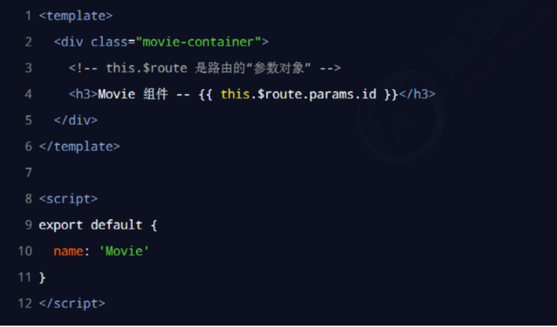

除此之外，还可以使用props传参

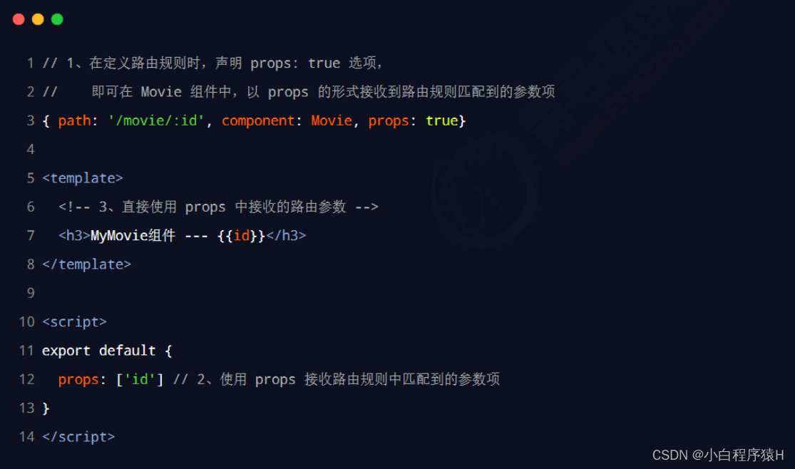


# 四、声明式导航 & 编程式导航

在**浏览器中，点击链接实现导航的方式，叫做声明式导航。**例如：

* 普通网页中点击\<a\> 链接、vue 项目中点击\<router-link> 都属于声明式导
**在浏览器中，调用 API 方法实现导航的方式，叫做编程式导航**。例如：

* 普通网页中**调用 location.href 跳转到新页面的方式，属于编程式导航**


## 4.1、vue-router 中的编程式导航 API


vue-router 提供了许多编程式导航的 API，其中最常用的导航 API 分别是：

| this.$router.**push**(‘hash 地址’)    | 跳转到指定 hash 地址，并**增加**一条**历史**记录       |
| ------------------------------------- | ------------------------------------------------------ |
| this.$router.**replace**(‘hash 地址’) | 跳转到指定的 hash 地址，并**替换**掉当前的**历史**记录 |
| this.$router.**go**(数值 n)           | 实现导航**历史前进、后退**                             |

## 4.2、$router.push

调用 this.$router.push() 方法，可以跳转到指定的 hash 地址，从而展示对应的组件页面。

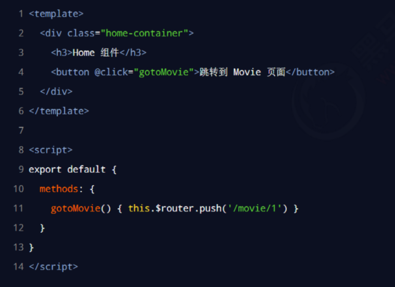

## 4.3、$router.replace

与**push**差不多

区别：

- push 会**增加**一条历史记录
- replace 不会增加历史记录，而是**替换**掉当前的历史记录

## 4.4、$router.go

调用 this.$router.**go()** 方法，可以在浏览历史中前进和后退。

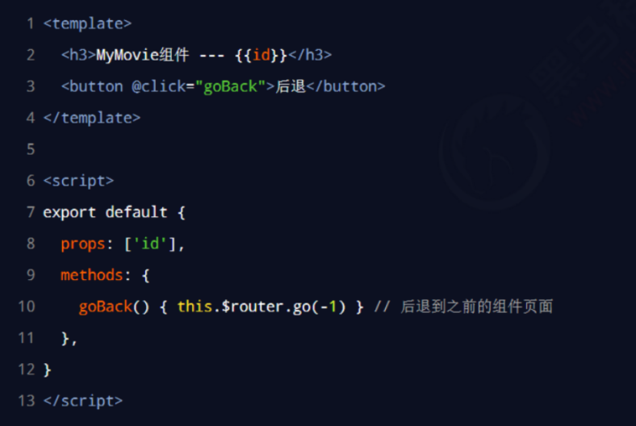

> **简化**：在实际开发中，一般只会前进和后退一层页面。因此 vue-router 提供了如下两个便捷
>
> ① $router.**back**()-------在历史记录中，**后退**到上一个页面
>
> ② $router.**forward**()------在历史记录中，**前进**到下一个页面


# 五、路由传参

## 5.1、用name传递参数

在路由文件src/router/index.js里配置name属性：

```js
routes: [
    {
      path: '/',
      name: 'Hello',
      component: Hello
    }
]
```

模板里(src/App.vue)用`$router.name`来接收

```html
<p>{{ $router.name}}</p>
```


## 5.2、通过`<router-link>` 标签中的to传参

**路由配置：**

```js
routes: [
    {
      path: '/hi1',
      name: 'hi1',
      component: Hi1
    }
]
```

**基本语法：**

```html
<router-link :to="{name:xxx,params:{key:value}}">valueString</router-link>
```

**App.vue传参示例:**

```html
<router-link :to="{name:'hi1',params:{username:'jspang'，id:'555'}}">Hi页面1</router-link>
```

**Hi1.vue接收示例：**

```html
<p>{{$route.params.username}}-{{$route.params.id}}</p>
```


## 5.3、vue-router 利用url传递参数

**路由配置：**

```js
routes: [
	{
    	path:'/params/:newsId/:newsTitle',
    	component:Params
	}
]
```

我们需要传递参数是新闻ID（newsId）和新闻标题（newsTitle）:

```html
<template>
    <div>
        <h2>{{ msg }}</h2>
        <p>新闻ID：{{ $route.params.newsId}}</p>
        <p>新闻标题：{{ $route.params.newsTitle}}</p>
    </div>
</template>
<script>
export default {
  name: 'params',
  data () {
    return {
      msg: 'params page'
    }
  }
}
</script>
```

直接利用url传值:

```html
<router-link to="/params/198/jspang website is very good">params</router-link>
```


## 5.4、通过query来传递参数

 刷新不会丢失数据，但是参数会以`?id:123`的格式拼接显示在url里面

```js
this.$router.push({
      path: '/user',
      query: {
        id: id//这里可以写很多数据
      }
    })
```

获取对应参数

```js
this.$route.query.id
```


## 5.5、配置路由的 props

### 5.5.1、布尔模式（Boolean Mode）

在布尔模式下，将整个 `route.params` 作为 `props` 传递给组件

```js
const router = new VueRouter({
  routes: [
    {
      path: '/user/:id',
      component: User,
      props: true// 将所有的route.params作为props传递给User组件
    }
  ]
});
```


在接收参数的组件（User组件）中，可以直接声明一个名为`id`的props来接收参数值：

```js
export default {
  props: ['id'],//接收数据
  // ...
};
```


### 5.5.2、对象模式（Object Mode）

使用对象模式，可以将静态值或函数作为 `props` 直接传递给组件

```js
const router = new VueRouter({
  routes: [
    {
      path: '/user',
      component: User,
      props: route => ({ query: route.query }) // 将route.query作为props传递给User组件
    }
  ]
});
```


在代码中执行路由跳转时，可以通过`query`属性传递查询参数:

```js
this.$router.push({ path: '/user', query: { id: 123 } }); // 发送id为123的查询参数
```


在接收参数的组件（User组件）中，可以声明一个名为`query`的props来接收查询参数对象：

```js
export default {
  props: ['query'],
  // ...
};
```


> 需要注意的是，如果使用了`props: true`或`props: route => ({ query: route.query })`这样的配置，Vue Router会将参数自动注入到组件的props中，因此不需要在组件中显示地访问`this.$route.params`或`this.$route.query`。


# 六、配置动态菜单

动态路由配置指的是根据动态数据生成对应的路由，然后根据路由来生成相应的菜单。

**具体步骤如下：**

1. 在 Vue 项目中，首先需要将路由配置改为以数组形式定义，而不是直接写死的静态配置。例如，定义一个名为 `routes` 的数组，用于保存动态生成的路由配置。

```js
const routes = [];
```

2. 获取动态的菜单数据，可以通过接口请求或其他方式获取。假设获取到的数据为 `menuData`，它是一个包含菜单项信息的数组。
```js
<script>
export default {
  data() {
    return {
      menuData: [] // 初始化空的菜单数据数组
    };
  },
  mounted() {
    this.fetchMenuData(); // 在组件挂载后发送请求获取菜单数据
  },
  methods: {
    fetchMenuData() {
      // 发送异步请求获取菜单数据
      // 假设接口返回的数据结构为 { success: true, data: [] }
      // 这里使用 setTimeout 模拟异步请求
      //真实的异步请求可能是通过 axios、fetch 或其他 HTTP 请求库发送的，而不是使用 setTimeout 模拟。
      setTimeout(() => {
        const response = { success: true, data: [
          { id: 1, title: '菜单项1', path: '/menu1', component: 'Menu1' },
          { id: 2, title: '菜单项2', path: '/menu2', component: 'Menu2' },
          // 其他菜单项...
        ]};
        
        if (response.success) {
          this.menuData = response.data; // 将菜单数据保存到组件的 data 中
        } else {
          console.error('菜单数据请求失败');
        }
      }, 1000);
    }
  }
};
</script>
```

  

3. 遍历 `menuData` 数组，根据每个菜单项生成相应的路由配置，并将其添加到 `routes` 数组中。生成路由配置时，可以使用 `vue-router` 提供的 `route` 构造函数来创建路由对象。

```js
menuData.forEach(menuItem => {
  const route = {
    path: menuItem.path,
    name: menuItem.name,
    // 根据菜单项的组件路径动态加载组件  
    component: () => import(`@/views/${menuItem.component}.vue`), 
    meta: { title: menuItem.title } // 可以添加一些额外的元数据，比如标题等
  };
  routes.push(route);
});
```

4. 在路由配置中定义一个通配符路由，用于处理未匹配到的路由路径，可以跳转到 404 页面或其他默认页面。

```js
const wildcardRoute = {
  path: '*',
  redirect: '/404' // 跳转到 404 页面或其他默认页面
}
routes.push(wildcardRoute);
```

5. 在 Vue Router 的初始化过程中，将动态生成的路由配置传入 `routes` 属性，以应用动态路由配置。

```js
const router = new VueRouter({
  routes
});
```

6. 将生成的路由对象挂载到 Vue 实例的根组件中。

```js
new Vue({
  router,
  render: h => h(App)
}).$mount('#app');
```


# 七、导航守卫

导航守卫可以`控制路由的访问权限`。

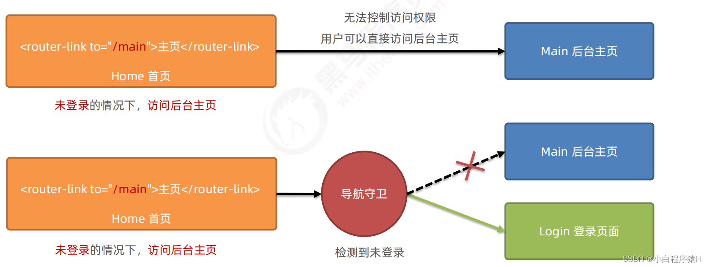

## 7.1、全局前置守卫

每次发生路由的**导航跳转**时，**都会触发**全局前置守卫。因此，在全局前置守卫中，程序员可以对每个路由进行**访问权限**的控制：

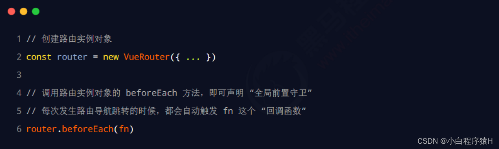

`全局前置守卫`的回调函数中接收 3 个形参，格式如下：

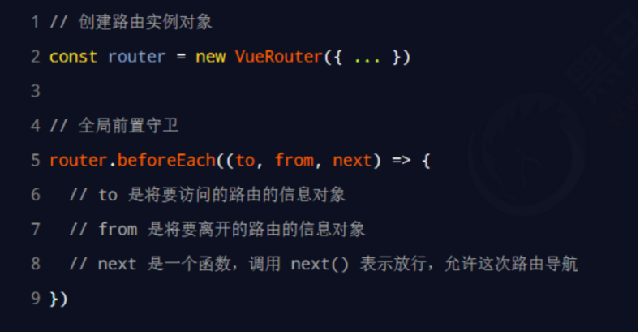

而next函数也有3 种调用方式：

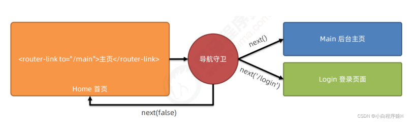

* 当前用户**拥有**后台主页的访问权限，直接放行：**next()**

* 当前用户**没有**后台主页的访问权限，**强制其跳转**到登录页面：**next(‘/login’)**

* 当前用户**没有**后台主页的访问权限，**不允许跳转**到后台主页：**next(false)**


### 实例：

**需求：**

⽤户访问在浏览⽹站时,会访问很多组件,当⽤户跳转到 `/notes` ,发现⽤户没有登录,此时应该让⽤户登录才能查看,应该让⽤户跳转到登录⻚⾯,登录完成之后才可以查看我的笔记的内容,这个时候全局守卫起到了关键的作⽤。

有两个路由 `/notes` 和 `/login`。

router.vue

```js
const router = new VueRouter({
    routes: [
        {
            path: '/notes',
            name: 'notes',
            component: () => import('@/views/Notes')
	},
	{
            path: '/login',
            name: 'login',
            component: () => import('@/views/Login')
	},
    ]
})

//全局守卫
router.beforeEach((to, from, next) => {
  //用户访问的是'/notes'
  if(to.path === '/notes') {
    //查看一下用户是否保存了登录状态信息
    let user = 
    JSON.parse(localStorage.getItem('user'))
    if(user) {
      //如果有，直接放行
      next();
    }else {
      //如果没有，用户跳转登录页面登录
      next('/login')
    }
  }else {
    next();
  }
})
```

Login.vue

```js
<template>
  <div>
     <input type="text" v-model="username">
     <input type="password" v-model="pwd">
     <button @click="handleLogin">提交</button>
  </div>
</template>
<script>
export default {
	data() {
    return {
      username: "",
      pwd: ""
    };
  },
  methods: {
    handleLogin() {
      //1.获取用户名和密码
      //2.与后端发生交互
      setTimeout(() => {
        let data = {
          username: this.username
        };
        //保存用户登录信息
        localStorage.setItem("user", JSON.stringfy(data));
        //跳转我的笔记页面
        this.$router.push({name: "notes"});
      }, 1000);
    },
  }
}
</script>
```

App.vue

```js
<!--全局守卫演示-->
<router-link to="/notes">我的笔记</router-link> |
<router-link to="/login">登录</router-link> |
<button @click="handleLogout">退出</button> 
<script>
export default {
    methods: {
        handleLogout() {
            //删除登录状态信息
            localStorage.removeItem("user");
            //跳转到⾸⻚
            this.$router.push('/')
        }
    },
}
</script>
```

### 跳转之前清除session：

```js
//全局守卫
router.beforeEach((to, from, next) => {
  //用户访问的是'/notes'
  if(to.path === '/notes') {
      // 清除会话数据
	  sessionStorage.clear();
      next();
  }else {
    next();
  }
})
```


## 7.2、全局后置钩子

每次发生路由的跳转**之后**，**都会触发**全局后置钩子，用的比较少

```js
// 全局后置守卫
router.afterEach(function (to, from) {
 
})
```

> 注意：全局后置钩子是没有第三个参数中的 `next` 的

## 7.3、路由独享守卫

顾名思义是独有的路由守卫，与全局前置路由守卫没啥区别，只是作用的范围不同罢了。

```js
	...
     { 
        path: 'users',
        component: Users,
        meta: { isAuth: true, title: '用户管理'  },
        beforeEnter: (to, from, next)=>{
		   // ...
        }
      },
     ...
```

> 注意：独享路由守卫是`没有后置`路由守卫的

## 7.4、组件内路由守卫

你可以在路由组件内直接定义以下路由导航守卫：

- `beforeRouteEnter`
- `beforeRouteUpdate`（2.2新增）
- `beforeRouteLeave`

```js
<template>
  <h4 class="text-center">订单管理</h4>
</template>

<script>
export default {
  name: 'MyOrders',
  // 通过路由规则，进入该组件时被调用
  beforeRouteEnter(to, from, next){
    // ...
  },
  // 通过路由规则，离开该组件时被调用
  beforeRouteLeave(to, from, next){
    // ...
  }
}
</script>
```

> 注意：是没有前置后置可分的，因为`beforeRouteLeave`是离开该组件时才会被调用，并不是跳转之后就调用的


## 7.5、路由元信息mete实现权限控制

给需要添加权限的路由设置meta字段

```js
{
    path: '/blog',
    name: 'blog',
    component:() => import('@/views/Blog'),
    meta: {
        requiresAuth: true
    },
}
{
    //路由独享的守卫
    path: 'notes',
    name: 'notes',
    component: () => import('@/views/Notes'),
    meta: {
        requiresAuth: true
    }
},
//全局守卫
router.beforeEach((to, from, next) => {
  if(to.matched.some(record => record.meta.requiresAuth)) {
    //需要权限
    if(!localStorage.getItem('user')) {
      next({
        path: '/login',
        query: {
          redirect: to.fullPath
        }
      })
    }else {
      next();
    }
  }else {
    next();
  }
})
```

Login.vue

```js
//登录操作
handleLogin() {
    // 1.获取⽤户名和密码
    // 2.与后端发⽣交互
    setTimeout(() => {
        let data = {
            username: this.username
         };
	localStorage.setItem("user", JSON.stringify(data));
	// 跳转到之前的⻚⾯
	this.$router.push({path:this.$route.query.redirect });
    },1000};
}
```


## 7.6、数据获取

有时候，进⼊某个路由后，需要从服务器获取数据。例如，在渲染⽤户信息时，你需要从服务器获取⽤户的数据。我们可以通过两种⽅式来实现：

- **导航完成之后获取**：先完成导航，然后在接下来的组件⽣命周期钩⼦中获取数据。在数据获取期间显示“加载中”之类的指示。
- **导航完成之前获取**：导航完成前，在路由进⼊的守卫中获取数据，在数据获取成功后执⾏导航。

> 导航完成后获取数据

当你使⽤这种⽅式时，我们会⻢上导航和渲染组件，然后在组件的 `created` 钩⼦中获取数据。这让我们有机会在数据获取期间展示⼀个 loading 状态，还可以在不同视图间展示不同的 loading 状态。

```js
<template>
  <div class="post"> 
    <div v-if="loading" class="loading">Loading...</div>
	<div v-if="error" class="error">{{ error }}</div> 
	<div v-if="post" class="content">
            <h2>{{ post.title }}</h2> 
            <p>{{ post.body }}</p>
	</div>
    </div>
</template>
<script>
export default {
    name: "Post",
        data() {
            return {
		loading: false,
		post: null,
		error: null
            };
 	},
	// 组件创建完后获取数据，
	// 此时data已经被监视了
	created() {
	// 如果路由有变化，会再次执⾏该⽅法
	this.fetchData();
 	},
	watch: {
    $route: "fetchData"
  },
  methods: {
    fetchData() {
      this.error = this.post = null;
      this.loading = true;
      this.$http.get('/api/post').then((result) => {
        this.loading = false;
        this.post = result.data;
      }).catch((err) => {
        this.error = err.toString();
      });
   }
}
</script>
```

