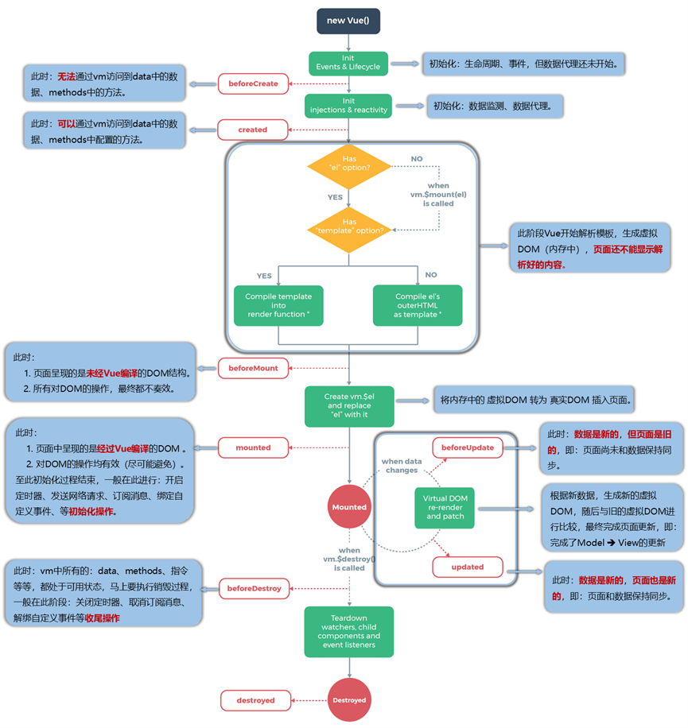
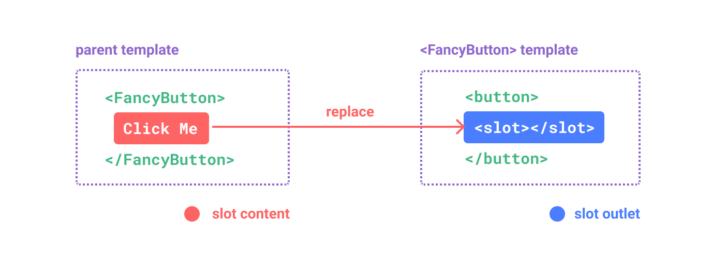

<h1><center>vue框架基础</center></h1>

[TOC]

# 一、介绍

官方文档：

https://v2.cn.vuejs.org/v2/guide

Vue是一款前端渐进式框架，可以提高前端开发效率。

## 1.1、特点：

1. **组件化开发：**Vue 鼓励使用组件化的方式进行开发，将应用拆分成多个独立可复用的组件。
2. **响应式数据绑定：**Vue 使用了双向数据绑定和虚拟 DOM，使得开发者可以轻松地将数据与视图进行关联。当数据发生变化时，视图会自动更新，而无需手动操作。
3. **虚拟 DOM：**Vue 使用虚拟 DOM 技术来显著提升性能。通过在 JavaScript 对象中对真实 DOM 进行操作，Vue 可以高效地计算出最小的 DOM 更新量，并将变更批量更新到真实 DOM 中，从而减少了性能开销。
4. **渐进性框架：**Vue 是一个渐进式框架，意味着你可以逐步采用它来构建项目。你可以将 Vue 直接引入到现有项目中，也可以使用其完整的单文件组件系统构建复杂的应用程序。


## 1.2、MVVM模型

- **M** : 模型（Model）: 当前页面渲染所依赖的数据源
- **V** : 视图（View）: 当前页面所渲染的DOM结构
- **VM** : 视图模型（ViewModel）: vue的实例，MVVM的核心


## 1.3、Vue的基本目录结构

- build：项目构建（webpack）相关代码、
- config：配置目录，包括端口号等
- node_modules：npm加载的项目依赖模块
- src：这里是要开发的目录，基本要做的事都在这个目录里
  - assert: 放置一些图片，如LOGO等
  - components：目录里放的组件文件
  - App.vue：项目入口文件，可以直接将组件写在这里，而不使用components目录
  - main.js：项目的核心文件
- static：静态资源目录，如图片、字体等
- test：初始测试目录，可删除
- .xxxx文件： 这些是一些配置文件，包括语法配置，git配置等。
- index.html：首页入口文件
- package.json：项目配置文件
- README.md：项目的说明文档

# 二、Vue的生命周期


官网的[生命周期](https://cn.vuejs.org/guide/essentials/lifecycle.html)介绍

示意图如下：



**什么是生命周期？**

- Vue 实例从创建到销毁的过程，就是生命周期。也就是从开始创建、初始化数据、编译模板、挂载Dom→渲染、更新→渲染、卸载等一系列过程，我们称这是 Vue 的生命周期。

**什么是钩子函数？**

- 钩子函数 是一组预定义的函数，它们允许你在组件生命周期的不同阶段执行自定义代码。每个生命周期阶段都有对应的钩子函数，它们会在特定的时间点被触发。


**以下是几个常用的钩子函数：**

## 1. **beforeCreate：**

   * 在实例初始化之后、数据观测 (data observer) 和事件配置之前被调用。
   * 通常在此阶段进行一些初始化操作，如设置一些初始数据。
## 2. **created：**

   - 在实例创建完成后被立即调用。
   - 在这个阶段可以访问到数据，并可以对数据进行一些处理。
   - 但是此时还没有挂载 DOM ，无法操作 DOM 元素。
## 3. **beforeMount：**

   - 在挂载开始之前被调用，即将开始编译模板并将其插入到 DOM 中。
   - 此时模板还没有被渲染成最终的 HTML。
## 4. **mounted（常用）：**

   - 在挂载完成后被调用。
   - 可以操作 DOM 元素、发送网络请求等操作。
   - **绑定自定义事件、订阅消息等初始化操作。**
   - 通常在此阶段进行异步操作或与第三方库进行交互。
## 5. **beforeUpdate：**

   * 在数据更新之前被调用。
   * 可以在此阶段进行一些准备工作，比如获取更新前的状态信息。
## 6. **updated：**

   * 在数据更新完成后被调用。
   * 可以执行更新后的 DOM 操作，但需避免无限循环的更新操作。
## 7. **beforeDestroy（常用）：**

   * 在实例销毁之前被调用。
   * **可以在此阶段进行一些清理工作，比如取消定时器、解绑全局事件等。**
## 8. **destroyed：**

   * 在实例销毁后被调用。
   * 在此阶段，实例的所有东西都被清除，监听器被移除、子组件被销毁等。

## 9. **nextTick : **

更新数据后立即操作dom。

## 10.activated和deactivated

● \<keep-alive>包裹的动态组件会被缓存，它是一个抽象组件，它自身不会渲染一个dom元素，也不会出现在父组件链中。当组件在 \<keep-alive> 内被切换，它的 activated 和 deactivated 这两个生命周期钩子函数将会被对应执行。

● 如\<keep-alive>包裹两个组件：组件A和组件B。当第一次切换到组件A时，组件A的created和activated生命周期函数都会被执行，这时通过点击事件改变组件A的文字的颜色，在切换到组件B，这时组件A的deactivated的生命周期函数会被触发；在切换回组件A，组件A的activated生命周期函数会被触发，但是它的created生命周期函数不会被触发了，而且A组件的文字颜色也是我们之前设置过的。

---


> 生命周期可以总共分为8个阶段：创建前/后, 载入前/后,更新前/后,销毁前/后。


# 三、Vue基本语法


## 3.1、插值语法

插值表达式用户把vue中所定义的数据,显示在页面上. 插值表达式允许用户输入"JS代码片段"

**语法**：`<标签/>{{ 变量名/对象.属性名 }}</标签>`


## 3.2、指令语法

以 v- 开头，并后跟指令名称的形式，用于操作 DOM 元素的行为和交互。指令语法使用特定的指令来绑定数据和监听事件等。例如 v-bind、v-if、v-for、v-on 等。指令语法可以用于控制元素的属性、显示/隐藏元素、循环渲染元素、监听事件等。

1. **v-bind：**将数据绑定到 HTML 属性上。

   ```js
   
   ```

2. **v-if：**根据条件来渲染元素。

   ```html
   <div v-if="isShown">显示的内容</div>
   ```

3. **v-for：**循环渲染元素。

   ```js
   <ul>
     <li v-for="item in items">{{ item }}</li>
   </ul>
   ```

4. **v-on：**监听 DOM 事件并执行相应方法。

   ```js
   <button v-on:click="handleClick">点击我</button>
   ```

5. **v-model：**实现表单输入元素的双向绑定。

   ```js
   <input v-model="message" placeholder="请输入内容">
   ```

6. **v-show：**根据条件来显示/隐藏元素。

   ```js
   <div v-show="isVisible">内容</div>
   ```


## 3.3、显示数据(v-text和v-html)

 v-text和v-html专门用来展示数据, 其作用和插值表达式类似。v-text和v-html可以避免插值闪烁问题.

 当网速比较慢时, 使用{{}}来展示数据, 有可能会产生插值闪烁问题。

>  插值闪烁: 在数据未加载完成时，页面会显示出原始的{{}}, 过一会才会展示正常数据.

```js
v-text：<span v-text="msg"></span>	
<!-- 相当于<span>{{msg}}</span> -->
v-html：<span v-html="msg"></span>	
<!-- 相当于<span>{{msg}}</span> -->
```

**区别：**

**v-text：**把数据当作纯文本显示.
**v-html：**遇到html标签,会正常解析

## 3.4、单向数据绑定(v-bind)

v-bind:href =“xxx” 或简写为 :href

数据只能从 data 流向页面

## 3.5、双向数据绑定(v-model)

 Vue的双向绑定可以实现: 数据变化的时候, 页面会自动刷新, 页面变化的时候，数据也会自动变化.

**双向绑定：**数据不仅能从 data 流向页面，还能从页面流向 data

> v-model:value可以简写为v-model

```js
<div id="app">
    用户名: <input type="text" v-model="username"/>
</div>
```

## 3.6、事件绑定(v-on)

 Vue中也可以给页面元素绑定事件.

> v-on可以简写成@

```js
<!--完整写法-->
<button v-on:事件名="函数名/vue表达式">点我</button>
<!--简化写法-->
<button @事件名="函数名/vue表达式">点我</button>
```

**事件修饰符:**

事件修饰符主要对事件的发生范围进行限定

```js
<button @事件名.事件修饰符="函数名/vue表达式">点我</button>
```

**常用事件修饰符**：

* .stop ：阻止事件冒泡, 也就是当前元素发生事件,但当前元素的父元素不发生该事件
* .prevent ：阻止默认事件发生
* .capture ：使用事件捕获模式, 主动获取子元素发生事件, 把获取到的事件当自己的事件执行
* .self ：只有元素自身触发事件才执行。（冒泡或捕获的都不执行）
* .once ：只执行一次
* passive：事件的默认行为立即执行，无需等待事件回调执行完毕

# 四、渲染

##  4.1、条件渲染

官网的[条件渲染](https://cn.vuejs.org/guide/essentials/conditional.html)

- v-if 动态删除创建元素，实现元素显示与隐藏
  - 刚进入页面时默认隐藏（初始为false隐藏），且后期很可能元素也不需要展示，v-if性能更好

```html
<div v-if="isShown">显示的内容</div>
```

-  `v-if`  `v-else-if`  和  `v-else` 指令时，可以根据不同的条件来渲染不同的内容

```html
<div>
  <p v-if="status === 'success'">成功状态</p>
  <p v-else-if="status === 'warning'">警告状态</p>
  <p v-else>其他状态</p>
</div>
```

> 需要主要的是一个 `v-else` 元素必须跟在一个 `v-if` 或者 `v-else-if` 元素后面，否则它将不会被识别。


- v-show 动态为元素添加或删除display：none样式，
  - 频繁切换元素样式，v-show 性能更好
  
  ```html
  <div v-show="isVisible">内容</div>
  ```
  
  

## 4.2、列表渲染

官网的[列表渲染](https://cn.vuejs.org/guide/essentials/list.html)

> 官方建议，只要用到 v-for 指令，一定要绑定一个:key属性    而且尽量把id作为key的值，字符串或数字类型，key不能重复，类似于主键。

在组件中使用v-for可以遍历数组元素，已达到重复使用该组件的作用。

```html
<div id="app">
	<ul>
        <li v-for="(user, index) in users" :key="index">
        	{{index}}--{{user.name}}--{{user.age}}--{{user.gender}}
        </li>
	</ul>
</div>
<script>
    var app = new Vue({
        el:"#app",//el即element，要渲染的页面元素
        data: {
            users:[
                {"name":"白卓冉","age":8,"gender":"男"},
                {"name":"白大锅","age":12,"gender":"女"},
                {"name":"白仙女","age":4,"gender":"男"}
            ]
        }
    });
</script>
```

语法如下 ：

```js
v-for="value in object"
v-for="(value,key) in object"
v-for="(value,key,index) in object"
```

注意：key 一般配合v-for一起使用. 用来在特定情况下, 保证被遍历的数组中的元素的顺序.

> react、vue中的key有什么作用？
>
> **虚拟DOM中key的作用：**
> 1）key是虚拟DOM对象的标识，当数据发生变化时，Vue会根据【新数据】生成【新的虚拟DOM】
> 2）随后Vue进行【新虚拟DOM】与【旧虚拟DOM】的差异比较，比较规则如下：
> **对比规则：**
> 1）旧虚拟DOM中找到了与新虚拟DOM相同的key：
> ① 若虚拟DOM中内容没变，直接使用之前的真实DOM
> ② 若虚拟DOM中内容改变，则生成新的真实DOM，随后替换掉页面中之前的真实DOM
> 2）旧虚拟DOM中未找到与新虚拟DOM相同的key，创建新的真实DOM,随后渲染到页面
> **用index作为key可能会引发的问题：**
> 1）若对数据进行：逆序添加、逆序删除等破坏顺序操作：会产生没有必要的真实DOM更新==》界面效果没问题，但效率低
> 2）若结构中还包含输入类的DOM：会产生错误DOM更新==》界面有问题
> **开发中如何选择key？：**
> 1）最好使用每条数据的唯一标识作为key，比如id、手机号、身份证号、学号等唯一值。
> 2）如果不存在对数据的逆序添加、逆序删除等破坏顺序操作、仅用于渲染列表用于展示，使用index作为key是没有问题的

```js

<div id="app">
    <button @click="add">添加</button>
    <ul>
        <!-- 添加:key即可. 注意,key中的值必须是唯一且不会改变的值-->
        <li v-for="name in list" :key="name">
            <input type="checkbox"> {{name}}
        </li>
    </ul>
</div>
```


# 五、vue常用的属性

| el属性       | 用来指示vue编译器从什么地方开始解析 vue的语法，可以说是一个占位符。 |
| :----------- | ------------------------------------------------------------ |
| data     | 用来组织从view中抽象出来的属性，可以说将视图的数据抽象出来存放在data中。 |
| template | 用来设置模板，会替换页面元素，包括占位符。                   |
| methods属性  | 放置页面中的业务逻辑，js方法一般都放置在methods中            |
| render   | 创建真正的Virtual Dom                                        |
| computed属性 | 用来计算 Vue.js 计算属性，计算属性在处理一些复杂逻辑时是很有用的 |
| watch    | Vue.js 监听属性 watch，我们可以通过 watch 来响应数据的变化 watch:function(new,old){}监听data中数据的变化 两个参数，一个返回新值，一个返回旧值。 |

## 5.1、data

**定义：**用于定义数据属性

**data的函数式：**

```js
var app = new Vue({
  data: function() {
    return {
      message: 'Hello, Vue!',
      count: 0,
      person: {
        name: 'Alice',
        age: 25,
        occupation: 'Engineer'
      }
    };
  }
});
```

> data属性中一般使用return返回数据，避免数据污染


**data的对象式：**

```js
var app = new Vue({
  data: {
    message: 'Hello, Vue!',
    count: 0,
    person: {
      name: 'Alice',
      age: 25,
      occupation: 'Engineer'
    }
  }
});
```


## 5.2、计算属性computed

在vue中有一个属性computed专门用于存放计算属性,同时存在一个缓存，当多次重复调用一个计算属性时，vue会直接将缓存中的结果放出（如果存放于methods则不存在缓存）

**计算属性:**

**定义：**要用的属性不存在，要通过已有属性计算而来。
**原理：**底层借助了Object.defineproperty方法提供的getter和setter。
get函数什么时候执行？

* 初次读取时会执行一次
* 当依赖的数据发生改变时会被再次调用

**优势：**与methods相比，内部有缓存机制（复用），效率更高，调试方便。

>  1）计算属性最终会出现在vm上，直接读取使用即可。
>  2）如果计算属性要被修改，那必须写set函数去响应修改。且set中要引起计算时依赖的数据发生改变。

**计算属性的简写:**

一般计算属性用不到set方法，即如果确定只会用到计算属性的get方法时，可以这样简写

```js
computed: {
    fullName() {
        return this.firstName + '-' + this.secondName
    }
}
```

## 5.3、wactch监视

监视属性watch:

1. 当被监视的属性发生变化时，回调函数自动调用，进行相关操作

2. 监视的属性必须存在，才能进行监视！

**监视的两种写法：**
    1）new Vue时传入watch配置
    2）通过vm.$watch监视

```js
    <div id="root">
        <h1>今天天气很{{info}}</h1>
        <button @click="changeWeather">切换天气</button>
    </div>

    <script type="text/javascript">
        const vm = new Vue({
            el: '#root',
            data: {
                isHot: true,
            },
            computed: {
                info() {
                    return this.isHot ? '热' : '冷'
                }
            },
            methods: {
                changeWeather() {
                    this.isHot = !this.isHot;
                }
            },
            watch: {
                isHot: {
                    immediate: true, //初始化的时候直接调用handler，默认为false
                    //当isHot发生改变时调用handler,同时将变化前的值和变化后的值传进来
                    handler(newValue, oldValue) {
                        console.log(newValue + ',' + oldValue)
                    }
                }
            }
        })
    </script>
```

或者

```js
vm.$watch('isHot',{
    immediate: true, //初始化的时候直接调用handler，默认为false
    //当isHot发生改变时调用handler,同时将变化前的值和变化后的值传进来
    handler(newValue, oldValue) {
        console.log(newValue + ',' + oldValue)
    }
})
```

**deep深度监视:**

深度监视：

* Vue中的watch默认不监测对象内部值的改变（一层）
* 配置deep：true可以监测对象内部值改变（多层）

> 1. Vue自身可以监测对象内部值的改变，但Vue提供的watch默认不可以
> 2. 使用watch时根据数据的具体结构，决定是否采用深度监视。

```js
    <div id="root">
        {{numbers.a}}<button @click="numbers.a++">a++</button> {{numbers.b}}
        <button @click="numbers.b++">a++</button>
    </div>

    <script type="text/javascript">
        const vm = new Vue({
            el: '#root',
            data: {
                numbers: {
                    a: 1,
                    b: 1,
                }
            },
            watch: {
                //监视多级结构中某个属性的变化
                'numbers.a': {
                    handler(newValue, oldValue) {
                        console.log(newValue + ',' + oldValue)
                    }
                },
                //监视多级结构中所有属性的变化
                numbers: {
                    deep: true,
                    handler() {
                        console.log("numbers发生改变了")
                    }
                }
            }
        })
    </script>
```

**监视的简写：**

```js
watch: {
    /* isHot: {
                    handler(newValue, oldValue) {
                        console.log(newValue + ',' + oldValue)
                    }
                } */
    isHot() {
        console.log("被修改了")
    }
}
```

## 5.4、Vue数组变化侦测

变更方法：（会对调用它们的原数组进行变更，**vue能监测到数组变化**）

- - `push()` ：向数组的末尾添加一个或多个元素，并返回修改后的数组的新长度。 
  - `pop()`：从数组的末尾移除并返回最后一个元素。
  - `shift()`：从数组的开头移除并返回第一个元素，同时将数组中的所有其他元素位置向前移动一个索引。
  - `unshift()`：向数组的开头添加一个或多个元素，并返回修改后的数组的新长度。
  - `splice()` ：通过删除、替换或添加元素的方式修改数组。
  - `sort()`：对数组进行原位排序，即修改原数组中元素的顺序。默认情况下，根据 Unicode 编码进行排序。也可以传递一个比较函数来自定义排序规则。
  - `reverse()`：反转数组中元素的顺序，即数组中的第一个元素变为最后一个，最后一个变为第一个，以此类推。
- `filter()`，`concat()` 和 `slice()`，这些都不会更改原数组，而总是**返回一个新数组**
- 在计算属性中使用 `reverse()` 和 `sort()` 的时候务必小心，这两个方法将变更原始数组


## 5.5、计算属性和监听的区别

computed和watch之间的区别：

1. computed能完成的功能，watch都可以完成。
2. watch能完成的功能，computed不一定能完成，例如：watch可以进行异步操作。

> 两个重要的小原则：
>
> * 所有被Vue管理的函数。最好写成普通函数，这样this的指向才是vm 或 组件实例对象。
> * 所有不被Vue管理的函数（定时器的回调函数、ajax的回调函数等），最好写成箭头函数，这样this的指向才是vm或组件实例对象。


##  5.6、函数methods

`methods` 属性允许你定义一组方法，这些方法可以在模板中调用或在组件的其他方法中使用。这些方法可以是任意 JavaScript 函数，并具有与普通函数相同的功能。

- methods：包含所有方法的对象
- vue自动为methods中的方法绑定了永远指向组件实例的this，这确保了方法在作为事件监听器或回调函数时始终保持正确的 `this`。
- 不应该在定义 `methods` 时使用箭头函数，因为箭头函数没有自己的 `this` 上下文。

```html
<template>
  <div id="app">
    <p>Count: {{ count }}</p>
    <button @click="increment()">Increment</button>
  </div>
<template>
<script>
export default {
	name="xxx",
    data() {
      return {
        count: 0
        };
    },
    methods: {
      increment() {
        this.count++;
      }
    }
}
</script>

```


## 5.7、组件

### 5.7.1、组件注册

> 一个 Vue 组件在使用前需要先被“注册”，这样 Vue 才能在渲染模板时找到其对应的实现

**全局注册**

- 使用 `app.component()` 方法，让组件在当前 Vue 应用中全局可用。

- eg:

  ```js
  import { createApp } from 'vue'
  const app = createApp({})
  
  app.component(
    // 注册的名字
    'MyComponent',
    // 组件的实现
    {
      /* ... */
    }
  )
  ```

- ```js
  app
    .component('ComponentA', ComponentA)
    .component('ComponentB', ComponentB)
    .component('ComponentC', ComponentC)
  
  ```

  

**局部注册**

- 局部注册的组件需要在使用它的父组件中显式导入，并且只能在该父组件中使用

- 优点是使组件之间的依赖关系更加明确，并且对 tree-shaking 更加友好。

- **局部注册的组件在后代组件中并不可用**。

- 局部注册需要使用 `components` 选项

- eg：

  ```js
  <script>
  import ComponentA from './ComponentA.vue'
  
  export default {
    components: {
      ComponentA
    }
  }
  </script>
  
  <template>
    <!--导入后在这里使用它-->
    <ComponentA />
  </template>
  ```

  > 对于每个 `components` 对象里的属性，它们的 key 名就是注册的组件名，而值就是相应组件的实现。


### 5.7.2、深入理解组件

#### 5.7.2.1、函数化组件

即无状态（*没有 data*）无实例（*没有 this 上下文*）的组件，渲染开销较小，且不会出现在`Vue devtools`当中。

```js
Vue.component("my-component", {
  functional: true,
  // 通过提供context参数为没有实例的函数组件提供上下文信息
  render: function(createElement, context) {},
  // Props可选
  props: {}
});
```


#### 5.7.2.2、动态组件

使用`<component>`元素并动态绑定其`is`属性，可以让多个组件使用相同的 Vue 对象挂载点，并实现动态切换。

```js
<script>
  var vm = new Vue({
    el: "#example",
    data: {
      currentView: "home"
    },
    components: {
      home: {
        /* ... */
      },
      posts: {
        /* ... */
      },
      archive: {
        /* ... */
      }
    }
  });
</script>

<component v-bind:is="currentView">
  <!-- 组件在vm.currentview变化时改变！ -->
</component>
```

如果需要将切换的组件保持在内存，保留其状态并且避免重新渲染，可以使用 Vue 内置的`keep-alive`指令。

```html
<keep-alive>
  <component :is="currentView">
    <!-- 非活动组件将被缓存！ -->
  </component>
</keep-alive>
```


#### 5.7.2.3、组件异步加载

Vue 允许将组件定义为工厂函数，从而异步的解析组件定义。Vue 只会在组件渲染时才触发工厂函数，并将结果缓存起来用于后续渲染。定义组件的工厂函数将会接收 resolve（*接收到从服务器下载的 Vue 组件 options 时被调用*）和 reject（*当远程 Vue 组件 options 加载失败时调用*）回调函数作为参数。

```js
Vue.component("async-example", function(resolve, reject) {
  setTimeout(function() {
    // 将组件定义传递到resolve回调函数当中
    resolve({
      template: "<div>I am async!</div>"
    });
  }, 1000);
});
```

可以结合 Webpack 提供的**代码切割**功能，将 Vue 组件的 options 对象提取到单独 JavaScript 文件，从而实现异步的按需加载。

```js
// 使用webpack的require()来进行异步代码块切割
Vue.component("async-webpack-example", function(resolve) {
  require(["./my-async-component"], resolve);
});

// 使用webpack的import()来进行异步代码块切割
Vue.component("async-webpack-example", () => import("./my-async-component"));
```

从 Vue 2.3.0 版本开始，可以通过下面的方式来定义一个异步组件。

```js
const AsyncWebpackExample = () => ({
  component: import("./MyComp.vue"), // 需要加载的组件
  loading: LoadingComp, // loading时渲染的组件
  error: ErrorComp, // 出错时渲染的组件
  delay: 200, // 渲染loading组件前的等待时间（默认：200ms）
  timeout: 3000 // 最长等待时间，超出则渲染error组件（默认：Infinity）
});
```

> 在路由组件上使用这种写法，需要使用 vue-router 的 2.4.0 以上版本。


#### 5.7.2.4、组件的循环引用

循环引用，即两个组件互相引用对方，例如下面代码中`tree-folder`、`tree-folder-contents`两个组件同时成为了对方的父或子节点，如果使用 Webpack 模块化管理工具`requiring`/`importing`组件的时候，会报出`Failed to mount component: template or render function not defined.`错误。

```js
<template>
  <p>
    <span>{{ folder.name }}</span>
    <tree-folder-contents :children="folder.children" />
  </p>
</template>

<template>
  <ul>
    <li v-for="child in children">
      <tree-folder v-if="child.children" :folder="child" />
      <span v-else>{{ child.name }}</span>
    </li>
  </ul>
</template>
```

因为`tree-folder`、`tree-folder-contents`相互引用对方之后，无法确定组件加载的先后顺序陷入死循环，所以需要事先指明 webpack 组件加载的优先级。解决上面例子中 Vue 组件循环引用的问题，可以在`tree-folder`组件的`beforeCreate()`生命周期函数内注册引发问题的`tree-folder-contents`组件。

```js
beforeCreate: function () {
  this.$options.components.TreeFolderContents = require("./tree-folder-contents.vue").default
}
```


#### 5.7.2.5、组件命名约定

JavaScript 中命名组件组件时可以使用`kebab-case`、`camelCase`、`PascalCase`，但 HTML 模板中只能使用`kebab-case`格式。

```js
<kebab-cased-component></kebab-cased-component>
<camel-cased-component></camel-cased-component>
<pascal-cased-component></pascal-cased-component>
<!-- 也可以通过自关闭方式使用组件 -->
<kebab-cased-component />

<script>
  components: {
    "kebab-cased-component": {},
    "camelCasedComponent": {},
    "PascalCasedComponent": {}
  }
</script>
```

> 推荐 JavaScript 中通过`PascalCase`方式声明组件， HTML 中则通过`kebab-case`方式使用组件。


#### 5.7.2.6、组件递归

当局部注册的 Vue 组件递归调用自身时，需要在创建组件时添加`name`选项，全局注册的组件则可以省略该属性，因为 Vue 会自动进行添加。

```js
// 局部注册
new Vue({
  el: "#my-component",
  name: "my-component",
  template: "<div><my-component></my-component></div>"
});

// 全局注册
Vue.component("my-component", {
  // name: "my-component", 可以省略name属性
  template: "<div><my-component></my-component></div>"
});
```

> 组件递归出现死循环时，会提示`max stack size exceeded`错误，所以需要确保递归操作都拥有一个终止条件（*比如使用 v-if 并返回 false*）。


#### 5.7.2.7、组件模板

可以在 Vue 组件上使用`inline-template`属性，组件会将内嵌的 HTML 内容作为组件本身的模板进行渲染，而非将其作为`slot`分发的内容。

```js
<my-component inline-template>
  <div>
    <p>These are compiled as the component"s own template.</p>
    <p>Not parent"s transclusion content.</p>
  </div>
</my-component>
```


也可以通过在`<script>`标签内使用`type="text/x-template"`和`id`属性来定义一个内嵌模板。

```js
<script type="text/x-template" id="hello-world-template">
  <p>Hello hello hello</p>
</script>

<script>
  Vue.component("hello-world", {
    template: "#hello-world-template"
  });
</script>
```


### 5.7.3、组件 v-model

官网的 [组件v-model](https://cn.vuejs.org/guide/components/v-model.html) ,这里只是简单介绍

> `v-model` 可以在组件上使用以实现双向绑定。

- v-model的参数
  - 默认情况下，`v-model` 在组件上都是使用 `modelValue` 作为 prop，并以 `update:modelValue` 作为对应的事件
- 多个`v-model`绑定
  - 组件上的每一个 `v-model` 都会同步不同的 prop，而无需额外的选项
- 处理`v-model`修饰符
  - 组件的 `v-model` 上所添加的修饰符，可以通过 `modelModifiers` prop 在组件内访问到

### 5.7.4、透传 Attribute

官网的 [透传Attribute](https://cn.vuejs.org/guide/components/attrs.html)

> “透传 attribute”指的是传递给一个组件，却没有被该组件声明为`props` 或 `emits`的 attribute 或者 `v-on` 事件监听器。

- Attributes 继承
  - 当一个组件以单个元素为根作渲染时，透传的 attribute 会自动被添加到根元素上
- 对 `class` 和 `style` 的合并
  - 如果一个子组件的根元素已经有了 `class` 或 `style` attribute，它会和从父组件上继承的值合并。
- `v-on` 监听器继承
- 深层组件继承
  - 透传的 attribute 不会包含 `<MyButton>` 上声明过的 props 或是针对 `emits` 声明事件的 `v-on` 侦听函数，换句话说，声明过的 props 和侦听函数被 `<MyButton>`“消费”了。
  - 透传的 attribute 若符合声明，也可以作为 props 传入 `<BaseButton>`。
- 禁用 Attributes 继承
  - 如果**不想要**一个组件自动地继承 attribute，你可以在组件选项中设置 `inheritAttrs: false`。
  - 这些透传进来的 attribute 可以在模板的表达式中直接用 `$attrs` 访问到。
- 多根节点的 Attributes 继承
  - 有着多个根节点的组件没有自动 attribute 透传行为
  - 如果 `$attrs` 没有被显式绑定，将会抛出一个运行时警告。


### 5.7.5、一些内置组件

#### 5.7.5.1、KeepAlive

`<KeepAlive>` 是一个内置组件，它的功能是在多个组件间动态切换时缓存被移除的组件实例，比较常用的是路由缓存。

```html
<!-- 非活跃的组件将会被缓存！ -->
<KeepAlive>
  <component :is="activeComponent" />
</KeepAlive>
```

> 在DOM模板中使用时，它应该被写为 `<keep-alive>`。

**包含/排除**

- `<KeepAlive>` 默认会缓存内部的所有组件实例，但我们可以通过 `include` 和 `exclude` prop 来定制该行为

**缓存实例的生命周期**

- 一个持续存在的组件可以通过 `activated` 和 `deactivated`选项来注册相应的两个状态的生命周期钩子

```js
export default {
  activated() {
    // 在首次挂载、
    // 以及每次从缓存中被重新插入的时候调用
  },
  deactivated() {
    // 在从 DOM 上移除、进入缓存
    // 以及组件卸载时调用
  }
}
```

- `activated` 在组件挂载时也会调用，并且 `deactivated` 在组件卸载时也会调用。
- 这两个钩子不仅适用于 `<KeepAlive>` 缓存的根组件，也适用于缓存树中的后代组件。


#### 5.7.5.2、Teleport

`<Teleport>` 是一个内置组件，它可以将一个组件内部的一部分模板“传送”到该组件的 DOM 结构外层的位置去。

**基本用法：**

```html
<button @click="open = true">Open Modal</button>

<Teleport to="body">
  <div v-if="open" class="modal">
    <p>Hello from the modal!</p>
    <button @click="open = false">Close</button>
  </div>
</Teleport>
```

- `<Teleport>` 接收一个 `to` prop 来指定传送的目标。`to` 的值可以是一个 CSS 选择器字符串，也可以是一个 DOM 元素对象

- `<Teleport>` 挂载时，传送的 `to` 目标必须已经存在于 DOM 中。理想情况下，这应该是整个 Vue 应用 DOM 树外部的一个元素。如果目标元素也是由 Vue 渲染的，你需要确保在挂载 `<Teleport>` 之前先挂载该元素。


#### 5.7.5.3、Suspense

- `<Suspense>` 是一个内置组件，用来在组件树中协调对异步依赖的处理，允许在组件树上层等待下层的多个嵌套异步依赖项解析完成，并可以在等待时渲染一个加载状态。

- `<Suspense>` 可以等待的异步依赖有两种：

  - 带有异步 `setup()` 钩子的组件。这也包含了使用 `<script setup>` 时有顶层 `await` 表达式的组件。
  - 异步组件

- `async setup()`
  - 组合式 API 中组件的 `setup()` 钩子可以是异步的
  - 如果使用 `<script setup>`，那么顶层 `await` 表达式会自动让该组件成为一个异步依赖

**事件**

- `<Suspense>` 组件会触发三个事件：`pending`、`resolve` 和 `fallback`。`pending` 事件是在进入挂起状态时触发。`resolve` 事件是在 `default` 插槽完成获取新内容时触发。`fallback` 事件则是在 `fallback` 插槽的内容显示时触发。


## 5.8、混合属性 mixins

用来将指定的 mixin 对象复用到 Vue 组件当中。

```html
// mixin对象
var mixin = {
  created: function() {
    console.log("混合对象的钩子被调用");
  },
  methods: {
    foo: function() {
      console.log("foo");
    },
    conflicting: function() {
      console.log("from mixin");
    }
  }
};

// vue属性
var vm = new Vue({
  mixins: [mixin],
  created: function() {
    console.log("组件钩子被调用");
  },
  methods: {
    bar: function() {
      console.log("bar");
    },
    conflicting: function() {
      console.log("from self");
    }
  }
});

// => "混合对象的钩子被调用"
// => "组件钩子被调用"
vm.foo(); // => 输出："foo"
vm.bar(); // => 输出："bar"
vm.conflicting(); // => 输出："from self"
```

> 同名组件 option 对象的属性会被合并为数组依次进行调用，其中 mixin 对象里的属性会被首先调用。如果组件 option 对象的属性值是一个对象，则 mixin 中的属性会被忽略掉。


## 5.9、渲染函数 render()

用来创建 VNode，该函数接收`createElement()`方法作为第 1 个参数，该方法调用后会返回一个虚拟 DOM（*即 VNode*）。

直接使用表达式，或者在`render()`函数内通过`createElement()`进行手动渲染，Vue 都会自动保持`blogTitle`属性的响应式更新。

```js
<h1>{{ blogTitle }}</h1>

<script>
  render: function (createElement) {
    return createElement("h1", this.blogTitle)
  }
</script>
```

> 如果组件是一个函数组件，render()还会接收一个 context 参数，以便为没有实例的函数组件提供上下文信息。

通过 render()函数实现虚拟 DOM 比较麻烦，因此可以使用 Babel 插件`babel-plugin-transform-vue-jsx`在 render()函数中应用 JSX 语法。

```js
import AnchoredHeading from "./AnchoredHeading.vue";

new Vue({
  el: "#demo",
  render(h) {
    return (
      <AnchoredHeading level={1}>
        <span>Hello</span> world!
      </AnchoredHeading>
    );
  }
});
```


## 5.10、**过滤器fliters**   (vue3已弃用该功能)

- 本质：函数，用于文本的格式化，可与插值表达式和v-bind属性绑定,添加到JavaScript表达式尾部，由管道符：|   进行调用，与模板类似

- 一定要有返回值   待处理值，通过参数获取

- {{   a | func  }}

- 多个过滤器按照就近原则，从左到右依次传结果

- 私有>全局

```js
 //全局过滤器
        Vue.filter('capi1', function (str) {
            return str.charAt(0).toUpperCase() + str.slice(1)
        })
       
        //创建Vue的实例对象
        const vm = new Vue({
            el: '#app',
            //当前vm实例需要控制哪个区域，接收器是选择器
            data: {
                //data对象就是要渲染到页面的数据
                username: 'zhangsan'
            },
            filters: {
               //私有过滤器
                capi(val) {
                    //首字母大写
                    const first = val.charAt(0).toUpperCase()
                    const other = val.slice(1)
                    //位置1以后的所有字母
                    return first + other

                }
            }
        })
```


# 六、组件间通信

## 6.1、父组件向子组件通信(props)

* props只能是父组件向子组件进行传值，props使得父子组件之间形成一个单向的下行绑定。子组件的数据会随着父组件的更新而响应式更新。

* props可以显示定义一个或一个以上的数据，对于接收的数据，可以是各种数据类型，同样也可以是传递一个函数。

* props属性名规则：若在props中使用驼峰形式，模板中标签需要使用短横线的形式来书写。


> 注意props父组件向子组件进行传值，子组件收到后不能进行修改，如果需要对数据进行修改，可以复制一份再修改复制的那一份。

```js
// 父组件
<template>
    <div id="father">
        <son :msg="msgData" :fn="myFunction"></son>
    </div>
</template>

<script>
import son from "./son.vue";
export default {
    name: father,
    data() {
        return{
            msgData: "父组件数据";
        }
    },
    methods: {
        myFunction() {
            console.log("这是父组件的函数");
        }
    },
    components: {
        son
    }
};
</script>
```

```js
// 子组件
<template>
    <div id="son">
        <p>{{msg}}</p>
        <button @click="fn">按钮</button>
    </div>
</template>
<script>
export default {
    name: "son",
    props: ["msg", "fn"]
};
</script>
```


如何修改props 接收到的数据？

​	一般来说，都是将接收到的数据进行复制，然后再对复制的数据进行修改或加工，不能直接修改原数据。

下面将展示如何 **修改** props 接收到的数据：

```js
// 子组件
<template>
    <div id="son">
        <p>{{msg}}</p>
        <button @click="fn">按钮</button>
		<button @click="revise">点击修改数据</button>
    </div>
</template>
<script>
export default {
    name: "son",
    props: ["msg", "fn"],
    data(){
        return{
            newMsg:this.msg,//这里复制了接收到的数据msg
        }
    },
    methods:{
        revise(){
          this.newMsg = "这是修改后的数据";  
        },
    },
};
</script>
```


* 动态 props

可以通过`v-bind`指令，响应式的绑定父组件数据到子组件的 props。当父组件数据变化时，该变化也会传导至子组件。

```js
<div>
  <input v-model="parentMsg" />
  <br />
  <child v-bind:my-message="parentMsg"></child>
</div>
```

使用`v-bind`可以让其参数值能够以 JavaScript 表达式的方式被解析，否则所有传入的 props 都会被子组件认为是字符串类型。

```js
<!-- 传递的是字符串"1" -->
<comp some-prop="1"></comp>
<!-- 传递实际的 number -->
<comp v-bind:some-prop="1"></comp>
```


* 验证 props

可以为组件的 props 指定验证规则，如果传入数据不符合要求，Vue 会发出相应警告，这样可以有效提高组件的健壮性。

```js
Vue.component("example", {
  props: {
    // 基础类型检测
    propA: Number,
    // 多种类型
    propB: [String, Number],
    // 必传且是字符串
    propC: {
      type: String,
      required: true
    },
    // 数字，有默认值
    propD: {
      type: Number,
      default: 100
    },
    // 数组或对象的默认值由1个工厂函数返回
    propE: {
      type: Object,
      default: function() {
        return { message: "hello" };
      }
    },
    // 自定义验证函数
    propF: {
      validator: function(value) {
        return value > 10;
      }
    }
  }
});
```

> `props`会在组件实例创建之前进行校验。

* props 的默认值

可以通过给组件的 props 定义默认值来设置属性的初始值。

1. 直接在 props 中定义默认值：

```js
props: {
  message: {
    type: String,
    default: 'Hello, World!' // 设置默认值为 'Hello, World!'
  }
}
```

2. 使用工厂函数设置默认值：

```js
props: {
  count: {
    type: Number,
    default: function() {
      return 0; // 使用工厂函数返回默认值
    }
  }
}
```

3. 使用对象或数组作为默认值时需要使用工厂函数：

```js
props: {
  items: {
    type: Array,
    default: function() {
      return []; // 返回空数组作为默认值
    }
  }
}
```

> 当父组件没有传递对应的 prop 值时，Vue.js 将会使用默认值来填充 prop


## 6.2、子组件向父组件通信/子组件调用父组件的函数($emit)

$emit 绑定一个自定义事件，当这个事件被执行的时候就会将参数传递给父组件，而父组件通过v-on监听并接收参数

```js
// 父组件
<template>
  <div class="section">
    <com-article :articles="articleList" @onEmitIndex="onEmitIndex"></com-article>
    <p>{{currentIndex}}</p>
  </div>
</template>

<script>
import comArticle from './test/article.vue'
export default {
  name: 'comArticle',
  components: { comArticle },
  data() {
    return {
      currentIndex: -1,
      articleList: ['红楼梦', '西游记', '三国演义']
    }
  },
  methods: {
    onEmitIndex(idx) {
      this.currentIndex = idx
    }
  }
}
</script>
```

```js
//子组件
<template>
  <div>
    <div v-for="(item, index) in articles" :key="index" @click="emitIndex(index)">{{item}}</div>
  </div>
</template>

<script>
export default {
  props: ['articles'],
  methods: {
    emitIndex(index) {
      this.$emit('onEmitIndex', index) // 触发父组件的方法，并传递参数index
    }
  }
}
</script>
```


## 6.3、ref 、$refs/父组件调用子组件的方法及数据

这种方式也是实现父子组件之间的通信

`ref`：这个属性用在子组件上，它的引用就指向了子组件的实例，可以通过实例来访问组件的数据和方法

如果在普通的 DOM 元素上使用，引用指向的就是 DOM 元素；如果用在子组件上，引用就指向组件实例。

- `ref` 是一个特殊的 attribute，和 `v-for` 中提到的 `key` 类似。
- `ref` 允许我们在一个特定的 DOM 元素或子组件实例被挂载后，获得对它的直接引用
- 可以通过 `this.$refs.绑定的ref名.绑定组件的函数或属性` 使用它

> this.$refs[ref名称]指向文档流中靠下的组件或DOM节点，若是ref相同的组件或DOM节点间是父子关系，则指向父级组件或DOM节点。
>
> 当循环内的ref值不同时，需提供this.refs\[ref名称]\[0]来获取该DOM节点或组件实例；当ref值相同时，this.$refs[ref名称]获取到的是该DOM节点或组件的数组。

```js
//子组件
export default {
  data () {
    return {
      name: '子组件定义的name'
    }
  },
  methods: {
    sayHello () {
      console.log('调用了子组件')
    }
  }
}
```

```js
//父组件
<template>
  <child ref="child"></component-a>
</template> 
<script>
  import child from './child.vue'
  export default {
    components: { child },
    mounted () {
      console.log(this.$refs.child.name);  // 输出：子组件定义的name
      this.$refs.child.sayHello();  // 输出：调用了子组件的sayHello()函数
    }
  }
</script>
```

## 6.4、eventBus事件总线（$emit / $on）

eventBus事件总线适用于任意组件之间的通信，使用步骤如下：

**（1）创建事件中心管理组件之间的通信**

```js
// event-bus.js

import Vue from 'vue'
export const EventBus = new Vue()
```

**（2）发送事件**

假设有两个兄弟组件firstCom和secondCom：

在firstCom组件中发送事件：

```js
<template>
  <div>
    <button @click="add">加法</button>    
  </div>
</template>

<script>
import {EventBus} from './event-bus.js' // 引入事件中心

export default {
  data(){
    return{
      num:0
    }
  },
  methods:{
    add(){
      EventBus.$emit('addition', {
        num:this.num++
      })
    }
  }
}
</script>
```

**（3）接收事件**

在secondCom组件中接收事件：

```js
<template>
  <div>求和: {{count}}</div>
</template>

<script>
import { EventBus } from './event-bus.js'
export default {
  data() {
    return {
      count: 0
    }
  },
  mounted() {
    EventBus.$on('addition', param => {
      this.count = this.count + param.num;
    })
  }
}
</script>
```

> 在上述代码中，这就相当于将num值存贮在了事件总线中，在其他组件中可以直接访问。事件总线就相当于一个桥梁，不用组件通过它来通信。虽然看起来比较简单，但是这种方法也有不变之处，如果项目过大，使用这种方式进行通信，后期维护起来会很困难。


## 6.5、slot插槽

Vue 中的插槽（slot）是一种灵活的方式，用于在组件中插入内容。它允许父组件向子组件传递任意的 HTML 内容，并在子组件中进行渲染。

### 6.5.1、默认插槽（Default Slot）

**作用：**

- 默认插槽是 Vue 中最基本的插槽形式，也称为匿名插槽。它允许父组件向子组件传递任意内容，并在子组件中进行渲染。
- 通过在子组件中使用 `<slot>` 标签，可以定义默认插槽的位置。在父组件中，可以在标签内放置任意 HTML 内容，这些内容将被传递到子组件中的默认插槽位置进行渲染。



* `<slot>` 元素是一个**插槽出口** (slot outlet)，标示了父元素提供的**插槽内容** (slot content) 将在哪里被渲染。

* 插槽内容可以访问到父组件的数据作用域，因为插槽内容本身是在父组件模板中定义的
* 插槽内容**无法访问**子组件的数据

具体示例代码如下：

```html
<!-- 子组件my-component的模板 -->
<div>
  <h2>Child</h2>
  <slot>
    父组件没有需要插入的内容时显示
  </slot>
</div>

<!-- 父组件模板中使用my-component -->
<div>
  <h1>Parent</h1>
  <child>
    <p>Content 1</p>
    <p>Content 2</p>
  </child>
</div>

<!-- 渲染结果 -->
<div>
  <h1>Parent</h1>
  <div>
    <h2>Child</h2>
    <p>Content 1</p>
    <p>Content 2</p>
  </div>
</div>
```


### 6.5.2、具名插槽（Named Slot）

**作用：**

- 具名插槽允许开发者在父组件中定义多个插槽，并将内容分发到相应的插槽中。这样可以实现在子组件中更精确地控制不同部分的渲染。
- 在父组件中，可以通过使用 `<template>` 标签和 `v-slot` 指令来定义具名插槽。而在子组件中，则需要使用 `<slot>` 标签的 `name` 属性来匹配对应的具名插槽。

具体示例代码如下：

```html
<!-- 子组件 -->
<div id="app">
  <header>
    <slot name="header"></slot>
  </header>
  <main>
    <slot>这是默认插槽，这里可以定义默认展示的数据，当然，其他具名插槽也可以设置</slot>
  </main>
  <footer>
    <slot name="footer"></slot>
  </footer>
</div>

<!-- 父组件 -->
<app>
  <div slot="header">Header</div>
  <p>Content 1</p>
  <p>Content 2</p>
  <div slot="footer">Footer</div>
</app>

<!-- 渲染结果 -->
<div id="app">
  <header>
    <div>Header</div>
  </header>
  <!--这是未定义name的插槽-->
  <main>
    <p>Content 1</p>
    <p>Content 2</p>
  </main>
  <footer>
    <p>Footer</p>
  </footer>
</div>
```


### 6.5.3、作用域插槽（Scoped Slot）

**作用：**

- 作用域插槽是一种特殊的插槽类型，允许父组件向子组件传递数据，并在子组件中进行处理和渲染。这样可以实现更复杂的交互和数据通信。
- 在父组件中，可以使用 `<template>` 标签和 `v-slot` 指令来定义作用域插槽，并通过参数的形式传递数据。在子组件中，可以通过插槽的名称和作用域中的数据来进行渲染和操作。

```html
<!-- 子组件通过props传递数据给插槽 -->
<div class="child">
  <slot text="hello from child"></slot>
</div>

<!-- 父组件使用带有scope属性的<template> -->
<div class="parent">
  <child>
    <template scope="props">
      <span>hello from parent</span>
      <span>{{ props.text }}</span>
    </template>
  </child>
</div>

<!-- 渲染结果 -->
<div class="parent">
  <div class="child">
    <span>hello from parent</span>
    <span>hello from child</span>
  </div>
</div>
```

> 子组件通过`props`传递数据给`<slot>`插槽，父组件使用带有`scope`属性的`<template>`来表示表示当前作用域插槽的模板，`scope`值对应的变量会接收子组件传递来的 props 对象。


# 七、内置指令和自定义指令

## 7.1、内置指令

带有`v-`前缀，当表达式值发生变化时，会响应式的将影响作用于 DOM。指令可以接收后面以`:`表示的**参数**（*被指令内部的 arg 属性接收*），或者以`.`开头的**修饰符**（*指定该指令以特殊方式绑定*）。

总结一下内置指令：

```js
<html
  v-text = "更新元素的textContent"
  v-html = "更新元素的innerHTML"
  v-show = "根据表达式的true/false，切换HTML元素的display属性"
  v-for = "遍历内部的HTML元素"
  v-pre = "跳过表达式渲染过程，可以显示原始的Mustache标签"
  v-cloak = "保持在HTML元素上直到关联实例结束编译，可以隐藏未编译的Mustache"
  v-once = "只渲染元素和组件一次"
></html>

<!-- 根据表达式的true和false来决定是否渲染元素 -->
<div v-if="type === "A"">A</div>
<div v-else-if="type === "B"">B</div>
<div v-else-if="type === "C"">C</div>
<div v-else>Not A/B/C</div>

<!-- 动态地绑定属性或prop到表达式 -->
<p v-bind:attrOrProp
  .prop = "被用于绑定DOM属性"
  .camel = "将kebab-case特性名转换为camelCase"
  .sync = "语法糖，会扩展成一个更新父组件绑定值的v-on监听器"
></p>

<!-- 绑定事件监听器 -->
<button
  v-on:eventName
  .stop = "调用event.stopPropagation()"
  .prevent = "调用event.preventDefault()"
  .capture = "添加事件监听器时使用capture模式"
  .self = "当事件是从监听器绑定的元素本身触发时才触发回调"
  .native = "监听组件根元素的原生事件"-
  .once = "只触发一次回调"
  .left = "点击鼠标左键触发"
  .right = "点击鼠标右键触发"
  .middle = "点击鼠标中键触发"
  .passive = "以{passive: true}模式添加监听器"
  .{keyCode | keyAlias} = "触发特定键触事件"
>
</button>

<!-- 表单控件的响应式绑定 -->
<input
  v-model
  .lazy = "取代input监听change事件"
  .number = "输入字符串转为数字"
  .trim = "过滤输入的首尾空格" />
```


## 7.2、自定义指令

**自定义指令（Custom Directives）**，用于在 DOM 元素上添加自定义的行为。通过自定义指令，我们可以在元素上直接操作 DOM、绑定事件、修改样式、处理输入等，实现一些与业务逻辑相关的交互效果。

自定义指令的作用包括：

1. **封装常见操作：**可以将一些常见的 DOM 操作封装起来，提供更简洁的语法和更高级别的抽象。例如，可以创建一个自定义指令来控制元素的可见性、添加动画效果、限制输入的格式等。
2. **简化模板代码：**可以将一些复杂的逻辑或重复的代码封装到指令中，从而简化模板的代码量。这样可以使模板更加清晰和易于维护。
3. **增强可重用性：**自定义指令可以被多个组件共享和复用，从而提高代码的可重用性。可以将一些常用的交互功能封装成指令，然后在需要的组件中引用，减少重复开发和代码冗余。
4. **扩展 Vue 功能：**通过自定义指令，我们可以扩展 Vue 的功能，使其具备特定的行为。Vue 自身提供的内置指令无法满足所有需求，而自定义指令可以帮助我们实现更灵活和个性化的功能。

简单举例 **自定义指令** 将绑定的输入框的值转换为大写字母。

```js
<template>
  <div>
    <!--绑定的时候需要加` v-自定义的name `-->
    <input v-uppercase v-model="text" type="text">
    <p>{{ text }}</p>
  </div>
</template>

<script>
export default {
  data() {
    return {
      text: ''
    };
  },
  directives: {//在这里定义自定义指令
    uppercase: {//这里的自定义name就不需要加'v-'
      update(el, binding) {//update 钩子函数会在指令绑定的元素发生更新时执行
        //获取到绑定的元素 el(这里是绑定的输入框) 和指令的绑定信息 binding
        el.value = binding.value.toUpperCase();//通过toUpperCase()将输入的信息转为大写
      }   
    }，
    ...其他的自定义指令...
  }
};
</script>
```

# 八、绑定 HTML 的 class 和 style

直接操作`class`与`style`属性是前端开发当中的常见需求，Vue 通过`v-bind:class`和`v-bind:style`指令有针对性的对这两种操作进行了增强。

## 8.1、v-bind:class

绑定 HTML 的`class`属性。

```js
<!-- Vue对象中的data -->
<script>
  ... ...
  data: {
    isActive: true,
    hasError: false,
    classObject: {
      active: true,
      "text-danger": false
    }
  }
  ... ...
</script>

<!-- 直接绑定class到一个对象 -->
<div v-bind:class="classObject"></div>

<!-- 直接绑定class到对象的属性 -->
<div class="static" v-bind:class="{ active: isActive, "text-danger": hasError }"></div>

<!-- 渲染结果 -->
<div class="static active"></div>
```

可以传递一个数组给`v-bind:class`从而同时设置多个 class 属性。

```js
<!-- Vue对象中的data -->
<script>
  ... ...
  data: {
    activeClass: "active",
    errorClass: "text-danger"
  }
  ... ...
</script>

<!-- 绑定class到计算属性 -->
<div v-bind:class="[activeClass, errorClass]"></div>

<!-- 渲染结果 -->
<div class="active text-danger"></div>

<!-- 使用三目运算符，始终添加errorClass，只在isActive为true时添加activeClass -->
<div v-bind:class="[isActive ? activeClass : "", errorClass]"></div>

<!-- 在数组中使用对象可以避免三目运算符的繁琐 -->
<div v-bind:class="[{ active: isActive }, errorClass]"></div>
```

当在自定义组件上使用`class`属性时，这些属性将会被添加到该组件的根元素上面，这一特性同样适用于`v-bind:class`。

```js
<!-- 声明一个组件 -->
<script>
  Vue.component("my-component", {
    template: "<p class="foo bar">Hi</p>",
    data: {
      isActive: true
    },
  })
</script>

<!-- 添加2个class属性 -->
<my-component class="baz boo"></my-component>

<!-- 渲染结果 -->
<p class="foo bar baz boo">Hi</p>

<!-- 使用v-bind:class -->
<my-component v-bind:class="{ active: isActive }"></my-component>

<!-- 渲染结果 -->
<p class="foo bar active">Hi</p>
```


## 8.2、v-bind:style

绑定 HTML 的`style`属性。

```js
<script>
  ... ...
  data: {
    styleObject: {
      color: "red",
      fontSize: "13px"
    },
    styleHeight: {
      height: 10rem;
    }
    styleWidth: {
      width: 20rem;
    }
  }
  ... ...
</script>

<div v-bind:style="styleObject"></div>

<!-- 使用数组可以将多个样式合并到一个HTML元素上面 -->
<div v-bind:style="[styleHeight, styleWidth]"></div>
```

使用`v-bind:style`时 Vue 会自动添加*prefix 前缀*，常见的 prefix 前缀如下：

- `-webkit-` Chrome、Safari、新版 Opera、所有 iOS 浏览器(包括 iOS 版 Firefox)，几乎所有 WebKit 内核浏览器。
- `-moz-` 针对 Firefox 浏览器。
- `-o-` 未使用 WebKit 内核的老版本 Opera。
- `-ms-` 微软的 IE 以及 Edge 浏览器。


# 九、Vue的代理服务器

什么是Vue的代理服务器？

Vue 的代理服务器（[devServer.proxy](https://cli.vuejs.org/zh/config/#devserver-proxy)）是一种在开发环境中用于处理跨域请求的工具。在前端开发中，由于浏览器的同源策略限制，通常无法直接进行跨域请求。为了解决这个问题，可以使用代理服务器来转发请求并绕过同源策略的限制。

## vue脚手架配置代理

**方法一**

在 `vue.config.js` 文件中添加以下代码：

```js
devServer: {
    proxy: "http://localhost:5000(需要请求的端口)"
}
```

组件中请求使用的方法：

```js
<template>
  <div>
    <button @click="getMessage">获取信息</button>
  </div>
</template>

<script>
  import axios from 'axios'
  export default {
    name="app",
    methods:{
      getMessage(){
        axios.get('http://localhost:8080/students').then(
          response => {
            console.log("请求成功了",response.data)
          },error => {
            console.log("请求失败",error.message)
          }
        )
      }
    }
  }
</script>
```

**说明**

1. 优点：配置简单，请求资源时直接发送
2. 缺点：不能配置多个代理，不能灵活的控制请求是否走代理
3. 工作方式：当请求了前端public文件里不存在需要的资源时，才会转发请求


**方法二**

在 `vue.config.js` 文件中添加以下代码：

```js
module.exports = {
  devServer: {
    proxy: {
      '/api': {//匹配所有以'/api'开头的请求路径
        target: 'http://localhost:7000', // 实际请求的目标地址
        changeOrigin: true, // 是否改变请求的原始域名
        pathRewrite: {
          '^/api': '', // 请求路径重写，将 /api 替换为空字符串
        },   
      },
      '/api2': {//匹配所有以'/api2'开头的请求路径
        target: 'http://localhost:9000', // 实际请求的目标地址
        changeOrigin: true, // 是否改变请求的原始域名
        pathRewrite: {
          '^/api2': '', // 请求路径重写，将 /api 替换为空字符串
        },   
      },  
    },
  },
};
/*对于第一个配置'/api'
changeOrigin:true --服务器收到的请求头中的host为：localhost:7000
changeOrigin:false --服务器收到的请求头中的host为：localhost:8080
changeOrigin的默认值是true
*/
```

组件中请求的方法：

```js
<template>
  <div>
    <button @click="getMessage">获取信息</button>
    <button @click="getMessage2">获取信息2</button>
  </div>
</template>

<script>
  import axios from 'axios'
  export default {
    name="app",
    methods:{
      getMessage(){
        axios.get('http://localhost:8080/api/students').then(
          response => {
            console.log("请求成功了",response.data)
          },error => {
            console.log("请求失败",error.message)
          }
        )
      },
      getMessage2(){
        axios.get('http://localhost:8080/api2/message2').then(
          response => {
            console.log("消息2请求成功了",response.data)
          },error => {
            console.log("消息2请求失败",error.message)
          }
        )
      },
    }
  }
</script>
```

说明：

1. 优点：可以配置多个代理，并且可以灵活的控制请求是否走代理
2. 缺点：配置繁琐，请求资源时必须加前缀


# 十、动画

## 10.1、[Transition](https://cn.vuejs.org/guide/built-ins/transition.html#transition)

Vue 提供了内置组件`<transition/>`来为 HTML 元素、Vue 组件添加过渡动画效果，可以在**条件展示**（*使用`v-if`或`v-show`*）、*动态组件*、*展示组件根节点*的情况下进行渲染。`<transition/>`主要用来处理单个节点，或者同时渲染多个节点当中的一个。

- `<Transition>` 会在一个元素或组件进入和离开 DOM 时应用动画。

- `<Transition>` 仅支持单个元素或组件作为其插槽内容。如果内容是一个组件，这个组件必须仅有一个根元素。

- 当一个 `<Transition>` 组件中的元素被插入或移除时，会发生下面这些事情：

  - Vue 会自动检测目标元素是否应用了 CSS 过渡或动画。如果是，则一些 [CSS 过渡 class](https://cn.vuejs.org/guide/built-ins/transition.html#transition-classes) 会在适当的时机被添加和移除。
  - 如果有作为监听器的 [JavaScript 钩子](https://cn.vuejs.org/guide/built-ins/transition.html#javascript-hooks)，这些钩子函数会在适当时机被调用。
  - 如果没有探测到 CSS 过渡或动画、也没有提供 JavaScript 钩子，那么 DOM 的插入、删除操作将在浏览器的下一个动画帧后执行。

**css过渡class**


 - `v-enter-from`：进入动画的起始状态。在元素插入之前添加，在元素插入完成后的下一帧移除。
- `v-enter-active`：进入动画的生效状态。应用于整个进入动画阶段。在元素被插入之前添加，在过渡或动画完成之后移除。这个 class 可以被用来定义进入动画的持续时间、延迟与速度曲线类型。
- `v-enter-to`：进入动画的结束状态。在元素插入完成后的下一帧被添加 (也就是 `v-enter-from` 被移除的同时)，在过渡或动画完成之后移除。
- `v-leave-from`：离开动画的起始状态。在离开过渡效果被触发时立即添加，在一帧后被移除。
- `v-leave-active`：离开动画的生效状态。应用于整个离开动画阶段。在离开过渡效果被触发时立即添加，在过渡或动画完成之后移除。这个 class 可以被用来定义离开动画的持续时间、延迟与速度曲线类型。
- `v-leave-to`：离开动画的结束状态。在一个离开动画被触发后的下一帧被添加 (也就是 `v-leave-from` 被移除的同时)，在过渡或动画完成之后移除。


### 10.1.1、自定义 CSS 类名

结合`Animate.css`使用时，可以在`<transition/>`当中通过以下属性自定义 class 类名。

```html
<transition
  enter-class="animated"
  enter-active-class="animated"
  enter-to-class="animated"
  leave-class="animated"
  leave-active-class="animated"
  leave-to-class="animated"
>
</transition>
```


### 10.1.2、自定义 JavaScript 钩子

结合`Velocity.js`使用时，通过 v-on 在属性中设置钩子函数。

```js
<transition
  v-on:before-enter="beforeEnter"
  v-on:enter="enter"
  v-on:after-enter="afterEnter"
  v-on:enter-cancelled="enterCancelled"
  v-on:before-leave="beforeLeave"
  v-on:leave="leave"
  v-on:after-leave="afterLeave"
  v-on:leave-cancelled="leaveCancelled"
>
</transition>

<script>
  // ...
  methods: {
    beforeEnter: function (el) {},
    enter: function (el, done) { done() },
    afterEnter: function (el) {},
    enterCancelled: function (el) {},
    beforeLeave: function (el) {},
    leave: function (el, done) { done() },
    afterLeave: function (el) {},
    leaveCancelled: function (el) {} // 仅用于v-show
  }
</script>
```


### 10.1.3、显式设置过渡持续时间

可以使用`<transition>`上的`duration属性`设置一个以毫秒为单位的显式过渡持续时间。

```html
<transition :duration="1000"> Hank </transition>

<!-- 可以分别定制进入、移出的持续时间 -->
<transition :duration="{ enter: 500, leave: 800 }"> Hank </transition>
```


### 10.1.4、组件首次渲染时的过渡

通过`<transition>`上的`appear属性`设置组件节点首次被渲染时的过渡动画。

```html
<!-- 自定义CSS类名 -->
<transition
  appear
  appear-class="custom-appear-class"
  appear-to-class="custom-appear-to-class"
  appear-active-class="custom-appear-active-class"
>
</transition>

<!-- 自定义JavaScript钩子 -->
<transition
  appear
  v-on:before-appear="customBeforeAppearHook"
  v-on:appear="customAppearHook"
  v-on:after-appear="customAfterAppearHook"
  v-on:appear-cancelled="customAppearCancelledHook"
>
</transition>
```


## 10.2、transition-group

- `<transition-group>` 会在一个 `v-for` 列表中的元素或组件被插入，移动，或移除时应用动画。

- 当在 DOM模板中使用时，组件名需要写为 `<transition-group>`。

- `<transition-group>`组件内部的元素必须要提供唯一的`key`属性值。

- 和 `<Transition>` 的区别

  - 默认情况下，它不会渲染一个容器元素。但你可以通过传入 `tag` prop 来指定一个元素作为容器元素来渲染。
  - [过渡模式](https://cn.vuejs.org/guide/built-ins/transition.html#transition-modes)在这里不可用，因为我们不再是在互斥的元素之间进行切换。
  - 列表中的每个元素都**必须**有一个独一无二的 `key` attribute。
  - CSS 过渡 class 会被应用在列表内的元素上，**而不是**容器元素上。

  

  下面是使用示例：

```js
<div id="list-demo" class="demo">
  <button v-on:click="add">Add</button>
  <button v-on:click="remove">Remove</button>
  <transition-group name="list" tag="p">
    <span v-for="item in items" v-bind:key="item" class="list-item">
      {{ item }}
    </span>
  </transition-group>
</div>

<script>
  new Vue({
    el: "#list-demo",
    data: {
      items: [1, 2, 3, 4, 5, 6, 7, 8, 9],
      nextNum: 10
    },
    methods: {
      randomIndex: function() {
        return Math.floor(Math.random() * this.items.length);
      },
      add: function() {
        this.items.splice(this.randomIndex(), 0, this.nextNum++);
      },
      remove: function() {
        this.items.splice(this.randomIndex(), 1);
      }
    }
  });
</script>

<style>
  .list-item {
    display: inline-block;
    margin-right: 10px;
  }
  .list-enter-active,
  .list-leave-active {
    transition: all 1s;
  }
  .list-enter,
  .list-leave-to {
    opacity: 0;
    transform: translateY(30px);
  }
</style>
```

`<transition-group>`实现的列表过渡效果在添加、移除某个 HTML 元素时，相临的其它 HTML 元素会瞬间移动至新位置，这个过程并非平滑的过渡。为解决这个问题，`<transition-group>`提供*v-move*特性去覆盖**移动过渡期间**所使用的 CSS 类名。开启该特性，即可以通过`name`属性手动设置（*下面例子中的`name="flip-list"`与`.flip-list-move`*），也可以直接使用`move-class`属性。

```js
<div id="flip-list-demo" class="demo">
  <button v-on:click="shuffle">Shuffle</button>
  <transition-group name="flip-list" tag="ul">
    <li v-for="item in items" v-bind:key="item">
      {{ item }}
    </li>
  </transition-group>
</div>

<script>
new Vue({
  el: "#flip-list-demo",
  data: {
    items: [1,2,3,4,5,6,7,8,9]
  },
  methods: {
    shuffle: function () {
      this.items = _.shuffle(this.items)
    }
  }
})
</script>

<style>
.flip-list-move {
  transition: transform 1s;
}
<style>
```

可以通过**响应式**的绑定`<transition>`和`<transition-gruop>`上的 name 属性，从而能够根据组件自身的状态实现具有动态性的过渡效果。

```js
<transition v-bind:name="transitionName"></transition>
```


# 十一、vuex

官网[vuex](https://vuex.vuejs.org/zh/)

Vuex 是一个专为 Vue.js 应用程序开发的**状态管理模式 + 库**。它采用集中式存储管理应用的所有组件的状态，并以相应的规则保证状态以一种可预测的方式发生变化。

组件之间的传值有父子通讯，兄弟组件通讯......但是传参对于多层嵌套就显得非常繁琐，代码维护也会非常麻烦。因此vuex就是把组件共享状态抽取出来以一个全局单例模式管理，把共享的数据函数放进vuex中，任何组件都可以进行使用。

详情请看《Vuex》


# 十二、全局遮罩

Vue 的**全局遮罩（Global Loading Mask）**是一种常见的 UI 组件，用于在页面加载或进行异步操作时，显示一个覆盖整个页面或指定区域的遮罩层，以提示用户当前操作正在进行中。全局遮罩能够提高用户体验，防止用户在操作未完成时与页面进行交互。

这里展示 elementui 的 [整页Loading 加载](https://element.eleme.cn/#/zh-CN/component/loading#zheng-ye-jia-zai)

```html
<el-button @click="openFullScreen2">点我打开遮罩</el-button>
```

methods配置:

```js
methods:{
openFullScreen2() {
    const loading = this.$loading({
      lock: true,//锁定屏幕的滚动
      text: 'Loading',//展示的文字
      spinner: 'el-icon-loading',//展示的图标
      background: 'rgba(0, 0, 0, 0.7)'//背景的颜色
    });
    //这里为了展示，让它自动关闭了
    setTimeout(() => {
      loading.close();
    }, 2000);//两秒钟后自动关闭
  }
}
```

Loading 还可以以服务的方式调用。引入 Loading 服务：

```js
import { Loading } from 'element-ui';
```

在需要调用时：

```js
Loading.service(options);//options 参数为 Loading 的配置项
```

`Loading.Service(options)` 会返回一个 Loading 实例，可通过调用该实例的 `close` 方法来关闭它：

```js
let loadingInstance = Loading.service(options);
this.$nextTick(() => { // 以服务的方式调用的 Loading 需要异步关闭
  loadingInstance.close();
});
```

